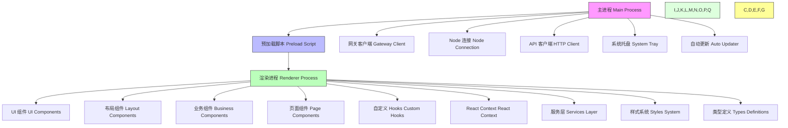

# Windows 应用项目结构说明

> 文档版本: 1.0
> 目录结构和文件组织说明

---

## 1. 根目录结构

```
apps/windows/
├── assets/                      # 静态资源
├── config/                      # 配置文件
├── docs/                        # 项目文档
├── scripts/                     # 构建脚本
├── src/                         # 源代码
├── electron-builder.json        # Electron 构建配置
├── electron.vite.config.ts      # Vite 配置
├── package.json                 # 项目依赖
├── tsconfig.json                # TypeScript 配置
├── vitest.config.ts             # 测试配置
└── README.md                    # 项目说明
```

---

## 2. 源代码目录 (src/)

### 2.1 主进程 (main/)

```
src/main/
├── index.ts                        # 主进程入口 (~2900 行)
├── gateway-client.ts              # 网关 WebSocket 客户端
├── node-connection.ts             # Node 模式 WebSocket 连接
├── node-mode-coordinator.ts       # Node 生命周期管理
├── api-client.ts                  # HTTP API 客户端
├── device-pairing-service.ts      # 设备配对服务
├── tray-manager.ts                # 系统托盘管理
├── updater-service.ts             # 自动更新服务
│
├── connection/                     # 连接管理模块
│   ├── connection-coordinator.ts   # 连接协调器
│   ├── ui-connection-manager.ts    # UI 连接管理
│   ├── node-connection-manager.ts  # Node 连接管理
│   └── README.md                   # 模块文档
│
├── skill-*.ts                      # 技能运行时模块（10+ 文件）
│   ├── skill-execution-service.ts
│   ├── skill-runtime.ts
│   ├── skill-sandbox.ts
│   └── ...
│
└── types/                          # 主进程类型定义
    └── *.ts
```

**主进程职责**:
- 窗口创建和管理
- WebSocket 连接管理（网关 + Node）
- 文件系统操作
- 系统托盘集成
- 自动更新
- IPC 通信处理

### 2.2 预加载脚本 (preload/)

```
src/preload/
└── index.ts                        # IPC 桥接实现 (~1120 行)
```

**预加载脚本职责**:
- 安全地暴露主进程 API 到渲染进程
- 定义 `window.electronAPI` 接口
- 所有 IPC 通道在此定义

### 2.3 渲染进程 (renderer/)

```
src/renderer/
├── main.tsx                        # React 应用入口
├── App.tsx                         # 根组件
│
├── components/                     # React 组件
│   ├── ui/                         # UI 基础组件
│   │   ├── Avatar/
│   │   ├── Badge/
│   │   ├── Button/
│   │   ├── Card/
│   │   ├── Checkbox/
│   │   ├── Divider/
│   │   ├── Empty/
│   │   ├── ErrorBanner/
│   │   ├── Input/
│   │   ├── Loading/
│   │   ├── Modal/
│   │   ├── PageHeader/
│   │   ├── Radio/
│   │   ├── Responsive/
│   │   ├── Select/
│   │   ├── Skeleton/
│   │   ├── Switch/
│   │   ├── Table/
│   │   ├── Tag/
│   │   ├── Toast/
│   │   ├── Tooltip/
│   │   └── ... (22+ 组件)
│   │
│   ├── layout/                     # 布局组件
│   │   ├── MainLayout/
│   │   ├── Sidebar/
│   │   └── TitleBar/
│   │
│   ├── business/                   # 业务组件
│   │   ├── ApprovalSettings/
│   │   ├── ConnectionStatus/
│   │   ├── CreditsView/
│   │   ├── DeviceCard/
│   │   ├── DualConnectionStatus/
│   │   ├── ExecDenylistManager/
│   │   ├── index.ts
│   │   ├── SkillCard/
│   │   ├── SkillStoreView/
│   │   ├── SubscriptionView/
│   │   ├── SystemStatus/
│   │   └── UpdaterView/
│   │
│   ├── Router.tsx                  # 视图路由
│   ├── GlobalModals.tsx            # 全局模态框
│   ├── DeviceBindWizard.tsx        # 设备绑定向导
│   └── WorkspaceWizard.tsx         # 工作空间向导
│
├── pages/                          # 页面组件
│   ├── AccountPage/                # 账户管理 (订阅+积分合并)
│   ├── AgentsPage/                 # Agent 管理
│   ├── AuthPage/                   # 登录认证
│   ├── AuditLogPage/               # 审计日志
│   ├── ChatPage/                   # 对话界面
│   ├── CreditsPage/                # 积分管理
│   ├── DashboardPage/              # 概览仪表板
│   ├── DevicesPage/                # 设备管理
│   ├── FilesPage/                  # 工作空间文件
│   ├── MemoriesPage/               # 记忆管理
│   ├── SettingsPage/               # 应用设置
│   ├── SkillsPage/                 # 技能管理
│   ├── SubscriptionPage/           # 订阅管理
│   ├── SystemPage/                 # 系统监控
│   ├── TaskBoardPage/              # 任务看板
│   └── index.ts                    # 页面导出
│
├── contexts/                       # React Context
│   ├── AppProviders.tsx            # Provider 组合
│   ├── AuthContext/                # 认证状态
│   ├── ConnectionContext/          # 连接状态
│   ├── SettingsContext/            # 应用设置
│   ├── SkillsContext/              # 技能状态
│   ├── ThemeContext/               # 主题管理
│   └── ... (6 contexts)
│
├── hooks/                          # 自定义 Hooks
│   ├── common/                     # 通用 Hooks
│   │   ├── useAsync/
│   │   ├── useDebounce/
│   │   ├── useLocalStorage/
│   │   ├── useMutation/
│   │   ├── usePagination/
│   │   ├── usePolling/
│   │   └── useQuery/
│   │
│   └── business/                   # 业务 Hooks
│       ├── useAgents/
│       ├── useAuditLog/
│       ├── useAuth/
│       ├── useChat/
│       ├── useCredits/
│       ├── useDashboard/
│       ├── useExecApprovals/
│       ├── useFiles/
│       ├── useGateway/
│       ├── useMemories/
│       ├── useServerCaptcha/
│       ├── useSettings/
│       ├── useSkills/
│       ├── useSkillStore/
│       ├── useSubagentRuns/
│       ├── useSubscription/
│       ├── useSystem/
│       ├── useSystemMonitor/
│       ├── useUserMemory/
│       └── useWorkspace/
│       └── ... (22+ hooks)
│
├── services/                       # API 服务层
│   ├── __tests__/
│   ├── agent-service.ts
│   ├── auth-service.ts
│   ├── chat-service.ts
│   ├── file-service.ts
│   ├── gateway-service.ts
│   ├── index.ts
│   ├── skill-service.ts
│   ├── subscription-service.ts
│   ├── system-service.ts
│   ├── user-memory-service.ts
│   └── ... (11+ services)
│
├── styles/                         # 样式文件
│   ├── global.css                  # 全局样式
│   ├── tokens.css                  # CSS 变量
│   └── tokens/                     # TypeScript 设计令牌
│       ├── colors.ts
│       ├── spacing.ts
│       ├── typography.ts
│       ├── shadows.ts
│       ├── radius.ts
│       ├── transitions.ts
│       ├── z-index.ts
│       └── breakpoints.ts
│
└── types/                          # TypeScript 类型
    ├── user.ts
    ├── skill.ts
    ├── file.ts
    ├── system.ts
    ├── gateway.ts
    └── chat.ts
```

---

## 3. 配置文件说明

### 3.1 Electron 配置

**electron-builder.json**:
- 打包配置
- 目标平台（Windows）
- 输出格式（NSIS, Portable, ZIP）
- 签名配置

### 3.2 Vite 配置

**electron.vite.config.ts**:
- 主进程构建配置
- 预加载脚本构建配置
- 渲染进程构建配置
- 开发服务器配置

### 3.3 TypeScript 配置

**tsconfig.json**:
- 严格模式启用
- ESM 模块
- 路径别名配置（`@/*` → `src/*`）

### 3.4 测试配置

**vitest.config.ts**:
- 测试框架配置
- 覆盖率设置
- 模拟配置

---

## 4. 脚本目录 (scripts/)

```
scripts/
└── *.js / *.ts                    # 构建、发布脚本
```

---

## 5. 文档目录 (docs/)

```
docs/
├── ui-design-standards.md         # UI 设计标准（本文档）
├── feature-development-standards.md # 功能开发标准
├── component-standards.md         # 组件开发规范
├── code-style-guide.md            # 代码风格指南
├── project-structure.md           # 项目结构说明（本文件）
├── page-template.md               # 页面开发模板
├── dual-connection-architecture.md # 双连接架构文档
├── improvements-summary.md        # 改进总结
└── ...                            # 其他技术文档
```

---

## 6. 关键文件索引

### 6.1 入口文件

| 文件 | 用途 |
|------|------|
| `src/main/index.ts` | 主进程入口 |
| `src/preload/index.ts` | 预加载脚本 |
| `src/renderer/main.tsx` | React 入口 |

### 6.2 核心配置文件

| 文件 | 用途 |
|------|------|
| `package.json` | 依赖和脚本 |
| `electron-builder.json` | 打包配置 |
| `electron.vite.config.ts` | 构建配置 |
| `tsconfig.json` | TypeScript 配置 |
| `vitest.config.ts` | 测试配置 |

### 6.3 核心组件文件

| 文件 | 用途 |
|------|------|
| `src/renderer/App.tsx` | 应用根组件 |
| `src/renderer/components/Router.tsx` | 视图路由 |
| `src/renderer/components/layout/MainLayout/` | 主布局 |
| `src/renderer/contexts/AppProviders.tsx` | Provider 组合 |

### 6.4 类型定义文件

| 文件 | 用途 |
|------|------|
| `src/renderer/types/*.ts` | 全局类型定义 |
| `src/main/types/*.ts` | 主进程类型 |

---

## 7. 依赖关系图



### 依赖说明

1. **主进程 (Main Process)**:
   - 负责窗口管理、系统集成和底层操作
   - 通过预加载脚本与渲染进程通信
   - 管理网关连接、Node连接和API客户端

2. **预加载脚本 (Preload Script)**:
   - 通过contextBridge安全暴露主进程API
   - 定义`window.electronAPI`接口
   - 所有IPC通道在此定义和处理

3. **渲染进程 (Renderer Process)**:
   - 基于React的单页应用
   - 包含完整的UI层、状态管理和业务逻辑
   - 通过`window.electronAPI`与主进程通信

---

## 8. 模块职责矩阵

| 模块 | 职责 | 依赖 |
|------|------|------|
| main/ | 窗口管理、IPC、系统集成 | electron, ws |
| preload/ | 安全 IPC 桥接 | electron |
| renderer/components/ui/ | 基础 UI 组件 | react |
| renderer/components/layout/ | 布局组件 | ui components |
| renderer/components/business/ | 业务组件 | ui, hooks |
| renderer/pages/ | 完整页面 | all components |
| renderer/hooks/ | 状态逻辑 | react, services |
| renderer/services/ | API 通信 | - |
| renderer/contexts/ | 全局状态 | react |
| renderer/styles/ | 样式系统 | CSS |
| renderer/types/ | 类型定义 | - |

---

## 9. 新增功能目录选择指南

### 新增 UI 组件
```
src/renderer/components/ui/NewComponent/
├── NewComponent.tsx
├── NewComponent.css
└── index.ts
```

### 新增页面
```
src/renderer/pages/NewPage/
├── NewPage.tsx
├── NewPage.css
├── components/          # 页面专属子组件
└── hooks/               # 页面专属 hooks
```

### 新增 Hook
```
src/renderer/hooks/business/useNewFeature/
├── useNewFeature.ts
├── useNewFeature.types.ts
└── index.ts
```

### 新增服务
```
src/renderer/services/new-service.ts
```

### 新增类型
```
src/renderer/types/new-domain.ts
```

---

## 附录: 文件路径速查

### 常用导入路径

```typescript
// 组件
import { Button } from '@/components/ui';
import { MainLayout } from '@/components/layout';
import { DeviceCard } from '@/components/business';

// 页面
import { DashboardPage } from '@/pages/DashboardPage';

// Hooks
import { useAuth } from '@/hooks/business/useAuth';
import { useQuery } from '@/hooks/common/useQuery';

// Services
import { authService } from '@/services/auth-service';

// Types
import type { User } from '@/types/user';

// Contexts
import { useAuth } from '@/contexts/AuthContext';

// Styles
tokens from '@/styles/tokens/colors';
```

### 路径别名配置

```json
// tsconfig.json
{
  "compilerOptions": {
    "paths": {
      "@/*": ["./src/renderer/*"],
      "@main/*": ["./src/main/*"],
      "@preload/*": ["./src/preload/*"]
    }
  }
}
```
