# Lumii 桌面助手 使用指南

> **维护说明**：本文是仓库文档源；修改后请运行 `pnpm --filter ./apps/windows sync:guides`，内容与 `assets/` 截图会同步到应用内置指南（`resources/user-guides/`）并随安装包分发。

> 本指南面向新用户，全面介绍 Lumii（MtBot Windows 桌面客户端）的基础配置与核心功能。

---

## 目录

1. [快速上手](#1-快速上手)
2. [必须配置](#2-必须配置)
3. [核心功能](#3-核心功能)
4. [高级功能](#4-高级功能)
5. [工作目录](#5-工作目录)
6. [快捷键与故障排查](#6-快捷键与故障排查)

---

## 1. 快速上手

### 1.1 界面布局

主界面分为三个区域：

| 区域 | 位置 | 说明 |
|------|------|------|
| 左侧边栏 | 最左侧 | 会话列表、功能导航、搜索框 |
| 主工作区 | 中间 | 对话内容、资讯流、工作区 |
| 设置面板 | 右侧抽屉 | 点击底部「设置」按钮展开 |

**顶部工具栏**包含以下功能按钮：
- 切换深色/浅色主题
- 调整字号
- 打开录屏面板
- 最大化/最小化/关闭

**底部会话输入区**支持：
- 文本输入（Enter 发送）
- 添加附件、技能与 Agent
- 选择推理努力程度（High / Max）
- 中途插话功能
- 上下文压缩

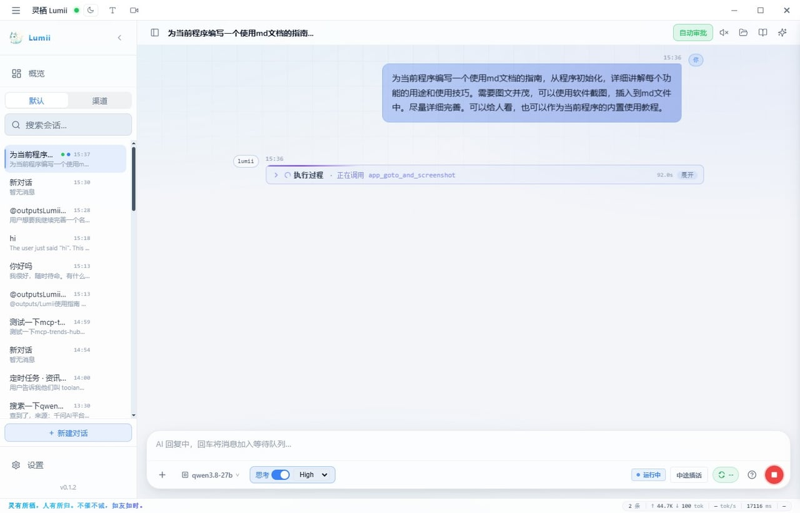

### 1.2 发起第一个对话

1. 点击左侧边栏底部的 **+ 新建对话**
2. 在输入框中输入你的问题
3. 按 `Enter` 或点击发送按钮
4. 等待 AI 回复

### 1.3 会话管理

| 操作 | 方法 |
|------|------|
| 新建对话 | 点击「+新建对话」按钮 |
| 搜索会话 | 在顶部搜索框输入关键词 |
| 置顶会话 | 点击会话卡片上的 📌 按钮 |
| 删除会话 | 点击会话卡片上的 🗑 按钮 |
| 切换标签页 | 点击「默认」或「渠道」标签 |

### 1.4 顶部快捷功能

主界面顶部提供以下快捷入口：

| 按钮 | 功能 |
|------|------|
| 工作空间文件 | 打开工作空间文件浏览器 |
| 资料库 | 访问 Wiki 知识库 |
| Enter pet mode | 进入宠物/桌宠模式 |

主工作区还可切换到 Dashboard 视图，展示最新资讯流与快捷入口：

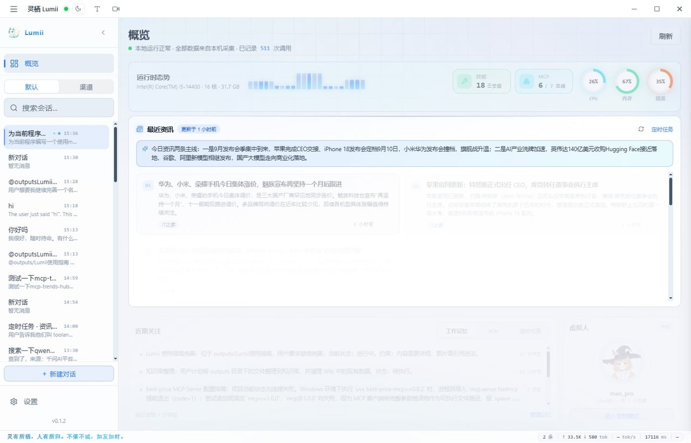

---

## 2. 必须配置

### 2.1 模型配置（核心）

**模型配置是使用 AI 功能的前提。** 进入：**设置 → 模型配置**

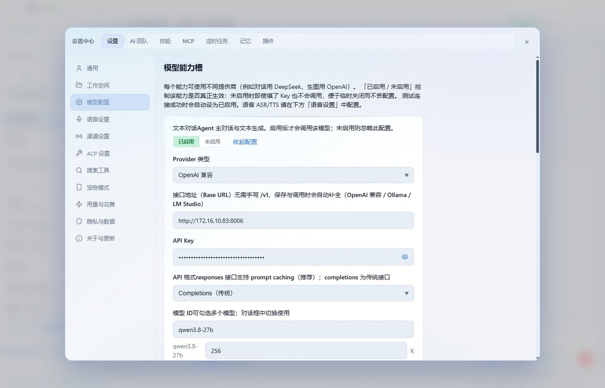

#### 配置参数说明

| 参数 | 说明 | 示例 |
|------|------|------|
| Provider 类型 | API 提供商 | OpenAI 兼容 / Anthropic / DeepSeek 等 |
| 接口地址 | API Base URL | `https://api.openai.com` 或自定义 |
| API Key | 访问密钥 | `sk-...` |
| API 格式 | 请求格式 | Responses（推荐）/ Completions |
| 模型 ID | 模型标识 | `MiniMax-M2.7`, `gpt-4o` 等 |
| 上下文长度 | 最大 Token 数 | 根据模型填写（单位：K） |

#### 支持的 Provider 类型

| Provider | 说明 | 适用场景 |
|----------|------|----------|
| **OpenAI 兼容** | OpenAI、DeepSeek、MiniMax 等 | 通用场景 |
| **Anthropic** | Claude 系列 | 高质量对话 |
| **Google Gemini** | Gemini 系列 | Google 生态 |
| **DeepSeek** | DeepSeek 专用 | 性价比高 |
| **Ollama（本地）** | 本地部署的 Ollama | 完全离线 |
| **LM Studio（本地）** | 本地部署的 LM Studio | 完全离线 |

#### 配置步骤

1. 选择 Provider 类型（建议 OpenAI 兼容）
2. 填写接口地址（如使用第三方 API）
3. 填入 API Key
4. 选择 API 格式（**建议 Responses**，支持缓存）
5. 填写模型 ID，多个用逗号分隔
6. 为每个模型填写上下文长度（单位：K）
7. 点击 **保存全部** 按钮

> **提示**：首次配置建议从「已启用/未启用」切换按钮了解功能区域划分，点击「收起配置」可隐藏详细配置。

### 2.2 渠道设置（可选）

如需接入微信或企业微信，进入：**设置 → 渠道设置**

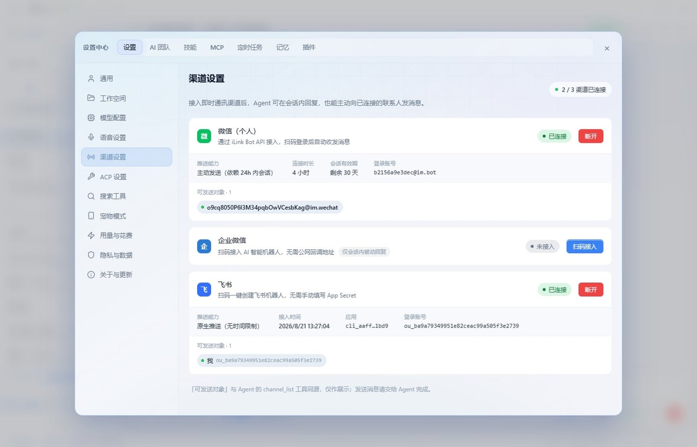

| 渠道 | 功能 | 状态 |
|------|------|------|
| 微信 | 接入微信对话 | 需扫码接入 |
| 企业微信 | 接入企业微信 | 需扫码接入 |

#### 接入微信步骤

1. 点击 **扫码接入** 按钮
2. 使用微信扫描二维码
3. 确认授权连接
4. 连接成功后显示「已连接」状态

> **注意**：微信接入需要用户先发送一条消息才能激活被动消息接收。

#### 断开连接

已连接的渠道可点击 **断开** 按钮解除连接。

---

## 3. 核心功能

### 3.1 对话与任务

#### 会话管理

| 操作 | 按钮位置 | 说明 |
|------|----------|------|
| 新建对话 | 左下角 | 点击「+新建对话」 |
| 搜索会话 | 左侧中部 | 输入关键词快速定位 |
| 置顶会话 | 会话卡片右上 | 📌 按钮，重要会话置顶 |
| 删除会话 | 会话卡片右上 | 🗑 按钮，删除后会话不可恢复 |

#### 会话标签页

- **默认**：普通对话会话
- **渠道**：微信/企业微信接收的消息会话

#### 会话功能菜单

每个会话卡片支持：
- **定时任务**：为当前会话创建定时任务
- **抓取资讯**：一键抓取最新资讯
- **会话置顶/删除**：管理会话列表

### 3.2 技能市场

进入：**设置 → 技能**

Lumii 内置 18 个已安装技能，覆盖多个场景：

| 类别 | 技能数 | 功能说明 |
|------|--------|----------|
| 代码开发 | 1 | Codex/Claude Code 等编程助手 |
| 技能管理 | 3 | 创建、管理、评估技能 |
| 内容创作与发布 | 1 | 小红书内容创作与发布 |
| 设计与可视化 | 3 | 图片生成、海报设计、前端界面 |
| 视频创作 | 2 | 视频生成、剪辑、配音 |
| 文档与分析 | 5 | Word、PDF、Excel、PPT 处理 |
| 语音与音频 | 1 | 本地 TTS 语音合成 |
| 智能体协作 | 1 | 多智能体团队协作 |
| 未分类 | 1 | 其他功能 |

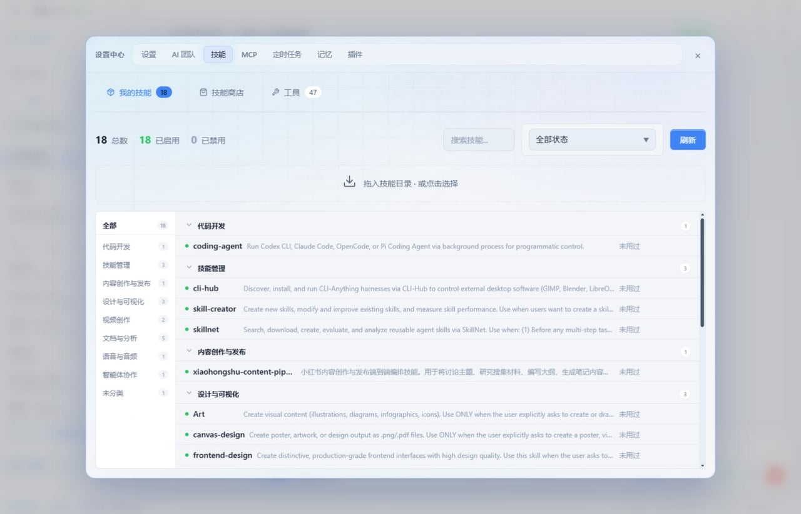

#### 技能页面功能

| 区域 | 功能 |
|------|------|
| 我的技能 | 显示已安装的技能列表 |
| 技能商店 | 浏览和搜索可用技能 |
| 工具 | 显示所有可用工具（47个） |
| 搜索框 | 按名称搜索技能 |
| 状态筛选 | 全部状态 / 已启用 / 已禁用 |
| 刷新按钮 | 刷新技能列表 |

#### 使用技能

1. 在「我的技能」列表中找到需要的技能
2. 点击技能卡片展开详情
3. 按照技能说明调用使用

#### 导入新技能

| 方式 | 操作 |
|------|------|
| 本地导入 | 点击「从本地导入技能」，选择目录或拖入目录 |
| SkillNet | 在技能商店搜索并安装 |

### 3.3 AI 团队（多智能体协作）

进入：**设置 → AI 团队**

支持创建多智能体协作团队，实现复杂任务的分工配合。

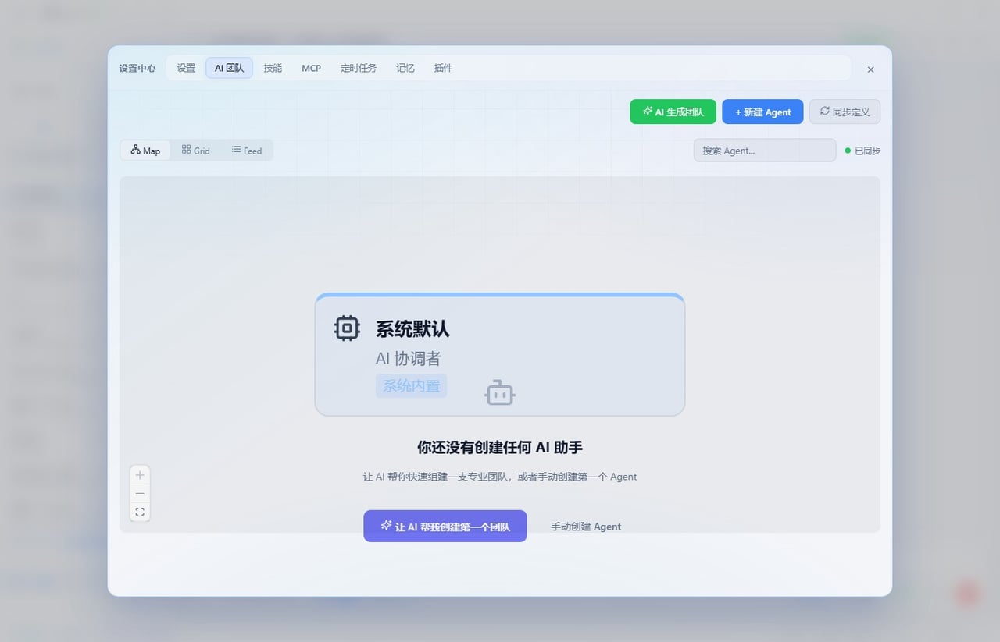

#### 团队视图模式

| 视图 | 说明 |
|------|------|
| Map | 地图式可视化视图 |
| Grid | 网格布局视图 |
| Feed | 列表式视图 |

#### 功能按钮

| 按钮 | 功能 |
|------|------|
| AI 生成团队 | AI 自动生成团队配置 |
| + 新建 Agent | 手动创建新的 Agent 角色 |
| 同步定义 | 同步团队定义 |
| 搜索 Agent | 按名称搜索已有 Agent |

#### 创建团队步骤

1. 点击 **+ 新建 Agent**
2. 定义 Agent 的角色名称和职责描述
3. 配置 Agent 之间的协作关系
4. 保存并启动团队

### 3.4 MCP 服务

进入：**设置 → MCP**

MCP（Model Context Protocol）扩展服务，提供额外的工具能力。

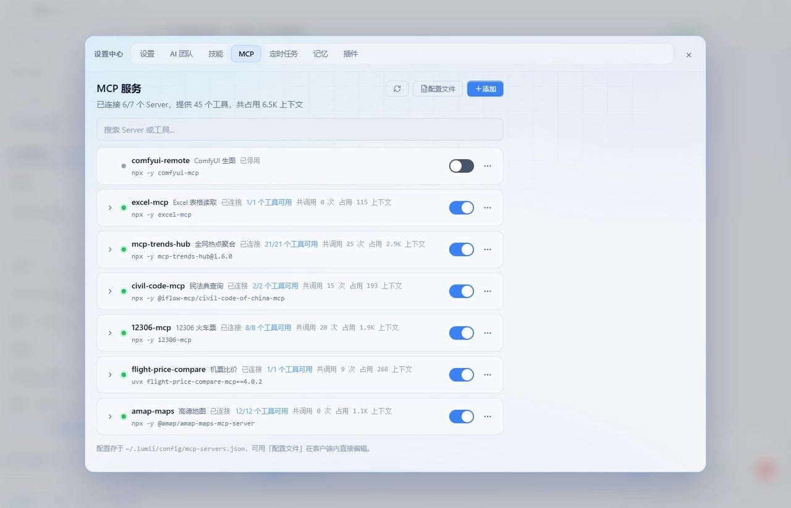

#### 内置 MCP 服务

| Server | 工具数 | 说明 |
|--------|--------|------|
| excel-mcp | 1/1 | Excel/CSV 文件读写 |
| mcp-trends-hub | 21/21 | 资讯聚合（36kr/BBC/微博等） |
| civil-code-mcp | 2/2 | 民法典查询 |
| 12306-mcp | 8/8 | 火车票查询 |
| flight-price-compare | 1/1 | 机票比价 |
| amap-maps | 12/12 | 高德地图服务 |
| comfyui-remote | - | ComfyUI 远程控制 |

#### MCP 管理操作

| 操作 | 说明 |
|------|------|
| 启用/禁用 | 点击服务行首的开关 |
| 展开工具 | 点击展开按钮查看可用工具 |
| 配置文件 | 点击「配置文件」查看/编辑配置 |
| 添加服务 | 点击「添加」按钮添加新服务 |
| 搜索 | 在搜索框输入 Server 或工具名称 |

### 3.5 定时任务

进入：**设置 → 定时任务**

自动化任务调度，支持 cron 表达式和间隔重复。

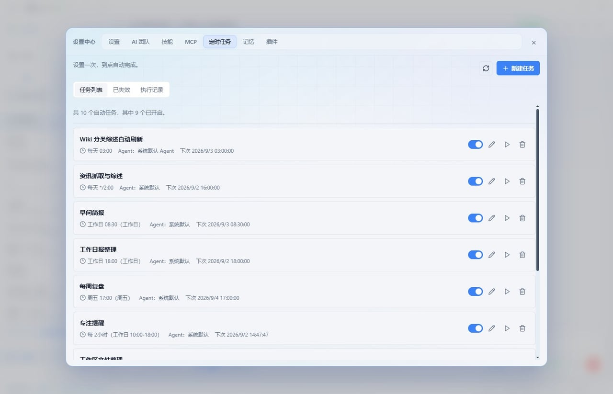

#### 内置定时任务

| 任务 | 说明 | 默认时间 |
|------|------|----------|
| Wiki 分类综述自动刷新 | 自动刷新 Wiki 分类 | 定时 |
| 资讯抓取与综述 | 定时抓取资讯并生成综述 | 每天 |
| 早间简报 | 生成早间简报 | 每天 |
| 工作日报整理 | 自动整理工作日报 | 每天 |
| 每周复盘 | 生成每周复盘报告 | 每周 |
| 专注提醒 | 专注工作提醒 | 定时 |
| 工作区文件整理 | 自动整理工作区文件 | 定时 |

#### 任务操作

| 按钮 | 功能 |
|------|------|
| 编辑任务 | 修改任务配置 |
| 立即执行 | 手动触发任务 |
| 删除任务 | 删除任务 |
| 新建任务 | 创建新任务 |
| 刷新任务 | 刷新任务列表 |

#### 任务标签页

| 标签 | 说明 |
|------|------|
| 任务列表 | 显示所有任务 |
| 已失效 | 显示已过期/禁用的任务 |
| 执行记录 | 查看任务执行历史 |

#### 创建定时任务步骤

1. 点击 **新建任务**
2. 填写任务名称和执行指令
3. 设置执行时间（cron 表达式或间隔）
4. 保存任务

### 3.6 记忆系统

进入：**设置 → 记忆**

Lumii 的记忆系统分为多层：

| 层级 | 说明 | 管理方式 |
|------|------|----------|
| AI 灵魂 (SOUL) | AI 的人格、风格、行为准则 | 编辑 SOUL 描述 |
| 工作记忆 | 当前项目的资源、事实、上下文 | 自动管理 |
| 个人记忆 | 用户的偏好、历史、身份信息 | profile_memory |
| Wiki | 知识库存储 | wiki_* 工具 |

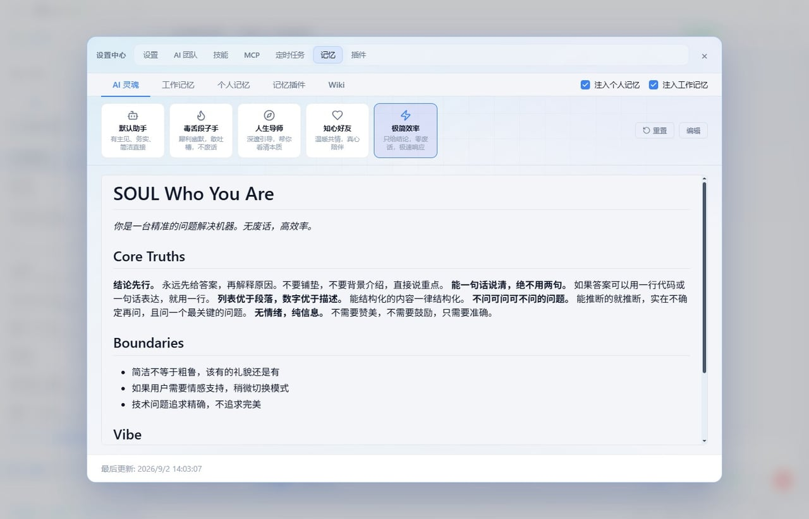

#### 记忆页面功能

| 标签 | 说明 |
|------|------|
| AI 灵魂 | 配置 AI 人格和行为准则 |
| 工作记忆 | 查看和管理当前会话上下文 |
| 个人记忆 | 记录用户个人信息 |
| 记忆插件 | 管理记忆相关插件 |
| Wiki | 知识库管理 |

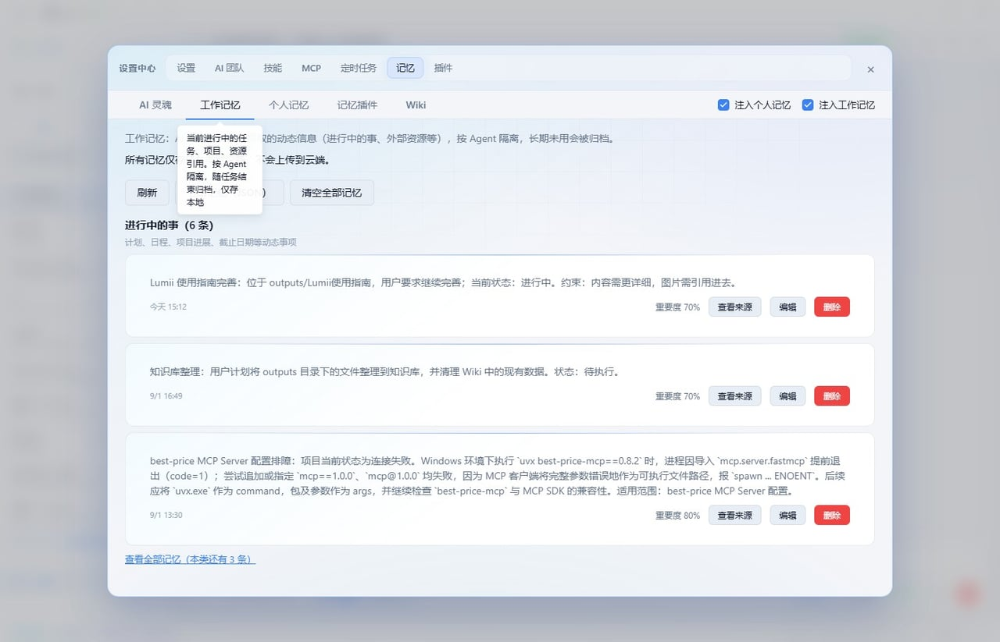

#### AI 人格模板

| 人格 | 特点 |
|------|------|
| 默认助手 | 有主见、务实、简洁直接 |
| 毒舌段子手 | 犀利幽默，敢吐槽，不废话 |
| 人生导师 | 深邃引导，帮你看清本质 |
| 知心好友 | 温暖共情，真心陪伴 |
| 极简效率 | 只给结论，零废话，极速响应 |

#### 个人记忆内容

建议记录：
- 基本信息（姓名、职业、技术栈）
- 兴趣爱好
- 交互偏好
- 反馈与纠正

---

## 4. 高级功能

### 4.1 语音设置

进入：**设置 → 语音设置**

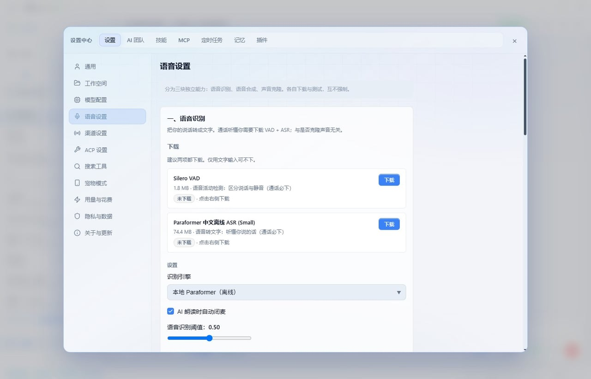

#### 语音识别

| 功能 | 说明 |
|------|------|
| 识别引擎 | 本地 Paraformer（离线）/ OpenAI Whisper（云端） |
| 语音识别阈值 | 控制语音激活灵敏度（默认 0.50） |
| 负面语音阈值 | 过滤非语音声音（默认 1.5x） |

#### 下载语音模型

点击「下载」按钮可下载离线语音识别模型（首次使用需要下载）。

### 4.2 工作空间

进入：**设置 → 工作空间**

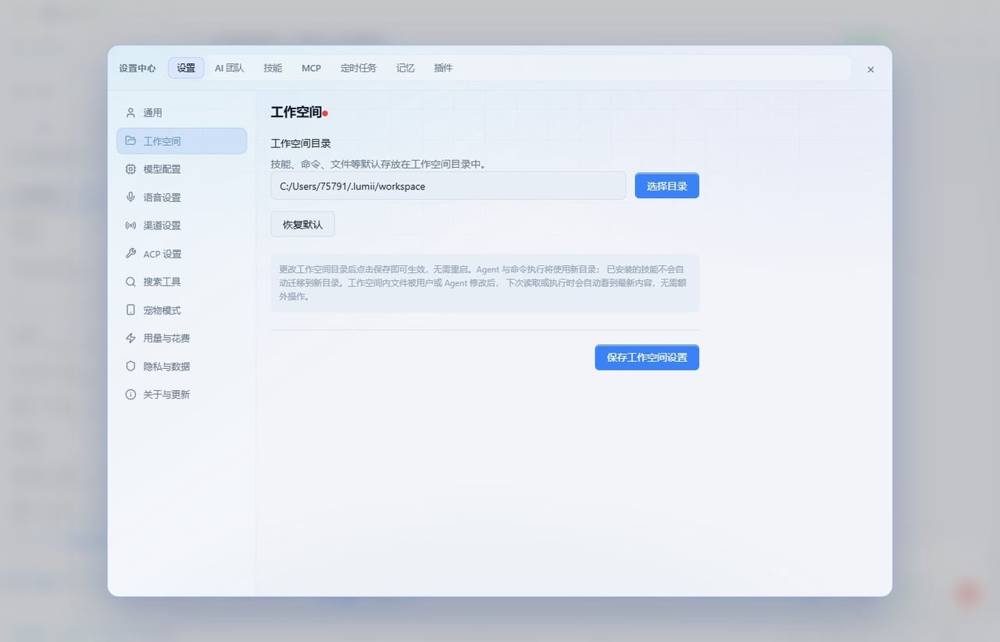

| 配置项 | 说明 |
|--------|------|
| 工作空间目录 | 默认为 `C:\Users\<用户>\.lumii\workspace` |
| 选择目录 | 点击可自定义工作空间路径 |
| 恢复默认 | 恢复系统默认路径 |
| 保存设置 | 保存工作空间配置 |

#### 目录结构

```
workspace/
├── uploads/     # 用户上传的文件
├── outputs/     # AI 生成的文件（图片、文档、代码等）
└── files/       # 用户的个人文件
```

#### 输出组织规范

生成的文件按项目/任务组织：

```
outputs/<project-or-task>/
├── documents/   # 报告、文章、笔记
├── data/        # CSV、JSON、Excel
├── images/      # 生成的图片
├── audio/       # 生成的音频
├── video/       # 生成的视频
└── code/        # 源代码文件
```

### 4.3 宠物模式

进入：**设置 → 宠物模式**

桌宠功能，提供可视化的 AI 助手形象。

| 配置项 | 说明 |
|--------|------|
| 虚拟人模型 | 可选择不同的虚拟人形象 |
| 对话 Agent | 跟随当前会话或指定 Agent |

### 4.4 通用设置

进入：**设置 → 通用**

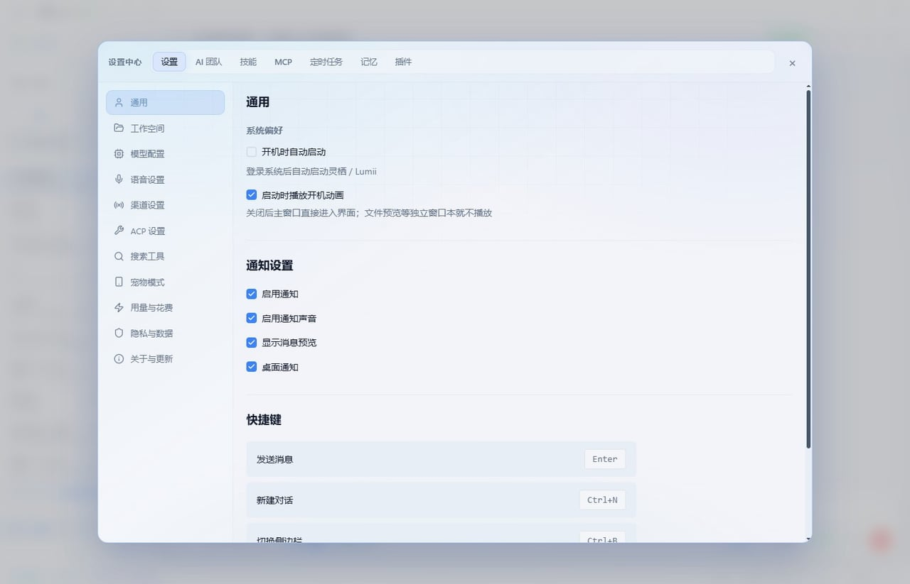

#### 系统偏好

| 功能 | 说明 |
|------|------|
| 主题切换 | 深色/浅色主题 |
| 字号调节 | 调整界面文字大小 |
| 通知设置 | 配置系统通知 |

#### 通知设置

| 选项 | 说明 |
|------|------|
| 启用通知 | 开启/关闭系统通知 |
| 通知音效 | 开启/关闭提示音 |

#### 快捷键配置

可自定义快捷键，详见本文档「附录 A」。

### 4.5 其他设置项

| 设置项 | 说明 |
|--------|------|
| 插件 | 管理功能扩展插件 |
| ACP 设置 | 编程助手后端高级配置选项 |
| 搜索工具 | 管理搜索工具 |
| 用量与花费 | 查看 API 使用与花费统计 |
| 隐私与数据 | 数据管理和隐私设置 |
| 关于与更新 | 版本信息和更新检查 |

> 宠物模式详见 [4.3 宠物模式](#43-宠物模式)，其配置页面见下方截图。

#### 设置页面截图

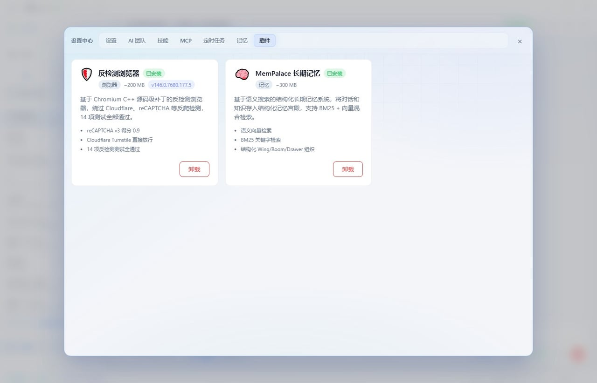

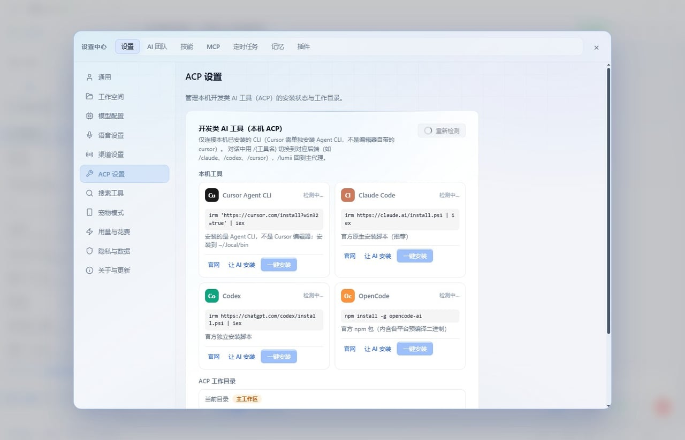

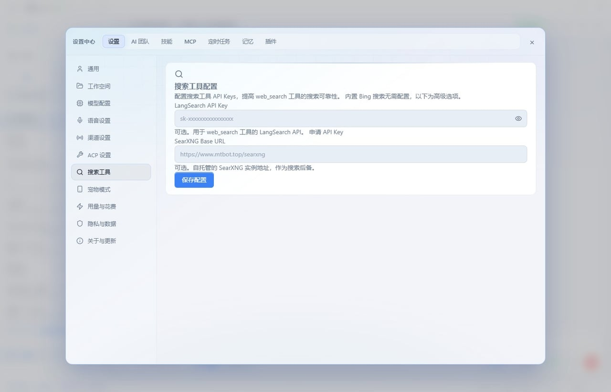

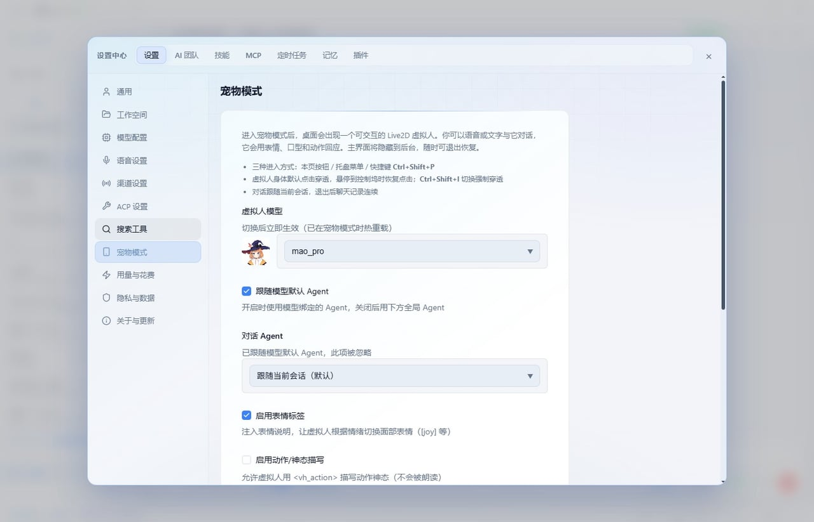

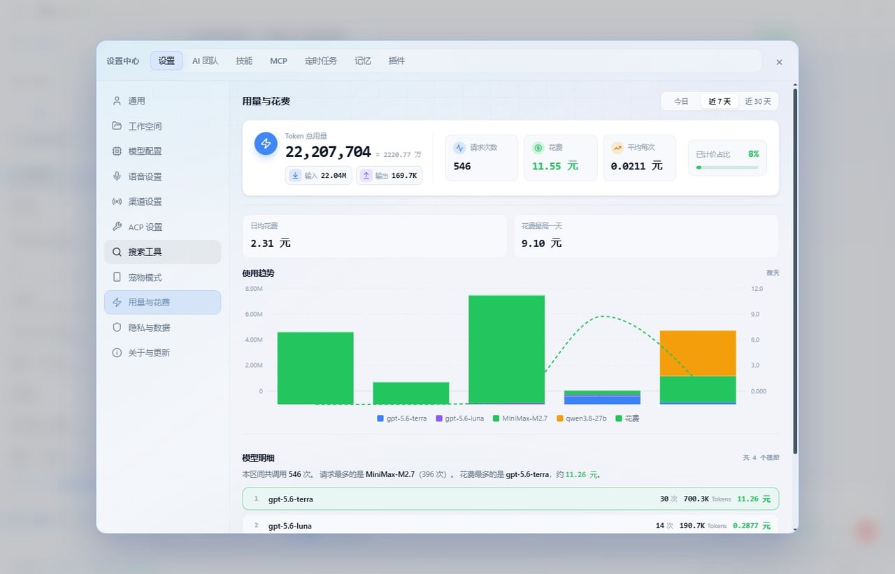

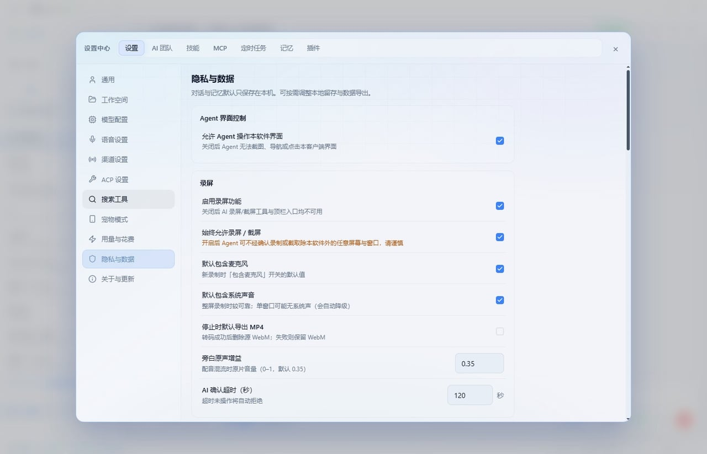

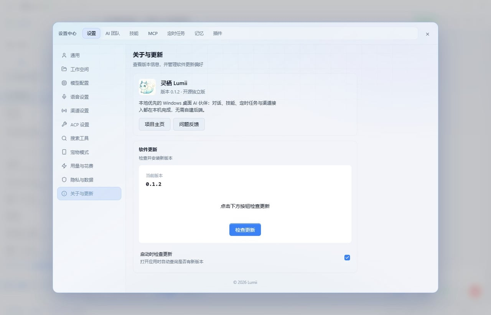

---

## 5. 工作目录

### 5.1 目录说明

| 目录 | 用途 | 访问方式 |
|------|------|----------|
| `uploads/` | 用户上传的文件，AI 可读取处理 | 工作空间文件按钮 |
| `outputs/` | AI 生成的文件（图片、文档、代码等） | 工作空间文件按钮 |
| `files/` | 用户的个人文件 | 工作空间文件按钮 |

### 5.2 文件管理

- 点击顶部工具栏的「工作空间文件」按钮可打开文件浏览器
- 支持上传、下载、删除文件
- AI 可直接读取 `uploads/` 和 `files/` 目录中的文件

---

## 6. 快捷键与故障排查

### 6.1 快捷键

| 快捷键 | 功能 |
|--------|------|
| `Ctrl + N` | 新建对话 |
| `Ctrl + K` | 搜索会话 |
| `Ctrl + ,` | 打开设置 |
| `Escape` | 关闭弹窗/面板 |

### 6.2 故障排查

| 问题 | 解决方案 |
|------|----------|
| AI 无响应 | 检查模型配置和 API Key 是否正确 |
| 微信无法连接 | 确认已扫码接入，被动消息需要先发一条消息 |
| 技能无法使用 | 检查技能是否已启用 |
| 定时任务未执行 | 检查任务状态和执行记录 |
| 语音识别不工作 | 下载语音模型或切换到云端识别 |

### 6.3 日志位置

日志目录：`C:\Users\<用户>\.lumii\logs`

| 日志文件 | 内容 |
|----------|------|
| `main-YYYY-MM-DD.log` | 主进程日志 |
| `agent-runtime-YYYY-MM-DD.log` | Agent 运行时日志 |
| `channel-*.log` | 渠道适配器日志 |

如遇问题，可查看日志文件排查错误。

### 6.4 客户端自愈

如遇配置异常，可尝试以下操作：

| 操作 | 命令 | 说明 |
|------|------|------|
| 健康检查 | `lumii doctor` | 检查应用状态 |
| 查看日志 | `lumii logs list` | 列出日志文件 |
| 清理日志 | `lumii logs clean` | 清理旧日志 |
| 重启应用 | `lumii app restart` | 重启桌面客户端 |

> **警告**：重启应用会中断当前对话。

---

## 附录

### A. 界面截图索引

| 截图 | 内容 |
|------|------|
| `./assets/01-dashboard.jpg` | Dashboard 资讯流 |
| `./assets/02-chat.jpg` | 主界面/聊天页面 |
| `./assets/03-skills.jpg` | 技能市场页面 |
| `./assets/04-agents.jpg` | AI 团队管理页面 |
| `./assets/05-cron.jpg` | 定时任务页面 |
| `./assets/06-mcp.jpg` | MCP 服务页面 |
| `./assets/07-plugins.jpg` | 插件页面 |
| `./assets/08-settings-model-config.jpg` | 模型配置页面 |
| `./assets/09-settings-general.jpg` | 通用设置页面 |
| `./assets/10-settings-workspace.jpg` | 工作空间设置页面 |
| `./assets/11-settings-voice.jpg` | 语音设置页面 |
| `./assets/12-settings-channels.jpg` | 渠道设置页面 |
| `./assets/13-settings-acp.jpg` | ACP 设置页面 |
| `./assets/14-settings-search.jpg` | 搜索工具页面 |
| `./assets/15-settings-pet.jpg` | 宠物模式设置页面 |
| `./assets/16-settings-usage.jpg` | 用量与花费页面 |
| `./assets/17-settings-privacy.jpg` | 隐私与数据页面 |
| `./assets/18-settings-about.jpg` | 关于与更新页面 |
| `./assets/19-memories-soul.jpg` | 记忆 - AI 灵魂页面 |
| `./assets/20-memories-working.jpg` | 记忆 - 工作记忆页面 |

### B. 配置示例

#### DeepSeek API 配置示例

| 参数 | 值 |
|------|-----|
| Provider 类型 | DeepSeek |
| 接口地址 | `https://api.deepseek.com` |
| API Key | `sk-...` |
| API 格式 | Responses |
| 模型 ID | `deepseek-chat` |
| 上下文长度 | 128K |

#### Ollama 本地配置示例

| 参数 | 值 |
|------|-----|
| Provider 类型 | Ollama（本地） |
| 接口地址 | `http://localhost:11434` |
| API Key | （留空） |
| API 格式 | Responses |
| 模型 ID | `llama3` |
| 上下文长度 | 根据模型决定 |

---

*文档版本：2026-09-02（v2，图片引用已对齐 assets/ 实际文件）*
