# Lumii 桌面助手 使用指南

> **维护说明**：本文是仓库文档源；修改后请运行 `pnpm --filter ./apps/windows sync:guides`，内容与 `assets/` 截图会同步到应用内置指南（`resources/user-guides/`）并随安装包分发。

> 本指南面向新用户，全面介绍 Lumii（MtBot Windows 桌面客户端）的基础配置与核心功能。

---

## 目录

1. [快速上手](#1-快速上手)
2. [必须配置](#2-必须配置)
3. [核心功能](#3-核心功能)
4. [高级功能](#4-高级功能)
5. [工作目录](#5-工作目录)
6. [快捷键与故障排查](#6-快捷键与故障排查)

---

## 1. 快速上手

### 1.1 界面布局

主界面分为三个区域：

| 区域 | 位置 | 说明 |
|------|------|------|
| 左侧边栏 | 最左侧 | 会话列表、功能导航、搜索框 |
| 主工作区 | 中间 | 对话内容、资讯流、工作区 |
| 设置面板 | 右侧抽屉 | 点击底部「设置」按钮展开 |

**顶部工具栏**包含以下功能按钮：
- 切换主题（浅色 / 护眼 / 深色 / 跟随系统）
- 调整字号
- 打开录屏面板
- 最大化/最小化/关闭

**底部会话输入区**支持：
- 文本输入（Enter 发送）
- 添加附件、技能与 Agent
- 选择推理努力程度（High / Max）
- 中途插话功能
- 上下文压缩

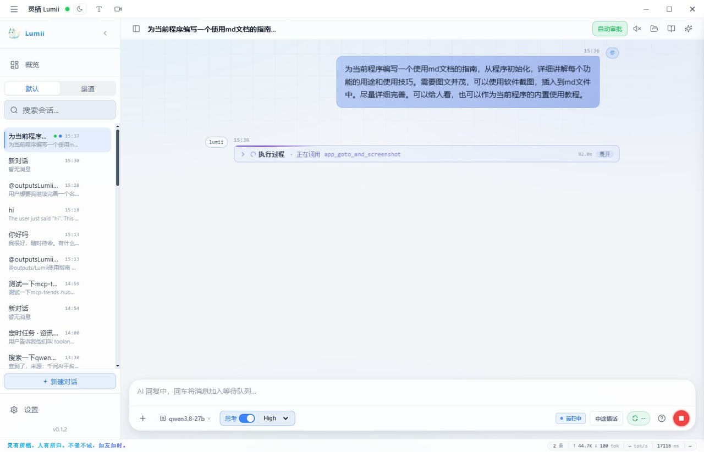

### 1.2 发起第一个对话

1. 点击左侧边栏底部的 **+ 新建对话**
2. 在输入框中输入你的问题
3. 按 `Enter` 或点击发送按钮
4. 等待 AI 回复

### 1.3 会话管理

| 操作 | 方法 |
|------|------|
| 新建对话 | 点击「+新建对话」按钮 |
| 搜索会话 | 在顶部搜索框输入关键词 |
| 重命名会话 | 右键会话卡片（或点 ···）选「重命名」 |
| 置顶会话 | 点击会话卡片上的 📌 按钮 |
| 删除会话 | 点击会话卡片上的 🗑 按钮 |
| 切换标签页 | 点击「默认」或「渠道」标签 |

> **关于会话标题**：新建后先用你的第一句话当标题；首轮对话结束时，AI 会再根据内容补一个更贴切的短标题。你一旦手动改过名，AI 就不会再覆盖。也可以直接对 AI 说「把这个会话改名成 XX」。空着没发过消息的「新对话」不会留在列表里。

### 1.4 顶部快捷功能

主界面顶部提供以下快捷入口：

| 按钮 | 功能 |
|------|------|
| 工作空间文件 | 打开工作空间文件浏览器 |
| 资料库 | 访问 Wiki 知识库 |

标题栏（窗口最上方）右侧还有常驻入口：录屏、宠物模式开关（爪印图标，点击开关宠物模式，开启时变绿）。

主工作区还可切换到 Dashboard 视图，展示最新资讯流与快捷入口：

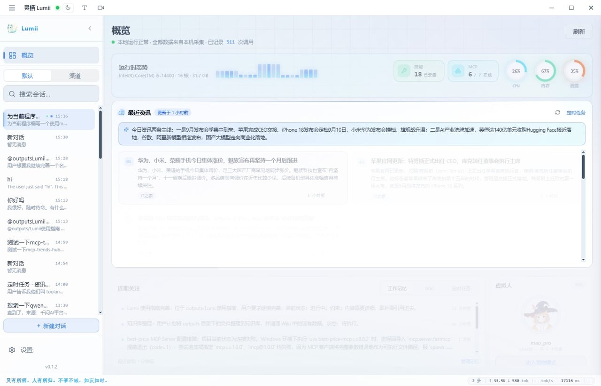

---

## 2. 必须配置

### 2.1 模型配置（核心）

**模型配置是使用 AI 功能的前提。** 进入：**设置 → 模型配置**

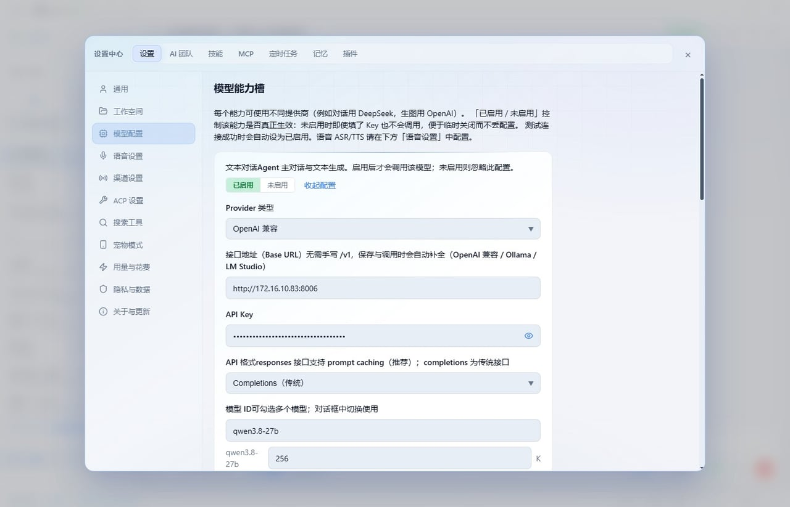

#### 配置参数说明

| 参数 | 说明 | 示例 |
|------|------|------|
| Provider 类型 | API 提供商 | OpenAI 兼容 / Anthropic / DeepSeek 等 |
| 接口地址 | API Base URL | `https://api.openai.com` 或自定义 |
| API Key | 访问密钥 | `sk-...` |
| API 格式 | 请求格式 | Responses（推荐）/ Completions |
| 模型 ID | 模型标识 | `MiniMax-M2.7`, `gpt-4o` 等 |
| 上下文长度 | 最大 Token 数 | 根据模型填写（单位：K） |

#### 支持的 Provider 类型

| Provider | 说明 | 适用场景 |
|----------|------|----------|
| **OpenAI 兼容** | OpenAI、DeepSeek、MiniMax 等 | 通用场景 |
| **Anthropic** | Claude 系列 | 高质量对话 |
| **Google Gemini** | Gemini 系列 | Google 生态 |
| **DeepSeek** | DeepSeek 专用 | 性价比高 |
| **Ollama（本地）** | 本地部署的 Ollama | 完全离线 |
| **LM Studio（本地）** | 本地部署的 LM Studio | 完全离线 |

#### 配置步骤

1. 选择 Provider 类型（建议 OpenAI 兼容）
2. 填写接口地址（如使用第三方 API）
3. 填入 API Key
4. 选择 API 格式（**建议 Responses**，支持缓存）
5. 填写模型 ID，多个用逗号分隔
6. 为每个模型填写上下文长度（单位：K）
7. 点击 **保存全部** 按钮

> **提示**：首次配置建议从「已启用/未启用」切换按钮了解功能区域划分，点击「收起配置」可隐藏详细配置。

### 2.2 渠道设置（可选）

接入 IM 渠道后，Agent 能收发消息、主动汇报进度。进入：**设置 → 渠道设置**

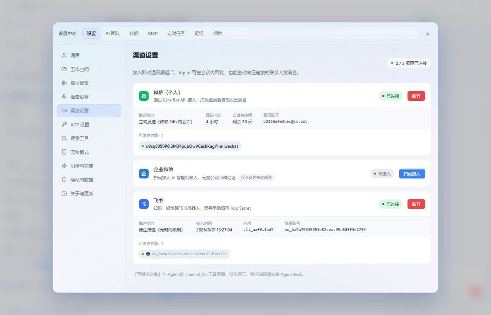

| 渠道 | 说明 | 接入方式 |
|------|------|----------|
| 微信 | 个人微信对话 | 扫码接入 |
| 企业微信 | 企业微信对话 | 扫码接入 |
| 飞书 | 飞书单聊 / 群聊 | 按页面提示配置 |
| QQ | QQ 机器人 | 按页面提示配置 |

#### 接入步骤（扫码类：微信 / 企业微信）

1. 点击 **扫码接入** 按钮
2. 用对应 App 扫描二维码
3. 确认授权连接
4. 连接成功后显示「已连接」状态

> **注意**：微信接入后需要先由你发一条消息，被动消息接收才会激活。

#### 断开连接

已连接的渠道可点击 **断开** 按钮解除连接。

#### 推送的富文本形态

Agent 主动推送时会**按渠道能力自动选格式**，不需要你指定：

| 渠道 | 推送形态 |
|------|----------|
| 飞书 | 交互卡片（内容用 `lark_md`；构造失败时回退成纯文本） |
| 企业微信 / QQ | 原生 Markdown |
| 微信 | 按渠道长度上限自动分段发送纯文本 |

> 目前推送只发文本与链接，**不支持插图**。

---

## 3. 核心功能

### 3.1 对话与任务

#### 会话管理

| 操作 | 按钮位置 | 说明 |
|------|----------|------|
| 新建对话 | 左下角 | 点击「+新建对话」 |
| 搜索会话 | 左侧中部 | 输入关键词快速定位 |
| 重命名会话 | 会话卡片右键菜单 | 「重命名」，可自定义标题 |
| 置顶会话 | 会话卡片右上 | 📌 按钮，重要会话置顶 |
| 删除会话 | 会话卡片右上 | 🗑 按钮，删除后会话不可恢复 |

#### 会话标签页

- **默认**：普通对话会话
- **渠道**：微信/企业微信接收的消息会话

#### 会话功能菜单

每个会话卡片支持：
- **定时任务**：为当前会话创建定时任务
- **抓取资讯**：一键抓取最新资讯
- **会话置顶/删除**：管理会话列表

### 3.2 技能

进入：**设置 → 技能**

内置技能随安装包分发（`bundled-skills/`），**类别与数量每个版本都可能变，以页面上的数字为准**——下表只说明都有哪些方向：

| 类别 | 主要覆盖 |
|------|----------|
| 内容创作与发布 | 小红书等平台的选题、写作与发布 |
| 视频创作 | 视频生成、剪辑、配音、字幕 |
| 设计与可视化 | 图片生成、海报设计、前端界面 |
| 文档与分析 | Word / PDF / Excel / PPT 的读写与处理 |
| 技能管理 | 创建、管理、评估技能本身 |
| 代码开发 | Codex / Claude Code 等编程助手 |
| 智能体协作 | 多 Agent 团队协作 |
| 语音与音频 | 本地 TTS 语音合成 |
| 系统维护 | 巡检、清理等运维类 |
| 其他 | 天气等零散能力 |

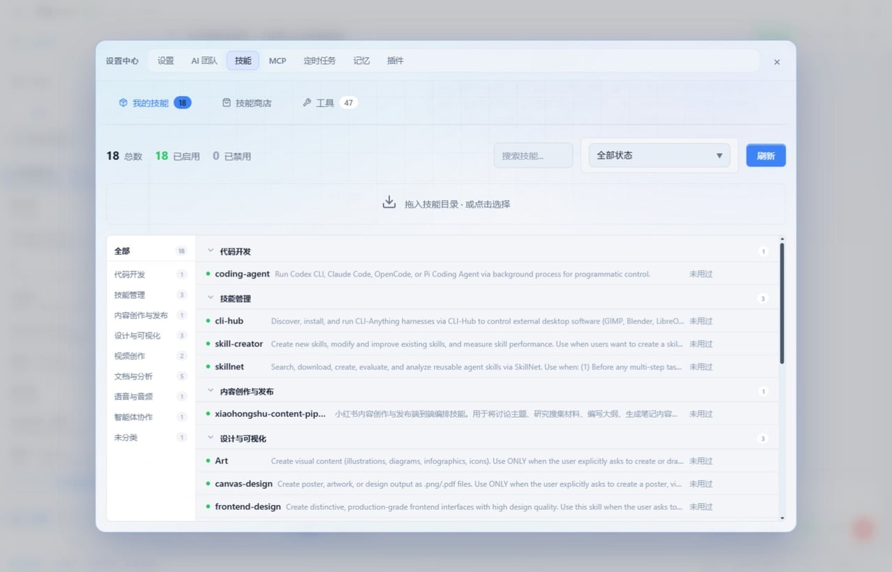

#### 技能页面功能

| 区域 | 功能 |
|------|------|
| 我的技能 | 显示已安装的技能列表 |
| 技能商店 | 浏览和搜索可用技能 |
| 工具 | 列出内建工具（数量由客户端动态统计）。渠道类工具在这里会被过滤掉，去「MCP」页看 |
| 搜索框 | 按名称搜索技能 |
| 状态筛选 | 全部状态 / 已启用 / 已禁用 |
| 刷新按钮 | 刷新技能列表 |

#### 使用技能

1. 在「我的技能」列表中找到需要的技能
2. 点击技能卡片展开详情
3. 按照技能说明调用使用

#### 导入新技能

| 方式 | 操作 |
|------|------|
| 本地导入 | 点击「从本地导入技能」，选择目录或拖入目录 |
| SkillNet | 在技能商店搜索并安装 |

### 3.3 AI 团队（多智能体协作）

进入：**设置 → AI 团队**

支持创建多智能体协作团队，实现复杂任务的分工配合。

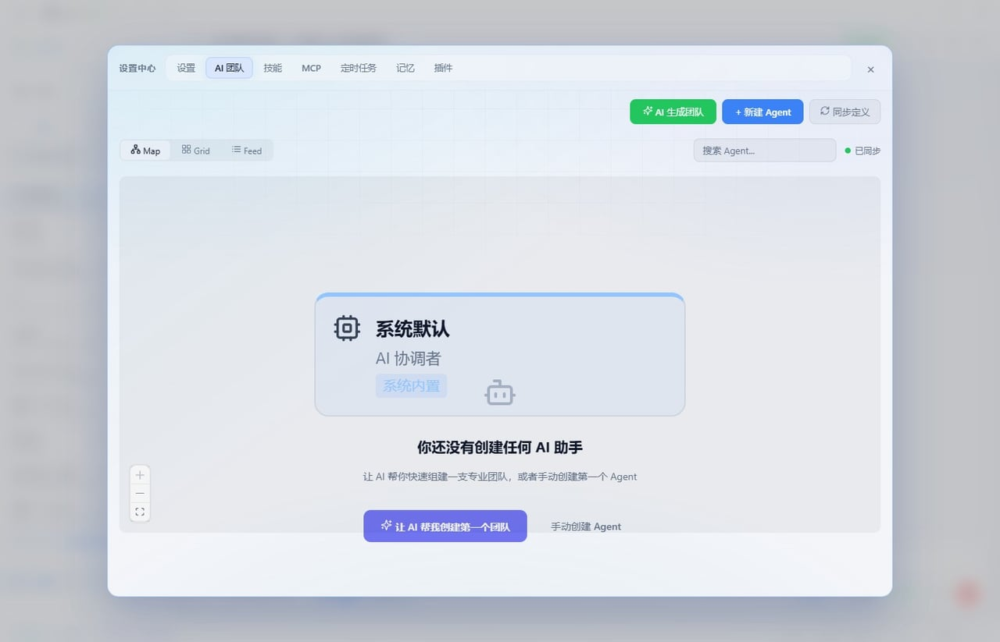

#### 团队视图模式

| 视图 | 说明 |
|------|------|
| Map | 地图式可视化视图 |
| Grid | 网格布局视图 |
| Feed | 列表式视图 |

#### 功能按钮

| 按钮 | 功能 |
|------|------|
| AI 生成团队 | AI 自动生成团队配置 |
| + 新建 Agent | 手动创建新的 Agent 角色 |
| 同步定义 | 同步团队定义 |
| 搜索 Agent | 按名称搜索已有 Agent |

#### 创建团队步骤

1. 点击 **+ 新建 Agent**
2. 定义 Agent 的角色名称和职责描述
3. 配置 Agent 之间的协作关系
4. 保存并启动团队

### 3.4 MCP 服务

进入：**设置 → MCP**

MCP（Model Context Protocol）扩展服务，提供额外的工具能力。

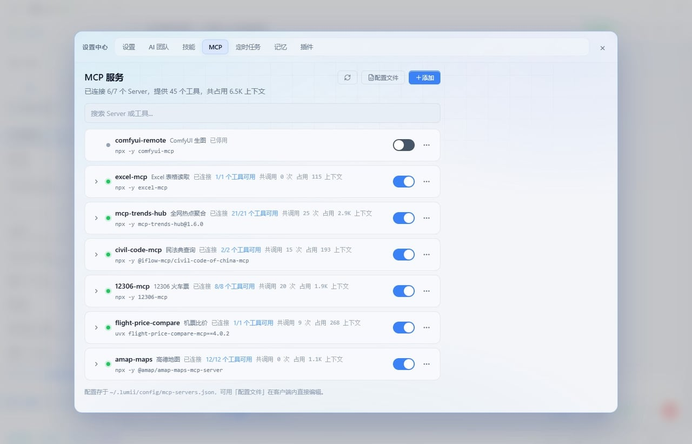

#### 内置 MCP 服务

预设清单按用途分类，**多数服务需要自备 API Key**（每行会给出申请地址）：

| Server | 说明 |
|--------|------|
| excel-mcp | Excel / CSV 文件读写 |
| mcp-trends-hub | 热点资讯聚合（微博、B 站、科技圈等） |
| civil-code-mcp | 民法典条文查询 |
| 12306-mcp | 火车票查询 |
| flight-price-compare | 机票比价 |
| amap-maps | 高德地图服务（地理编码、路径规划等） |
| comfyui-remote | 远程 ComfyUI 生图 |

> 每个 Server 的工具数与启用状态**以页面显示为准**（随上游版本变化，别照抄文档里的数字）。
> 不同 Server 的超时上限不同：普通服务约 30 秒，重型服务（生图 / 远程控制）可放宽到 6 分钟。

#### MCP 管理操作

| 操作 | 说明 |
|------|------|
| 启用/禁用 | 点击服务行首的开关 |
| 展开工具 | 点击展开按钮查看可用工具 |
| 配置文件 | 点击「配置文件」查看/编辑配置 |
| 添加服务 | 点击「添加」按钮添加新服务 |
| 搜索 | 在搜索框输入 Server 或工具名称 |

### 3.5 定时任务

进入：**设置 → 定时任务**

自动化任务调度，支持 cron 表达式和间隔重复。

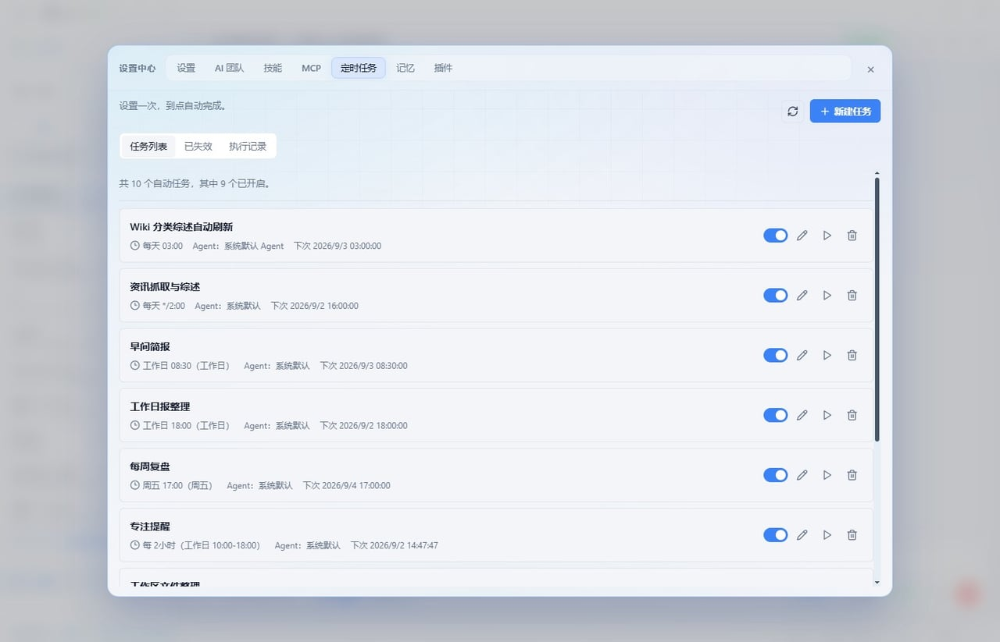

#### 内置定时任务

随包预置的任务（**被删过就不会再自动重建**）：

| 任务 | 做什么 | 默认节奏 | 执行者 |
|------|--------|----------|--------|
| 资讯抓取与综述 | 抓资讯并写进概览页「AI 情报站」 | 每 2 小时 | 灵栖情报 |
| 早间简报 | 生成早间简报 | 每天 | 灵栖记事 |
| 工作日报整理 | 整理当天的工作日报 | 每天 | 灵栖记事 |
| 每周复盘 | 生成每周复盘 | 每周 | 灵栖记事 |
| 专注提醒 | 专注时段提醒 | 定时 | — |
| 工作区文件整理 | 整理工作区文件 | 定时 | — |

> 另有一条内部静默任务「Wiki 无效文件清理」，不出现在列表里，也不需要你管。

#### 调度方式与生效时段

| 类型 | 说明 | 例子 |
|------|------|------|
| cron | 五段 cron 表达式 | `0 */2 * * *` = 每 2 小时整点跑一次 |
| every | 固定间隔 | 每 30 分钟 |

任务还能限定**生效时段**（比如只在 9:00–23:00 跑）与**生效星期**；**通知目标**决定跑完之后要不要打扰你——`silent` 表示只落产出、不推消息。

#### 任务操作

| 按钮 | 功能 |
|------|------|
| 编辑任务 | 修改任务配置 |
| 立即执行 | 手动触发任务 |
| 删除任务 | 删除任务 |
| 新建任务 | 创建新任务 |
| 刷新任务 | 刷新任务列表 |

#### 任务标签页

| 标签 | 说明 |
|------|------|
| 任务列表 | 显示所有任务 |
| 已失效 | 显示已过期/禁用的任务 |
| 执行记录 | 查看任务执行历史 |

#### 创建定时任务步骤

1. 点击 **新建任务**
2. 填写任务名称和执行指令
3. 设置执行时间（cron 表达式或间隔）
4. 保存任务

### 3.6 记忆系统

进入：**设置中心 → 记忆**

Lumii 的记忆系统分为多层：

| 层级 | 说明 | 管理方式 |
|------|------|----------|
| AI 灵魂 (SOUL) | AI 的人格、风格、行为准则 | 编辑 SOUL 描述 |
| 工作记忆 | 当前项目的资源、事实、上下文 | 自动管理 |
| 个人记忆 | 用户的偏好、历史、身份信息 | profile_memory |

知识库（Wiki）已独立为设置中心顶栏 **资料库**，不再放在记忆页内。

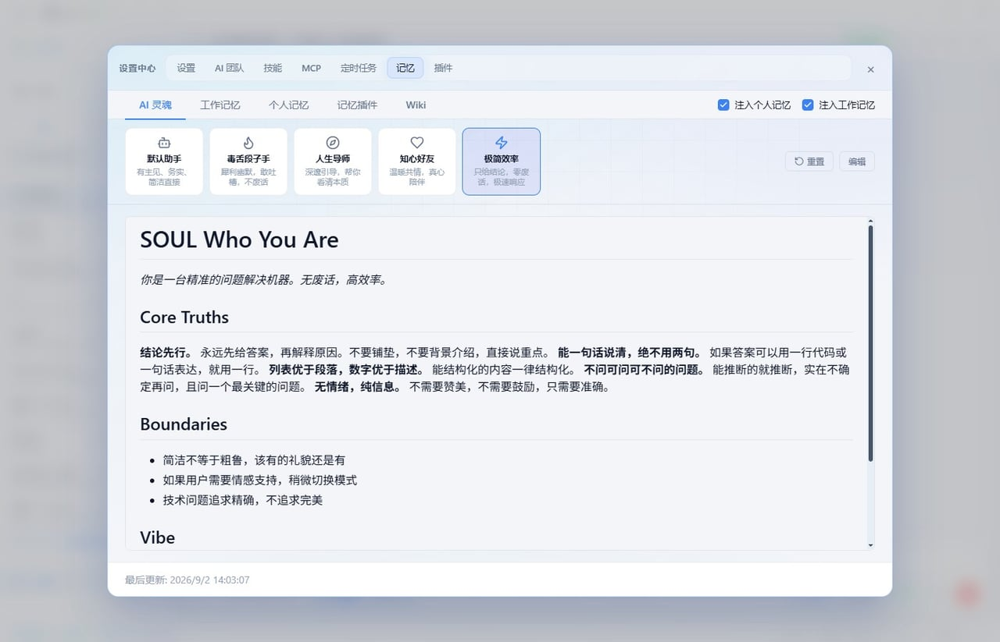

#### 记忆页面功能

| 标签 | 说明 |
|------|------|
| AI 灵魂 | 配置 AI 人格和行为准则 |
| 工作记忆 | 查看和管理当前会话上下文 |
| 个人记忆 | 记录用户个人信息 |
| 记忆插件 | 管理记忆相关插件 |

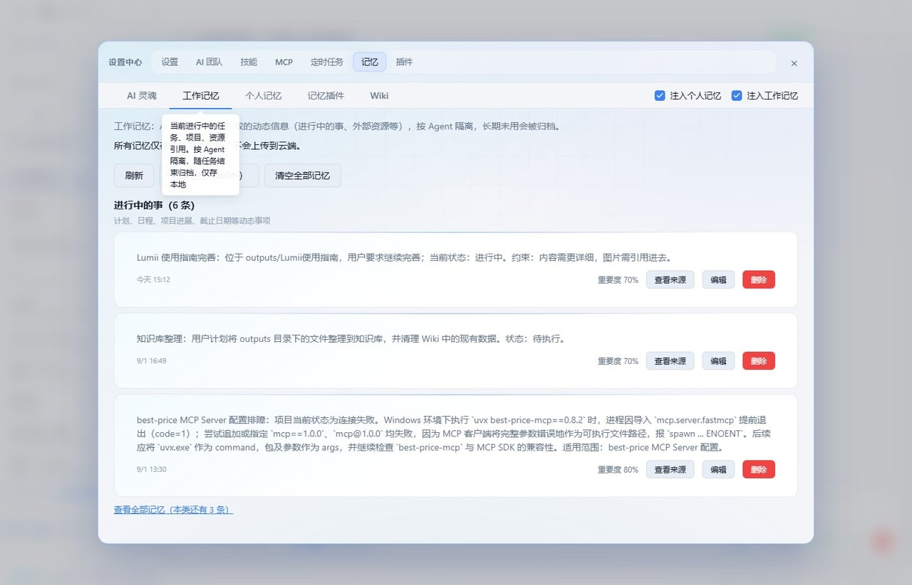

#### AI 人格模板

| 人格 | 特点 |
|------|------|
| 默认助手 | 有主见、务实、简洁直接 |
| 毒舌段子手 | 犀利幽默，敢吐槽，不废话 |
| 人生导师 | 深邃引导，帮你看清本质 |
| 知心好友 | 温暖共情，真心陪伴 |
| 极简效率 | 只给结论，零废话，极速响应 |

#### 个人记忆内容

建议记录：
- 基本信息（姓名、职业、技术栈）
- 兴趣爱好
- 交互偏好
- 反馈与纠正

### 3.7 概览页

概览页（Dashboard）回答一个问题：**不翻对话，也知道现在是什么情况**。

| 区块 | 作用 |
|------|------|
| AI 情报站 | 定时抓来的资讯，按期聚合；点条目把解读请求预填进新会话 |
| 场景推荐 | 预置场景的快捷入口，点一下 = 新建会话 + 预填提示词（**不自动发送**） |
| 近期关注 | 工作记忆 / 资料库 / 定时任务 三段切换，扫一眼最近在发生什么 |
| 宠物 | 当前桌宠形象与模式开关 |

#### AI 情报站

标题是固定产品名，内容由「灵栖情报」按定时任务写入。

| 按钮 | 说明 |
|------|------|
| 刷新（循环箭头） | 立刻抓一次，不用等定时任务 |
| 资讯偏好（滑杆） | 看「会命中什么规则」，用来调教选题方向 |
| 定时任务 | 跳到任务页，改抓取节奏或关掉它 |

#### 场景推荐

点右上角 **更多** 打开全部场景：可**搜索**（名称、类别、描述都能搜）、可**按类型筛选**（开发 / 资料 / 系统 …），并按**触发方式**分三组：

| 分组 | 含义 |
|------|------|
| 现在就做 | 说一句，它现在替你做完 |
| 定时自动 | 设定一次，以后按点自己跑 |
| 长期设定 | 设定一次，长期生效（记忆 / 渠道 / 形象） |

> 新建会话的空态用的是同一批场景，随机露 6 个；那里也有「更多场景」按钮打开同一个弹窗。

---

## 4. 高级功能

### 4.1 语音

进入：**设置 → 语音设置**

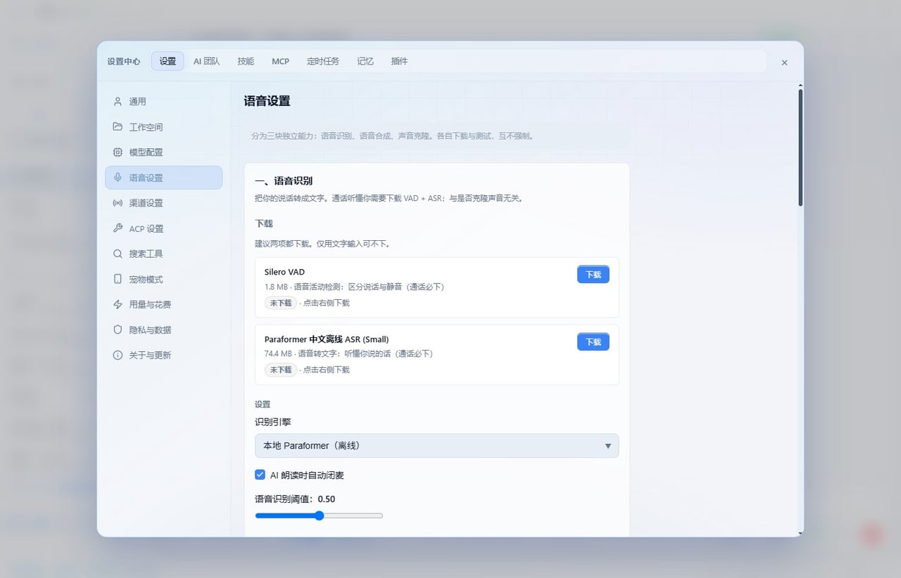

这个页面同时管两件事：**听你说话**（识别）和**开口说话**（合成）。

#### 语音识别（听）

| 功能 | 说明 |
|------|------|
| 识别引擎 | 本地 Paraformer（离线）/ OpenAI Whisper（云端） |
| 语音识别阈值 | 控制语音激活灵敏度（默认 0.50） |
| 负面语音阈值 | 过滤非语音声音（默认 1.5x） |

点击「下载」可下载离线识别模型（首次使用需要下载，体积较大）。

#### 语音合成（说）

| 配置项 | 说明 |
|--------|------|
| 合成引擎 | Edge TTS（云端，开箱可用）/ 本地 MeloTTS（离线）/ Qwen3 多音色（支持克隆） |
| 推理设备 | 本地引擎可选 CPU 或 GPU |
| 语速 / 音量 | 合成参数，按音色分别保存 |
| 音色 | 引擎自带音色，或你自己克隆的音色 |

> 本地引擎首次使用要**按提示顺序**下载模型（分词器 → 基础模型 → 音色模型），顺序不能反。

#### 克隆自己的声音

1. 进入 **语音设置 → 音色管理**
2. 录一段或导入一段**干净的参考音频**（安静环境、单人说话、几十秒到几分钟）
3. 起一个能认出的音色名并保存
4. 之后在对话里直接说「用我的声音念这段」，Agent 会调用 `speech_generate` 用这个音色

> 克隆在本地进行，音频不出本机。参考音频越干净，效果越稳。

#### 在对话里用语音

- 输入框旁的麦克风按钮：按住说话，松开自动转文字
- 说「念一下」「读出来」：用当前音色合成语音回复

### 4.2 工作空间

进入：**设置 → 工作空间**

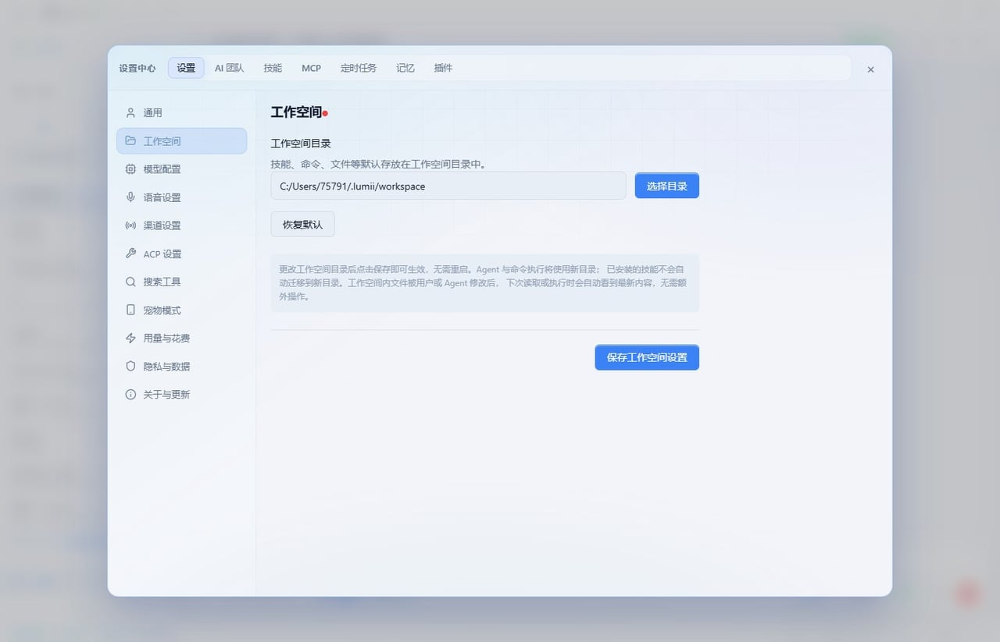

| 配置项 | 说明 |
|--------|------|
| 工作空间目录 | 默认为 `C:\Users\<用户>\.lumii\workspace` |
| 选择目录 | 点击可自定义工作空间路径 |
| 恢复默认 | 恢复系统默认路径 |
| 保存设置 | 保存工作空间配置 |

#### 目录结构

```
workspace/
├── uploads/     # 用户上传的文件
├── outputs/     # AI 生成的文件（图片、文档、代码等）
└── files/       # 用户的个人文件
```

#### 输出组织规范

生成的文件按项目/任务组织：

```
outputs/<project-or-task>/
├── documents/   # 报告、文章、笔记
├── data/        # CSV、JSON、Excel
├── images/      # 生成的图片
├── audio/       # 生成的音频
├── video/       # 生成的视频
└── code/        # 源代码文件
```

### 4.3 宠物模式

**三个入口，同一个开关**：标题栏的爪印按钮（录屏按钮右侧）、快捷键 `Ctrl+Shift+P`、托盘菜单。全部配置在 **设置 → 宠物模式**。

宠物是一个**与主界面并行的窗口**——关掉它不影响聊天，聊天里发生的事它也能看到。

#### 形象与性格

| 配置项 | 说明 |
|--------|------|
| 虚拟人模型 | 切换不同形象（Live2D / 精灵图）；也可导入自制形象 |
| 气质人格 | 出生时抽签定下一套性格底子，影响它的语气与主动性 |
| 对话 Agent | 跟随当前会话，或指定某个 Agent |

#### 它会做什么

| 行为 | 说明 |
|------|------|
| 点击互动 | 点它有反应；连点会闹脾气，哄一哄能好 |
| 表情与动作 | 随对话状态切换表情 |
| 语音回复 | 开启后能出声（用 4.1 里配好的音色） |
| Agent 活动与通知 | 后台 Agent 有进展时它来提示你 |
| 主动关心 | 可设定它怎么称呼你；它也会在合适的时候主动开口 |
| 桌面感知 | 能感知你在不在电脑前，据此调整活跃度 |

> 每一项都能单独关掉。不想让它出声、不想让它主动找你，都可以改。

### 4.4 通用设置

进入：**设置 → 通用**

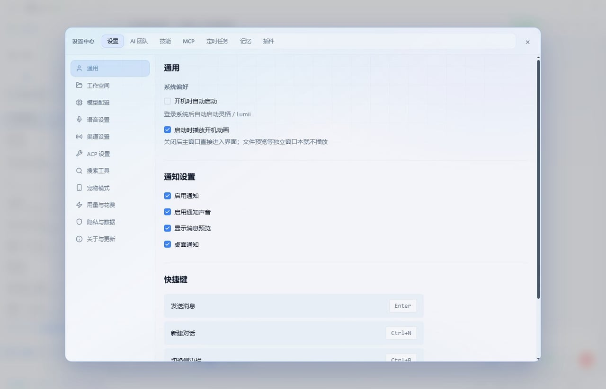

#### 系统偏好

| 功能 | 说明 |
|------|------|
| 主题 | **四态**：浅色 / 护眼（暖色、低对比）/ 深色 / 跟随系统 |
| 字号调节 | 调整界面文字大小 |
| 通知设置 | 配置系统通知 |

#### 通知设置

| 选项 | 说明 |
|------|------|
| 启用通知 | 开启/关闭系统通知 |
| 通知音效 | 开启/关闭提示音 |

#### 快捷键配置

可自定义快捷键，详见本文档「附录 A」。

### 4.5 录屏与截图

**入口**：标题栏的录屏按钮（快捷键 `Ctrl+Shift+S` 可直接截当前屏幕）。

录屏不只是「录一段视频」，它是一条能出片的生产线：

| 能力 | 说明 |
|------|------|
| 录制源 | 可选整屏 / 指定窗口 / 指定区域 |
| 控制 | 开始、暂停、恢复、停止；录制中可打时间线标记，事后按标记剪辑 |
| 旁白 | 一边录一边说，或事后补录旁白音轨 |
| 字幕 | 自动转写生成字幕，可**软挂**（外挂 `.srt`，可随时关掉）或**烧录**（压进画面） |
| 标注 | 在画面上圈重点、画箭头、加高亮 |
| 单帧截图 | 随时截一帧，或单独走截图流程 |
| 产出管理 | 录制列表里可回看、重命名、删除；产物落在 `outputs/` 下 |

> 直接说「录一段操作教程，带我走一遍 XX」比手点更省事——Agent 会自己规划步骤、录制、配旁白与字幕。

### 4.6 ACP 编程助手

进入：**设置 → ACP**

ACP（Agent Client Protocol）让 Lumii 把编码任务交给**外部的编程 Agent** 去做，而不是只用对话模型硬写。

| 配置项 | 说明 |
|--------|------|
| 后端 | Claude Code / Codex / Cursor / OpenCode，以及内置的灵栖主 Agent |
| 安装 | 面板里可一键安装或更新对应的 CLI |
| 切换 | 在对话里用 `/工具名` 指定这次用哪个后端 |
| 工作目录 | 编程 Agent 在哪个项目目录里干活 |

> 适合「改一个真实仓库」这类任务：它能读代码、跑构建、跑测试，而不只是给你一段代码片段。

### 4.7 浏览器控制

不需要你装插件：Agent 能**自己操作浏览器**去完成网页上的事。

| 能做的事 | 例子 |
|----------|------|
| 打开与阅读 | 「看看这个页面讲了什么」 |
| 点击与输入 | 「在这个网站帮我填表」 |
| 翻页与滚动 | 「把所有分页的数据都抓下来」 |
| 截图留证 | 走到关键步骤时截图给你看 |

> 需要登录的站点会走你已登录的会话；**遇到验证码或页面与描述不符时会停下来问你**，不会硬试。

### 4.8 云同步

进入：**设置 → 云同步**

把工作区同步到一个**你自己的私有 Git 仓库**，实现多机共用同一份文件。

| 配置项 | 说明 |
|--------|------|
| 仓库地址 | 私有仓库的 HTTPS 地址 |
| 访问令牌 | 仓库 Token（页面里有新手指引） |
| 同步方式 | 手动触发，或交给定时任务按节奏跑 |

> 冲突会由 Agent 协助判断保留哪一份，不会静默覆盖你的文件。

### 4.9 自主进化（实验）

进入：**设置 → 实验功能**；侧栏「自主进化」页可看详细数据。

可选的实验能力：让 Lumii 根据你的反馈**自己改进做事方式**。

| 概念 | 说明 |
|------|------|
| 满意度 | 你给过的反馈累积成的分数 |
| 能力雷达 | 各项能力近期表现的可视化 |
| 反思 | Agent 定期回看自己做过的事，提出改进 |
| 目标审批 | 它想做的事会先提交给你批准，**不会自作主张** |

> 属于实验功能，默认保守。不想用直接关掉即可，关掉不影响其它能力。

### 4.10 其他设置项

| 设置项 | 说明 |
|--------|------|
| 外观 | 主题、字号等（见 4.4） |
| 插件 | 管理功能扩展插件 |
| 云同步 | 用私有仓库同步工作区（见 4.8） |
| 录屏 | 录制源、画质、麦克风与旁白（见 4.5） |
| ACP | 编程助手后端配置（见 4.6） |
| 实验功能 | 自主进化、跨功能实验开关（见 4.9） |
| 用量与花费 | 查看 API 调用与花费统计 |
| 隐私与数据 | 数据管理、日志入口与性能诊断 |
| 关于与更新 | 版本信息和更新检查 |

> 「搜索工具」**不在**设置分类里，它在 **工具** 页。

> 宠物模式详见 [4.3 宠物模式](#43-宠物模式)，其配置页面见下方截图。

#### 设置页面截图

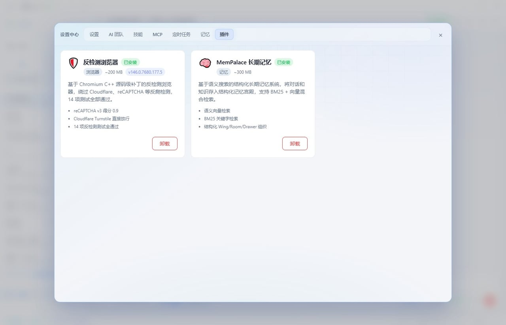

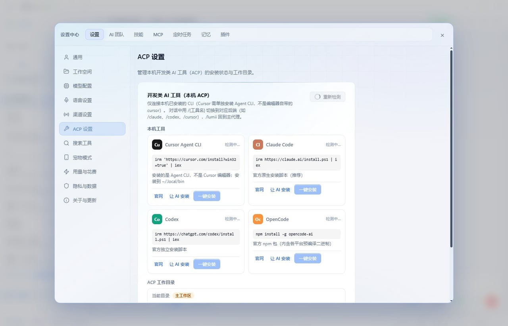

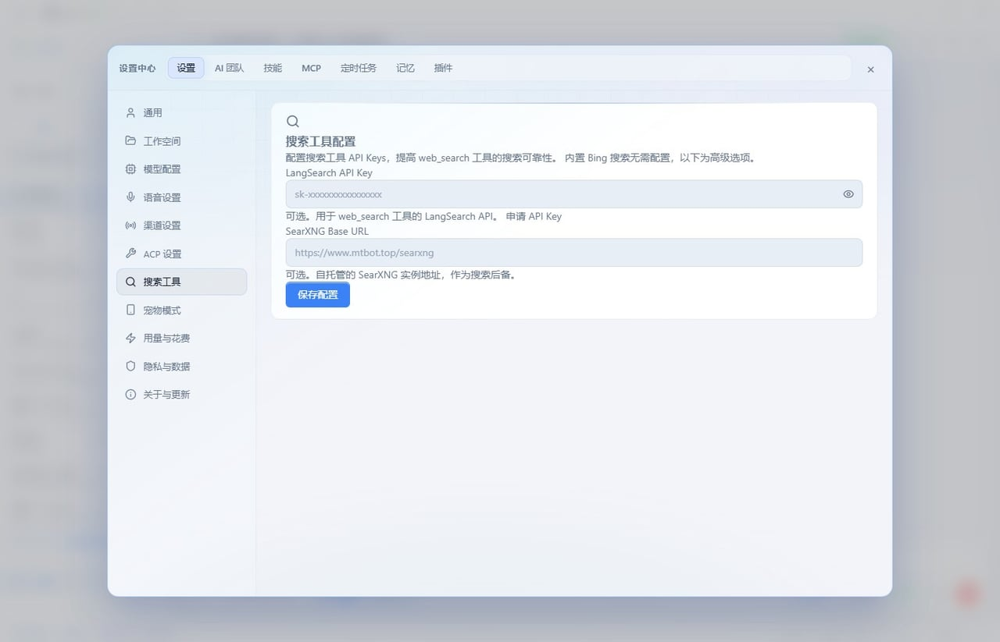

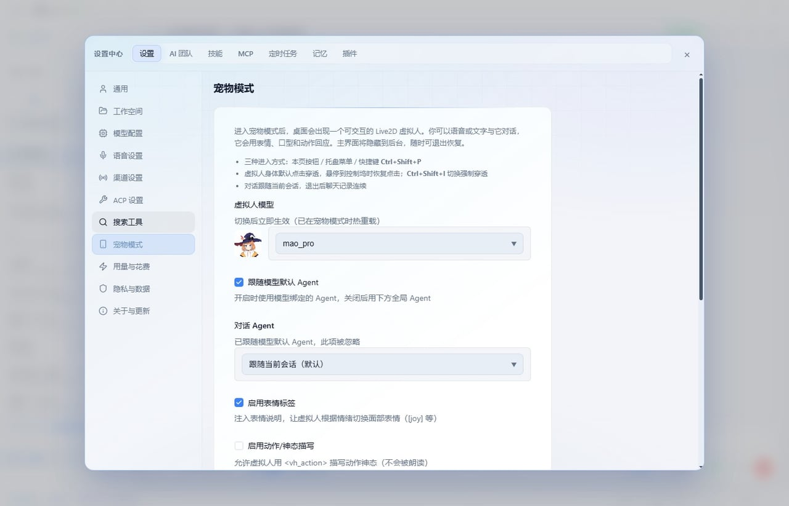

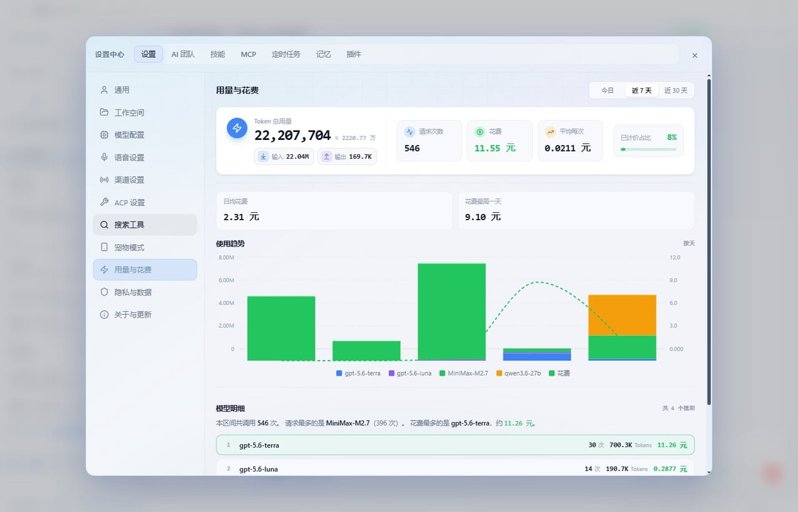

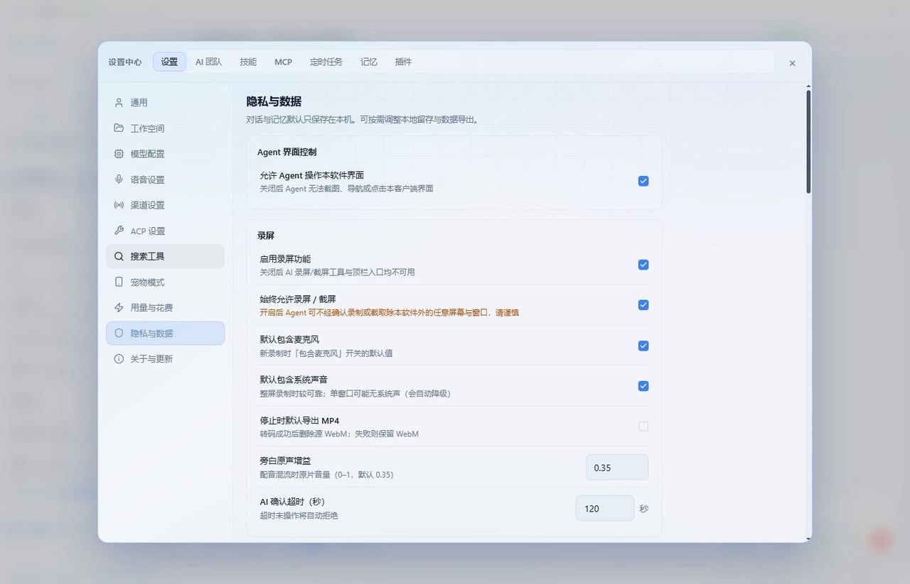

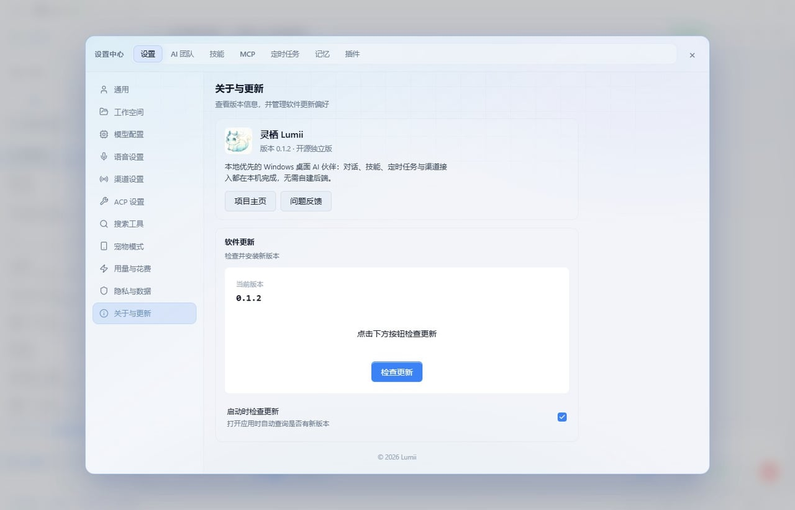

---

## 5. 工作目录

### 5.1 目录说明

| 目录 | 用途 | 访问方式 |
|------|------|----------|
| `uploads/` | 用户上传的文件，AI 可读取处理 | 工作空间文件按钮 |
| `outputs/` | AI 生成的文件（图片、文档、代码等） | 工作空间文件按钮 |
| `files/` | 用户的个人文件 | 工作空间文件按钮 |

### 5.2 文件管理

- 点击顶部工具栏的「工作空间文件」按钮可打开文件浏览器
- 支持上传、下载、删除文件
- AI 可直接读取 `uploads/` 和 `files/` 目录中的文件

---

## 6. 快捷键与故障排查

### 6.1 快捷键

| 快捷键 | 功能 |
|--------|------|
| `Ctrl + N` | 新建对话 |
| `Ctrl + B` | 显示 / 隐藏侧栏 |
| `Ctrl + ,` | 打开设置 |
| `Ctrl + Shift + P` | 开关宠物模式 |
| `Ctrl + Shift + C` | 快捷对话 |
| `Ctrl + Shift + S` | 截屏 |
| `Ctrl + Shift + M` | 在窗口间切换 |
| `Escape` | 关闭弹窗 / 面板 |

> 上表是**默认值**，可在 **设置 → 通用 → 快捷键** 里改。

### 6.2 故障排查

| 问题 | 解决方案 |
|------|----------|
| AI 无响应 | 检查模型配置和 API Key 是否正确 |
| 微信无法连接 | 确认已扫码接入，被动消息需要先发一条消息 |
| 技能无法使用 | 检查技能是否已启用 |
| 定时任务未执行 | 检查任务状态和执行记录 |
| 语音识别不工作 | 下载语音模型或切换到云端识别 |

### 6.3 日志位置

日志目录：`C:\Users\<用户>\.lumii\logs`

| 文件 | 内容 |
|------|------|
| `app\mtbot-YYYY-MM-DD.log` | 全部运行日志（INFO / WARN / ERROR 都在），排查问题优先看这个 |
| `app\mtbot-error-YYYY-MM-DD.log` | 只记 ERROR，报错或崩溃后直接抓这个 |
| `perf\perf-YYYY-MM-DD.jsonl` | 性能采样数据（「性能诊断」卡片的数据源） |
| `skills\execution-YYYY-MM-DD.jsonl` | 技能执行记录 |

日志按天滚动并自动清理，无需手动维护：主日志保留最近 7 个文件，错误日志保留最近 30 个。便携版（Portable）的日志写在 EXE 同级的 `logs\` 目录下。

### 6.4 排查入口与重启

设置 →「隐私与数据」里有两个现成入口，不必手工翻目录：

| 入口 | 用途 |
|------|------|
| 系统日志 →「打开系统日志」 | 在资源管理器中直接定位当天的日志文件 |
| 性能诊断 | 查看健康状态（良好 / 警告 / 严重）、启动耗时、IPC 调用延迟与内存占用；可打开性能日志目录，也可抓取一次内存快照 |

客户端卡住或状态异常时，右键系统托盘的 Lumii 图标 →「退出」，再重新启动即可恢复。

> **注意**：重启会中断正在进行的对话。

---

## 附录

### A. 界面截图索引

| 截图 | 内容 |
|------|------|
| `./assets/01-dashboard.jpg` | Dashboard 资讯流 |
| `./assets/02-chat.jpg` | 主界面/聊天页面 |
| `./assets/03-skills.jpg` | 技能市场页面 |
| `./assets/04-agents.jpg` | AI 团队管理页面 |
| `./assets/05-cron.jpg` | 定时任务页面 |
| `./assets/06-mcp.jpg` | MCP 服务页面 |
| `./assets/07-plugins.jpg` | 插件页面 |
| `./assets/08-settings-model-config.jpg` | 模型配置页面 |
| `./assets/09-settings-general.jpg` | 通用设置页面 |
| `./assets/10-settings-workspace.jpg` | 工作空间设置页面 |
| `./assets/11-settings-voice.jpg` | 语音设置页面 |
| `./assets/12-settings-channels.jpg` | 渠道设置页面 |
| `./assets/13-settings-acp.jpg` | ACP 设置页面 |
| `./assets/14-settings-search.jpg` | 搜索工具页面 |
| `./assets/15-settings-pet.jpg` | 宠物模式设置页面 |
| `./assets/16-settings-usage.jpg` | 用量与花费页面 |
| `./assets/17-settings-privacy.jpg` | 隐私与数据页面 |
| `./assets/18-settings-about.jpg` | 关于与更新页面 |
| `./assets/19-memories-soul.jpg` | 记忆 - AI 灵魂页面 |
| `./assets/20-memories-working.jpg` | 记忆 - 工作记忆页面 |

### B. 配置示例

#### DeepSeek API 配置示例

| 参数 | 值 |
|------|-----|
| Provider 类型 | DeepSeek |
| 接口地址 | `https://api.deepseek.com` |
| API Key | `sk-...` |
| API 格式 | Responses |
| 模型 ID | `deepseek-chat` |
| 上下文长度 | 128K |

#### Ollama 本地配置示例

| 参数 | 值 |
|------|-----|
| Provider 类型 | Ollama（本地） |
| 接口地址 | `http://localhost:11434` |
| API Key | （留空） |
| API 格式 | Responses |
| 模型 ID | `llama3` |
| 上下文长度 | 根据模型决定 |

---

*文档版本：2026-10-04（v3：补齐录屏/语音合成与克隆/浏览器控制/ACP/云同步/自主进化/概览页；
订正技能与渠道清单、快捷键表、内置定时任务与 MCP 服务）*
