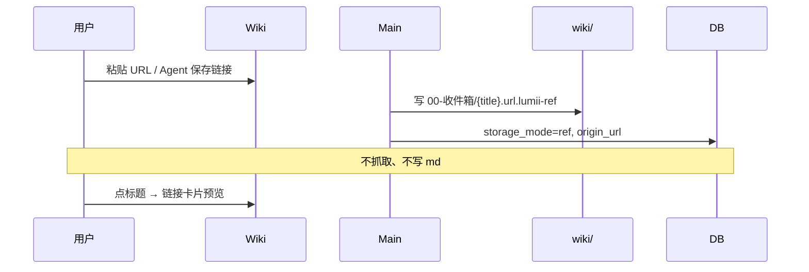
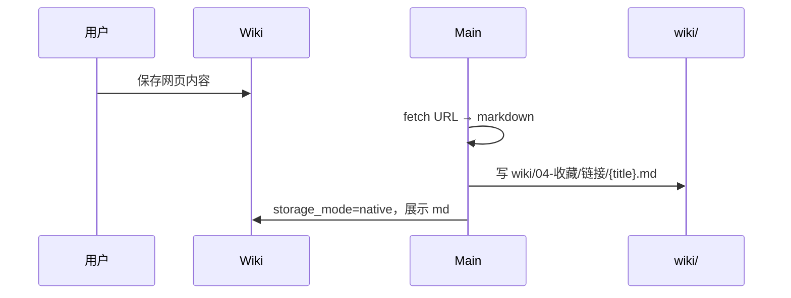
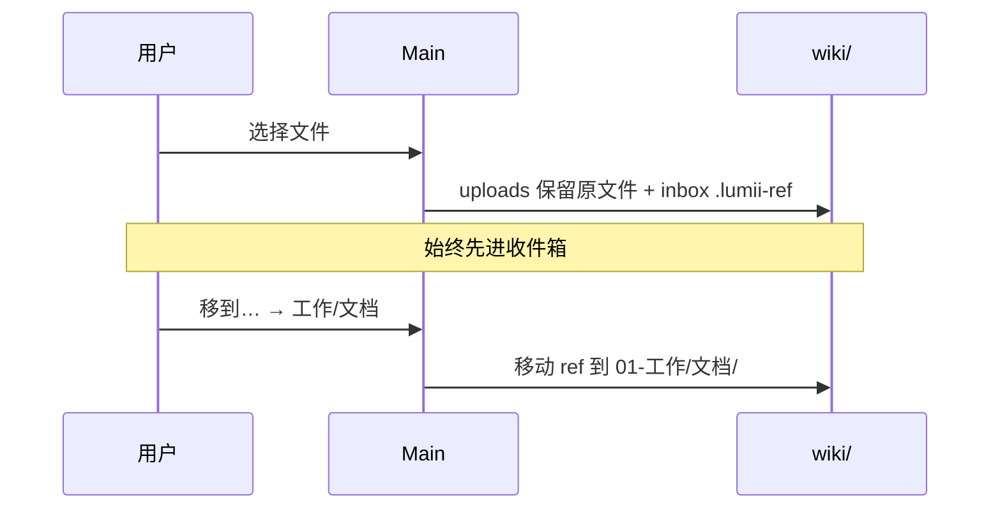

# Wiki 资料库重设计：引用优先 + 工作空间目录

> 日期：2026-08-29  
> 状态：**已确认（v1.1）**  
> 前置：[2026-08-27-wiki-topic-hierarchy-redesign.md](./2026-08-27-wiki-topic-hierarchy-redesign.md)  
> 关联：[wiki-user-guide.md](../../guide/wiki-user-guide.md)

---

## 0. 已确认决策

| 项 | 决策 |
|----|------|
| Wiki 根目录 | `<activeWorkspace>/wiki/`（**已确认**） |
| 链接 / 网页 | 默认只存**引用**（URL + 标题）；用户主动点 **「保存网页内容」** 才下载为 `.md` |
| 交互 | **越简单越好**；减少按钮、减少自动流程 |
| 文件迁入 | 默认**复制**进 wiki，原文件保留 |
| 打开原文件 | 次要操作，预览为主 |
| 旧六大类 | **映射共存**（DB 字段保留，UI 显示新名称） |
| AI 分类 | **不自动归档**；仅可选建议，且默认偏保守（易错则留收件箱） |

---

## 1. 背景与目标

### 1.1 用户诉求

1. **收集** — 丢进来即可，不必立刻分类  
2. **整理** — 有**像文件夹一样好懂**的分组，自己拖/选就能放对  
3. **使用** — App 内搜索、预览；很少打开磁盘原文件  
4. **可控** — `wiki/` 目录看得见、摸得着  

### 1.2 要解决的核心矛盾

**人类分类**与 **AI 分类**目标不一致：人按「这件事跟我有什么关系」分；AI 按文本语义猜，容易把「工作里的学习资料」放进「学习」、把「生活账单」放进「工作」。

**对策（本设计硬性约束）：**

- 新资料 **100% 先进收件箱**，入库时不写分类  
- AI **从不静默改分类**；只在用户点「帮我看看放哪」时出现一行建议  
- 一级类 **少而宽**，边界用日常口语描述，降低误判代价  
- 拿不准的一律 **收件箱**（AI 置信度低阈值）

### 1.3 设计目标

| 目标 | 说明 |
|------|------|
| 引用优先 | 文件、链接默认不搬、不下载；`wiki/` 下写 `.lumii-ref` |
| 按需实体化 | 用户明确要「保存网页 / 迁入 wiki」时才落盘实体 |
| 分类给人用 | 左栏 = 文件夹；名称一听就懂 |
| 交互极简 | 主路径：搜 → 点 → 读；整理是低频次要路径 |

---

## 2. 设计原则

1. **零决策入库** — 上传、丢链接 → 收件箱，结束  
2. **人主导分类** — 移动 / 拖到文件夹；AI 仅辅助  
3. **链接先引用** — 不自动抓取；用户说保存再下载  
4. **预览即主界面** — 点标题 = 看内容，不是打开文件  
5. **目录即界面** — 左栏与 `wiki/` 一一对应  
6. **渐进迁移** — 与现有 `wiki_sources`、六大类字段兼容  

---

## 3. 分类体系（人类优先）

### 3.1 一级分类（左栏，共 6 项 + 收件箱）

采用 **「生活场景」** 而非「用途轴」；每类用一句话说清边界，方便人对照、也便于写进 AI prompt。

| 一级 | 人怎么理解 | 典型内容 | 磁盘路径 |
|------|------------|----------|----------|
| **收件箱** | 还没想好放哪 | 一切新进来的 | `wiki/00-收件箱/` |
| **工作** | 跟上班、项目、赚钱有关的 | 文档、会议、汇报、合同（工作向） | `wiki/01-工作/` |
| **学习** | 主动在学、在读、在备考的 | 课程、读书笔记、教程、考试 | `wiki/02-学习/` |
| **生活** | 私人、家庭、日常琐事 | 证件、医疗、账单、日记、照片说明 | `wiki/03-生活/` |
| **收藏** | 网上看到、先留着以后看 | **链接引用**、模板、长期参考 | `wiki/04-收藏/` |
| **归档** | 暂时不用，别删 | 旧项目、过期资料 | `wiki/05-归档/` |

**为什么这样分：**

- **工作 / 学习 / 生活** 是中文用户最自然的三个生活域，比「项目与事务 / 学习成长」更口语  
- **收藏** 专门承接链接和「还没细看的参考」，避免 AI 在 工作/学习 之间瞎猜  
- **归档** 独立，避免和「生活」混在一起  

「稍后处理」不进主题树，作为列表筛选标签（`wiki/_parking/`），左栏**不单独占一级**（减一项）。

### 3.2 小类（每大类 3–4 个，默认即可）

小类 **可编辑**，但默认保持稀疏，减少选择负担。

| 大类 | 默认小类 |
|------|----------|
| 工作 | 文档 · 会议 · 汇报 · 整合长文 |
| 学习 | 笔记 · 课程 · 资料 · 整合长文 |
| 生活 | 证件 · 家庭 · 随笔 · 整合长文 |
| 收藏 | 链接 · 模板 · 媒体 · 整合长文 |
| 归档 | （无小类，或按年 `2026/`） |

收件箱 **无小类**。

### 3.3 降低 AI 分错的设计

| 规则 | 说明 |
|------|------|
| 入库不分类 | `topic_category/subtopic` 为空 = 收件箱 |
| 不自动 apply | 禁用「归档完成后自动写入分类」作为默认行为 |
| 建议可关 | 设置项：「整理时显示分类建议」默认 **开**，可关 |
| 低置信度 | 模型置信度 &lt; 阈值 → 不建议具体类，只提示「留在收件箱」 |
| 收藏兜底 | URL / 链接类 AI 若不确定 → 建议 **收藏 / 链接**，不猜 工作/学习 |
| 批量整理 | 「一键 AI 分类」必须 **预览列表 + 确认**，不可静默执行 |
| 用户纠错 | 移动后可选「记住这类放这里吗」— P2，先不做 |

### 3.4 与旧六大类映射（共存）

| 旧大类 | 新一级 | 默认小类 |
|--------|--------|----------|
| 做事记录 | 工作 | 文档 |
| 学习资料 | 学习 | 资料 |
| 计划与复盘 | 工作 | 汇报 |
| 证件凭据 | 生活 | 证件 |
| 模板参考 | 收藏 | 模板 |
| 随笔创作 | 生活 | 随笔 |

DB 仍存原字段；UI 与 `wiki/` 路径用新名；迁移脚本写映射表 JSON。

---

## 4. 存储模型

### 4.1 三态 `storage_mode`

| 值 | 含义 | 典型场景 |
|----|------|----------|
| `ref` | 引用 | 本地文件、**仅 URL 的链接** |
| `materialized` | 实体在 wiki 内 | 用户「迁入 wiki」后的文件 |
| `native` | 在 wiki 内创建 | 笔记、**用户保存后的网页 md**、整合长文 |

### 4.2 引用文件 `.lumii-ref`

**本地文件引用：**

```json
{
  "kind": "wiki-ref",
  "version": 1,
  "refType": "file",
  "targetPath": "D:/Downloads/报告.pdf",
  "title": "Q3 报告",
  "linkedAt": "2026-08-29T10:00:00+08:00"
}
```

**链接引用（默认，不下载）：**

```json
{
  "kind": "wiki-ref",
  "version": 1,
  "refType": "url",
  "targetUrl": "https://example.com/article",
  "title": "示例文章",
  "linkedAt": "2026-08-29T10:00:00+08:00"
}
```

路径示例：`wiki/00-收件箱/示例文章.url.lumii-ref`

### 4.3 类型分流（修订）

| 来源 | 入库行为 | storage_mode |
|------|----------|--------------|
| 用户上传文件 | 原路径不动，写 inbox ref | `ref` |
| 用户 / Agent **保存链接** | 只写 url ref，**不抓取** | `ref` |
| 用户点 **「保存网页内容」** | 抓取 → `wiki/.../*.md` | `native` |
| 新建笔记 | 直接写 `.md` | `native` |
| AI 整合长文 | 写 `{大类}/整合长文/*.md` | `native` |
| 用户「迁入 wiki」 | 复制文件到 wiki | `materialized` |

### 4.4 目录布局

根路径：**`<activeWorkspace>/wiki/`**

```
wiki/
├── 00-收件箱/
├── 01-工作/
│   ├── 文档/
│   └── 整合长文/
├── 02-学习/
├── 03-生活/
├── 04-收藏/
│   └── 链接/          # 链接 ref 默认落点（用户可再移动）
├── 05-归档/
├── _parking/          # 稍后处理（标签，非左栏一级）
└── .lumii/
    └── wiki-meta.json
```

索引仍在 `~/.lumii` SQLite（FTS、任务）；**用户感知以 `wiki/` 为准**。

---

## 5. 前端与交互（极简）

### 5.1 信息架构

**左栏仅 7 项：** 收件箱 · 工作 · 学习 · 生活 · 收藏 · 归档 · （底部分隔）搜索  

- **去掉**左栏一级「知识图谱」「稍后处理」「资料库」等概念入口  
- 图谱、清理、重建索引、编辑分类 → 全部进右上角 **「⋯」**  
- 默认打开 **收件箱**（有角标）或上次离开的分区  

```
┌──────────────────────────────────────────────────┐
│  🔍 搜索                              ⋯          │
├─────────┬────────────────────────────────────────┤
│ 收件箱 3│  收件箱                              │
│ 工作    │  ┌──────────────────────────────────┐  │
│ 学习    │  │ 📎 某知乎回答          2 天前    │  │
│ 生活    │  │ 📄 Q3报告.pdf          昨天      │  │
│ 收藏    │  └──────────────────────────────────┘  │
│ 归档    │  [ + 添加文件 ]  [ + 添加链接 ]        │
│ ─────── │                                        │
│ 搜索    │                                        │
└─────────┴────────────────────────────────────────┘
```

### 5.2 主列表（一行一事）

| 元素 | 行为 |
|------|------|
| 整行点击 | 打开 **详情抽屉**（预览） |
| 标题 | 可编辑（P1） |
| 副标题 | 一行摘要；链接显示域名 |
| 角标 | 「链接」「引用」— 小字，不抢眼 |
| 行尾 | 仅 **⋯** 菜单：移到… · 保存网页内容（链接）· 迁入 wiki · 稍后处理 · 删除 |

**不出现**「详情」「移动」等多个并排按钮。

### 5.3 详情抽屉

| 区块 | 内容 |
|------|------|
| 正文 | 已保存 md / 提取文本 / 链接卡片（标题 + 摘要 + **在浏览器打开**） |
| 链接未保存时 | 卡片说明：「仅保存了链接；需要离线阅读请点下方保存」 |
| 底栏（最多 3 个） | **移到…** · **保存网页内容**（仅 url-ref）· **迁入 wiki**（仅 file-ref） |

「打开原文件 / 打开链接」合并为正文区文字链，不占底栏主按钮。

### 5.4 添加资料（两条入口）

1. **+ 添加文件** — 选文件 → 收件箱 ref，toast「已加入收件箱」  
2. **+ 添加链接** — 粘贴 URL + 可选标题 → 收件箱 url-ref，**不下载**  

Agent 侧「帮我保存这个链接」同理：只建 ref，除非用户说「保存网页内容/下载」。

### 5.5 分类（移动）

**「移到…」** 弹层：

```
┌─ 移到 ─────────────────┐
│  ○ 工作  ○ 学习  ○ 生活  │
│  ○ 收藏  ○ 归档          │
│  ── 小类 ──              │
│  ○ 笔记  ○ 课程  …       │
│                          │
│  💡 建议：收藏（链接类）  │  ← 可选一行，可忽略
│                          │
│        [ 确定 ]          │
└──────────────────────────┘
```

- 无「就这样」单独按钮 — **用户选手 = 确定**，一步完成  
- AI 建议 **灰色小字一行**，不预选、不阻断  
- 收件箱内可 **多选 + 批量移到…**（P1）

### 5.6 保存网页内容（用户主动）

触发：详情底栏 / ⋯ 菜单 / 用户话术「保存网页内容」

1. 确认：「将下载网页并保存为 Markdown，可能需要几秒」  
2. 后台抓取 → `wiki/{当前分类或收藏}/链接/{标题}.md`  
3. `storage_mode`: `ref` → `native`；删除或保留 url-ref（保留作溯源）  
4. 详情自动刷新为 md 预览  

失败：toast + 保留 url-ref，可重试。

### 5.7 搜索

顶栏或左栏「搜索」→ 全屏搜索结果列表，点行开抽屉。无高级筛选（P0）。

### 5.8 刻意不做 / 下沉的功能

| 功能 | 处理 |
|------|------|
| 知识图谱 | ⋯ 更多 |
| Wiki 整理 / 编目 | ⋯ 更多 |
| 综述合成 | ⋯ 更多 |
| 重建索引 | ⋯ 更多 |
| 收件箱 AI 一键分类 | ⋯ 更多（且必须预览确认） |
| 类型 Tab（文档/图片/音视频） | 取消；用搜索 + 图标区分 |

---

## 6. 核心流程

### 6.1 添加链接（不自动下载）



### 6.2 用户主动保存网页



### 6.3 上传文件



### 6.4 日常阅读

点标题 → 抽屉预览。file-ref 预览失败时，正文区显示「打开原文件」链接。

---

## 7. 后端设计

### 7.1 模块

| 模块 | 职责 |
|------|------|
| `WikiVaultLayout` | 创建/解析 `wiki/` 树 |
| `WikiRefStore` | 读写 `.lumii-ref`（file / url） |
| `WikiClipSaver` | **用户触发**时 URL → md |
| `WikiMaterializer` | 复制 file 进 wiki |
| `WikiOrganizer` | 移动 ref/md + 更新 topic |
| `WikiRepo` | CRUD、FTS |

### 7.2 入库总线（修订）

```
ingest(item)
  ├─ 去重
  ├─ itemType == url → write url-ref, storage_mode=ref, topic=空
  ├─ itemType == file → write file-ref, storage_mode=ref, topic=空
  ├─ itemType == note → write .md, storage_mode=native
  ├─ index FTS（链接仅标题+url；正文待用户保存后补索引）
  └─ 不 enqueue 自动分类
```

### 7.3 新增 IPC

| 命令 | 说明 |
|------|------|
| `wiki:link:save` | `{ sourceId }` 抓取并写 md |
| `wiki:source:materialize` | file-ref → 复制进 wiki |
| `wiki:vault:ensure-layout` | 初始化目录 |
| `wiki:organize:suggest` | 可选；低置信度返回 null |

### 7.4 链接预览（未保存）

- 列表/抽屉：读 `title` + 缓存的 og/meta（入库时 **仅拉 meta，不拉正文** — 轻量）  
- 或仅显示 URL + 用户填的标题（P0 最简）  
- 完整正文 **仅在** `wiki:link:save` 后  

---

## 8. 与现有实现

| 现有 | 调整 |
|------|------|
| 自动归档 inbox | 改为 **默认关闭**；仅手动或显式批量 |
| 剪藏即 md | 改为 **url-ref**；保存网页走新 IPC |
| 待整理/待补分 | UI 合并为 **收件箱** |
| 六大类 | 映射共存，见 §3.4 |
| 整合长文 | 保持；产物 `native` 写入对应大类/整合长文 |

---

## 9. 分期实施

| 阶段 | 内容 |
|------|------|
| **P0** | 左栏 6 类 + 收件箱；预览优先；链接只 ref；移动弹层；⋯ 收纳高级功能 |
| **P1** | `wiki/` 目录 + `.lumii-ref`；`wiki:link:save`；批量移动 |
| **P2** | file materialize；失效 ref 检测 |
| **P3** | 可选批量 AI 建议（预览确认）；定期整理提醒 |

---

## 10. 确认记录

| 项 | 结论 |
|----|------|
| 一级分类 | **工作 / 学习 / 生活 / 收藏 / 归档** + 收件箱；AI 易错 → 入库不分类、建议可选 |
| 链接 | **用户主动才下载** |
| 交互 | **极简**；左栏 7 项；行内仅 ⋯ |
| wiki 位置 | **activeWorkspace/wiki/** ✓ |
| 迁入 | **复制** ✓ |
| 旧类 | **映射共存** ✓ |

---

*下一步：更新 [wiki-user-guide.md](../../guide/wiki-user-guide.md)；编写 `docs/plans/` P0 实现任务。*
