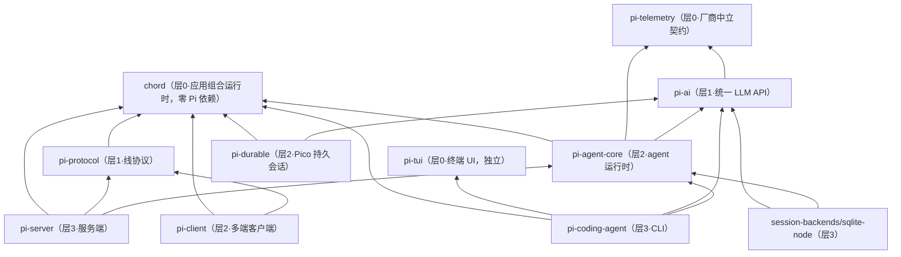

# 01 · 起源、发展历程与设计哲学

> 一句话：用 git 考古和 CHANGELOG 证据还原 pi 从哪里来、怎么长大、改名去了哪，并把作者散落在博客与 README 里的设计主张归纳成五条可验证的工程原则。读完你能自己回答："这个框架为什么长这样？哪些东西是它故意不做的？"

## 0 本篇地图

- 前置：无（本篇是课程起点）。后续第 02 篇进入 `pi-ai` 的统一 LLM API。
- 预计阅读：25 分钟；动手实验（`../code/01/`）再加 15 分钟。
- 本篇所有数字来自本地克隆 `temp/pi-course-research/pi` 的 git 历史（快照 2026-09-23），引用的每条路径都在仓库里核实过存在。外部动机论述引自作者 2025-11-30 长文（本地 `references/pi-minimal-coding-agent-post.md`）。

## 1 作者与动机：为什么"又"造一个 coding agent

Mario Zechner（GitHub: badlogic），奥地利格拉茨，Java 游戏框架 libGDX 的作者。pi 不是他的第一个"一个人养一个生态"的项目，这也解释了他后来对 issue 的独裁式管理风格——他在总结里明说："I tend to be dictatorial. A lesson I've learned the hard way over the years with my bigger projects."

他在 2025-11-30 的长文开头把自己对现有 harness 的不满列得很具体，逐条拆开看：

| 不满 | 作者原话要点 | 对 pi 设计的直接后果 |
|---|---|---|
| Claude Code 膨胀 | "turned into a spaceship with 80% of functionality I have no use for" | 极简主义总纲：`if I don't need it, it won't be built` |
| 系统提示词/工具每版变动 | "The system prompt and tools also change on every release, which breaks my workflows and changes model behavior. I hate that." | 系统提示词进版本控制、短到 <1000 token，可整体替换 |
| 上下文注入黑箱 | "Existing harnesses make this extremely hard or impossible by injecting stuff behind your back that isn't even surfaced in the UI." | 上下文工程控制权交给用户，注入点全部显式 |
| 无法检视交互 | "I want to inspect every aspect of my interactions with the model. Basically no harness allows that." | 会话 append-only、事件全暴露、UI 是核心的可替换皮 |
| 会话格式 | "a cleanly documented session format I can post-process automatically" | JSONL 会话格式有专文文档（`packages/coding-agent/docs/session-format.md`） |
| 闪烁渲染 | "Also, it flickers."（并补刀"it still flickers less than Claude Code"） | 自研 `pi-tui`：差分渲染 + 同步输出 |
| 自托管模型支持差 | 点名 Vercel AI SDK "doesn't play nice with self-hosted models ... specifically when it comes to tool calling" | 不用 SDK 封装层，直接对着四家 API 原生写 |

他的自我定位带着一贯的黑色幽默："So what's an old guy yelling at Claudes going to do? He's going to write his own coding agent harness and give it a name that's entirely un-Google-able, so there will never be any users."（Pi 如今约 109k stars——搜索引擎显然不买账。）

**这一节的方法论提醒**：pi 的几乎每个"奇怪"设计，都能在上表左边找到对应的伤口。读框架源码时，先问"它在防御谁的什么"，比直接问"它为什么不用最先进实践"有效得多。

## 2 项目时间线：一次 git 考古

以下数据全部由实验一（`../code/01/01-history-miner.mjs`）从本地克隆现算，不是抄 README。

### 2.1 总量与节奏

- 首次提交：`a74c5da1` 2025-08-09，"Initial monorepo setup with npm workspaces and dual TypeScript configuration"。
- 快照（2026-09-23）：6505 commits / 319 tags / v0.87.1；2025 年 1419 次，2026 年 5086 次。
- 月度提交分布（节选实验一输出）：

```
  2025-08    85  ###            2026-02   377  ############
  2025-09    53  ##             2026-03   418  ##############
  2025-10   129  ####           2026-04   461  ###############
  2025-11   280  #########      2026-05   481  ################
  2025-12   872  ############################  2026-06   424  ##############
  2026-01  1224  ########################################  2026-07   494  ################
                               2026-08   889  #############################
                               2026-09   318  ##########
```

三个清晰波峰：**2025-12（872）**——2025-11-30 博客出圈后的爆发；**2026-01（1224）**——历史最高，社区涌入 + 快速迭代期；**2026-08（889）**——server/protocol/client 平台化转向后的第二波工程高峰。2026 年 2–7 月稳定在 380–500/月，是一个项目进入"日常维护 + 定向建设"形态的标志。

### 2.2 包的出生顺序就是战略顺序

实验一按目录首次进历史的提交排的表（与简报核实值一致）：

| 包 | 首现提交 | 信号 |
|---|---|---|
| `tui`、`agent` | 2025-08-09 `a74c5da1` | 第一天就是 monorepo + TUI，不是先写 CLI 再重构 |
| `ai` | 2025-08-17 `f064ea0e` "Create unified AI package..." | 一周后补统一 LLM 层 |
| `coding-agent` | 2025-10-17 `ffc9be88` "Agent package + coding agent WIP" | 底座先稳，两个月后才长 CLI |
| `server` | 2026-07-21 `8495f9d0`（"rename orchestrator to server"） | 注意 commit 措辞：orchestrator 早于定名存在 |
| `evals` | 2026-07-25 `eafe11fb` | 平台化同时配评测 |
| `protocol` | 2026-07-30 `56eb685b` "remote session wire protocol" | |
| `client` | 2026-07-31 `33bc0a7b` "runtime-neutral session client" | 十日之内三连包，典型的"先有需求再拆包" |
| `telemetry` | 2026-08-05 `6b461b75` "extract telemetry package" | |
| `session-backends` | 2026-08-05 `a80008b9`（"rename storage package to session-backends"） | 同样先有 storage 后定名 |
| `chord` | 2026-08-28 `28b49a6b` "add Chord runtime foundation" | 独立应用组合运行时 |
| `durable` | 2026-09-18 `08016016` "move Pico into dedicated package" | Pico 先在 agent 包里孵化，成熟才搬家 |

两个读史要点。第一，**2025 年下半年只养三件套**（tui/ai/agent→coding-agent），2026-07 起才出现"平台"形状的包——极简主义不是不做功能，是先把内核跑通到自给自足（作者博客期间 pi 已是他日常主力），再谈多端。第二，**server 和 session-backends 的定名 commit 都是 rename**，说明"平台化"在仓库里先以草稿目录存在；包名是讨论出来的，不是预设的。

### 2.3 commit 主题词频里的重心

实验一对 6505 条主题去前缀、去发布自动化噪音（merge/release/changelog…）后的 top20：

```
   322  session      191  models      150  api
   300  tool         181  provider    148  prompt
   266  section      173  branch      145  contributor
   252  model        167  extension   131  context
   213  remove       165  thinking    155  compaction
   201  request      193  cycle       192  next
   189  approve
```

session/tool/model/compaction/context 霸榜——这个仓库的日常就是"会话格式 + 工具循环 + 模型适配"，没有 UI 框架词、没有插件市场词。**`remove` 进 top10 值得玩味**：一个持续删自己代码的框架，极简不是口号是维护动作。

### 2.4 单点最大的功能提交

按 diff 插入行数扫 feat 提交：最大的是 `46b66c59` 2026-09-14 "feat(agent): add hardened pico3 kernel"（+15148 行）。2026 年 9 月的主线就是 durable/Pico 持久化内核，这与 2.2 的包出生表互为印证。

## 3 改名考古：从 badlogic/pi-mono 到 earendil-works

仓库不是生下来就叫 `earendil-works/pi`。CHANGELOG 里留下了完整的地层剖面（实验二之外可用 `git grep -n mariozechner` 复现）：

1. **`packages/coding-agent/CHANGELOG.md` L1712**（0.73.1, 2026-05-07）：
   > "**Self-update support for the npm scope migration**: `pi update --self` now supports the upcoming package rename from `@mariozechner/pi-coding-agent` to `@earendil-works/pi-coding-agent`."
   
   注意这是"upcoming"——先给存量全局安装的用户铺升级通道，再改名。供给侧的体面。
2. **同文件 0.74.0（2026-05-07）**："Updated repository links and package references for the move to `earendil-works/pi-mono` and `@earendil-works/*` package scopes."——GitHub 组织与 npm scope 同批切换。
3. **commit `aa23e784` 2026-09-07**："fix(coding-agent): update repository links to `\"earendil-works/pi\"` (#9278)"——仓库名最终从 `pi-mono` 收敛为 `pi`。CHANGELOG 里的 issue 链接因此同时存在 `badlogic/pi-mono`、`earendil-works/pi-mono`、`earendil-works/pi` 三代 URL，是天然的断代标尺。

现在 `packages/*/package.json` 的 `name` 全部是 `@earendil-works/pi-*`（11 个包），但历史 CHANGELOG 里的 `@mariozechner/pi-ai` 等旧名保留原样未回改——文档即化石。唯一"合法"残留的个人 scope 是原生依赖 `@mariozechner/clipboard`（作者个人维护的剪贴板原生包）。

**组织化的意义**：改名伴随的是从"badlogic 的个人项目"到 Earendil Works 公司主体（earendil.com）的过渡，之后才出现 telemetry（厂商中立契约）、RFC 站（rfc.earendil.com/keyword/pi）这类"可被第三方信任"的基础设施。对个人品牌项目，这是一条可复制的毕业路径：**先让用户能无感迁移，再搬门牌。**

## 4 分层架构：一张图 + 一张实测依赖表

实验二（`02-repo-map.mjs`）读全部 `package.json` 的内部依赖做拓扑分层，层数 = 依赖链深度。实测输出（按层排序，体量为 `src/` 下 TS 源码字节数）：

| 层 | 包 | src TS 文件 / 体量 | 内部依赖 |
|---|---|---|---|
| 0 | `tui` | 42 / 566 KB | 无 |
| 0 | `chord` | 34 / 364 KB | 无 |
| 0 | `telemetry` | 6 / 31 KB | 无 |
| 0 | `evals` | 5 / 54 KB | 无 |
| 1 | `ai` | 182 / 857 KB | telemetry |
| 1 | `protocol` | 8 / 28 KB | chord |
| 2 | `agent`(pi-agent-core) | 117 / 1120 KB | chord, ai, telemetry |
| 2 | `durable` | 16 / 158 KB | chord, ai |
| 2 | `client` | 8 / 35 KB | chord, protocol |
| 3 | `coding-agent` | 274 / 2459 KB | chord, agent-core, ai, tui |
| 3 | `server` | 16 / 65 KB | chord, agent-core, protocol |
| 3 | `session-backends/sqlite-node` | 15 / 68 KB | ai, agent-core |



三个非显然的读图结论：

1. **tui 只被 coding-agent 依赖，且自己零依赖**。UI 是皮不是骨——这正是作者"要在 agent 核心上轻松构建替代 UI"主张的物证：换掉终端 UI，核心不陪葬。
2. **chord 是 2026 年才出现的"第 0 层"**，且被除 ai/tui 外几乎所有新包依赖，自己却不依赖任何 Pi 包。新基础设施先做成可独立复用的运行时，再往里注入 pi 语义——与 2.2 的"Pico 先住 agent 包、成熟才搬 durable"是同一套孵化纪律。
3. **体量分布诚实**：coding-agent（2.4MB）比它下面的所有层加起来还大，因为它承载 CLI 的全部用户面（扩展、主题、导出、微实验区）。核心层克制，功能堆在表皮——和"80% 功能我不要"的宣言自洽。

## 5 设计哲学逐条解析

哲学只有配上"它拒绝了什么"才可证伪。以下五条，每条给出主张、代价、仓库证据。

### 5.1 极简：只有四种 API 值得抽象

主张：世上只有一种值得存在的 LLM 抽象面——OpenAI Completions / OpenAI Responses / Anthropic Messages / Google Generative AI。其余 provider（xAI/Groq/Cerebras/OpenRouter/llama.cpp/Ollama/vLLM）都收敛为这四种方言的变体。所以 `pi-ai` 不做"每 provider 一个适配器"，而是在四种 API 实现里处理方言差异（作者文里举例：Cerebras/xAI/Mistral 不吃 `store` 字段、Mistral 用 `max_tokens`、reasoning 内容散落在 `reasoning_content` 与 `reasoning` 两个字段）。

代价：漏水的抽象永远漏水。作者自己承认 "Like any unifying API, it can never be perfect due to leaky abstractions"，token/缓存计费只能 best-effort。

证据：`packages/ai/README.md`（很长的 API 文档）与 `packages/ai/src/` 按四种 API 组织。

### 5.2 上下文工程控制权归用户

主张：系统提示词 + 工具定义合计 **<1000 token**，默认只给 4 个工具（read/bash/edit/write，grep/find/ls 只读组默认关闭）；注入用户上下文的唯一通道是 AGENTS.md（全局→项目分层），整体替换系统提示词也留了口子。第 6 节看源码。

对照拒绝：Claude Code 的系统提示词每版在变（作者为此建了 cchistory.mariozechner.at 专门盯梢）。pi 把"提示词是代码"（作者 2025-06-02 同名博文）落进 git diff。

### 5.3 可检视性：YOLO 不是疏忽，是立场

主张：默认无权限系统、无审批弹窗、无 Haiku 预检——"By default, it runs with the permissions of the user and process that launched it"（README）。理由是安全剧场论：agent 能读文件 + 能跑代码 + 有网络，whack-a-mole 无解，"Everybody is running in YOLO mode anyways ... why not make it the default and only option?"

边界外包：需要真边界就容器化，README 指到 `packages/coding-agent/docs/containerization.md`（Gondolin micro-VM / 纯 Docker / OpenShell 三方案）。

可检视性的另一面是把"别的 harness 藏起来的东西"变成显式操作：
- **无内置 to-dos** → `TODO.md` 文件，模型可改、你可 diff；
- **无 plan mode** → `PLAN.md` 文件，跨会话、可进版本库。作者补刀 Claude Code 的 plan mode 常靠 sub-agent 干活，"you have zero visibility into what that sub-agent does"；
- **无 background bash** → tmux。长任务开 tmux 会话，你能随时 attach 进去一起看（LLDB 调试的 GIF 就是演示这个）；
- **无 sub-agents** → 让 pi 用 bash 跑 `pi`，输出全可见。作者的判断很硬："Using a sub-agent mid-session for context gathering is a sign you didn't plan ahead."

### 5.4 MCP 之否：token 账本说话

主张：不支持 MCP，未来也不。证据是账本：Playwright MCP 21 工具 ≈13.7k token、Chrome DevTools MCP 26 工具 ≈18.0k token，每次会话开局先烧掉 7–9% 上下文——不管你这会话用不用得上。替代方案是"CLI 工具 + README"：agent 需要时才读 README（渐进披露），用 bash 调用。作者的同类用例只花 4 个 CDP 脚本 + 225 token 的 README。更早的 2025-08-15 文里他还做过一个受控对比实验（terminalcp）：把 MCP 缩到单工具、纯文本输出、增量读取（`since_last`），来检验 MCP 相对 CLI 到底还剩多少优势。

这条最能体现 5.1 的同构思维：MCP 想解决的问题（工具发现与调用）已经有一种便宜 100 倍的原生解（文件系统 + bash），再加协议层是付双倍的钱。

### 5.5 会话格式：可后处理是第一公民

主张：会话是干净、有文档、可程序化后处理的格式，不是黑盒数据库。文档在 `packages/coding-agent/docs/session-format.md`，配套的 compaction 见同目录 `compaction.md`；2026 年这条线长成 `session-backends`（SQLite 后端）与 `durable`（Pico 持久运行时，`packages/durable/docs/pico-v5.md`）。课程第 04/05 篇会逐字段拆 JSONL 会话。

### 5.6 供给链硬化：极简主义的 B 面

"不写代码"的另一面是"不装来路不明的代码"。README "Supply-chain hardening" 一节（L78–90）逐条：

```
- 直接外部依赖锁精确版本；内部 workspace 包保持 range
- .npmrc: save-exact=true + min-release-age=2（不装当天发布的依赖）
- package-lock.json 是唯一真相；pre-commit 默认拦截误改 lockfile（需 PI_ALLOW_LOCKFILE_CHANGE=1）
- npm run check 校验依赖锁定 + 生成 coding-agent 的 shrinkwrap
- 发布 CLI 带 npm-shrinkwrap.json，锁住 npm 用户的传递依赖
- 本地安装/文档安装/pi update --self 一律 --ignore-scripts
- CI 用 npm ci --ignore-scripts + 定时 npm audit / audit signatures
- lifecycle script 有显式白名单，新命中者默认 fail 直到人工审
```

个人项目做到这个程度极为罕见。注意它与 5.3 的呼应：**对内**（agent 对系统）作者选择放手，**对外**（npm 对 agent 的宿主）他上了全套军规。放手的对象选错了才是真正的哲学。

## 6 源码精读

### 6.1 系统提示词的入口长什么样

`packages/coding-agent/src/core/system-prompt.ts`——连接口注释都在宣示主权（工具默认集、可整体替换）：

```ts
export interface BuildSystemPromptOptions {
  /** Custom system prompt (replaces the default prefix). */
  customPrompt?: string;
  /** Exact full prompt replacement set by a before_agent_start handler. */
  forceSystemPrompt?: string;
  /** Tools to include in prompt. Default: [read, bash, edit, write]. */
  selectedTools?: string[];
  // ...toolGuidelines / promptGuidelines / appendSystemPrompt / sections
  /** Pre-loaded context files. */
  contextFiles?: Array<{ path: string; content: string }>;
}
```

`forceSystemPrompt` 这个字段就是 5.2 的物证：连"pi 的默认提示词"都明说可以被 handler 一键顶掉。

### 6.2 不闪烁是怎么做到的

`packages/tui/src/tui-main-screen.ts` 用终端同步输出转义序列（`CSI ?2026h` / `CSI ?2026l`）把一帧内所有写入包成原子更新，配合"找到第一条与屏幕不同的行，从那里重画到底"的差分算法（完整论述在作者长文 pi-tui 一节：retained mode + backbuffer + 差分渲染）。这是"TUI 库独立成层 0"的技术原因——闪烁问题在渲染层解决，与 agent 核心无关。

### 6.3 `.npmrc` 全文只有两行

```
save-exact=true
min-release-age=2
```

第二行是作者原创性最强的一条防线：npm 解析时直接跳过发布不足 2 天的版本，供应链投毒的"发布-被装"窗口被物理拉长。

## 实验

代码在 `../code/01/`，零依赖 Node ≥20，运行方式与真实输出见该目录 README：

| 实验 | 验证什么 |
|---|---|
| `01-history-miner.mjs` | 本篇第 2 节全部数字可复算：月度提交柱状图、各包首现提交（战略顺序）、commit 主题词频 top20（工程重心）。仓库缺失时给出克隆指引而非崩溃。 |
| `02-repo-map.mjs` | 第 4 节的分层表与 mermaid 图可复算：扫 `packages/*/package.json` 的 `@earendil-works/*` 内部依赖做拓扑分层，附 src 体量。亲手跑一遍你会亲眼看到 tui 与 chord 在层 0。 |

跑出来的数字和本篇不一致时：你看到的是更新的 HEAD，git 考古脚本永远是最新的真相。

## 延伸阅读

- 仓库内：`README.md`（定位与供给链）、`AGENTS.md`（人机同规）、`packages/coding-agent/docs/how-pi-works.md`、`packages/coding-agent/docs/session-format.md`、`packages/coding-agent/docs/containerization.md`、`packages/agent/docs/harness.md`（1468 行的 AgentHarness 规范，含 38 条不变量）、`packages/chord/README.md`、`packages/durable/docs/pico-v5.md`。
- 作者博客：2025-11-30 极简 agent 长文（mariozechner.at/posts/2025-11-30-pi-coding-agent/）、2025-11-02 MCP 论战、2025-08-15 MCP vs CLI benchmark、2025-06-02 "Prompts are code"。
- 项目面：pi.dev、pi.dev/docs/latest、rfc.earendil.com/keyword/pi。
- 下一篇：第 02 篇《pi-ai：统一 LLM API 的四种方言》，从本篇 5.1 的"四种 API"主张出发，进源码看方言处理与跨 provider 上下文交接。
