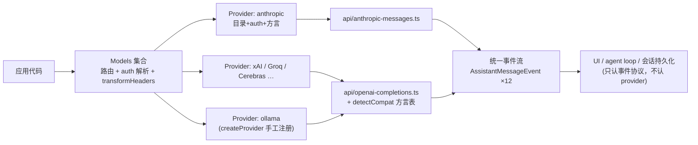

# 02 · pi-ai：统一 LLM API

> 一句话：pi-ai 用"四种 API 家族 + 一层方言补丁 + 一条统一事件流"把三十多家 LLM 提供商收敛成同一个可编程表面；读完你能解释这个抽象为什么成立、在哪里让步，并能用 faux provider 在没有 API key 的情况下复现它的全部协议行为。

## 0 本篇地图

- 前置：第 01 篇（作者动机与包结构总览）。
- 预计阅读：25~30 分钟。
- 本篇覆盖：`packages/ai`（约 25.1k 行 TS，2025-08-17 首次出现）。四种 API 论断与真实 `KnownApi` 清单 → Completions "方言问题"及 `detectCompat` 取证 → 统一事件流与 abort 语义 → 工具调用与 `details` 分离设计 → 模型注册表生成链 → token/成本统计的 best-effort 困境 → 跨 provider handoff 与签名 blob → faux provider 与浏览器可用性。
- 实验：`../code/02/`，三个零依赖 `.mjs`，不需要任何 API key。

## 1 "四种 API"：收敛为什么成立

作者在 2025-11-30 长文里的原话（`references/pi-minimal-coding-agent-post.md` L65）：

> There's really only four APIs you need to speak to talk to pretty much any LLM provider: OpenAI's Completions API, their newer Responses API, Anthropic's Messages API, and Google's Generative AI API.

这个论断成立的物理原因：OpenAI Completions 成了事实标准，xAI、Groq、Cerebras、OpenRouter 以及一切自托管服务器（Ollama、vLLM、LM Studio）都在说它的方言；Anthropic 和 Google 各守一座山头。于是 pi-ai 只需要实现少数"线协议"（wire protocol），其余提供商按方言归队。README 说得很直白：

> Providers internally share **API implementations** (the wire protocols): Anthropic models use `anthropic-messages`, OpenAI uses `openai-responses`, while xAI, Groq, Cerebras, OpenRouter, and most others share `openai-completions`.（`packages/ai/README.md`）

诚实的注脚：真实的 `KnownApi` 不是 4 个成员，而是 10 个（`packages/ai/src/types.ts` L17-29）：

```ts
export type KnownApi =
	| "openai-completions"
	| "mistral-conversations"
	| "openai-responses"
	| "azure-openai-responses"
	| "openai-codex-responses"
	| "anthropic-messages"
	| "bedrock-converse-stream"
	| "google-generative-ai"
	| "google-vertex"
	| "pi-messages";
```

所以更准确的说法是"四个 API **家族**"：Azure/Codex 是 Responses 的变体，Vertex 是 Google 的另一扇门；Mistral 和 Bedrock Converse 是两家不肯归队的山头，作者为它们各写了一个独立实现——这恰恰暴露了"四种就够"的边界：抽象层愿意为顽固的少数派多开文件，但不愿意为它们发明新抽象。

目录组织直接映射这个分层（`packages/ai/src/`）：

- `src/api/`：线协议实现。每个模块导出恰好 `stream` 和 `streamSimple` 两个函数（外加 `.lazy.ts` 包装器延迟加载 SDK），如 `openai-completions.ts`、`anthropic-messages.ts`。
- `src/providers/`：运行时单元。每个 provider 拥有自己的模型目录（`<id>.models.ts`，生成产物）、auth（API key 解析 / OAuth）与 stream 行为，共 50+ 个工厂。
- `src/models.generated.ts`：生成目录的注册汇总（文件头就是 `// This file is auto-generated by scripts/generate-models.ts`）。



调用链是三层：`Models` 集合（路由 + auth 解析）→ `Provider`（目录 + 方言配置）→ API 实现（真正的 fetch/SSE）。混合 API 的 provider（GitHub Copilot、OpenCode Zen）按 `model.api` 逐模型分发（`createProvider()` 接受 `api` 映射表，README "Custom Providers" 节）。

## 2 Completions 的"方言问题"：一个 API，三十种口音

Completions 表面统一，细节全是坑。pi-ai 的对策是给每个模型挂一张 `compat` 方言表（`OpenAICompletionsCompat`，`packages/ai/src/types.ts` L674 起），缺省值由 `detectCompat()` 按 provider 名 + baseUrl 自动嗅探。取证片段（`packages/ai/src/api/openai-completions.ts` L1585-1670，节选）：

```ts
const isNonStandard =
	isNvidia || isCerebras || provider === "xai" || baseUrl.includes("api.x.ai") ||
	isTogether || baseUrl.includes("chutes.ai") || isDeepSeek || isZai || isMoonshot || /* ... */ false;

const useMaxTokens =
	baseUrl.includes("chutes.ai") || isDeepSeek || isMoonshot || isCloudflareAiGateway ||
	isTogether || isNvidia || isAntLing || isZai;

return {
	supportsStore: !isNonStandard,
	supportsDeveloperRole: isOpenRouterDeveloperRoleModel || (!isNonStandard && !isOpenRouter),
	maxTokensField: useMaxTokens ? "max_tokens" : "max_completion_tokens",
	requiresReasoningContentOnAssistantMessages: isDeepSeek,
	thinkingFormat: isDeepSeek ? "deepseek" : isZai ? "zai" : /* ... */ "openai",
	// ...
};
```

一张表看清三个具体差异：

| 差异点 | OpenAI 官方 | Cerebras / xAI | Chutes / DeepSeek | Mistral |
|---|---|---|---|---|
| `store` 字段 | 支持（pi 发 `store:false` 关闭数据留存） | 未知字段直接报错 → `supportsStore:false` | 同左 | 不适用（独立 API） |
| 最大输出字段名 | `max_completion_tokens` | `max_completion_tokens` | `max_tokens`（`useMaxTokens`） | 独立字段名 |
| system 的角色名 | reasoning 模型用 `developer` | `supportsDeveloperRole:false` → 回退 `system` | 同左 | 独立 |
| reasoning 返回字段 | Responses 的 `reasoning.encrypted` 项 | `reasoning` | **`reasoning_content` 和 `reasoning` 同时返回、内容相同** | `thinking` 独立处理 |

reasoning 字段一战的源码注释（`openai-completions.ts` L601-605）：

```ts
// Some endpoints return reasoning in reasoning_content (llama.cpp),
// or reasoning (other openai compatible endpoints)
// Use the first non-empty reasoning field to avoid duplication
// (e.g., chutes.ai returns both reasoning_content and reasoning with same content)
const reasoningFields = ["reasoning_content", "reasoning", "reasoning_text"];
```

注意处理方式是"取第一个非空字段"而不是固定优先级——因为 chutes 两个字段都填、内容一样，写死优先级会产生重复的思考块。请求侧更夸张：`thinkingFormat` 有 openai / openrouter / deepseek / together / baseten / zai / qwen / qwen-chat-template / chat-template / string-thinking / ant-ling 共 11 种取值（`types.ts` L695 注释），同一个"打开思考"的意图，要翻译成 `reasoning_effort`、`reasoning:{effort}`、`thinking:{type}`、`enable_thinking`、`chat_template_kwargs`、顶层 `thinking` 字符串等互不兼容的请求体。这些方言不写进一张矩阵表，抽象就是空话；写进矩阵表，就是一张 100 行的 TypeScript 接口。pi-ai 选择了后者——这是"统一 API"的真实成本。

Mistral 则根本不说 Completions 方言（工具调用的多轮格式、JSON 模式都不同），所以有自己的 `src/api/mistral-conversations.ts`。这正是第 1 节说的：抽象层为山头开文件，不为山头改抽象。

## 3 统一事件流：12 个事件、一条铁律、全程可断

入口两对：`stream()/complete()` 接受各 API 的完整选项集；`streamSimple()/completeSimple()` 接受统一选项（`reasoning: 'minimal'|'low'|'medium'|'high'|'xhigh'|'max'`）。事件协议是唯一的收敛点，`AssistantMessageEvent` 的完整联合类型（`packages/ai/src/types.ts` L652-668）：

```ts
export type AssistantMessageEvent =
	| { type: "start"; partial: AssistantMessage }
	| { type: "text_start"; contentIndex: number; partial: AssistantMessage }
	| { type: "text_delta"; contentIndex: number; delta: string; partial: AssistantMessage }
	| { type: "text_end"; contentIndex: number; content: string; partial: AssistantMessage }
	| { type: "thinking_start"; ... }   // 同 text_* 三件套
	| { type: "thinking_delta"; ... }
	| { type: "thinking_end"; ... }
	| { type: "toolcall_start"; contentIndex: number; partial: AssistantMessage }
	| { type: "toolcall_delta"; contentIndex: number; delta: string; partial: AssistantMessage }
	| { type: "toolcall_end"; contentIndex: number; toolCall: ToolCall; partial: AssistantMessage }
	| { type: "done"; reason: Extract<StopReason, "stop"|"length"|"toolUse"|"deferred">; message: AssistantMessage }
	| { type: "error"; reason: Extract<StopReason, "aborted"|"error">; error: AssistantMessage };
```

两条容易被忽视的契约（README "Complete Event Reference" + types.ts 注释都明文写了）：

1. **`partial` 是活对象，不是事件时刻快照**。provider 会在生成推进中原地改写同一个 message 与 content block；消费方应当"在处理事件时读它"，不能把它存起来当历史。这条契约是为零拷贝（每个 token 不 clone 整个消息）买的单，README 甚至配了 `AssistantMessageFrameEncoder` 来把流压缩成可持久化的帧序列。
2. **事件不保证按块连续**。同一条上游 chunk 可能同时带 text 和 tool call 增量，事件会交错出现，必须用 `contentIndex` 关联回块：

```text
# README 给出的交错示例（简化）
text_start(i=0) → text_delta(i=0) → toolcall_start(i=1) → text_delta(i=0) → toolcall_delta(i=1) → …
# 错误消费法：把 toolcall_start 当作"文本块已结束"
# 正确消费法：只认 contentIndex 与各自的 *_end
```

错误与 abort 的统一语义：**返回流之后的失败永不 throw**。失败走 `error` 事件、落进最终消息的 `stopReason`（`"error" | "aborted"`）与 `errorMessage`。abort 的关键设计是**部分结果保留**：`await s.result()` 返回的 `AssistantMessage` 带着已收到的 `content` 与已知的部分 usage，且可以直接 push 回 `context.messages` 里下一轮接着说"Please continue"（README "Continuing After Abort"）。对比很多 SDK 里 abort 即丢弃一切，这一条对 agent 续写、对计费、对"检查每一次交互"的哲学都是地基。

实现本体极简：`src/utils/event-stream.ts` 的 `EventStream<T, R>` 实现 `AsyncIterable`，`push()` 进事件、`end(result)` 收尾、`result(): Promise<R>` 挂一个 promise 等最终消息。实验 01 用 60 行复刻的就是这个结构。

## 4 工具调用：TypeBox 校验与 `details` 分离

工具定义用 TypeBox schema（`Type`/`Static`/`TSchema` 从包根再导出），好处是 schema 本身是纯 JSON、可序列化传输；坑是 Google 不接受 `Type.Enum` 生成的 `anyOf/const` 模式，README 专门提醒用自带的 `StringEnum` 助手。执行前用 `validateToolCall(tools, toolCall)` 对照 schema 校验，失败时把错误文本作为 `isError:true` 的 toolResult 塞回去让模型自纠。关于校验器，两份官方材料口径略有差异：README 说用 "TypeBox's built-in validator"，博客说 "validated using TypeBox schemas and AJV"（L186）——可认定底层是 TypeBox 生态的 schema 校验（AJV 系），报错信息详细。

本篇最想讲的设计是 **tool result 的 LLM/UI 分离**。`ToolResultMessage` 类型（`types.ts` L539-552，节选）：

```ts
{
	role: "toolResult";
	toolCallId: string;
	toolName: string;
	content: (TextContent | ImageContent)[];  // 进 LLM 上下文的部分
	details?: JsonRepresentation<TDetails>;    // 不进上下文、给 UI 用的结构化数据
	usage?: Usage;
	isError: boolean;
}
```

作者的说法（博客 L186）："Another abstraction I haven't seen in any unified LLM API is splitting tool results into a portion handed to the LLM and a portion for UI display." 为什么这个分离重要：一次 `git diff` 执行，给 LLM 的最优形态是截断后的纯文本 diff（省 token），给 UI 的最优形态是结构化的文件/行号/统计 JSON（渲染折叠面板）。若只有一个 `content: string`，UI 就得反向解析文本——博客原话 "It also sucks hard to parse textual tool outputs and restructure them for display in a UI"。`content` 与 `details` 各走各的路，会话序列化时两者都留在 JSONL 里，UI 换皮不用重跑工具。这与第 01 篇"要能检查每一次交互"的动机严丝合缝。

流式方向还有半个设计：`toolcall_delta` 携带 JSON 增量并做**尽力而为的增量解析**，`partial.content[contentIndex].arguments` 允许字段残缺、字符串截断（README 明确警告"BE DEFENSIVE"，最少保证是 `{}`）。这才能在模型写完文件内容之前就开始流式渲染 diff。已知短板：工具**结果**还不能流式（bash 的 ANSI 输出无法边跑边显示，博客 L225 自认，"a simple fix that will eventually make it into the package"）。

## 5 模型注册表：从两个上游生成一份带类型的目录

博客 L132："I'm parsing data from both OpenRouter and models.dev ... into models.generated.ts."。生成链：

```
OpenRouter /models API ─┐
                        ├─ scripts/generate-models.ts (3474 行) ─→ src/providers/data/<id>.json
models.dev ─────────────┘        （忽略的原始数据，含定价/能力/thinking 元数据）
                                 └→ src/providers/<id>.models.ts（稳定的带类型包装）
                                    └→ src/models.generated.ts（汇总注册，禁止手改）
```

产出的是字面量类型：`getBuiltinModel('openai', 'gpt-4o-mini')` 返回 `Model<'openai-responses'>`，provider id 和 model id 都自动补全（README "Static Catalog Reads"）。动态列模型的 provider（llama.cpp、OpenRouter 实时列表）走 `models.refresh()`，读取仍是同步的"最后一次已知列表"；需要按 API 收窄选项类型时用 `hasApi(m, 'anthropic-messages')` 类型守卫。

手工定义新模型是标准动作而非黑魔法（README "createProvider()" 的 Ollama 例）：一个纯数据对象 `Model<'openai-completions'>`（id/api/provider/baseUrl/reasoning/input/cost/contextWindow/maxTokens 全字段），配 `createProvider({ id, auth, models, api })` 注册即可；自托管服务器常见要再加 `compat: { supportsDeveloperRole: false, supportsReasoningEffort: false }`——这正是第 2 节方言表的反向使用：方言表既是内部实现，也是对用户的公开配置面。

## 6 token/成本统计：一场 best-effort 的投降

作者把丑话说在前面（博客 L83）：

> Anthropic has the sanest approach, but generally it's the Wild West. Some report token counts at the start of the SSE stream, others only at the end, making accurate cost tracking impossible if a request is aborted. To add insult to injury, you can't provide a unique ID to later correlate with their billing APIs ... So pi-ai does token and cache tracking on a best-effort basis. Good enough for personal use, but not for accurate billing.

源码逐家印证了这个"上报时机各异"：

- **Anthropic**：SSE 的 `message_start` 事件就带 `usage.input_tokens`/`cache_*`，pi 立即写入并试算成本（`anthropic-messages.ts` L615-625）；`message_delta` 里再更新 `output_tokens`（L763-773）。两头都报，中途 abort 至少输入侧已知。
- **OpenAI Completions**：要主动请求 `stream_options: { include_usage: true }`（`openai-completions.ts` L829，且 `supportsUsageInStreaming:false` 的服务器不发——又是一门方言），usage 出现在**最后一个 chunk**。中途 abort 即颗粒无收。
- **Google**：每个 chunk 都可能带 `usageMetadata`，pi 来一份更新一份（`google-generative-ai.ts` L231-249）。

叠加"无法向 provider 传入自有 request id 去对账账单 API"，pi-ai 的选择是：统一 `Usage` 结构（input/output/cacheRead/cacheWrite/totalTokens/cost，外加"各家报才填"的可选 `reasoning`、Anthropic 独有的 `cacheWrite1h`——注释明说 reasoning tokens 是 `output` 的子集），能报多少算多少，`responseId` 字段"不要假设跨 provider 存在"（README "Stop Reasons"）。这不是没做好，而是问题本身在这些 API 上无解——实验 03 用两个假 provider 把这个不可对账性演示成一张对照表。

## 7 跨 provider handoff：thinking、签名 blob 与可序列化上下文

`Context` 是纯 JSON（`JSON.stringify` 直接存库、跨服务传输，README "Context Serialization"），`AssistantMessage` 携带 `provider/api/model` 三坐标，于是 handoff 的全部难点浓缩为一句话：**别的提供商生成的历史，怎么喂给当前提供商而不炸**。`transformMessages()`（`packages/ai/src/api/transform-messages.ts`）按三坐标判定 `isSameModel`，规则分四档：

1. user / toolResult 消息原样通过（图片对非视觉模型降级为占位文本）。
2. 同 provider+api+model 的 assistant 消息原样重放——thinking 块连同 `thinkingSignature` 一起保留，哪怕思考文本为空（OpenAI 加密推理就是空文本+密文）。
3. 跨 provider 的 thinking 块**降级为普通文本**（transform-messages.ts 把块转为 `{type:"text", text: block.thinking}`）；README handoff 节称其转为 `<thinking>` 标签文本，实际加标签发生在请求侧：OpenAI 兼容服务器需要 `compat.requiresThinkingAsText`（`types.ts` L691 注释："thinking blocks must be converted to text blocks with `<thinking>` delimiters"）。
4. **签名 blob 只认原主**。`redacted`（安全过滤器加密的思考）跨模型直接丢弃；各家不透明重放数据——`thinkingSignature`、`TextSignatureV1`（OpenAI Responses 的消息元数据）、Google 的 `thoughtSignature`、Responses 的 `reasoning.encrypted` 项——离开签发方就是废字节，重放给别家轻则报错、重则计费/审计串数据。跨家时删除是唯一正确动作。

附带一个工程细节：tool call id 也要归一化——OpenAI Responses 生成 450+ 字符、含 `|` 的 id，而 Anthropic 要求 `^[a-zA-Z0-9_-]+$` 且 ≤64 字符（transform-messages.ts 函数头注释），pi 维护一张新旧 id 映射表同步改写 toolCall 与对应 toolResult。

## 8 faux provider 与浏览器：抽象的自我验证

`fauxProvider()` 是内建测试 provider：`faux.setResponses([fauxAssistantMessage([fauxThinking(...), fauxToolCall('echo', {...})], { stopReason: 'toolUse' })])` 脚本化响应队列，按请求顺序消费；usage 按约 1 token / 4 字符估算，`sessionId` + `cacheRetention` 在场时自动模拟缓存读写；工具参数走真实的 `toolcall_delta` 增量流。它的价值在于：**faux 只依赖事件协议、不碰任何 HTTP**，所以它跑得通，就证明 UI 与 agent loop 真的只依赖统一表面——本篇三个实验全部沿用这个思路（用纯 JS 复刻协议形状）。

浏览器可用性是同一直觉的另一半：核心入口与 provider 工厂无副作用、tree-shaking 干净（按 provider 子路径导入，SDK 在 lazy chunk 里）；没有环境变量的地方显式传 `apiKey` 或注入 localStorage 版 `CredentialStore`；Bedrock 与 OAuth 登录是 Node-only，文档明确标注调用会失败/需代理。

## 源码精读

四段最能代表 pi-ai 设计口味的短摘录（均相对仓库根；引用片段的完整定义请在本地克隆中打开对应行号）。

**1）方言解析 = 检测 + 显式覆盖**（`packages/ai/src/api/openai-completions.ts` L1685 起）。自动嗅探只是底稿，用户在模型定义里写的 `compat` 字段逐键覆盖——抽象层把最终决定权交还给用户，这是它与"全托管 SDK"的根本立场差异：

```ts
function getCompat(model: Model<"openai-completions">): ResolvedOpenAICompletionsCompat {
	const detected = detectCompat(model);
	if (!model.compat) return detected;
	return {
		supportsStore: model.compat.supportsStore ?? detected.supportsStore,
		supportsDeveloperRole: model.compat.supportsDeveloperRole ?? detected.supportsDeveloperRole,
		// ... 逐字段 ?? 合并
	};
}
```

**2）事件流的最终结果协议**（`packages/ai/src/utils/event-stream.ts`）。`EventStream<T, R>` 实现 `AsyncIterable<T>`，`push()` 投事件、`end(result)` 收尾、`result(): Promise<R>` 单独取最终 `AssistantMessage`——迭代与结算两条通道分离，abort 后消费循环正常退出、`result()` 照样 resolve 出带部分内容的消息。第 3 节的全部语义就架在这 ~100 行上。

**3）Usage 是"各家报什么抄什么"的并集**（`packages/ai/src/types.ts` L396-418，节选）。可选字段 + 明确注释是它的文档策略：

```ts
export interface Usage {
	input: number; output: number; cacheRead: number; cacheWrite: number;
	/** Subset of `cacheWrite` written with 1h retention. Only Anthropic reports this split. */
	cacheWrite1h?: number;
	/** ... `output` already includes these tokens. ... left undefined by providers that don't. */
	reasoning?: number;
	totalTokens: number;
	cost: { input: number; output: number; cacheRead: number; cacheWrite: number; total: number };
}
```

**4）handoff 的同家/异家分叉点**（`packages/ai/src/api/transform-messages.ts`，节选）。三坐标 `isSameModel` 是全文档最核心的一个布尔量：签名保留、thinking 原样、还是降级为文本，全由它决定；函数头注释还顺手记录了"Responses 生成 450+ 字符含 `|` 的 id，Anthropic 要求 `^[a-zA-Z0-9_-]+$` 且最多 64 字符"这种血泪兼容细节：

```ts
const isSameModel =
	assistantMsg.provider === model.provider &&
	assistantMsg.api === model.api &&
	assistantMsg.model === model.id;
```

## 实验（../code/02/）

| 文件 | 验证什么 |
|---|---|
| `01-faux-stream.mjs` | 纯 JS 复刻事件协议（start/text_*/toolcall_*/done + 活 `partial` + `result()`），同一事件源 tee 给"终端渲染器"和"JSONL 记录器"两个消费者，演示统一事件流如何把 UI 与 provider 解耦；`abort` 参数演示部分结果保留 |
| `02-handoff.mjs` | provider A（thinking 独立字段+签名）→ provider B（只认文本），打印转换前后 JSON；对照"同 provider 重放保留签名 / 跨 provider 丢弃签名 + thinking 降级为文本 + toolCall id 归一化" |
| `03-token-meter.mjs` | 两个假 provider 分别在流首（Anthropic 式）与流尾（OpenAI/Google 式）报 token，中途 abort 对比可计费性，复现博客 L83 的 best-effort 困境 |

运行方式：`node 01-faux-stream.mjs`（Node ≥ 20，零依赖，三个都已实际跑通），真实输出见 `../code/02/README.md`。

## 延伸阅读

- `packages/ai/README.md`（1758 行，本篇的字段名/事件名均以它和 `src/types.ts` 为准）
- `packages/ai/src/api/openai-completions.ts`（`detectCompat`）、`src/api/transform-messages.ts`、`src/providers/faux.ts`、`src/utils/event-stream.ts`
- `scripts/generate-models.ts` 头部与 `packages/ai/README.md` "Development / Adding a New Provider" 清单
- https://mariozechner.at/posts/2025-11-30-pi-coding-agent/ （四种 API、token Wild West、split tool results 三处原话出处）
- https://github.com/earendil-works/pi
