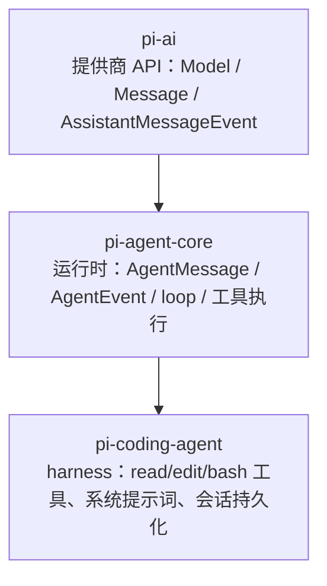

# 03 · pi-agent-core：agent loop 与事件流

> 一句话：拆开一个生产级 agent 运行时的最小内核——双层循环、事件协议、工具失败收敛、运行中注入——读完你能判断自己的手写 loop 缺了哪些会咬人的边角。

## 0 本篇地图

- 前置：第 02 篇（pi-ai 的统一消息类型与流式事件）、第 04 篇（coding-agent harness，本篇结尾呼应）。
- 主角：`packages/agent/`（发布名 `@earendil-works/pi-agent-core`），src 下核心三个文件：`types.ts`（500 行）、`agent-loop.ts`（898 行）、`agent.ts`（609 行）。
- 预计阅读 30 分钟。三个实验在 `../code/03/`，全部零依赖 Node ≥ 20 可直接跑。

核心论断先行：**agent 运行时没有魔法，loop 骨架 200 行就能写对七七八八；pi-agent-core 多出来的近两千行，几乎全部花在"错误、中断、并发、注入"这四类会咬人的边角上**。本篇按"类型 → 事件 → 循环 → 工具 → 队列 → hooks → 对照清单"的顺序展开。

## 1 定位：一个不知道"编码"为何物的运行时

`packages/agent/README.md` 第一句自我定位："Stateful agent with tool execution and event streaming. Built on `@earendil-works/pi-ai`."（package.json 的 description 是 "General-purpose agent with transport abstraction, state management, and attachment support"）。

分层关系（呼应第 2、4 篇）：



本篇的主角——核心运行时三件套（`types.ts` / `agent-loop.ts` / `agent.ts`）——对"编码代理"零感知：不内置任何工具，只定义工具的**接口**（`AgentTool`）和执行的**协议**（事件流）。这正是作者"在 agent 核心上轻松构建替代 UI"哲学的落点——运行时无关意味着终端 UI、RPC 服务端、测试桩都只是 `AgentEvent` 的消费者（第 4 篇会看到 coding-agent 如何在这一层上盖房子）。注意一个容易迷路的事实：`packages/agent` 包内还有第二层 `src/harness/`（`docs/harness.md` 规范的 AgentHarness 实现，自带持久化会话与 node 环境的 bash/read 工具，见 `src/harness/tools/bash.ts`），它坐在核心循环之上、面向 durable 场景，与核心层的"harness 无关"并不矛盾——本篇只讲核心层，harness 层留给第 4 篇。

运行时内部分两级：

- **低层**：`agent-loop.ts` 的 `agentLoop()` / `agentLoopContinue()`，无状态函数，输入 `AgentContext + AgentLoopConfig`，输出一个 `EventStream<AgentEvent, AgentMessage[]>`。
- **高层**：`agent.ts` 的 `Agent` 类，围绕低层循环包上状态（`AgentState`）、订阅（`subscribe`）、abort 与消息队列。README 快速上手示例用的就是 `Agent`。

## 2 AgentMessage：可扩展联合类型

pi-ai 定义 LLM 世界的四种消息（`packages/ai/src/types.ts` 第 553 行）：

```ts
export type Message = SystemMessage | UserMessage | AssistantMessage | ToolResultMessage;
```

agent 层在它们之上加了一个开放口子（`packages/agent/src/types.ts`）：

```ts
export interface CustomAgentMessages {
	// Empty by default - apps extend via declaration merging
}

export type AgentMessage = Message | CustomAgentMessages[keyof CustomAgentMessages];
```

**declaration merging 自定义角色**：应用通过接口合并往联合类型里加成员，例如（types.ts 注释原例，模块名沿用仓库注释中的旧包名）：

```ts
declare module "@mariozechner/agent" {
  interface CustomAgentMessages {
    artifact: ArtifactMessage;
    notification: NotificationMessage;
  }
}
```

加进来之后，`AgentMessage` 自动包含这两个角色，transcript、事件、订阅回调全程保持类型安全；但 LLM 只认四种标准角色，所以每条发给模型的消息都要过 `convertToLlm` 这道闸（见第 4 节）。默认实现（`agent.ts` 的 `defaultConvertToLlm`）就一句话：只保留 `system/user/assistant/toolResult`，其余全部滤掉。

这个设计的关键取舍：**自定义消息（UI 通知、artifact、状态卡片）默认对模型不可见**，想可见就得在 `convertToLlm` 里显式改写成 user 消息。与"每次交互都可检查"的哲学一脉相承——模型看到什么，永远由一个纯函数决定。

另一个值得一提的边界：`AgentState.systemPrompt` 是**只读**的，系统提示词不是独立配置项，而是 transcript 头部那条 system 消息的投影（types.ts 注释："to change the prompt, append a system message"）。提示词变更也是一段可回放的 transcript，这为第 4 篇的会话格式与 compaction 埋了伏笔。

## 3 事件流全清单

`packages/agent/src/types.ts` 的 `AgentEvent` 是穷举联合类型，共 10 个事件、三段生命周期，逐字照抄：

```ts
export type AgentEvent =
	| { type: "agent_start" }
	| { type: "agent_end"; messages: AgentMessage[] }
	| { type: "turn_start" }
	| { type: "turn_end"; message: AgentMessage; toolResults: ToolResultMessage[] }
	| { type: "message_start"; message: AgentMessage }
	| { type: "message_update"; message: AgentMessage; assistantMessageEvent: AssistantMessageEvent }
	| { type: "message_end"; message: AgentMessage }
	| { type: "tool_execution_start"; toolCallId: string; toolName: string; args: any }
	| { type: "tool_execution_update"; toolCallId: string; toolName: string; args: any; partialResult: any }
	| { type: "tool_execution_end"; toolCallId: string; toolName: string; result: any; isError: boolean };
```

粒度分档：

- **run 级**：`agent_start`（无负载）到 `agent_end`（携带本次 run 新增的全部消息）。注释明确：`agent_end` 是最后发出的事件，但 Agent 要等所有 awaited 订阅者落定才算 idle。
- **turn 级**：一个 turn = 一次 assistant 响应 + 它的工具调用与结果。`turn_end` 同时带 assistant 消息和本轮全部 `toolResults`。
- **消息级**：`message_start/update/end` 覆盖 system、user、assistant、toolResult 四种标准消息；`message_update` **只对 assistant 流式阶段发出**。toolResult 的"流"很短：`message_start` 紧接 `message_end`（实验 01 输出里可见成对出现）。
- **工具级**：`tool_execution_start`（含 `args`）→ 任意次 `tool_execution_update`（含 `partialResult`）→ `tool_execution_end`（含 `result` 与 `isError`）。

**与 pi-ai 的分层**（第 2 篇的 `AssistantMessageEvent` 在此接上）：细粒度增量事件（`text_delta`、`thinking_delta`、`toolcall_delta` 等 12 个，`packages/ai/src/types.ts` 第 652 行起）**不直接**出现在 agent 事件流里，而是被塞进 `message_update.assistantMessageEvent` 字段透传。agent 事件只保证"消息有更新"，渲染层想要逐字增量，就下钻一层。README 快速上手正是这么写的：

```ts
if (event.type === "message_update" && event.assistantMessageEvent.type === "text_delta") {
  process.stdout.write(event.assistantMessageEvent.delta);
}
```

分层的收益：agent 层换 provider 不影响 UI；UI 不关心 delta 切分细节也能工作（只消费 `message_end` 就拿到完整消息）。

各消费者取什么（代码可证实的部分）：`Agent.processEvents` 本身就是一份"事件 → 状态"的 reducer——`message_start/update` 维护 `streamingMessage`，`message_end` 把消息 push 进 `state.messages`，`tool_execution_start/end` 维护 `pendingToolCalls` 集合，`turn_end` 摘取 `errorMessage`（`agent.ts`）。**状态是事件的投影，不是并行的第二事实源**。终端 UI 取 `message_update` 做实时渲染（docs/rpc.md 显示 RPC 消费同一事件协议，持久化侧取 `message_end`/`agent_end`，见延伸阅读与第 4 篇）。

## 4 源码精读（一）：agent loop 主干

`agent-loop.ts` 的 `runLoop` 是一个**双层 while**，先看骨架（有删节，行意为原文顺序）：

```ts
// packages/agent/src/agent-loop.ts runLoop（骨架）
let pendingMessages = (await config.getSteeringMessages?.()) || [];  // drain 点 0

while (true) {                                                        // 外层：follow-up 复活
    let hasMoreToolCalls = true;
    while (hasMoreToolCalls || pendingMessages.length > 0) {          // 内层：工具轮次
        // …prepareNextTurn / 注入 pendingMessages / prepareRequest…
        const message = await streamAssistantResponse(currentContext, config, signal, emit, streamFunction);
        if (message.stopReason === "error" || message.stopReason === "aborted") {
            await emit({ type: "turn_end", message, toolResults: [] });
            await emit({ type: "agent_end", messages: newMessages });
            return;                                                   // 硬退出
        }
        const toolCalls = message.content.filter((c) => c.type === "toolCall");
        // …执行工具、把 toolResults 推进 context…
        pendingMessages = (await config.getSteeringMessages?.()) || [];  // drain 点 1
    }
    const followUpMessages = (await config.getFollowUpMessages?.()) || [];  // drain 点 2
    if (followUpMessages.length > 0) { pendingMessages = followUpMessages; continue; }
    break;
}
await emit({ type: "agent_end", messages: newMessages });
```

一次 prompt 的完整旅程，按事件顺序：

1. **入队与广播 prompt**。`runAgentLoop` 一进门先跑 `declareToolChanges`（下详），然后发 `agent_start`、`turn_start`，再对每条 prompt 消息发 `message_start/end` 并推入 context。
2. **构建请求**。`streamAssistantResponse` 是 AgentMessage 世界与 LLM 世界的边界，管线固定为四步（agent-loop.ts 内函数体逐段可对应）：
   - `transformContext`（可选，AgentMessage[] → AgentMessage[]，做裁剪/注入）；
   - `convertToLlm`（AgentMessage[] → Message[]，滤掉自定义角色）；
   - `getApiKey(model.provider)`（每次请求现取，注释点名 GitHub Copilot 这类短效 OAuth 可能在长工具执行期间过期的场景）;
   - `streamFunction(config.model, llmContext, { ...config, apiKey, signal })`。
3. **消费流式响应**。pi-ai 的 `start` 事件到来时把 partial 消息 push 进 context 并发 `message_start`；后续每个 delta 事件**原地替换** context 末尾的 partial 并发 `message_update`；`done`/`error` 时用 `response.result()` 的终值替换末尾、发 `message_end`。副作用是：transcript 里永远有一条"活的"assistant partial，中途 abort 也不丢已流出的文本（实验 01 场景 B 验证了这点）。
4. **错误即数据**。`stopReason === "error" | "aborted"` 走硬退出：补发 `turn_end`（`toolResults: []`）和 `agent_end` 后 return。这不是异常路径——`StreamFn` 的类型注释（types.ts）规定契约："Must not throw … Failures must be encoded in the returned stream via protocol events and a final AssistantMessage with stopReason"。**失败被编码为数据，事件序列永远完整走到 agent_end**，消费端不需要 try/catch。
5. **工具执行 → 续轮判定**。有 toolCall 就执行（第 5 节），结果推入 context；`hasMoreToolCalls = !executedToolBatch.terminate`；发 `turn_end`；poll steering。内层循环条件 `hasMoreToolCalls || pendingMessages.length > 0` 意味着：**就算没有工具调用，只要 steering 队列非空也会续轮**。
6. **外层收尾**。内层退出即"agent 本来要停了"，poll follow-up；有则 `continue` 复活，没有就 `agent_end`。

三个与骨架无关、但生产必需的细节：

- **`declareToolChanges`**：每次发请求前，把 `context.tools`（运行时能执行的）与 transcript 里 system 消息声明的工具（模型以为能调的）做 diff，差集写进 `toolsAdded`/`toolsRemoved` 的 system 消息。**工具热增减必须让模型知情**，手写 loop 十有八九漏掉这个。
- **`stopReason === "length"` 的护栏**：输出被 token 上限截断时，流式 JSON 参数是"尽力抢救"解析出来的，可能语法合法但内容残缺——所以 `failToolCallsFromTruncatedMessage` 把该消息里**所有** toolCall 直接判为 isError（错误文本让模型重发），宁可错杀。
- **`agentLoopContinue`**：重试/续跑入口，不加新消息，但强制校验末条消息不是 assistant（`Cannot continue from message role: assistant`），防止发出 provider 必拒的请求。

**abort 传播路径**（signal 自上而下贯穿）：`Agent.abort()` → AbortController → signal 同时流到 (a) provider 层——由 pi-ai 按契约把中断编码成 `stopReason: "aborted"` 的最终消息；(b) `prepareToolCall` 与并行执行 thunk 的入口检查——已 abort 则直接产出 `Operation aborted` 的 isError 结果；(c) `tool.execute` 的第三个参数——工具自己 reject。三方汇合后仍走第 4 步的硬退出：补发完 `turn_end`/`agent_end` 正常收尾。**abort 不是打断，是体面收场**（实验 01 场景 B 的完整事件序列即此）。另有一道兜底：`Agent.handleRunFailure` 捕获 loop 之外的意外抛错（比如 streamFn 违约），当场合成一条 `stopReason: "aborted" | "error"` 的 assistant 消息并补齐 `message_start/end + turn_end + agent_end` 四个事件——即便出了 bug，事件协议不变量也不破。

## 5 源码精读（二）：工具管线与失败三态

工具接口（`types.ts` 的 `AgentTool`）：继承 pi-ai 的 `Tool`（`name`/`description`/TypeBox `parameters`），加 `label`、`prepareArguments?`、`execute(toolCallId, params, signal, onUpdate)`，另有 `executionMode?`（单工具并发覆写）与 `replay?`（durable 场景的恢复策略）。execute 的注释只有一句话但立场鲜明：**"Throw on failure instead of encoding errors in `content`."**——工具只管抛，收敛是 loop 的事。

preflight 阶段 `prepareToolCall` 的次序（agent-loop.ts），决定了三种失败形态如何收敛：

```ts
// packages/agent/src/agent-loop.ts prepareToolCall（有删节）
const tool = currentContext.tools?.find((t) => t.name === toolCall.name);
if (!tool) return { kind: "immediate",
    result: createErrorToolResult(`Tool ${toolCall.name} not found`), isError: true };   // 态 1：未知工具
try {
    const preparedToolCall = prepareToolCallArguments(tool, toolCall);   // prepareArguments 垫片
    const validatedArgs = validateToolArguments(tool, preparedToolCall); // 态 2：校验失败 = throw
    // …beforeToolCall 可返回 { block: true, reason } 拦截，也产 immediate error…
    return { kind: "prepared", toolCall, tool, args: validatedArgs };
} catch (error) {
    return { kind: "immediate",
        result: createErrorToolResult(error instanceof Error ? error.message : String(error)),
        isError: true };
}
```

执行阶段 `executePreparedToolCall` 用 try/catch 包住 `tool.execute`，抛错同样收成 `isError: true` 的 `createErrorToolResult(error.message)`（**态 3：执行抛错**）。`afterToolCall` 钩子还能改写结果，它自己抛错也会被再包一层（连 `isError` 一起置真）。三态殊途同归：`tool_execution_end(isError=true)` + 一条 `isError` 的 toolResult 消息进 transcript，模型下一轮在请求里逐字看到错误文本自我修正——实验 02 完整演示了这条闭环。注意事件时序细节：`tool_execution_start` 在 preflight **之前**发，所以校验失败/未知工具也会先收到 start 事件（实验 02 输出可证）。

校验器在 pi-ai（`packages/ai/src/utils/validation.ts` 的 `validateToolArguments`），三道工序：`structuredClone` 后 `normalizeOptionalNulls`；TypeBox 的 `Value.Convert(tool.parameters, args)` 做**强制类型转换**（字符串 "42" → 数字这类温和纠错）；再 `validator.Check`，不过就抛出格式化的错误文本：

```
Validation failed for tool "write_file":
  - content: must have required property 'content'

Received arguments:
{ ... }
```

`prepareArguments` 是校验前的兼容垫片（`prepareToolCallArguments`）：老扩展用 `file_path` 字段，新 schema 要 `path`，在**校验之前**归一化，schema 保持干净、旧调用方不炸。实验 02 用 `file_path → path` 演示了这个垫片；它在校验前跑，所以垫片产出的对象仍要过 TypeBox 全量校验。

**并行与顺序的精确语义**（`ToolExecutionMode`，types.ts 注释即规范原文）：默认 `parallel`；但 `config.toolExecution === "sequential"` **或批次里任何一个工具自带 `executionMode: "sequential"`**，整批降级为顺序执行（`executeToolCalls` 的 `hasSequentialToolCall` 判断）。并行模式的三段次序：

1. `tool_execution_start` + preflight **按模型源序逐个做**（types.ts 注释原文："tool calls are prepared sequentially, then allowed tools execute concurrently"）；
2. 过了 preflight 的工具**并发执行**，`tool_execution_end` 按**完成序**发（先完成先报，UI 因此能实时标记单卡完成）；
3. `Promise.all` 收齐后，toolResult 消息**按源序**逐条 `message_start/end` 落 transcript——**模型看到的顺序永远等于它发出 toolCall 的顺序**，与完成先后无关。

实验 01 场景 A 专门让第 2 个工具先完成，事件流里 `tool_execution_end` 是 read→bash，而 toolResult 消息是 bash→read，两条序的分工一目了然。

还有两个边角：`onUpdate` 回调发的 `tool_execution_update` 被 loop 记录进 `updateEvents` 数组并在工具结束后 `await Promise.all`——保证订阅者不会看到"工具已 end 还有 update"的时序倒挂；promise 落定后再调 `onUpdate` 直接忽略（`acceptingUpdates` 标志）。批级的 `terminate` 语义则保守：**批内每一个**结果都带 `terminate: true` 才提前停（`shouldTerminateToolBatch` 的 `every`），防止一个工具误杀全批。

## 6 steering / follow-up 队列：运行中注入消息

`Agent` 运行中再调 `prompt()` 会直接抛错（"Use steer() or followUp() to queue messages"），运行中注入只有队列一条路。实现是 `agent.ts` 里的 `PendingMessageQueue`：一个数组加 `QueueMode`（types.ts："all" 一次全排空 / "one-at-a-time" 一次只出最旧一条），`Agent` 持有两个实例，构造默认 `steeringMode ?? "one-at-a-time"`、`followUpMode ?? "one-at-a-time"`。

两个队列的**语义差异在 drain 时机**，不在数据结构：

| | 入队 API | drain 时机（runLoop 内） | 用途 |
|---|---|---|---|
| steering | `agent.steer(msg)` | ① 循环启动时；② 每个 `turn_end` 后；③ `prepareNextTurn` 长耗时操作后补捞 | 纠正正在干活的 agent（"改用 *.ts"） |
| follow-up | `agent.followUp(msg)` | 仅当无工具调用且 steering 也空、agent 本来要停时 | 排队下一个任务（"然后写个总结"） |

steering 的 drain 点 0 值得注意：`runLoop` 第一行就 poll（注释："user may have typed while waiting"——用户按下回车到首个请求发出之间也可能打字）。drain 点 ③ 的注释解释了 one-at-a-time 的一个精妙角落：compaction 这类长准备期间可能又攒了消息，但**只在早先 poll 为空时才补捞**，"otherwise one-at-a-time mode would deliver two messages in this turn"。

`continue()` 里还有一个队列感知的恢复逻辑：末条消息是 assistant（上一轮被中断在响应后）时，先尝试把排队的 steering 当新 prompt 跑（带 `skipInitialSteeringPoll` 防止刚取出的消息被 drain 点 0 重复消费），再试 follow-up，都没有才抛错。队列 API 另有 `peekQueuedMessages`（预览不消费）、`clearSteeringQueue`/`clearFollowUpQueue`/`clearAllQueues`、`hasQueuedMessages`。

实验 03 演示了完整剧本：两条 steering + 一条 follow-up 同时排队，one-at-a-time 把两条 steering 拆进两个 turn，follow-up 等到自然停止点才进场；README 里注明把 `steeringMode` 改成 `"all"` 两条会同轮注入。

## 7 hooks 扩展点

`AgentLoopConfig`（types.ts）就是低层循环的全部扩展面，按触发时机排：

| hook | 时机 | 能改变什么 | 违约后果 |
|---|---|---|---|
| `transformContext` | 每次请求前，AgentMessage 层 | 裁剪/注入上下文（compaction 挂点之一） | 注释明令不得 throw |
| `convertToLlm` | 同上，LLM 边界 | 自定义角色 → 标准角色/过滤 | throw 会"interrupt the loop without a normal event sequence" |
| `getApiKey` | 同上 | 每次请求现取密钥 | 不得 throw，无钥返 undefined |
| `prepareRequest` | pending 消息已入 transcript、请求发出前 | 换 context/model/thinkingLevel | — |
| `beforeToolCall` | preflight 内、参数已校验后 | `{block:true, reason}` 否决执行（错误文本回喂模型），可带 `terminate` | 在 try 内，throw 收敛为 isError |
| `afterToolCall` | 执行后、`tool_execution_end` 前 | 逐字段覆写 content/details/usage/isError/terminate（无深合并） | 同上 |
| `finishTurn` | 全部 toolResult 落地后、`turn_end` 前 | `{action:"end"}` 提前结束；`{action:"continue"}` 强制再跑一轮 | error/aborted 轮不受其影响（仍是硬退出） |
| `prepareNextTurn` | `turn_end` 后、下一轮开始前 | 换整套 context/model/thinking，或追加消息 | — |
| `getSteeringMessages` / `getFollowUpMessages` | 三个/一个 drain 点 | 注入消息 | 不得 throw，空返 `[]` |
| `toolExecution` | 批级配置 | sequential/parallel | 工具可用 `executionMode` 覆写 |

外加工具自身的 `prepareArguments`（第 5 节）。几个观察：**政策类逻辑（权限、审批、结果改写）全走 `beforeToolCall`/`afterToolCall`**——第 4 篇会看到 coding-agent 的权限确认就是这对钩子的应用；`finishTurn`/`prepareNextTurn` 提供轮间控制权，但 error/aborted 轮被设计成不可翻转的硬退出，防止钩子把失败轮强行续命；`prepareNextTurn` 的注释直接点名 compaction 长耗时场景，说明这个钩子是为"轮间做重活"设计的。低层循环对 harness 的所有开放性都收敛在这张表里——没有插件注册表，没有事件总线，就是十个函数指针。

## 8 与"200 行手写 loop"的对照

本篇的实用产出。实验 01 的 `runAgentLoop` 约 60 行，加上 faux provider 和工具全文约 280 行，已经能演示正确的事件序列——**骨架确实小**。对照 pi-agent-core（核心三文件约 2000 行），差距如下，建议当作自查清单：

骨架（手写完全够）：入队 prompt → `transformContext`/`convertToLlm` 建请求 → 流式消费并原地更新 partial → 执行工具 → 结果进 transcript → 有工具就续轮。

生产必需的边角（手写 loop 的高频事故点）：

1. **失败编码进流**：streamFn 不 throw，错误变 `stopReason: error|aborted` 的最终消息；loop 里错误是硬退出分支而非异常。
2. **事件不变量兜底**：任何路径（含 hook 抛错、streamFn 违约）都补齐 `turn_end + agent_end`（`handleRunFailure` 合成消息），UI/持久化端永远不用清道。
3. **工具失败三态收敛**：未知工具、校验失败、执行抛错统一成 `isError` toolResult 回喂模型；工具只管 throw。
4. **截断护栏**：`stopReason === "length"` 时整批 toolCall 判残废，不执行可能缺角的参数。
5. **两套顺序**：完成序只给 UI（`tool_execution_end`），源序进 transcript（toolResult 消息）；混用会让模型看到乱序结果。
6. **abort 三方贯串**：provider、preflight/执行入口、工具内部都查同一 signal；已流出的 partial 保留在 transcript，不假装没说过。
7. **三个 steering drain 点 + 两个队列语义**：启动补捞、turn 间注入、停止前排队；one-at-a-time 防同轮双弹。
8. **工具增减要让模型知情**：`declareToolChanges` 往 system 消息写 `toolsAdded/toolsRemoved` diff。
9. **密钥现取**：`getApiKey` 每请求执行，扛住长工具执行期间的 OAuth 过期。
10. **update 时序护栏**：`onUpdate` 事件被 loop await 收编，杜绝 end 后还有 update。
11. **状态 = 事件 reducer**：`processEvents` 单一事实源，订阅者落定才算 idle。
12. **continue 的角色校验**：末条是 assistant 就拒跑，防 provider 必拒请求。

一句话总结：demo loop 与产品 loop 的距离，基本就是这 12 条的距离。

## 实验（../code/03/）

三个零依赖 `.mjs`（Node ≥ 20，`node xxx.mjs` 直接跑，内置 faux provider 无需 API key），已于 2026-09-23 全部实跑通过，README 贴有真实输出：

| 实验 | 验证正文哪个论断 |
|---|---|
| `01-mini-agent-loop.mjs` | 第 3 节全事件清单与时序；第 5 节并行语义——场景 A 中 read 先完成，`tool_execution_end`（完成序）为 read→bash 而 toolResult 消息（源序）为 bash→read；第 4 节 abort 路径——场景 B 演示 abort 后工具 reject → isError toolResult → 下一轮 provider 直接 aborted，partial 文本 `[开始跑长命令]` 保留在 transcript，事件序列完整走到 `agent_end` |
| `02-tool-validation.mjs` | 第 5 节失败三态——t1 缺 required、t3 执行抛 EACCES、t4 未知工具，事件序列完全同构（校验失败也先发 `tool_execution_start`）；模型第 2/3/4 次请求逐字看到错误文本并逐轮修正；`prepareArguments` 把 `file_path` 在校验前归一化为 `path` |
| `03-steering.mjs` | 第 6 节三个 drain 点与 one-at-a-time——两条 steering 拆进两个 turn，follow-up 在自然停止点才消费；transcript 打印出模型视角的完整注入序列 |

实验对真实实现做了有记录的精简（校验器只查 required/string，pi 是 TypeBox+AJV 全量；hooks 未模拟；01 只演示 parallel 模式），对应关系在 `../code/03/README.md` 头部注明。

## 延伸阅读

- `packages/agent/README.md` — 定位与快速上手；`packages/agent/docs/` 深入专题：`harness.md`（1468 行的 AgentHarness 规范，不可变 entry tree 与 38 条不变量，第 4 篇续谈）、`rpc.md`（事件流的 RPC 化）、`tool-durability.md` / `assistant-durability.md`（工具副作用恢复，`replay` 字段的背景）、`plugins.md`。
- `packages/agent/src/types.ts` → `agent-loop.ts` → `agent.ts` 顺序通读约 2000 行，本篇所有引用的最小闭包。
- `packages/ai/src/utils/validation.ts`（`validateToolArguments`）、`packages/ai/src/types.ts`（`AssistantMessageEvent` 第 652 行、`Message` 第 553 行）。
- 系列衔接：第 02 篇（pi-ai 流式事件的上游实现）、第 04 篇（harness 如何消费本篇的 hooks 与事件流构建 coding-agent）。
