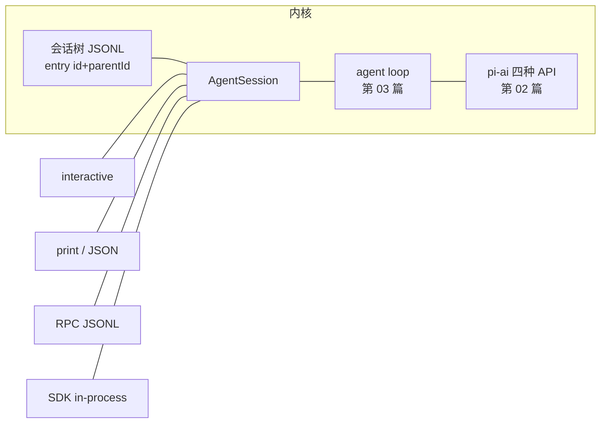

# 04 · pi-coding-agent：harness 架构与极简主义论战

> 一句话：pi-coding-agent 是 pi 全家桶落地的第一个产品形态——一棵会话树、一份由代码生成的系统提示词、四个默认工具。本篇把它的 harness 架构拆开，并逐条核对作者"六个不做"（YOLO、无 to-dos、无 plan mode、无 MCP、无 background bash、无 sub-agents）的原文论据与代码事实，把 MCP 论战折算成可验证的 token 数字。读完你应该能回答：一个 coding agent 的功能清单里，哪些是必需品，哪些是别人替你承担的复杂度。

## 0 本篇地图

- 前置：第 02 篇（pi-ai 事件流）、第 03 篇（agent loop 与 steering/follow-up）。第 01 篇的设计哲学在本篇逐条落地。
- 预计阅读：35 分钟。
- 正文：harness 全景与四种运行形态 → 系统提示词源码清点 → 内置工具取证 → 六个"不做"逐条核账 → MCP 论战量化 → 信任模型与自我扩展。
- 实验：`../code/04/` 三个零依赖脚本，全部实测通过，真实输出见其 README。

## 1 how-pi-works 全景：一棵树、一个循环、四种形态

`packages/coding-agent/docs/how-pi-works.md` 全文只有 49 行，开头两段给出全部数据结构：

> Pi coordinates model requests, tool execution, context assembly, and session storage. … Messages and events in a session form a tree. Each path through that tree is a branch. The branch ending at the current entry is the active branch and supplies the history for the next model request.

**会话树是真相源，LLM 上下文只是它的一次投影。** Agent loop 一节原文只有三句，浓缩成五步（顺序与原文一致）：

1. 提交的消息追加到活跃分支；
2. 从**系统提示词 + 活跃分支 + 可用工具 + 模型设置**组装模型请求，经所选 provider 发出；
3. provider 流式返回（文本 + 工具调用）；
4. 记录响应，执行每个工具调用，记录结果——**一个 turn 完成**；
5. 若工具结果或排队消息需要下一次模型调用，则开始新 turn，否则 run 结束。

steering / follow-up / abort 的语义在同节一句话带过（第 03 篇已在 agent-core 层实现过这三者，coding-agent 只是接入交互层）。Context 一节补充了组装细节：树条目先转换成 model 兼容的 user/assistant/toolResult 消息（`convertToLlm`，第 03 篇），compaction 存在时以摘要条目替换旧消息——**原始条目永远留在树里**。

四种运行形态（Interfaces 一节）：

| 形态 | 入口 | 协议 |
|---|---|---|
| interactive | `pi` | 终端 UI（pi-tui，第 07 篇） |
| print | `pi -p "..."` | 一次性文本输出 |
| JSON | `pi --mode json` | 事件流逐行 JSON（第 02 篇的事件协议） |
| RPC | `pi --mode rpc` | stdin/stdout JSONL 命令+事件双向（`docs/rpc.md`） |

外加 TypeScript SDK（进程内嵌）。文档原话："All interfaces use the same agent and session mechanisms."——这正是第 02、03 篇反复出现的解耦主张在进程层面的最终形态：**内核只有一个 AgentSession，UI/管道/跨进程都只是事件的消费者**。



## 2 最小系统提示词：不是作文，是函数

### 2.1 源码结构

系统提示词在 `packages/coding-agent/src/core/system-prompt.ts`（216 行）。当前版本已经不是一段静态字符串，而是**有序分节**，源码注释即设计说明：

```ts
/**
 * Ordered system prompt sections, keyed by name. `preamble` is untagged text; every other
 * section is wrapped in a tag of the same name so the model can match later updates to it.
 * These become `SystemMessage.sections` in the transcript.
 */
```

默认分节：`preamble`（唯一无标签段）、`<tools>`、`<rules>`、`<docs>`、`<addendum>`（用户追加）、`<project_context>`（AGENTS.md 注入点）、`<skills>`、`cwd`。preamble 全文只有 27 个词：

```ts
"You are an expert coding assistant operating inside pi, a coding agent harness. You help users by reading files, executing commands, editing code, and writing new files."
```

更值得注意的是 `<rules>` 的来源。`buildRules()`（同文件）按启用的工具集**生成**规则——默认四工具下第一条是：

```ts
if ((hasBash || hasPowerShell) && !hasGrep && !hasFind && !hasLs) {
    // ...
    addRule("Use bash for file operations like ls, rg, find");
}
for (const name of selectedTools) {
    for (const rule of toolGuidelines[name] ?? []) addRule(rule);
}
addRule("Be concise in your responses");
addRule("Show file paths clearly when working with files");
```

也就是说：**提示词是工具集的纯函数**。启用 grep/find/ls，"用 bash 搜索"这条规则自动消失；换掉工具集，`<tools>` 行与 `<rules>` bullet 随之重算。"Prompts are code"（2025-06-02 博客）在这里不是修辞，是字面实现。扩展还可经 `customPrompt` 顶掉 preamble、`forceSystemPrompt` 整体替换（注释原文："Exact full prompt replacement set by a before_agent_start handler"）。

### 2.2 为什么敢砍

作者 2025-11-30 长文（本地参考文件 `references/pi-minimal-coding-agent-post.md` L316-348）贴了当时的提示词全文并解释（L348，原文）：

> But it turns out that all the frontier models have been RL-trained up the wazoo, so they inherently understand what a coding agent is. There does not appear to be a need for 10,000 tokens of system prompt.

他引用的对照组是 [cchistory](https://cchistory.mariozechner.at) 上留档的 Claude Code 系统提示词——10,000 tokens 量级。作者的三条理由：前沿模型不需要被教"怎么当工程师"；每条规则都在限制规则之外的合理行为；提示词占的每个 token 都是用户少掉的上下文。

### 2.3 实测

实验 03 按 `buildSystemPromptSections()` 的逻辑用默认配置重建了这份提示词（各工具的 snippet/guidelines 运行时从源码提取）：

```
(untagged) preamble      1 行    27 词  ≈  43 tok
<tools>                  6 行    55 词  ≈  81 tok
<rules>                 10 行   141 词  ≈ 206 tok
<docs>                   8 行   124 词  ≈ 274 tok
默认提示词合计 ≈ 604 tok（不含运行时插值与项目上下文）
```

604 token，外加实验 01 测得的工具 API 面 ≈582 token，合计 ≈1.2k——与博客"system prompt and tool definitions together come in below 1000 tokens"（2025-11 版式）同一量级，对 ~10k 的对照组仍是数量级优势。一个诚实的观察：`<rules>` 里 edit 工具一家贡献了 4 条 bullet（≈150 tok），全部是"不要发重叠编辑""相邻修改合并"这类**防御真实失败模式**的规则——极简是相对 13.7k 的极简，规则仍会随踩坑生长，区别在于每条都能说出它防的是什么（审查方法见实验 03 输出）。

`<docs>` 段则值得单列：它把 pi 自己的 README/docs/examples 路径逐条告诉模型（"Pi documentation (read only when the user asks about pi itself…)"）——**自我解释与自我扩展是提示词层的一等公民**，见第 6 节。

## 3 最小工具集：注册 8 个，默认 4 个

注册表在 `packages/coding-agent/src/core/tools/index.ts`（原文）：

```ts
export type ToolName = "read" | "bash" | "powershell" | "edit" | "write" | "grep" | "find" | "ls";
export const allToolNames: Set<ToolName> = new Set([
	"read", "bash", "powershell", "edit", "write", "grep", "find", "ls",
]);
```

默认只注入四个（`system-prompt.ts` L58）：`selectedTools: [...(input.selectedTools ?? ["read", "bash", "edit", "write"])]`。grep/find/ls 是可选只读组（用 `pi --tools read,grep,find,ls` 可获得"无 bash 的只读探索模式"，作者在 plan mode 一节给出此用法），powershell 是 bash 的 Windows 包装（`powershell.ts` 复用 bash 工厂）。

各工具 schema 与输出控制（全部取证自 `tools/*.ts`）：

| 工具 | 参数 | 输出截断/行为 |
|---|---|---|
| read | `path` + 可选 `offset`(1-based)/`limit` | 头部截断至 2000 行或 50KB（`truncate.ts`）；图片(jpg/png/gif/webp/bmp)按附件发送；description 要求"continue with offset until complete" |
| bash | `command` + 可选 `timeout`(秒，默认无超时) | **尾部**截断至最近 2000 行或 50KB（保尾弃头，见 3.1）；截断时全量输出另存临时文件 |
| edit | `path` + `edits[]`（`oldText` 须全文件唯一且互不重叠，`newText`） | 一次调用多处不相交修改；description 与 4 条 guidelines 全在防重叠/唯一性失败 |
| write | `path` + `content` | 不存在则创建，自动建父目录 |
| grep | `pattern` + glob/ignoreCase/literal/context/limit 等 | 调用 ripgrep（`ensureTool("rg")` 缺失时自动下载）；默认 100 matches、50KB、行长 500 字符截断；尊重 .gitignore、跳二进制 |
| find | glob `pattern` + path/limit | 默认 1000 条；尊重 .gitignore |
| ls | path/limit | 默认 500 条 |

两处细节值得放大：

**3.1 bash 的截断哲学。** bash 与 read 方向相反：read 保头（文件从第一行读起），bash 保尾（报错信息在末尾）。截断不只是丢数据——`BashToolDetails` 里有 `fullOutputPath`，全量输出写入临时文件，模型要完整内容就去读文件。这与第 02 篇"details 与 content 分离"是同一哲学：**工具输出是结构化事实，不是一坨给人看的字符串**。

**3.2 约束采样。** read/write 的定义里都有 `constrainedSampling: { type: "json_schema", strict: "prefer" }`——工具入参尽量走 provider 的严格 JSON schema 模式，把"模型把参数写坏"这一类失败交给解码器兜底，而不是往提示词里堆"你必须输出合法 JSON"。

两个注入面都要记账：API 的 `tools[]`（description + schema，每次请求全量发送）和提示词的 `<tools>/<rules>`（snippet + guidelines）。实验 01 逐字抽取实测：

```
默认四工具(read/bash/edit/write)  API ≈ 582 tok   提示词 ≈ 218 tok   合计 ≈ 800 tok
八工具全开                        API ≈ 1171 tok  提示词 ≈ 277 tok   合计 ≈ 1448 tok
```

## 4 六个"不做"：逐条核账

作者清单（博客 "What I don't want to be" 一节至 "No sub-agents" 一节）。每条按"论据 → 落地 → 评"过一遍。

### 4.1 YOLO 默认：安全剧场不如没有

论据（原文）："If you look at the security measures in other coding agents, they're mostly security theater. As soon as your agent can write code and run code, it's pretty much game over." 作者点名 Simon Willison 的 dual-LLM 模式——连作者本人都承认 "this solution is pretty bad"，且"if an LLM has access to tools that can read private data and make network requests, you're playing whack-a-mole with attack vectors"。结论："Everybody is running in YOLO mode anyways to get any productive work done, so why not make it the default and only option?"

落地：工具直接用 pi 进程的 OS 权限；安全文档不再承诺进程内防护，而是把隔离做成三档梯子 + `docs/containerization.md` 四种部署：**Plain Docker、Docker Sandboxes、OpenShell（NVIDIA 策略沙箱）、Gondolin 扩展（本地 micro-VM，把内置工具路由进 VM）**。security.md 甚至明说"prompt injection from untrusted content, lack of a built-in sandbox"属于本地 agent 的预期行为、不在漏洞受理范围——把威胁模型写进文档而不是藏在审批弹窗后面。

评：YOLO 不是"不关心安全"，是**承认进程内审批防不住注入驱动的 agent，把边界画到进程外**。这也解释了为什么不内置 web_fetch："it can use curl… both of which provide ample surface area for prompt injection"——不内置不能免疫的工具，也就不假装免疫。

### 4.2 无内置 to-dos

论据："to-do lists generally confuse models more than they help. They add state that the model has to track and update, which introduces more opportunities for things to go wrong." 替代：`TODO.md` 文件 + 现成的 edit 工具。

落地与反转：注册表里没有 todo 工具——但 `examples/extensions/todo.ts` 是一个完整示例扩展，注册 `todo` 工具 + `/todos` 命令，头注释写明设计："State is stored in tool result details (not external files), which allows proper branching - when you branch, the todo state is automatically correct for that point in history."

评：核心不做，示例给足——"不做"的真实语义是**不进默认上下文、不成为内核状态机分支**；你要就 5 分钟装上，且学会话树分支语义的正确做法。

### 4.3 无 plan mode

论据：计划就是"think through a problem together"，要跨会话就写 `PLAN.md`（"file-based plans can be shared across sessions, and can be versioned with your code"）。对 Claude Code plan mode 的批评很具体：它靠 sub-agent 探索，"you have zero visibility into what that sub-agent does"；"I need observability for planning and I don't get that with Claude Code's plan mode."

落地：只读模式是**一条 CLI 参数**而非内核状态机（`pi --tools read,grep,find,ls`）；完整 plan-mode 体验放在 `examples/extensions/plan-mode/`（`/plan` 切换、写工具禁用、bash 走只读命令白名单、从 "Plan:" 小节提取步骤并跟踪 [DONE:n]）。

### 4.4 无 MCP → 第 5 节专门算账。

### 4.5 无 background bash

论据："Background process management adds complexity: you need process tracking, output buffering, cleanup on exit, and ways to send input to running processes." 而 Claude Code 的 background bash"has poor observability… forces the agent to track running instances without providing a tool to query them"（早期版本 compaction 后连后台进程都忘掉）。替代方案是存在了三十年的 tmux——作者贴了 pi 在 tmux 里用 LLDB 调 C 程序的例子："How's that for observability?" 收尾："Claude Code can use tmux too, you know. Bash is all you need."

落地：bash 工具就是同步的（schema 里没有 background 参数）。评：这是"可检视性 > 内置便利"最干净的样本——tmux 的后台进程模型对用户、对 agent、对 git 三方都可见，内置后台 shell 反而制造私有状态。

### 4.6 无 sub-agents

论据三连：sub-agent 是"black box within a black box"，"Context transfer between agents is also poor"；会话中途派 sub-agent 收集上下文是计划不足的症状（"Using a sub-agent mid-session for context gathering is a sign you didn't plan ahead"）；并行多 agent 写代码是反模式（"unless you don't care if your codebase devolves into a pile of garbage"）。

但作者自己用 sub-agent——方式暴露立场：一个 markdown prompt 模板，让主 agent **用 bash 跑 `pi --print`** 做 code review。他承认拿不到内部过程，但"while I don't get full observability into the inner workings of the sub-agent, I get full observability on its output. Something other harnesses don't really provide, which makes no sense to me."

评：第 03 篇的结论在此闭环——pi 的每个事件都是会话树条目，所以"sub-agent"退化成"另起一个会话再读它的树"，编排不需要内核特性，`print`/`rpc` 模式（第 1 节）就是它的 sub-agent API。

### 4.7 合起来的账

六个"不做"不是六个怪癖，是同一笔账的六行：每个内置特性都要付 schema token、提示词 token、状态机分支、UI 代码、用户心智。pi 的解法是把复杂度外包给**已经存在且完全可检视的东西**：文件（TODO/PLAN）、tmux（后台）、CLI（外部能力）、扩展（其他一切）。作者的极端兜底（原文）："If pi doesn't fit your needs, I implore you to fork it. I truly mean it."

## 5 MCP 论战：把主张折算成 token

《What if you don't need MCP at all?》(2025-11-02) 给出精确实测（不是估算）：

| 方案 | 工具数 | 每会话固定注入 | 占 200k 窗口 |
|---|---|---|---|
| Playwright MCP | 21 | 13,693 tokens | 6.8% |
| Chrome DevTools MCP | 26 | 17,978 tokens | 9.0% |
| 作者 browser-ctl（4 个 CDP 脚本） | 0 | README ≈225 tokens，**按需读取** | ≈0 |
| pi 默认四工具（实验 01 实测） | 4 | ≈800 tokens | 0.4% |

结构差异不在"少"，在**计费方式**：MCP 的 schema 是前置固定成本——11-30 文原文："dump their entire tool descriptions into your context on every session. That's 7-9% of your context window gone before you even start working. Many of these tools you'll never use in a given session."；README 是渐进披露（progressive disclosure——作者特意指出这正是 Anthropic Skills 的机制："Anthropic's skills add progressive disclosure (love it)"）。作者列出的其余三条差异：MCP 输出必须过一遍 agent 上下文才能落盘（不可组合）；改输出格式要改服务器源码；加工具要改别人的仓库，而 CLI 工具"took not even a minute"（文中 cookies 工具是让 agent 现写的）。

pi 侧数字：默认四工具合计 800 tok，是 Playwright MCP 的 5.8%；八工具全开 1448 tok 仍不到其 11%。更早的 2025-08-15 受控实验（课程研究笔记：terminalcp——作者自写的 MCP 服务器，单工具、纯文本输出、`since_last` 增量读取避免全量重发）在他自己的复盘（11-02 文）里结论是一句："both can be efficient if you take care."

作者承认 MCP 合适的例外（11-02 文 In Conclusion，课程研究笔记归纳）：**没有本地 shell 的客户端**（聊天平台类 agent）；**长生命周期的有状态工具**（浏览器实例、数据库连接池）；**没有现成 CLI 的系统**。三条边界恰好都落在 pi 的问题域之外——"不做"的准确语义是：我的问题域里它不划算，不等于你的问题域里也不划算。必须用时，作者的妥协也是 CLI 路线：`mcporter` 把 MCP 服务器包装成 CLI 工具再挂到 bash 上。

Benchmark 一节（11-30 文 L509-533）：作者用 pi + Claude Opus 4.5 跑了 Terminal-Bench 2.0 完整轮（每任务 5 次 trial，够格提交 leaderboard），结果自称（原文）："Benchmark results are hilarious, but the real proof is in the pudding." 他真正引用的证据是同榜的 **Terminus 2**——Terminal-Bench 官方的极简 agent，只给模型一个 tmux 会话、无文件工具，"holding its own against agents with far more sophisticated tooling"。顺带一个可复现实验的彩蛋：他观察到"error rates … get worse once PST goes online"。

## 6 信任模型：两道不同的门

极简 harness 常被读成"没有信任模型"，恰恰相反——pi 把信任拆成两道**互相独立**的门，文档写得比多数 harness 细。

**门一：project trust（资源加载门）。** `docs/usage.md`：pi 启动时若发现"项目自带资源"就要求信任决议——受保护清单具体到路径：`cwd/.pi/`（settings、extensions、prompts、themes、SYSTEM.md 等）、`package.json`、全局配置目录下的项目条目。决议顺序：CLI `--approve`/`--no-approve` → 会话内 `/trust` → `trust.json` 保存的决定；非 git 目录要求显式决定；`defaultProjectTrust` 默认 `"ask"`，print/JSON/RPC 模式下 "ask"/"never" 一律跳过受保护资源。**这道门防的不是恶意代码执行到一半，而是"clone 一个仓库、目录里带着扩展代码、下次启动就静默加载"这类事故**（同文件有完整决策表）。

**门二：工具执行 = YOLO，没有门。** 已信任目录里的 AGENTS.md / CLAUDE.md 等上下文文件"load regardless of project trust"——文本指令不设开关，usage.md 的对策是认知而非机制："Treat instructions in a folder as untrusted input." AGENTS.md 按 global → 项目层级注入（11-30 文："Both the global one … and the project-specific one"；仓库根 AGENTS.md 甚至直接规定 agent 的写作方式："Explain non-trivial designs and problems as: problem, concrete example or short trace, then solution"）。安全文档进一步把预期钉死：prompt injection、无内置沙箱属于本地 agent 的既有属性（security.md L97），想要隔离去用第 4.1 节的四种部署。

两道门合起来是一个一致的模型：**能执行的东西进门前审，只能影响概率的东西（文本、指令）进门后认**——审批工具调用是后者，所以没有；加载扩展代码是前者，所以必须有。

## 7 自我扩展：文档是给 agent 读的

第 2 节说过，`<docs>` 段把 pi 自己的全部文档路径注入系统提示词。配合两件事构成"自我扩展"闭环：

1. 扩展是"进程内 TS 模块"（how-pi-works 原文："Extensions are TypeScript modules loaded into the Pi process. Their factory functions register tools, commands, shortcuts, providers, event handlers, renderers, and terminal UI."），放进 `.pi/extensions/` 即加载；
2. `examples/extensions/` 里 78 个可抄的样本——todo、plan-mode、自定义 provider、游戏覆盖层（doom-overlay）……

于是用户问"pi 能不能加个 X"时，模型读自己的文档、抄一个示例、写个文件就完成扩展——**harness 的功能增长不依赖内核作者**。这与第 4.7 节的账互为表里：内核保持极小，因为增长路径另有其人。作者对治理也持同一姿态（原文）："I tend to be dictatorial… If pi doesn't fit your needs, I implore you to fork it."

## 源码精读

**1）Agent loop 只有三段话**（`packages/coding-agent/docs/how-pi-works.md` §Agent loop）——harness 的全部职责边界，一段话一个机制：

> A submitted message is added to the active branch. Pi builds a model request from the system prompt, active branch, available tools, and model settings, then sends it through the selected provider. The provider streams an assistant response, which can contain text and tool calls. Pi records the response, executes each tool call, and records the results. That completes one turn.

**2）系统提示词的标签契约**（`src/core/system-prompt.ts`）——非 preamble 段一律 `<tag>` 包裹，注释说明目的是让模型能把后续更新对上号，配合 `SystemMessage.sections` 落盘：

```ts
const sections: SystemPromptSections = { preamble: promptSections.preamble };
for (const [name, content] of Object.entries(promptSections)) {
	if (name !== "preamble") sections[name] = `<${name}>\n${content}\n</${name}>`;
}
```

**3）规则是工具集的函数**（同文件 `buildRules`）——见 2.1 节引文：条件规则 + 工具贡献 + 两条恒定收尾，去重后拼 bullet。

**4）bash 的截断与溢出**（`src/core/tools/bash.ts` + `truncate.ts`）——常量 `DEFAULT_MAX_LINES = 2000`、`DEFAULT_MAX_BYTES = 50 * 1024` 全工具共享；bash 单独用尾部截断并在 `BashToolDetails.fullOutputPath` 里留下全量输出的路径。

**5）注册表与默认集分离**（`src/core/tools/index.ts` 的 `allToolNames` 8 项 vs `system-prompt.ts` L58 的默认 4 项）——"极简默认、完整注册、扩展补全"三层结构的直接证据。

## 实验（../code/04/）

| 文件 | 验证什么 | 实测要点 |
|---|---|---|
| `01-tool-token-census.mjs` | 从本地克隆逐字统计 8 个工具的 API 注入面与提示词注入面 | 默认四工具 ≈800 tok，为 Playwright MCP(13,693) 的 5.8% |
| `02-minimal-browser-tools/` | 按 11-02 文复刻 4 个 CDP 脚本骨架（零依赖，无浏览器时打印将执行的命令、退出码 0）+ 英文 README | README 948 字符 ≈ 237 tok（原文 225，同一量级）；四脚本全部退出码 0 |
| `03-prompt-inventory.mjs` | 按 `buildSystemPromptSections` 逻辑重建默认提示词并逐条列出全部 14 个 bullet | 默认 ≈604 tok；规则随工具集增减，edit 独占 4 条 |

## 延伸阅读

- 仓库：`packages/coding-agent/docs/how-pi-works.md`、`docs/usage.md`（trust 决策表）、`docs/security.md`、`docs/containerization.md`（四种隔离）、`docs/rpc.md`、`src/core/system-prompt.ts`、`src/core/tools/`、`examples/extensions/{todo.ts,plan-mode/}`
- 博客（本地 `references/pi-minimal-coding-agent-post.md`）：§Minimal system prompt / §Minimal toolset / §YOLO by default / §No built-in to-dos / §No plan mode / §No MCP / §No background bash / §No sub-agents / §Benchmarks
- https://mariozechner.at/posts/2025-11-02-what-if-you-dont-need-mcp/ （MCP 实测数字 + browser-ctl + 例外场景）
- https://mariozechner.at/posts/2025-08-15-mcp-vs-cli/ （terminalcp 受控实验：单工具、纯文本、since_last）
- https://cchistory.mariozechner.at （Claude Code 系统提示词历史留档）
- 下一篇：第 05 篇（compaction 与会话管理——本篇一拖带过的"摘要替换旧消息"）
