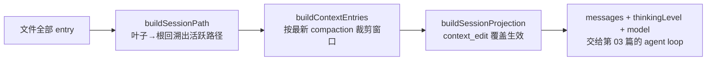

# 05 · 会话与上下文工程

> 一句话：把 pi 的会话文件拆开看——append-only 的 JSONL 树如何同时充当持久化格式、分支引擎和上下文工厂；压缩、上下文编辑、渐进披露如何在这一个文件上协同。读完你能给 agent 设计一份"既给人审计、又给模型喂饭"的存储格式。

## 0 本篇地图

- 前置：第 03 篇（`AgentMessage` 与事件流——落盘的正是这些消息）、第 04 篇（harness 的系统提示词 sections——本篇讲它怎么被组装）。
- 主角：`packages/coding-agent/src/core/session-manager.ts`（2010 行）与 `src/core/compaction/`（3 个文件），文档 `docs/session-format.md`、`docs/compaction.md`。
- 预计阅读 40 分钟。实验在 `../code/05/`，三个零依赖脚本。

pi 的上下文管理三件套都长在同一块基石上：**一个永不改写的 JSONL 文件**。压缩不改写历史，只是追加一条"从这里开始读"的书签；编辑上下文不删除消息，只是追加一条覆盖记录；切换分支不复制文件，只是在树上换个叶子。本篇按"格式 → 投影 → 树操作 → 压缩 → 组装全景"的顺序展开。

## 1 会话是资产，不是黑箱

作者造 pi 的动机清单里，会话格式排得相当靠前（博客原文）：

> Speaking of surfacing things, I want to inspect every aspect of my interactions with the model. Basically no harness allows that. I also want a cleanly documented session format I can post-process automatically, and a simple way to build alternative UIs on top of the agent core. While some of this is possible with existing harnesses, the APIs smell like organic evolution. These solutions accumulated baggage along the way, which shows in the developer experience.

关键词是 **cleanly documented** 和 **post-process automatically**：会话文件不是实现细节，而是公开接口。pi 把它写成一份 289 行的正式规范（`docs/session-format.md`），连迁移规则都逐版写明。对比之下（仓库外观察，推测）：Claude Code 的会话同样落盘 JSONL，但格式属于实现细节，没有对外的版本契约；Codex 的会话格式也散落在 issue 讨论里而非规范文档。pi 的差异不在"用了 JSONL"，而在**把格式当 API 治理**。

## 2 JSONL 格式：header、三版迁移与十一种 entry

### 2.1 header 与三版迁移

每个会话文件第一行是 header（`session-format.md`）：

```json
{"type":"session","version":3,"id":"a1b2c3d4","timestamp":"2026-09-23T10:00:00.000Z","cwd":"/path/to/project"}
```

`version` 至今演进过三次，`session-manager.ts` 里两个迁移函数就是活的历史（当前 `CURRENT_SESSION_VERSION = 3`）：

- **v1 → v2：线性变树。** v1 的 entry 没有 `id`/`parentId`，是一条纯线性的流水账。`migrateV1ToV2` 顺序遍历，给每条 entry 现造 8 字符十六进制 id（`generateId`：`randomUUID().slice(0, 8)`，撞名重试 100 次，兜底用完整 UUID），并用 `prevId` 串出父链；顺手把压缩 entry 的 `firstKeptEntryIndex`（下标引用）升级成 `firstKeptEntryId`（id 引用）——下标在树结构里毫无意义，这是线性时代的化石。
- **v2 → v3：改名。** `migrateV2ToV3` 只做一件事：`message.role === "hookMessage"` 改写为 `"custom"`。扩展注入消息的机制从"钩子"更名为"自定义"，值得专门跑一次迁移。

迁移在读入时执行、保存时按新版本写回，旧文件永远可读。这是"格式即 API"的直接成本与收益。

### 2.2 entry 类型全集

除 header 外，`session-manager.ts` 的判别联合共 11 种 entry（逐个摘自类型定义）：

| type | 内容 | 投影进模型上下文？ |
|---|---|---|
| `message` | 一条 `AgentMessage`（user/assistant/toolResult + pi 扩展的 bashExecution/custom/branchSummary/compactionSummary 角色） | ✅ |
| `thinking_level_change` | 思考等级变更记录 | ❌（作为设置读取） |
| `model_change` | 模型切换记录 | ❌（作为设置读取） |
| `usage` | 一次请求的 token 用量记录 | ❌ |
| `compaction` | 压缩书签：`summary` + `firstKeptEntryId` + `tokensBefore`（可带 `usage`、`details`、系统提示词检查点） | ✅（摘要+检查点） |
| `branch_summary` | 离开分支时的上下文保全：`fromId` + `summary` | ✅ |
| `custom` | 扩展自定义数据（不进上下文） | ❌ |
| `custom_message` | 扩展注入的自定义消息 | ✅ |
| `context_edit` | 对某条已落盘消息的覆盖指令：`targetId` + 新内容/`null`（省略） | ✅（以覆盖形式） |
| `label` | 给用户看的标签（书签/批注） | ❌ |
| `session_info` | 会话级元数据 | ❌ |

所有 entry 共享 `SessionEntryBase`：`type`、`id`（8 字符 hex）、`parentId`、`timestamp`。**"是否进上下文"这一列是本篇的暗线**：文件里的大部分行并不进模型——会话文件是超集，模型窗口是它的投影。

### 2.3 id/parentId 树与叶子

`parentId` 让文件天然是森林：正常对话时每个新 entry 的 `parentId` 指向上一条，看起来就是一条链；`/tree` 跳转后从旧 entry 续写，旧 entry 就长出第二个孩子。没有任何"分支表"之类的元数据——**分支就是入度大于 1 的节点**，活跃分支就是从当前叶子回溯到根的那条路径。sessions.md 一句话点明语义：

> Pi stores entries as a tree, so returning to an earlier point does not erase the branch you leave.

写入侧还有个值得注意的细节：`SessionManager._persist` 在第一条 assistant 消息落盘之前**不写文件**——纯聊了个开头就退出的会话不会在磁盘上留下垃圾文件（`session-manager.ts`，`hasAssistant` 判断）。

### 2.4 磁盘上的位置与命名

```
~/.pi/agent/sessions/--<cwd转义>--/<timestamp>_<sessionId>.jsonl
```

目录名转义在 `getDefaultSessionDirPath`，一行表达式就是全部规则：

```typescript
const safePath = `--${resolvedCwd.replace(/^[/\\]/, "").replace(/[/\\:]/g, "-")}--`;
return join(resolvedAgentDir, "sessions", safePath);
```

`/`、`\`、`:` 统统换成 `-`，所以 `C:\Users\me\proj` 变成 `--C-Users-me-proj--`：一个项目一个目录，人眼可寻，`ls` 就是索引。文件名前半段是创建时间戳（排序即时间线），后半段是会话 id（跨文件引用如 `parentSession` 用它）。

## 3 三步流水线：原始历史是数据，模型上下文是投影

这是本篇的核心。给定"读入内存的全部 entry + 当前叶子 id"，pi 用三个纯函数产出模型请求的上下文，全部在 `session-manager.ts`，无一字副作用：



### 3.1 buildContextEntries：压缩窗口

活跃路径上如果存在 compaction entry，历史就被切成三段（源码骨架）：

```typescript
const contextEntries: SessionEntry[] = [compaction];          // 摘要本体顶在最前
let foundFirstKept = false;
for (let i = 0; i < compactionIdx; i++) {
    const entry = path[i];
    if (entry.id === compaction.firstKeptEntryId) foundFirstKept = true;
    if (foundFirstKept && !(entry.type === "message" && entry.message.role === "system")) {
        contextEntries.push(entry);                            // 保留区：firstKeptEntryId 起
    }                                                          // 系统消息除外——见下节
}
contextEntries.push(...path.slice(compactionIdx + 1));         // 压缩之后的新历史
```

被丢弃的只有"压缩点之前、保留区之外"的旧消息——它们在文件里一行不少，只是不再进上下文。注意两处巧思：其一是**多次压缩**时，路径上可能残留一条更老的 compaction（它的 id 恰好落在新保留区内），投影阶段会把它处理为空（见 3.2 代码注释）；其二是保留区**剔除系统消息**——源码注释说得很直白："System messages are prompt state, not conversation; the compaction entry carries their replay"，系统提示词是每轮重新组装的，历史里存的是当时的**检查点**，不是让旧版本混进新请求。

### 3.2 buildSessionProjection：context_edit 覆盖

保留区确定后，`buildSessionProjection` 再扫一遍，把 `context_edit` entry 收进 `Map<targetId, edit>`——**后写覆盖先写**（同一目标多次编辑，最新的赢）——然后逐 entry 投影：

```typescript
// buildContextEntries() may retain an older compaction entry because its
// raw ID lies inside the newest retained range. Only the newest compaction
// at index zero contributes a checkpoint and summary.
messages: sourceEntry.type === "compaction" && index > 0
    ? []
    : projectContextEntry(sourceEntry, edits.get(sourceEntry.id)),
```

`context_edit` 是"改写历史"的正确姿势：模型视图里那条大 toolResult 可以被替换成摘要文本、甚至替换成空（从上下文省略），但原始行永远躺在文件里。第 1 节说的"追加式编辑"在此闭环：**修正 = 追加一条覆盖记录**。溢出恢复（5.7 节）正是先追加省略 edit、再考虑压缩。

### 3.3 buildSessionContext：终点是消息加设置

投影结果除了 `messages`，还带 `thinkingLevel` 与 `model`——沿活跃路径扫 `thinking_level_change`/`model_change`/assistant 消息取最新值。至此，"文件 + 叶子"到"一次模型请求的全部材料"完全确定。`message` entry 的映射按角色分流：标准四类直通；`custom_message` 变成第 03 篇讲过的可扩展角色消息；`branch_summary`/`compaction` 变成对应的 `branchSummary`/`compactionSummary` 消息（message-types.md：coding-agent 通过 declaration merging 给 `AgentMessage` 追加了 `bashExecution`、`custom`、`branchSummary`、`compactionSummary` 四个角色）。

这套三段式的价值一句话：**原始历史（source of truth）与模型视图（projection）彻底解耦，且投影是纯函数**。它买到三样东西：任何时点可以换叶子重放（分支）；任何消息可以追加覆盖（编辑）；任何外部工具可以直接读文件做后处理（动机兑现）——三者互不干扰，因为没人改写原始行。

## 4 树操作：/tree、/fork、/clone 的取舍

sessions.md 给出的权威对照表：

| 命令 | 行为 | 什么时候用（文档原话意译） |
|---|---|---|
| `/tree` | **当前文件内**移动叶子 | 相关的替代方案应该留在一起 |
| `/fork` | 从早先的 user 消息**新建会话文件** | 替代方案应该变成独立工作 |
| `/clone` | 把**活跃分支**复制进新会话文件 | 想要当前状态的一份独立拷贝 |

`/tree` 的交互也有意思：选中一条 user 消息会把原文放回编辑器，改完提交即长出新分支；选中 assistant 或别的 entry 则从该点之后以空编辑器继续。`/fork` 还有个 CLI 形态：`pi --fork` 在进交互前就先分叉。

为什么分支默认同文件而不是复制？表格里"related alternatives should stay together"背后是三个工程理由：同文件分叉共享 compaction 与文件账本的历史，投影时一棵树全搞定；`parentSession` 头字段+复制文件留给真正要分家的场景；最关键的，树让"上下文保全"成为可能——离开的分支不会消失，还能被摘要回来（第 6 节）。

## 5 compaction 全解剖

### 5.1 触发：一个不等式，三个时机

判据只有一行（`compaction.ts`）：

```typescript
export function shouldCompact(contextTokens: number, contextWindow: number, settings: CompactionSettings): boolean {
    return contextTokens > contextWindow - settings.reserveTokens;
}
```

`reserveTokens` 默认 **16384**（`DEFAULT_COMPACTION_SETTINGS`，可在 `~/.pi/agent/settings.json` 或项目 `.pi/settings.json` 覆盖）：上下文一旦逼近窗口上限减这块预留，就该压缩。三个检查时机（compaction.md）：**轮间**——多轮 agent 运行中，工具批跑完、结果追加之后、下一次 assistant 请求之前的 `prepareNextTurn` 里（工具批若终结了运行且无排队消息则跳过）；**新 user 提示之前**；**兜底**——低层运行结束后若遭遇 provider 溢出错误或提前 `stopReason: "length"`，做一次压缩重试。手动入口是 `/compact [instructions]`，可选指令给摘要定焦。

### 5.2 切点搜索：findCutPoint

压缩不是"砍最老的"，而是"从最新往回保留约 `keepRecentTokens`（默认 **20000**）"。`findCutPoint` 从新往旧累加 token 估算（chars/4 的粗估，与第 03 篇同源），一过预算就停在**最近的合法切点**上。合法切点规则（compaction.md "Cut Point Rules"）：

> Valid cut points are: User messages, Assistant messages, BashExecution messages, Custom messages (custom_message, branch_summary). Never cut at tool results (they must stay with their tool call).

源码注释补了一个方向性细节：切在带 toolCall 的 assistant 消息上是安全的——它的 toolResult 排在**后面**，会随保留区活下来；找到切点后还会**向前**回吸紧邻的"不进上下文的元数据 entry"（model_change 之类），直到碰到 compaction 边界或上下文中可见的 entry——别让一条 `model_change` 孤零零悬在窗口边缘。

### 5.3 塞不下一个 span：split turn 与双摘要

合法切点大多落在 user 消息边界——docs 把"一条 user 消息 + 它引发的所有轮次"定义为 **user-message span**，正常压缩整段整段地切。麻烦在于单个 span 就超过 `keepRecentTokens`（一次超长工具轰炸的任务）：切点被迫落在 span 中间的 assistant 消息上，这就是 split turn（`isSplitTurn = true`，`turnStartIndex` 指回开头的 user 消息）。处理办法是**两次摘要合并**：

> For split user-message spans, Pi generates two summaries and merges them: 1. History summary: previous context (if any). 2. User-message-span prefix summary: the early part of the split user-message span.

保留区里那半截"没有 user 消息开头的工具流"，由前缀摘要补上叙事主语，模型不会看到没头没尾的 toolResult 串。

### 5.4 落盘形态：CompactionEntry

摘要完成后追加一条 `compaction` entry，载荷（`CompactionResult`，落盘时由 SessionManager 补 id/parentId）：

- `summary`：结构化摘要文本（含文件清单，见 5.5）；
- `firstKeptEntryId`：保留区起点——投影窗口的右游标；
- `tokensBefore`：压缩前的上下文 token 估算（UI 显示省了多少）;
- 可选 `usage`（生成摘要这次 LLM 调用本身的开销，进账单）、`details`（扩展数据/文件清单）、系统提示词检查点。

注意 `firstKeptEntryId` 是**id 而非下标**——v1→v2 迁移专门改造的就是它。树结构下标会骗人，id 不会。

### 5.5 文件账本与迭代摘要

压缩摘要最怕丢两类事实：决定了什么、动过哪些文件。第二类 pi 不指望模型自觉，用**机械账本**兜底：`utils.ts` 从消息里扫 read/edit/write 工具调用维护 `FileOperations`，`CompactionDetails` 落盘为两个数组：

```typescript
export interface CompactionDetails {   // compaction.ts:51
    readFiles: string[];
    modifiedFiles: string[];
}
```

关键是**累积**：新一轮压缩先把上一条 compaction 的 `details` 回填进账本再算新账（`if (Array.isArray(details.readFiles)) for (const f of details.readFiles) fileOps.read.add(f)`），最终 `summary += formatFileOperations(readFiles, modifiedFiles)` 把清单钉死在摘要文本尾部。十次压缩之后，模型依然知道自己最初读过哪个文件。docs 的概括：

> Both use closely related structured formats and track file operations cumulatively.

第一类事实靠**迭代摘要**：第二次压缩时把上一条摘要作为 `<previous-summary>` 连同新消息一起交给模型，提示词是更新指令而非重新总结（compaction.md "How It Works" 第 3 步："passing the previous summary as iterative context when present"）。摘要是滚动的状态机，不是每轮重写的作文。

### 5.6 一个容易被略过的参数：cacheRetention: "none"

`completeSummarization` 发起摘要请求时显式传 `cacheRetention: "none"`（compaction.ts:653）。docs 解释了动机：

> Summarization requests disable prompt-cache writes because these one-off prompts are unlikely to be reused.

摘要请求的"输入"是一份再也不会原样出现的对话前缀——允许它写 prompt cache 纯属交智商税（Anthropic 的 cache write 按输入 token 加价计费）。在会话格式文档里翻到这一行，最能体会 pi 的颗粒度：**格式的每个字段的账单含义都被想清楚了**。

### 5.7 溢出恢复的顺序学

请求已经被 provider 打回（context overflow）或截断（提前 `stopReason: "length"`）时，docs 规定了一条严格顺序的恢复路径：先落盘失败的 assistant 响应 → 走完公开的 `turn_end`/`agent_end` 生命周期 → **追加 context_edit 省略过大的消息** → 仍有必要才做压缩并追加 compaction → 以全新 run 重试。压缩失败或被取消则保留省略 edit、不追加、不重试。"Raw transcript history, exports, billing totals ... can still inspect the omitted attempt"——**修的是投影，永远不是账本**。

## 6 branch summarization：给离开的分支留遗书

`/tree` 跳走的瞬间，pi 提议给正在离开的分支生成一份 `branch_summary` entry（`{ type: "branch_summary", fromId, summary, details?, usage? }`，`parentId` 挂在导航目标上），插入新分支继续干活。它与 compaction 用同一套结构化格式与文件账本机制，但分工完全不同（compaction.md 首表）：

| 机制 | 触发 | 目的 |
|---|---|---|
| Compaction | 逼近上下文窗口 | 续命：压掉老历史继续当前分支 |
| Branch summarization | `/tree` 跨分支导航 | 移植：把被弃分支的工作装进目标分支 |

前向的（compaction）服务于 token 预算，侧向的（branch summary）服务于注意力预算——两个方向共用一个摘要引擎，是"机制正交"的漂亮案例。

## 7 上下文组装全景

把镜头拉远，一次请求的上下文由六路材料拼成（系统提示词部分呼应第 04 篇）：

1. **系统提示词 sections**：harness 按 section 字典拼装、可增可换（第 04 篇），压缩时其检查点随 compaction 存档；
2. **context 文件**：全局与项目 `AGENTS.md`（信任门控，第 04 篇）；
3. **skills 渐进披露**：启动时只把每个技能的 name+description+path 写进系统提示词——"Pi advertises each available skill by name and description, then loads its full instructions only when the task calls for them"（skills.md）；正文按需加载，`disable-model-invocation: true` 的技能连模型都不能主动触发，只能 `/skill:name` 显式调用。name ≤ 64 字符、description ≤ 1024 字符的硬限就是给常驻成本上的笼头；
4. **prompt 模板**：Markdown 文件即 `/命令`，替换语法一张表（`$1`/`$2` 位置参数、`$@` 或 `$ARGUMENTS` 全参、`${1:-default}` 带默认值、`${@:N}`/`${@:N:L}` 切片），参数按 shell 式引号切分；
5. **编辑器注入**：`@` 搜文件附件、`!` 前缀跑命令把输出带进对话（usage.md）；
6. **本篇的主体**：会话投影——compaction 窗口 + context_edit 覆盖后的消息流。

常驻的永远是索引与摘要，全文只在被点名时进场。整条设计线一以贯之：**token 是预算，文件是账本，投影是艺术**。

## 8 与 Claude Code / Codex 的定性对比

以下为仓库外观察（推测，凭公开资料），只作定位参照：

- **Claude Code**：会话也是 JSONL、也有 `/compact` 与自动压缩，但历史视图主要是线性 transcript + 摘要替换；分支/时间旅行不是产品级概念。格式无版本契约，随版本变（作者博客那句 "the APIs smell like organic evolution" 矛头所指，也是它用户量大的必然代价——作者自己说了 not blaming anyone）。
- **Codex CLI**：有 rollout 会话记录与压缩机制，格式同样属实现细节；编辑/回退依赖 git 而非会话树。
- **pi**：树是原生概念、格式有版本号与迁移代码、编辑以 append-only 覆盖实现。三者都认同"落盘要能后处理"，只有 pi 把它写成规范并承诺迁移。

## 9 启示：如果你的 agent 也要存会话

1. **第一版就上 id/parentId**，哪怕暂时用不上分支。pi 从线性升级到树付出的代价是专用迁移函数+`firstKeptEntryIndex` 这种化石字段；你不必付两遍。
2. **区分事实与视图**：改写上下文 = 追加覆盖记录（context_edit），绝不动原始行。审计、计费、回放、分支全部依赖"历史不可变"这一个不变量，破一次就全塌。
3. **压缩是书签不是删页**：`{summary, firstKeptEntryId}` 一条 entry 解决，重放、再压缩、换叶子都免费。切点永不落在 toolResult 上——工具调用与其结果是不可分割的原子。
4. **给摘要配机械账本**：文件操作清单从工具调用里机械推导并跨轮累积，别让模型凭记忆复述"我们改过什么"。
5. **盯住摘要请求自己的账单**：一次性 prompt 禁用 cache write（`cacheRetention: "none"`），一个参数省的是真金白银。
6. **常驻上下文全按索引设计**：skills 只留 name+description，技能正文/模板/大文件全按需。渐进披露不是功能，是纪律。

## 实验（../code/05/）

| 脚本 | 验证正文哪一节 | 内容 |
|---|---|---|
| `01-session-tree.mjs` | §2.3、§3 | 内置一段手写 pi 风格 JSONL（header + 各类 entry + 分叉 + compaction + context_edit），解析成树、ASCII 渲染并高亮活跃路径，模拟 buildContextEntries 窗口裁剪与 context_edit 覆盖；支持传入真实 `~/.pi/agent/sessions/*.jsonl` 路径 |
| `02-toy-compactor.mjs` | §5.1-5.5 | 40 条合成消息（read/bash/edit 工具调用、大小悬殊的 toolResult）；chars/4 估算、反向 findCutPoint（绝不切 toolResult）、split turn 双摘要合并、结构化摘要+累积文件账本、追加 CompactionEntry 到 JSONL；二次压缩验证 previousSummary 迭代与账本累积；全程原始文件只增不改 |
| `03-skills-disclosure.mjs` | §7 | 现场生成 demo 技能目录（frontmatter+长正文+scripts/），对比 name+description 常驻注入与全文加载的 token 差值；实现 `$1/$@/${1:-x}/${@:N}/${@:N:L}` 模板替换并跑真实用例 |

三个脚本零依赖、Node ≥ 20、`node 0X-*.mjs` 直接跑；真实输出贴在 `../code/05/README.md`。

## 延伸阅读

- `docs/session-format.md`（289 行规范，逐条对照本篇 §2）；`docs/compaction.md`（463 行，§5-6 的权威来源，ASCII 图示值得细看）。
- `packages/coding-agent/src/core/session-manager.ts`：`SessionEntryBase`/11 类型联合 → `migrateV1ToV2`/`migrateV2ToV3` → `getDefaultSessionDirPath` → `buildContextEntries`/`buildSessionProjection`/`buildSessionContext`，正好是本篇的动线。
- `packages/coding-agent/src/core/compaction/`：`compaction.ts`（shouldCompact/findCutPoint/双摘要/文件账本/cacheRetention）、`branch-summarization.ts`、`utils.ts`（computeFileLists、serializeConversation）。
- `docs/sessions.md`、`docs/skills.md`、`docs/prompt-templates.md`、`docs/message-types.md` — §4、§7 逐条对应。
- `references/pi-minimal-coding-agent-post.md` — 作者动机原文（§1 引文出处）。
- 系列衔接：第 03 篇（被投影的 `AgentMessage` 与被消费的 `compactionSummary` 角色）、第 04 篇（系统提示词 sections 的组装端）、第 07 篇（扩展如何消费会话事件做后处理）。
