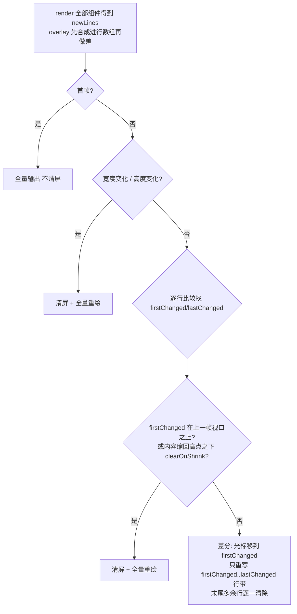

# 06 · pi-tui：终端 UI 引擎

> 一句话：拆开 pi-tui 的三根支柱——行级差分渲染、CSI ?2026 同步输出、retained 组件树——搞清终端 TUI 为什么会闪、pi 怎么把闪烁压到 (almost) 没有、输入侧的 escape 序列状态机怎么处理流式按键。读完你能给"会流式输出的 agent"搭一个架构正确的最小终端渲染器。

## 0 本篇地图

- 前置：第 03 篇（`message_update` 事件流——pi-tui 重绘的上游驱动源）、第 04 篇（coding-agent harness——pi-tui 最大的消费者）。
- 主角：`packages/tui`（src 约 18.3k 行 TS）。核心文件：`tui.ts`（1456 行，基类与渲染调度）、`tui-main-screen.ts`（655 行，主屏差分）、`tui-alt-screen.ts`（1745 行，备用屏视口）、`stdin-buffer.ts`（444 行，输入拼包）、`keys.ts`（1401 行，按键语义）。
- 预计阅读 35 分钟。实验在 `../code/06/`，三个零依赖脚本。

## 1 终端 TUI 为什么会闪

动机先于方案。作者离开 Claude Code 的理由里排得很靠后的一条（博客原文）：

> Claude Code has turned into a spaceship with 80% of functionality I have no use for. ... Also, it flickers.

闪烁是终端渲染的结构性问题。终端是"字符流设备"：没有帧缓冲、没有双缓冲，它只是顺序处理你写入的字节——光标移动、清行、落字，并且通常边解析边呈现。如果每次 UI 更新都把整屏重画一遍（全量重绘），那么在一次输出的时间窗内，用户看到的就是一帧"半新半旧"的撕裂画面；流式对话让这个问题雪上加霜——每个 token 都触发重绘，等于每个 token 撕一次整屏。

作者的自我定位（README 对 pi-tui 的一句话）：

> A minimal terminal UI framework with differential rendering, synchronized output for (almost) flicker-free updates, and components like editors with autocomplete and markdown rendering.

注意 "(almost)" 不是谦虚，是对终端生态的诚实描述（博客原文）：

> In any capable terminal like Ghostty or iTerm2, this works brilliantly and you never see any flicker. In less fortunate terminal implementations like VS Code's built-in terminal, you will get some flicker depending on the time of day, your display size, your window size, and so on. ... And it still flickers less than Claude Code.

## 2 三根支柱：retained 组件树、行差分、原子提交

pi-tui 的防闪烁是三层递进，各回答一个不同的问题：

| 支柱 | 回答的问题 | 所在层 |
|---|---|---|
| 行级差分 | 这一帧该写多少字节 | `tui-main-screen.ts` / `tui-alt-screen.ts` |
| CSI ?2026 同步输出 | 写出去的字节何时被呈现 | 同上（帧首尾包裹） |
| retained 组件树 + 行数组契约 | 文档怎么组织才能让逐行比较成为可靠的增量机制 | `tui.ts` + `Component` 接口 |

配套的调度层（`tui.ts`）再把"重绘次数"从事件频率解耦成帧率（16ms 节流，见 §4）。

编程模型上 pi-tui 选了 retained mode（组件树常驻、各自持有渲染缓存），而不是每帧从零重建的 immediate mode。作者对这笔账算得很直白（博客原文）：

> How wasteful is this approach? We store an entire scrollback buffer worth of previously rendered lines, and we re-render lines every time the TUI is asked to render itself. That's alleviated with the caching I described above, so the re-rendering isn't a big deal. ... a few hundred kilobytes for very large sessions. Thanks V8. What I get in return is a dead simple programming model that lets me iterate quickly.

"缓存整屏历史 + 每次请求时重渲染 + diff 只写变化"——用几百 KB 内存换一个简单心智模型，这是作者"不需要就不做"哲学在 UI 层的镜像。

## 3 Component 契约：可 diff 的文档长什么样

README "Component Interface" 给出的全部契约：

```typescript
interface Component {
  render(width: number): string[];
  handleInput?(data: string): void;
  handleMouse?(event: TuiMouseEvent): TuiMouseEventResult | undefined;
  invalidate(): void;
}
```

三条铁律，都是为"逐行 diff 能成立"服务的：

1. **`render(width)` 返回逐行字符串数组，可见宽度不得超过 `width`**——这不是君子协定而是硬约束：差分路径落笔前逐行检查，越宽就停掉终端、写崩溃日志、再抛错（`tui-main-screen.ts`）：

   > Rendered line 12 exceeds terminal width (57 > 40). ... Use visibleWidth() to measure and truncateToWidth() to truncate lines.

   为什么必须 crash 而不是静默截断？因为一行超宽会让终端自行折行/滚动，光标相对位移的全部算术从此失效——差分渲染器宁可炸得响亮，也不能让"上一帧行数组"和屏幕实际内容悄悄脱钩。
2. **样式不跨行**：TUI 在每行渲染输出末尾追加完整的 SGR reset 和 OSC 8 reset（README 原文 "Styles do not carry across lines"）。多行文本要逐行重新施加样式，或用 `wrapTextWithAnsi()` 保证折行后每行样式自足。这让"任意两行可比、单行可独立重写"成为可能。
3. **有缓存必须实现 `invalidate()`**：README "Caching" 一节的范式是 `cachedWidth`/`cachedLines` 双字段，宽度不变直接回缓存。coding-agent 的 `assistant-message.ts`、Markdown 组件都是这个结构。

三条合起来得到一个不变量：**行内容只可能因组件状态变化（或宽度变化）而变**。逐行比较因此就是可靠的增量信号——这是本篇后面所有算法的地基。

## 4 源码精读（一）：主屏差分渲染

`TuiMainScreen` 是 inline 形态：渲染进主屏、保留终端 scrollback，内容超过屏幕时由终端自然上滚。差分的基线是上一帧的行数组与若干游标状态（字段摘自 `tui-main-screen.ts`）：

```typescript
private previousLines: string[] = [];
private previousWidth = 0;
private previousHeight = 0;
private cursorRow = 0;           // 逻辑内容末尾
private hardwareCursorRow = 0;   // 终端光标实际所在文档行
private maxLinesRendered = 0;    // 曾渲染过的行数高点
private previousViewportTop = 0; // 上一帧视口顶缘对应的文档行
```

`doRender()` 的决策流：



代码里最有信息量的一句注释：

> Differential rendering can only touch what was actually visible. If the first changed line is above the previous viewport, we need a full redraw.

差分只能改写还在窗口里的行。第一处变化已经在窗口之上（内容早已滚进 scrollback）时，任何相对位移序列都只会把旧内容从 scrollback 里顶出来，唯一正确做法是清屏重画。

四条退化到全量重绘的路径，每条都有注释说明理由：

1. **宽度变化**："Width changes always need a full re-render because wrapping changes."——折行全变，每行作废。
2. **高度变化**：默认全量重绘；但有一个耐人寻味的例外——Termux：
   > Termux changes height when the software keyboard shows or hides. In that environment, a full redraw causes the entire history to replay on every toggle.

   于是按 `TERMUX_VERSION` 环境变量跳过高度变化的重绘。一个终端模拟器的怪癖，就要在渲染器里长出一个分支——跨终端工程的本体。
3. **firstChanged 在视口之上**（上面那句注释）。
4. **clearOnShrink**（可选开关）：内容缩短到历史高点以下且无 overlay 时重绘，否则屏幕上残留一片空白行。

正常差分路径生成的字节序列（按代码顺序，简化）：

```
\x1b[?2026h                    Begin synchronized output
\x1b[<n>B 或 \x1b[<n>A         相对位移到 firstChanged 所在屏幕行（目标在窗口之下则用 "\r\n"×k 滚动）
\r                             回到列 0
循环 i = firstChanged..lastChanged:  \x1b[2K + newLines[i]，行间 "\r\n"
(若旧帧更长: 逐行 \r\x1b[2K 清掉多余行，再移回)
\x1b[?2026l                    End synchronized output
```

注意重写的是 **firstChanged..lastChanged 行带**而不是"到文档末尾"，代码注释：

> Only render changed lines (firstChanged to lastChanged), not all lines to end — This reduces flicker when only a single line changes (e.g., spinner animation).

spinner 每 tick 只动一行，写盘量就是一行。

三个容易漏掉的工程细节：

- **BoundedTerminalWriter**：一帧的所有输出按 1 MiB 分块写入（`MAX_RENDER_WRITE_CHARS`），切分时避开 UTF-16 代理对中间。超长会话的全量帧可能拼出超过 V8 字符串上限的巨串，一帧写入不能死在这上面。
- **光标位置是虚拟状态**：`cursorRow`（内容末尾）与 `hardwareCursorRow`（光标真实位置）分开记账，Kitty 图像占位、清行、IME 硬件光标定位都会挪动真实光标，所有 `\x1b[nA/B` 位移都按 `hardwareCursorRow` 算。
- **调试阀门**：`PI_TUI_WRITE_LOG=<file>`（README）抓 stdout 的完整 ANSI 流；`PI_TUI_DEBUG_REDRAW=1`（代码）把每次全量重绘的原因写进 `pi-tui-debug.log`。差分渲染极难肉眼调试，这两招是方法论的一半。

调度层在 `tui.ts`（`TuiBase`）：`requestRender()` 用 `renderRequested` 标志合并成至多一帧，`MIN_RENDER_INTERVAL_MS = 16` 节流（约 60fps）；而键盘输入走 `requestImmediateRender()`，注释写明 "User input must preempt that throttled frame"——输入必须取消在途节流定时器立刻回帧。

**与流式输出的映射**（第 03 篇的闭环）：`message_update` 事件更新对应消息组件的文本并 `invalidate()`，`interactive-mode.ts` 随后调用 `ui.requestRender()`（全文数十处）。token 事件频率远高于 16ms 一帧，多次事件合并成一帧；帧内 diff 通常只有 Markdown 组件的最后一两行变化——**重写字节量正比于变化行宽，而不是会话长度**。这就是 pi 敢把整屏历史都 retained 在内存里的底气。

## 5 CSI ?2026：帧的原子提交

```typescript
const BEGIN_SYNCHRONIZED_OUTPUT = "\x1b[?2026h";
const END_SYNCHRONIZED_OUTPUT = "\x1b[?2026l";
```
（`tui-alt-screen.ts`；`tui-main-screen.ts` 内联同样序列。两种渲染器的每一帧都被这对序列包裹。）

CSI ?2026h/l 是"同步输出"终端扩展：begin 之后终端把写入缓冲起来，end 时一次性提交呈现——终端界的页翻转。差分与 2026 解决的是正交的问题：

| 机制 | 解决的问题 | 单独使用时的缺口 |
|---|---|---|
| 行差分 | 一帧写多少字节 | 写出的字节仍可能被终端边解析边呈现，帧内撕裂 |
| CSI ?2026 | 字节何时被呈现 | 不减少字节量，全量重绘照样闪、照样费带宽 |

优雅降级：不识别该私有模式的终端会按惯例忽略未知序列，输出内容依旧正确，只是失去原子提交——所以正确性不依赖终端能力，只有体验依赖。这正是 "(almost) flicker-free" 的由来：能力好的终端（Ghostty/iTerm2）零闪烁，差的（VS Code 内嵌终端）残余闪烁但依然是同场景下最轻的。

## 6 源码精读（二）：两种形态——主屏 inline 与备用屏全屏

`TUI` 是共享接口，实现可互换（README）：

```typescript
const tui: TUI = new TuiMainScreen(terminal);   // 渲染进主屏，保留终端 scrollback
// const tui: TUI = new TuiAltScreen(terminal); // 备用屏固定高度视口，滚动归应用
```

| | TuiMainScreen | TuiAltScreen |
|---|---|---|
| 内容去处 | 主屏 + 终端 scrollback | 备用屏固定视口；stop 时恢复主屏并打印完整最终文档 |
| 寻址 | 相对位移 `\x1b[nA/B`（要维护虚拟游标） | 绝对定位 `\x1b[row;colH`（整屏皆归我，无需游标记账） |
| 滚动 | 终端自理（`\r\n` 上顶） | 应用自有 viewport：鼠标滚轮/触控板/键盘导航、`follow:"end"` 自动跟随流式、OSC 133 prompt 跳转 |
| 交互 | 不捕获鼠标（scrollback 归终端） | SGR 鼠标命中测试、拖拽选区 + OSC 52 复制、搜索面板（Ctrl+Shift+F）、可拖拽滚动条 |

备用屏的 `doRender` 比主屏干净得多——每行都能绝对定位，比较逻辑退化为一句话（`tui-alt-screen.ts`，有删节）：

```typescript
for (let row = 0; row < height; row++) {
  if (!fullRedraw && !imagesNeedRedraw && screen[row] === this.previousScreen[row]) continue;
  buffer += `\x1b[${row + 1};1H\x1b[2K${screen[row] ?? ""}`;
}
```

`fullRedraw` 只在"上一屏为空或宽高变化"时发生；未变的行一个字节都不发。

coding-agent 的交互模式同时持有两种渲染器（`packages/coding-agent/src/modes/interactive/interactive-mode.ts`：`private renderer: TuiMainScreen | TuiAltScreen`），切换时用 `captureRenderState()/restoreRenderState()`（`tui-main-screen.ts`）保住主屏帧基线——同一段会话可以在 inline 与全屏之间来回切而不闪崩。README 也明确了两形态的功能分界：VStack/HStack/ScrollView 布局语义**只在备用屏可用**，"主屏上滚动条归终端"。

## 7 输入侧：按键是一个流协议问题

一次按键不是"一个字符串"。终端输入按字节流到达，一条 CSI 序列可能被拆进多个 data 事件——`stdin-buffer.ts` 头注释给的正是这个例子：

```
鼠标 SGR 序列 \x1b[<35;20;5m 可能到达为：
  Event 1: \x1b
  Event 2: [<35
  Event 3: ;20;5m
```

若直接逐事件解释，半个 `\x1b` 会被当成一次 Escape 按键、`[<35` 会被当成字面文本。`StdinBuffer` 的做法是一台"完整性三态机"：对以 `\x1b` 开头的数据判定 `complete / incomplete / not-escape`，识别 CSI（`\x1b[`）、OSC（`\x1b]`）、DCS（`\x1b P`，含 XTVersion 应答）、旧式鼠标（`ESC[M` + 3 字节），攒齐完整序列再向上发射；裸 `\x1b` 等 10ms 判为真 Esc（`DEFAULT_ESCAPE_TIMEOUT_MS = 10`，普通序列超时 50ms 兜底）。bracketed paste 用 `\x1b[200~` / `\x1b[201~` 定界，Editor 组件借此把超过 10 行的粘贴折叠成 `[paste #1 +50 lines]` 标记——粘贴不再刷屏、也不再逐字符触发重绘。注释标明灵感来源：OpenTUI（MIT）。

按键语义层在 `keys.ts`：legacy 序列与 Kitty 键盘协议并存。`ProcessTerminal` 启动时发一组探测（`terminal.ts`）：

```typescript
const KITTY_KEYBOARD_PROTOCOL_QUERY = `\x1b[>${...}u\x1b[?u\x1b[c`;
```

终端以 `\x1b[?<flags>u` 应答则支持 Kitty 协议，以 DA（`\x1b[?...c`）应答则不支持，据此置 `setKittyProtocolActive()`。应用层统一用 `matchesKey(data, Key.ctrl("c"))` 判断，不关心底下是哪种协议。legacy 终端里 shift+enter 与普通 enter 常常不可区分，pi 把 Kitty 的 CSI-u 编码固化为 `NATIVE_SHIFT_ENTER_SEQUENCE = "\x1b[13;2u"`——这也是文档让用户优先用 Alt+Enter 换行的原因（README Editor 节："Alt+Enter most reliable"）。

键位系统是三层结构"具名 action → 默认键 → 用户 JSON"（`keybindings.ts` + `packages/coding-agent/docs/keybindings.md`）：

```typescript
export interface KeybindingDefinition { defaultKeys: KeyId | KeyId[]; description?: string; }
export type KeybindingsConfig = Record<string, KeyId | KeyId[] | undefined>;
// 默认表片段：
"tui.editor.cursorLeft": { defaultKeys: ["left", "ctrl+b"], description: "Move cursor left" },
```

action 表通过 TypeScript declaration merging 让下游包扩充（`app.*` 是 coding-agent 加的应用级 action）；用户侧配置文件是 `~/.pi/agent/keybindings.json`：

```json
{
  "app.session.new": "ctrl+shift+n",
  "tui.altScreen.pageUp": []
}
```

空列表显式禁用 action——配置语义是"替换默认"而非叠加。

编辑器设施（README Editor/Input 节）：多行编辑带软折行、kill-ring（`kill-ring.ts`，yank/yankPop）与 undo、`Ctrl+]` 字符跳转、slash 命令补全与 Tab 文件补全（`CombinedAutocompleteProvider`，支持 `~/./../@` 前缀，`@` 前缀过滤为可附着文件）。IME 支持的做法值得单独一提：组件实现 `Focusable` 接口，在假光标处发射零宽 APC 标记 `CURSOR_MARKER`，渲染器在出帧前扫描标记、算出行列坐标、**把标记从输出中剥掉**，再用 `\x1b[nA/B` + `\x1b[<col>G` 把（默认隐藏的）硬件光标挪过去（`tui.ts extractCursorPosition`）——中文输入法候选窗因此不再飘到屏幕角落。

## 8 图像与其他设施（简述）

`components/image.ts` + `terminal-image.ts` 支持两种终端内联图像协议：Kitty graphics（Kitty/Ghostty/WezTerm）与 iTerm2 inline，PNG/JPEG/GIF/WebP 的宽高直接从文件头解析。一个漂亮的兼容性结论（README "Alternate-screen image compatibility"）：iTerm2 协议无法删除/裁剪已放置的图像，备用屏反复重绘会留下悬浮的残影，所以 `TuiAltScreen` 在 iTerm2 里把图像组件降级为文本占位符，主屏模式则照常渲染——协议能力决定渲染形态，而不是硬做兼容。`tui-main-screen.ts` 里还有 `expandChangedRangeForKittyImages`：图像占据多行，changed 行带要按图像占位扩张，否则残图不清。主屏对 WezTerm 的 EL（erase-line）擦除图像单元 bug 也有针对性绕路。这些细节共同解释了为什么"支持图片"四个字值几百行代码。

另有 OSC 11 查询终端背景色（`queryTerminalBackgroundColor`）、OSC 133 shell 语义 prompt 标记导航（备用屏）、`alt-screen-flash.ts` 的状态闪烁提示等，按需查阅 README。

## 9 启示：只给你 2000 行，终端 UI 的复杂度该花在哪

pi-tui 的 1.8 万行是"日常主力工具"的完全体。如果你的需求只是"一个流式输出不闪、能编辑输入的 agent TUI"，我建议把预算按下面的顺序花（推荐基于本篇读到的结构，不是作者原话）：

**必须投入：**
1. **上帧行数组 + firstChanged/lastChanged 行带重写 + 每行 `\x1b[2K`**——百来行，砍掉九成闪烁与带宽；这是全局唯一的地基。
2. **帧首尾包 `\x1b[?2026h/l`**——十行代码，把"帧内撕裂"这类问题整体消灭；不支持的终端自动退化，无兼容成本。
3. **全量重绘兜底**：宽度变化（折行作废）、firstChanged 高于视口（差分够不着）、内容收缩（残影）——差分方案的正确性全靠这几条逃生门，一条都不能省。
4. **输入拼包状态机 + ESC 超时**：半个转义序列不能碎成按键；裸 Esc 要有 10ms 级判定，否则 Esc 键形同虚设。
5. **合并 + 节流的渲染调度**：事件频率 ≠ 重绘频率，16ms 窗口 + 输入抢占，token 风暴只产生 60fps 帧。
6. **行宽硬校验**：超宽就响亮地崩，别静默错位——差分渲染器与终端状态一旦失同步，后面每一帧都在错误基线上。

**可以心安理得地砍**：overlay 合成、鼠标命中测试、图像协议、markdown 高亮、选区复制、搜索面板、滚动条 hover——它们都不影响"agent 打字你不闪"这个核心体验。pi 全都做了，因为它要替代日常主力 shell；你不需要。

最后一条架构教训是贯穿本篇的：**可差分性是接口设计出来的，不是算法设计出来的**。先有"render 返回行数组 + 每行样式自闭合 + invalidate 缓存契约 + 超宽即崩"这四条纪律，逐行 diff 才有资格成为增量机制；契约没立住，任何 diff 算法都会在某个角落悄悄错位。给终端做抽象时，先问"什么样的接口能让任意两帧可逐行比较"，再谈优化。

## 实验（../code/06/）

| 脚本 | 验证什么 |
|---|---|
| `01-diff-renderer.mjs` | 迷你 retained 渲染器（MiniTerminal + diffRender）：流式追加多帧，逐帧打印差分模式、重写行数、写盘字节 vs 全量重绘对比表；随后演示两个退化场景——cols 变化、变更行高于视口——各自落回全量重绘。每帧后用独立终端仿真器校验落屏一致性（PASS） |
| `02-sync-output.mjs` | 构造带 `\x1b[?2026h` … `\x1b[?2026l` 的完整帧字节；非 TTY（自动化环境）自动降级为打印转义后的字节流并解释真终端下的原子提交差异，保证退出码 0 |
| `03-input-probe.mjs` | stdin-buffer 风格的序列拼包状态机 + 按键语义表：TTY 下 raw mode 实探（Ctrl+C 退出）；非 TTY 用内置样例（含被拆成两个 chunk 的鼠标序列、Kitty CSI-u、bracketed paste）跑解析表，退出码 0 |

## 延伸阅读

- `packages/tui/README.md` — 官方 API 全览：Component 契约、两种渲染器、Editor/补全、图像兼容矩阵、`PI_TUI_WRITE_LOG` 调试。
- `packages/tui/src/tui-main-screen.ts` — 655 行读完主屏差分的全部逃生通道；`tui.ts` 的 `TuiBase`（调度、overlay 合成、CURSOR_MARKER）。
- `packages/tui/src/tui-alt-screen.ts` — 备用屏视口：布局、滚动跟随、选区/搜索（README "Alternate-screen viewport layouts" 一节是很好的导览）。
- `packages/tui/src/stdin-buffer.ts` + `keys.ts` + `keybindings.ts` — 输入侧三件套；`packages/coding-agent/docs/keybindings.md` — 用户侧键位配置。
- `references/pi-minimal-coding-agent-post.md`（"A closer look: pi-tui" 一节）— 闪烁动机与作者对缓存/差分权衡的自述。
- Kitty 键盘协议规范：https://sw.kovidgoyal.net/kitty/keyboard-protocol/ （`keys.ts` 头注释引用的即此）。
- 系列衔接：第 03 篇（`message_update` 如何成为重绘驱动源）、第 07 篇（扩展系统如何往这套 UI 里挂自定义组件与快捷键）。
