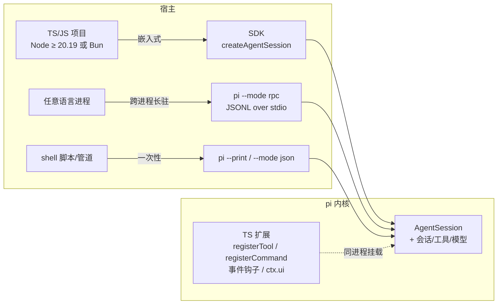

# 07 · 扩展系统、SDK 与 RPC：把 pi 当库用的三条路

> 一句话：同一个 agent 内核对外露出四种接口形态——进程内 TS 扩展、嵌入式 SDK、JSONL over stdio 的 RPC、一次性 CLI——本篇把每条路的真实 API 面、协议帧格式和安全边界逐字拆开，读完你能选对集成路径，并用任意语言写出一个 pi 客户端。

## 0 本篇地图

- 前置：第 03 篇（`AgentTool`/事件流——扩展工具最终落进这条管线）、第 05 篇（会话树与 entry——RPC 的游标和事件都长在它上面）、第 06 篇（TUI——RPC 模式下被"降级"的那部分 UI）。
- 主角：`packages/coding-agent/docs/` 的 extensions / sdk / rpc 三件套 / cli-integration / json / packages 六篇文档，外加 `examples/` 的 34 个扩展示例。
- 预计阅读 40 分钟。实验在 `../code/07/`。

## 1 "当库用"是刚需，不是附加品

作者的动机清单里，"可替换的外壳"和"会话可读"并列（博客原文）：

> I also want a cleanly documented session format I can post-process automatically, and **a simple way to build alternative UIs on top of the agent core**.

README 的定位一以贯之：核心最小、其余皆可选、**hackable via composable TypeScript extensions**。这句话解释了为什么 pi 的"扩展性"不是一种外挂机制而是分层方式：coding-agent 这个 CLI 本身就是 `pi-ai + pi-agent-core` 的又一个消费者，它对外提供的每扇门（扩展/SDK/RPC/CLI）通向的都是**同一个 agent、同一套会话、同一批工具**——cli-integration.md 原话：

> All four modes use the same agent, sessions, resources, and tools. The mode determines how input enters Pi, how output is exposed, and whether the process remains available for more commands.

所以"三条路"准确说是**四条**（外加进程内扩展这半条）：扩展改的是同进程行为，SDK 把内核嵌进你自己的进程，RPC 让任意语言跨进程控制长驻的 pi，CLI 的 print/JSON 模式服务一次性脚本。

## 2 路径总览：按宿主选路



| 路径 | 接口 | 进程 | 适合谁 |
|---|---|---|---|
| 扩展 | TS 模块 | 与 pi 同进程 | 给日常使用的 pi 加工具/命令/门禁/自定义 UI |
| SDK | `createAgentSession()` | 你的进程（Node/Bun） | TS 项目里嵌一个带会话的 agent |
| RPC | stdin/stdout JSONL | pi 长驻子进程 | Python/Go/Rust 客户端、GUI、Web、移动端 |
| print / JSON | `--print` / `--mode json` | 一次性 | 脚本取最终文本 / 结构化事件流 |

选择判据在 cli-integration.md 里是一张权威表（Print：要最终答案；JSON：要单次运行的结构化进度；RPC：要**双向持续控制**）。两个容易踩的语义坑文档写得很明白：非 TTY 输入输出自动落入 print 模式；`RpcClient.promptAndWait()` 这类客户端必须**先订阅再发 prompt**，因为"成功的 `prompt` 响应只代表已接受/入队，不代表跑完"。

## 3 扩展：在进程内用 TypeScript 改 harness

extensions.md 第一句就是定义：**"Extensions are TypeScript modules that add executable behavior to Pi."** 一个扩展 = 一个默认导出函数，接收 `ExtensionAPI`：

### 3.1 发现与加载

- 用户级：`~/.pi/agent/extensions/*.ts`；项目级：`<cwd>/.pi/extensions/`（sdk.md 的默认资源目录表列出：extension/skill/prompt/theme 四类同构）。
- 显式路径：`pi -e /path/to/ext.ts` 单次试用（`-e` 可重复）；`--extension` 是长形式（get_state 的 `global/project/extensions` 三来源分类与之对应）。
- 打包分发：settings.json 的 `packages` 声明（见 §6）。项目级声明**在授予 project trust 之前不读**——packages.md 原话 "Pi reads declarations from that file only after project trust is granted"。
- 关闭：`pi -x`（`--no-extensions`）。

### 3.2 ExtensionAPI 实操面

以 examples 里两个文件为标本。**`examples/extensions/hello.ts`** 是最小工具（全文 27 行，逐字引用核心）：

```typescript
import { Type } from "@earendil-works/pi-ai";
import { defineTool, type ExtensionAPI } from "@earendil-works/pi-coding-agent";

const helloTool = defineTool({
    name: "hello",
    label: "Hello",
    description: "A simple greeting tool",
    parameters: Type.Object({ name: Type.String({ description: "Name to greet" }) }),
    async execute(_toolCallId, params, _signal, _onUpdate, _ctx) {
        return { content: [{ type: "text", text: `Hello, ${params.name}!` }],
                 details: { greeted: params.name } };
    },
});

export default function (pi: ExtensionAPI) {
    pi.registerTool(helloTool);
}
```

`execute(_toolCallId, params, signal, onUpdate, ctx)` 五参数——与第 03 篇 `AgentTool.execute` 完全同构，`signal` 管 abort、`onUpdate` 发部分结果。**扩展工具不是旁路**：它注册进的是 harness 的工具表，走的正是第 3 篇那条"preflight 校验 → 执行 → isError 收敛"管线；工具集本身由 harness 集中管控（sdk.md：`tools`、`noTools`、`excludeTools`、`customTools` 四选项），扩展只能在门内加东西。

`ExtensionAPI` 的注册面，直接照抄 extensions.md 的用法表：`pi.on()` 观察/改写生命周期；`pi.registerTool()` 加模型可调用操作；`pi.registerCommand()` 加 `/` 命令（rpc-commands.md 的 get_commands 里 `source: "extension"` 即来自它）；`pi.registerShortcut()` / `pi.registerFlag()` 加快捷键与自定义旗标；`pi.sendUserMessage()` / `pi.sendMessage()` 主动投递消息；`pi.appendEntry()` 持久化不进上下文的会话数据（json.md 的 `entry_appended` 事件就是它）；`pi.registerProvider()` 挂自定义模型提供商。

**`examples/extensions/todo.ts`** 展示了三件套的组合拳：`todo` 工具（TypeBox 参数 + `StringEnum` 动作枚举）+ `/todos` 命令（弹自定义 TUI 组件）+ 一个值得咀嚼的设计决策——**状态存在 tool result 的 `details` 里，不存外部文件**。注释原文：

> State is stored in tool result details (not external files), which allows proper branching - when you branch, the todo state is automatically correct for that point in history.

重放时 `reconstructState` 扫 `ctx.sessionManager.getBranch()` 上的 toolResult 重建内存状态——第 05 篇"会话树是唯一事实源"在扩展侧的兑现：跟着分支走，状态自动正确。

### 3.3 事件钩子：拦截、改造、否决

`pi.on(...)` 的事件族（与本文其他文档交叉验证过的名字）：

| 事件/钩子 | 能做什么 | 佐证 |
|---|---|---|
| `input` | slash 解析前拿到原始输入（改写/校验） | prompt-templates.md 用法表 |
| `tool_call` | 执行前拦截：安全门禁可**否决**工具调用 | sdk.md "intercept tools"；json.md `extension_error` 示例的 `"event":"tool_call"` |
| `tool_result` | 执行后改结果 | extensions.md 事件参考 |
| `context` | 发给模型前改造消息数组 | examples README "context modifications" |
| `session_before_switch` / `session_before_fork` | **可取消**的会话切换/分叉 | rpc-commands.md switch_session、clone 的响应语义 |
| `session_before_compact` | 压缩前否决（compaction_end 的 `aborted:true` 即由此来） | json.md compaction 段 |
| `commands_changed` | 命令集变化通知 UI 刷新 | extensions.md registerCommand 段 |

执行顺序与幂等语义文档写得很死（extensions.md 原文）："Handlers run in extension load and registration order. `pi.on()` returns a function that unsubscribes that registration; changes do not affect a dispatch already in progress."——`tool_call`/`session_before_*` 返回否决即短路，安全扩展（safety gate、auto-approve）就是十几个事件的组合（examples README 的分类清单：tool interception、safety gates、git checkpoints、auto-commit、custom compaction…）。

### 3.4 ctx 与 UI：一份 API，三种宿主

每个 handler 都收 `ctx`：`ctx.mode`（"tui" | "rpc" | "print"）、`ctx.hasUI`、`ctx.sessionManager`（第 05 篇的投影 API 直接暴露给扩展）。`ctx.ui` 分两档（rpc-extension-ui.md 的降级清单就是权威 API 表）：

- **会阻塞的对话框**：`select` / `confirm` / `input` / `editor`——在 RPC 模式变成 request/response 子协议，返回 Promise；
- **发完即忘的通知类**：`notify` / `setStatus` / `setWidget` / `setTitle` / `setEditorText`——RPC 下变成客户端可忽略的通知；
- **TUI-only**：`custom()`、终端输入订阅、主题列表、footer/header、编辑器替换等 13 个——RPC/print 下抛错、no-op 或 undefined，文档要求用 `if (ctx.mode === "tui")` 守门。

这就是"mode independence"的实现方式：**同一份扩展代码在三宿主下行为可预期**，能力差异被显式列成表而不是让开发者运行时踩坑。

### 3.5 边界：能改什么，不能改什么

能改的：工具表、命令/快捷键/旗标、上下文与系统提示词、工具执行否决、会话切换/分叉/压缩否决、自定义 entry、UI 元素。不能/不该期待的：

- **没有沙箱**。扩展是宿主进程直接 import 的 TS，拥有完整 Node 权限——文档的安全答案是**信任 + 自查**，不是隔离：packages.md 原话 "Packages can execute extension code and can include skills that instruct the model to run programs. Review third-party package source before installing it."，项目级资源统一受 project trust 门控（呼应第 04 篇信任模型）。
- **没有热重载**。扩展在 runtime 创建时发现并加载；sdk.md 给出的所有会话替换路径（`AgentSessionRuntime.newSession()/switchSession()/fork()/importFromJsonl()`）都是"**replaces** the active AgentSession and recreates services"，`dispose()` 则 "aborts active work, invalidates extension contexts"——重载扩展的正路是**重建 runtime 并重新绑定订阅**，文档通篇未提供会话中途换扩展的机制。

### 3.6 工厂与生命周期：不要在构造期干活

extensions.md 给工厂函数单独立了一节生命周期规则，三条都值得抄进自己的模板：

- 工厂可同步可异步，异步工厂 Pi 会等完再启动后续流程——这是留给"启动时拉取配置、注册 provider"的窗口；
- **"Do not start processes, sockets, watchers, or timers in the factory because some invocations load extensions without starting a session."** 有些调用只加载扩展不开会话（想象 `pi -p` 的一次性运行），长生命周期资源要从 `session_start`（或真正需要它的命令/工具）里启动，并在幂等的 `session_shutdown` 处理器里释放；
- **"Reload replaces the extension runtime, so code after `await ctx.reload()` must not reuse state from the old runtime."** 这句是 §3.5 "没有热重载"的精确注脚：reload 的语义是换掉整个扩展运行时，不是原地打补丁；只有个人级和显式命令行扩展能参与项目扩展加载前的 `project_trust` 事件。

## 4 SDK：createAgentSession，进程内嵌入

sdk.md 开篇定界：**"`@earendil-works/pi-coding-agent` embeds Pi in a Node.js or Bun process... Use it when an in-process library API is more direct than the CLI, JSON stream, or RPC protocol."** 最小可用面（sdk.md 原文示例骨架）：

```typescript
const { session } = await createAgentSession({ sessionManager: SessionManager.inMemory() });
await session.prompt("What is the current working directory?");
const last = session.getLastAssistantText();
session.dispose();   // finally 里：abort active work, invalidate extension contexts
```

边界覆盖全在一张选项表里：`modelRuntime`（模型解析与认证）、`model`/`thinkingLevel`/`scopedModels`、`settingsManager`、`sessionManager`（换目录/换文件/换后端）、`resourceLoader`（`DefaultResourceLoader` 可指定 extensions/skills/prompts/themes 目录，还能用 `InlineExtension` 工厂把扩展**直接写在代码里**）、工具四开关 `tools/noTools/excludeTools/customTools`。

事件与语义的四个坑，sdk.md 都单独立了小节：**SDK 的 `prompt()` 对已接受的运行是"跑完才 resolve"（含自动重试）**——和 RPC 的"入队即响应"恰好相反，跨模式移植代码最容易翻车的一点；流式进行中再发 prompt 必须显式声明 steer 还是 follow-up，不选就抛错；`abort()` 是停止工作，`waitForIdle()` 是"不中断地等做完"；`subscribe` 里 `message_update` 带**累计快照**（进程内特权，RPC 线上会被剥掉，见 §5.3），等"Pi 不会再自己继续"要听 `agent_settled`。会话生命周期由 runtime 管理：换会话用 `session.newSession()/switchSession()/fork()/importFromJsonl()`，每次替换后**订阅要重新绑**。

## 5 RPC：JSONL over stdio，让 GUI 只是一台客户端

### 5.1 帧格式：比你想的更严格

rpc.md 的握手约定：`pi --mode rpc [--no-session]`，stdin 收命令、stdout 出一行一条 JSON、stderr 只放诊断。"一行一条"有字面级的讲究（json.md）：

> The stream uses strict JSONL framing. Each record is one JSON object terminated by LF (`\n`)... **Node.js `readline` is not suitable for this stream** because it also recognizes those Unicode separators.

U+2028/U+2029 在 JSON 字符串里合法但不是行边界——用 readline 的客户端会在别人粘贴的文本里把一条消息劈成两半。协议规定只按 LF 切分并剥可选的先行 CR。

帧级错误语义同样有三条硬规矩（rpc.md）：命令失败返回一条 `success:false` + `error` 字符串的 response；JSON 解析失败返回**不带请求 id 的 parse response**——`{"type":"response","command":"parse","success":false,"error":"Failed to parse command: ..."}`；有序关闭的方式是**关闭子进程 stdin**，Pi 在命令处理中或 `agent_settled` 后自行退出。stderr 全程只放诊断，原文敲黑板："Do not parse stderr as protocol data."

### 5.2 三类消息：command / response / event

响应统一包络：`{"type":"response","command":...,"success":true,"data":...}`，失败 `success:false` + `error` 字符串。主干命令表（rpc-commands.md 854 行挑主干）：

| 族 | 命令 | 备注 |
|---|---|---|
| 运行 | `prompt` / `steer` / `follow_up` / `abort` | prompt 可带 images；响应仅代表入队（第 03 篇的 steering/follow-up 队列原样进协议） |
| 模型 | `get_models` / `set_model` / `get_thinking_level` / `set_thinking_level` | model 对象含 cost 四价（USD/百万 token） |
| 发现 | `get_commands` | 返回 skill 命令带 `skill:` 前缀；extension/prompt/skill 三类来源 |
| shell | `bash` | **不进 LLM**：输出流 `bash_execution_update`，响应给截断后的 output/exitCode |
| 会话 | `get_state` / `get_entries` / `get_tree` / `switch_session` / `fork` / `clone` / `set_session_name` / `get_session_stats` / `export_html` | `get_tree` 直接返回第 05 篇那棵 entry 树 |
| 重试 | `abort_retry` | 自动重试退避期间可取消 |

命令族与前面各篇的内部机器一一对得上号：Prompting 族（`prompt/steer/follow_up/abort/clear_queue/new_session`）是第 3 篇队列的协议化；Queue modes 族（`set_steering_mode/set_follow_up_mode`）把 QueueMode 直接暴露给客户端；Compaction 族（`compact/set_auto_compaction`）与 Retry 族（`set_auto_retry/abort_retry`）是第 5 篇压缩与重试的 RPC 面；Session 族后半的 `get_tree/get_entries/get_fork_messages` 就是那棵会话树本身。**协议没有发明新概念，它是内核既有概念的 RPC 投影**——这也是这套协议能被其他语言照文档独立实现的原因。

两个协议细节值得单独说。**其一**，`bash` 的结果如何进上下文：RPC 的 bash 只是执行；但用户 TUI 里 `!` 跑出的 `BashExecutionMessage` 会在**下一次 prompt 时**被转成 `Ran \`cmd\`` + 围栏输出的 UserMessage 交给模型——执行与喂模型解耦，宿主可以消毒后再放行。**其二**，`get_entries` 的游标语义：

> The session is an append-only tree of entries with stable ids, so an entry id works as a durable cursor: pass the last entry id you have seen as `since` to get only entries strictly after it, even across client restarts.

增量拉取的游标就是会话树的 entry id——append-only 存储（第 05 篇）直接兑成了协议层的断点续传。

### 5.3 事件流：delta-only 线上形态

JSON/RPC 共享事件集（json.md 是 canonical）：`agent_start → turn_start → message_* → tool_execution_* → turn_end → agent_end → agent_settled`，外加 `queue_update`、`entry_appended`、`compaction_start/end`、`auto_retry_*`。与 SDK 事件的关键差异（json.md 原文）：

> Wire `message_update` records are delta-only. They omit the SDK event's cumulative `message` field and every `assistantMessageEvent.partial` snapshot so stream size remains linear.

客户端按 `contentIndex` 拼 delta，收到 `text_end`/`toolcall_end`/`message_end` 时用权威内容整体替换。`agent_end` 只结束一次低层 run，重试/压缩恢复/队列消息可能让工作继续——**等 `agent_settled` 才是真的没事了**。

把散落各节的硬性规定收拢成一份非 TS 客户端实现清单（每条都能在 rpc.md/json.md 找到出处；`code/07/01-rpc-transcript` 全部踩过一遍）：

1. 分帧**只按 LF**、剥可选的先行 CR；readline 类库的分行语义不可用（U+2028/U+2029 陷阱）；
2. 命令与事件都走 stdout 的 JSONL 单通道；stderr 只作诊断（"Do not parse stderr as protocol data"）；
3. response 用 `id` 关联请求；JSON 解析失败是**无 id 的 parse response**（`command:"parse"`），别去等一个不存在的 id；
4. `prompt` 的 response 只代表 accepted；run 结束认 `agent_end`，"不会再自己继续"认 `agent_settled`；
5. 流式中的 `prompt` 必须带 `streamingBehavior`（`steer`/`followUp`），否则换来一条 `success:false`；
6. 事件监听器在触发命令**发出之前**挂好——响应和后续事件可能在同一个 stdout chunk 里同步到达，事后注册必漏（实验里 `agent_end`/`agent_settled` 同 chunk，真实踩过）；
7. 有序关闭 = 关闭子进程 stdin，等它自己退出（当前命令处理完或 `agent_settled` 之后），不要动信号。

### 5.4 扩展 UI 也跨进程

RPC 模式下扩展的 `ctx.ui.select/confirm/...` 变成第二条子协议：pi 发 `extension_ui_request`（带 id），客户端回 `extension_ui_response`（`{"confirmed":true}` / `{"value":"..."}` 等按方法定形）；通知类不等回复；对话框超时由 pi 侧自动 resolve，**扩展作者不用处理悬挂**。fire-and-forget 消息客户端" SHOULD ignore unknown"——协议留了扩展位。

### 5.5 为什么"GUI 只是 RPC 客户端"

有了这套协议，"给 pi 做 GUI"塌缩成"读 stdout 拼事件 + 往 stdin 写命令"：TS 有现成 `RpcClient`（examples/rpc-client.ts），Python/Go 按文档百行可写（本篇实验 01 就是证明——**两个 .mjs 互相扮演服务端/客户端跑通完整轨迹，全程没用一行 pi 代码**）。第 08 篇会看到这条边界如何长成 WebUI/server 平台层的承重墙。

## 6 packages：把四种资源打成一个可分发单元

packages.md 的定义：**"Pi packages install and distribute extensions, skills, prompt templates, and themes as one unit."** 一个目录或 npm 包，靠约定目录（`extensions/ skills/ prompts/ themes/`）自动发现，或在 `package.json` 的 `pi` 键下用 glob 显式声明。分发面的关键决定：

- 安装源四类：`npm:` / `git:...@ref` / URL（按 git 处理）/ 本地路径；`pi install` 写 `~/.pi/agent/settings.json`（`--local` 写项目 `.pi/settings.json`），`pi list/remove/update --extensions` 管理；`pi -e npm:...` 单次试用不落盘。
- **版本钉死哲学**：npm 版本化 spec 与 git tag/commit 都是 pinned，"package updates reconcile the checkout but do not move a configured ref"——扩展生态的可复现性优先于"永远最新"。
- **依赖注入**：`pi-ai / pi-agent-core / pi-coding-agent / pi-tui / typebox` 由宿主提供，扩展包在 `peerDependencies` 声明 `"*"` 且禁止打包——保证同进程只有一份 pi 类型/单例。
- 包身份去重：npm 按包名、git 按去 ref 的仓库 URL、本地按解析后绝对路径；settings 的对象形式还能按资源类型过滤（`[]` 全关、`!pattern` 排除）。
- npm 上打 `pi-package` 关键词即进入官方 gallery（pi.dev/packages）——没有中心审核制分发，索引即发现。

## 7 与其他 agent 扩展机制的定性对比

只列有把握的点，其余标（推测）：

- **对比 Claude Code hooks**：CC hooks 是"生命周期点外部进程 + stdout/stdin 决策"，语言无关但每个 hook 是无状态子进程；pi 扩展是同进程 TS 模块，能持有状态、注册工具、改 UI——表达力换平台绑定（pi 只服务自己的宿主）。CC 的 MCP 接入是内建面；pi 仓库内 MCP 桥接**未见官方文档**（推测：以 MCP-as-extension 的形态存在于社区包）。
- **对比 MCP**：MCP 是跨进程协议标准，client/server 语言无关，工具发现/调用走 JSON-RPC；pi 扩展刻意相反——不设新协议，直接暴露类型化 TS API，代价是只有 TS 宿主。**RPC 模式才是 pi 递给其他语言的那只手**，但它控制的是整个 pi，而非单个工具。
- **共性**（推测）：三家都收敛到"事件钩子 + 工具注册 + 命令面板"三件套，说明 agent 扩展面的问题空间已经稳定。

## 8 启示：给你的 agent 设计"当库用"的分层

1. **先定"同一内核多形态"的 invariant**：pi 四条路共享 agent/会话/工具，模式只改输入输出包装。反例是每个集成面各养一套逻辑，行为漂移永无宁日。
2. **扩展 = 同进程 TS，安全边界就只剩信任**：没有沙箱不可怕，可怕的是含糊其辞。pi 把"装前读源码、项目级先信任"写进文档正文，是诚实的最低成本方案。
3. **协议先定帧再谈字段**：LF-only、readline 陷阱、delta-only、response≠完成、`agent_settled` 作终止信号——每帧语义都写进文档，别的语言才真能实现。RPC 的价值不在 JSON-RPC 这个词，在**可独立实现的完备文档**。
4. **UI 能力差异列表化**：`ctx.mode` + 降级清单，同一扩展三宿主可预期。藏起差异让运行时炸，是跨宿主 API 最常见的腐化起点。
5. **让存储格式直接兑出协议能力**：entry id 当 durable cursor、会话树原样返回、扩展状态进 toolResult details 随分支自动正确——第 05 篇的 append-only 树在本篇处处回本。**好的集成层是存储设计的利息。**

## 实验（../code/07/）

| 脚本 | 验证正文哪个论断 |
|---|---|
| `01-rpc-transcript/rpc-server-sim.mjs` + `client-sim.mjs` | §5 全部：按 rpc.md/rpc-commands.md/json.md 消息形状实现的迷你服务端 + 子进程客户端，跑通 prompt→事件流→steer→bash→abort 完整往返（脚本头注明"字段取自 docs，非真实 pi 进程"） |
| `02-hello-extension.ts` | §3.2/3.6：照 examples/extensions/hello.ts 风格的迷你扩展（工具 + 命令），文件头写安装方法，README 逐 API 标注 extensions.md 出处 |
| `03-skill-package/` + `count-skill-tokens.mjs` | §6：一个真实可装的技能包（package.json + pi manifest + SKILL.md + 支持脚本），统计"包作为分发单元"的常驻注入 vs 全文加载成本（呼应第 05 篇） |

## 延伸阅读

- `packages/coding-agent/docs/extensions.md` + `examples/extensions/`（34 个例子，todo.ts/custom-provider-header.ts 各代表状态管理与 provider 定制两极）。
- `docs/rpc.md → rpc-commands.md → rpc-extension-ui.md` 三件套连读：协议 → 命令 → UI 子协议；`docs/json.md` 是事件流 canonical。
- `docs/sdk.md` + `examples/sdk/`（README 有逐主题例子清单）；`examples/rpc-client.ts` 是 RpcClient 官方用法。
- `docs/packages.md` + `docs/cli-integration.md`——分发包与模式选择的两张表。
- 系列衔接：第 03 篇（扩展工具的落点管线）、第 05 篇（get_tree/get_entries 的树、todo.ts 的状态重放）、第 06 篇（ctx.ui 在 TUI 侧的实现）、第 08 篇（RPC 边界如何长成平台层）。
