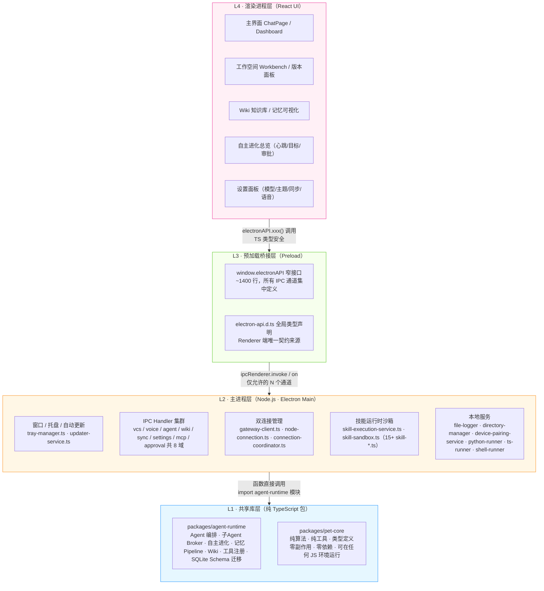
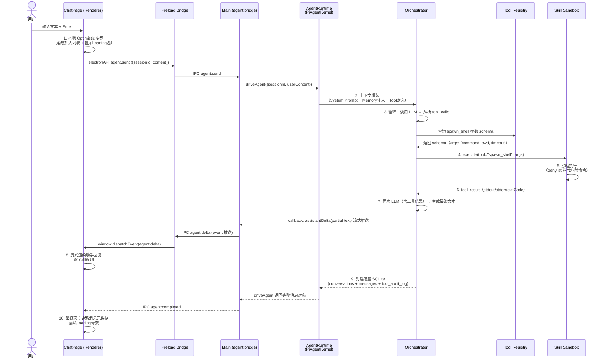
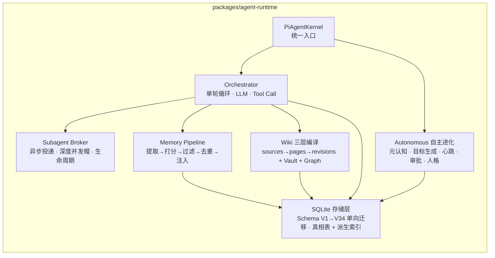

# 01. 整体架构设计

> 文档版本: 1.0 · 基于 Lumii 实际代码结构整理
> 适用读者: 架构师、资深开发者、需要理解系统全貌的团队成员

---

## 1. 架构定位与设计原则

### 1.1 架构定位

Lumii 是一款**本地优先（Local-First）的 AI 桌面伙伴应用**，架构围绕四个核心目标展开：

| 目标 | 架构要求 |
|------|---------|
| **隐私优先** | 所有核心数据（人格、记忆、对话、工作空间）默认存储在本地 `~/.lumii/`，不上传云端；云同步功能为可选且用户可控 |
| **Electron 安全隔离** | 严格的三层进程边界，渲染进程永不直接访问 Node API，所有系统能力通过 IPC 窄接口暴露 |
| **AI 可进化** | Agent Runtime 与 UI 解耦，支持自主进化模块（元认知、心跳、人格）独立迭代而不破坏现有对话体验 |
| **跨设备可移植** | Monorepo 分层（`packages/*` 纯逻辑 vs `apps/windows` 专属 Electron），为未来 macOS / Linux / 移动端复用核心保留空间 |

### 1.2 六大架构设计原则

| 原则 | 在本项目中的落地 |
|------|----------------|
| **单一职责** | `packages/pet-core` 只放纯 TS 数学/工具函数，零 UI、零 Electron、零 IO 副作用 |
| **明确边界** | 跨层调用必须走 IPC：Renderer ↔ Preload ↔ Main ↔ AgentRuntime，禁止 Renderer 直接 import Main 文件 |
| **安全隔离** | Preload 只暴露 `window.electronAPI` 的 N 个窄方法；绝不暴露完整 `ipcRenderer`；Main Handler 入参做 typeof/zod 校验 |
| **本地优先** | SQLite（agent-runtime.db）+ Markdown（soul.md / user-memory.md）是唯一真相；Git 同步为附加层而非存储层 |
| **可演进派生** | 真相表（`agent_memories` / `wiki_sources`）结构稳定；FTS5 / 向量 / 知识图谱全部作为派生索引，可整表删除重建 |
| **纯函数优先** | 打分、温度计算、Elo Rating 更新、记忆排序等核心算法写成纯函数，`now` / `random` 显式注入，保证单元测试不随墙钟漂移 |

---

## 2. 四层系统分层架构



### 2.1 各层职责矩阵

| 层 | 技术环境 | 职责 | 关键约束 | 代码位置 |
|----|---------|------|---------|---------|
| **L4 渲染进程** | Chromium + React 18 + Vite HMR | UI 渲染、状态管理、用户交互、CSS 主题、路由跳转 | **禁止**直接使用 Node / fs / SQLite / child_process；所有系统能力走 `window.electronAPI` | `apps/windows/src/renderer/` |
| **L3 预加载** | Electron Preload（沙箱内） | 安全桥接 Main 与 Renderer；集中定义 IPC 通道与类型签名 | **永不**暴露 `ipcRenderer` 或完整 `remote`；遵循"最小暴露原则" | `apps/windows/src/preload/index.ts` + `electron-api.d.ts` |
| **L2 主进程** | Node.js 18+（Electron 内置） | 窗口/托盘管理、文件系统、子进程、WebSocket 双连接、IPC Handler 分发、技能沙箱 | **禁止**直接操作 React 状态；UI 变更一律发 IPC 事件给 Renderer | `apps/windows/src/main/` |
| **L1 共享库** | 纯 TypeScript · tsconfig strict | Agent 内核逻辑、编排算法、数据库 Schema、Wiki 编译流水线、纯工具 | `packages/pet-core` **不得**依赖 React/Electron/Pixi/DOM；`packages/agent-runtime` **不得**依赖 UI 组件 | `packages/agent-runtime/src/` · `packages/pet-core/src/` |

---

## 3. 核心数据流向（完整时序）

以"用户发送一条消息 → Agent 调用 Shell 工具 → 结果返回并渲染"为例：



### 3.1 数据流关键设计点

1. **Optimistic UI**：用户发送后立即在前端插入本地消息，不等 IPC 返回，保证"0 延迟感"
2. **流式推送**：LLM 输出通过 `agent:delta` 事件逐块推送，不是等完整回答；对大回复用户感知显著
3. **审计可追溯**：所有工具调用同时写入 `tool_audit_log` 表，执行命令、参数、耗时、退出码、stdout 截断留痕
4. **沙箱护栏**：`spawn_shell` 等能力工具走 denylist（`rm -rf /`、格式化盘符等关键词直接拒绝），高风险命令进入 `ExecDenylistManager` 审批队列

---

## 4. Agent Runtime 子架构

Agent Runtime 是 L1 共享库层的核心，它自己又分为 7 大子模块：



| 子模块 | 关键输出 | 典型文件位置 |
|--------|---------|-------------|
| **Kernel** | `driveAgent()` / `driveAutonomousTick()` 两大入口 | `agent-runtime/src/agent/kernel.ts` |
| **Orchestrator** | 单轮对话 12 步循环；tool_call/tool_result 对；子 Agent 挂载；Commit Fence 永不中断 | `agent/orchestrator.ts` · `agent/subagent-broker.ts` · `agent/subagent-summary.ts` |
| **Subagent** | 六状态生命周期：PENDING→RUNNING→SUCCEEDED/FAILED/TIMEOUT/CANCELLED；异步事件回调；深度=1 并发帽 3~5 | `tools/built-in/spawn-agent-tool.ts` |
| **Autonomous** | 心跳 tick（默认 10min）；GPA 目标生成；Elo Rating 8 维度；Big Five 人格 EMA；离线审批 L0 自动/L1 用户/L2 超时归档 | `autonomous/` 目录（goal-*、capability-*、approval-*、personality-*、evolution-tick.ts） |
| **Memory** | 提取（Extract）→加权打分（4 维权重 0.35/0.30/0.20/0.15）→温度衰减→语义去重→预算注入 | `memory/` 目录 + `prompt/sections/memory-section.ts` |
| **Wiki** | Vault 智能分类；Topic 目录树；反向链接；Graph PageRank；Synthesis 批量摘要；向量召回 | `wiki/` 目录（repo.ts · vault.ts · taxonomy.ts · graph.ts · synthesis.ts · vector.ts） |
| **Storage** | `LocalDatabase.migrate()` 单向版本递增；Schema Registry；真相表 DDL 锁；CHECK 约束不支持 ALTER 的整表重建流程 | `storage/schema.ts` · `storage/migrations/` |

---

## 5. 存储架构

### 5.1 真相表 vs 派生索引

这是本项目最核心的存储铁律：

```mermaid
flowchart TB
    subgraph TRUTH["真相表（Truth Tables）—— 结构绝对稳定"]
        T1["agent_memories（5 类语义记忆）"]
        T2["wiki_sources（原始 Markdown）"]
        T3["conversations + messages"]
        T4["soul.md · user-memory.md（人可读 Markdown 文件）"]
        T5["autonomous_goals · reflections · capability_*"]
    end

    subgraph DERIVED["派生索引（Derived Indexes）—— 可删除 + 整表重建"]
        D1["FTS5 全文检索（TRIGGER 自动同步）"]
        D2["向量索引 BLOB（嵌入模型可换）"]
        D3["知识图谱邻接表（wiki_edges）"]
        D4["统计视图 + 健康表（ipc_aggregate / performance_health）"]
        D5["Wiki 编译产物（pages / revisions）"]
    end

    TRUTH -- "派生计算 →" --> DERIVED
    DERIVED -- "损坏/升级时" --> |"DROP + 全量重建"| DERIVED

    style TRUTH fill:#fff1f0,stroke:#cf1322
    style DERIVED fill:#f6ffed,stroke:#389e0d
```

| 类型 | 修改约束 | 迁移策略 |
|------|---------|---------|
| **真相表** | ⚠️ 严禁删除字段、严禁改列类型；**只允许新增可空列** | 通过 `LocalDatabase.migrate()` 单向升级 V1→V34 |
| **派生索引** | ✅ 随时删改 | 写 `rebuildXxxIndex()` 函数，删掉整表再跑一遍 |

### 5.2 ~/.lumii/ 数据目录总览

```
~/.lumii/
├── data/                      # 核心真相（可纳入 sync）
│   ├── agent-runtime.db       # SQLite 主库（9.7MB 级别）
│   ├── soul.md                # Agent 人格 Markdown
│   └── user-memory.md         # 用户稳定记忆（跨 Agent 共享）
├── config/                    # 配置（provider.json 属设备级，不同步；agents.json 可同步）
├── workspace/                 # 工作空间（.mtbot-vcs/ 是 Git 历史，体积可超 600MB）
├── sync/                      # 同步导出目录（推送前从 DB/文件导出 → Git 推送）
│   ├── profile/               #   soul.md + user-memory.md
│   ├── wiki/                  #   SQL Dump.gz 或 JSONL
│   ├── memory/                #   memories.jsonl
│   └── autonomous/            #   goals + reflections + ratings
├── models/ · runtimes/        # 本地嵌入模型 / Python / Node Runtime（设备级，不同步）
├── logs/ · cache/ · temp/     # 日志 · 缓存 · 临时（永不同步）
└── usage/ · dashboard-feed/   # 用量统计 · 信息流（通常不同步）
```

---

## 6. 安全架构

### 6.1 多层安全护栏

```
用户操作
  ↓
[L4 Renderer]  —— 输入校验 + UI 层防注入（HTML 转义 / XSS CSP）
  ↓ Preload 窄接口（只暴露 electronAPI，绝无 ipcRenderer.send）
[L3 Preload]   —— 参数 shape 粗校验 + 通道白名单
  ↓ IPC domain:action
[L2 Main Handler] —— zod/typeof 细校验 + 权限表（谁能调用 spawn_shell？）
  ↓ 能力分级
[Skill Sandbox]    —— shell 命令 denylist · 超时 kill · cwd 限制
[Approval Queue]   —— L2 外部副作用类目标走审批（user-visible / side-effect）
  ↓
文件系统 / 子进程 / 网络
```

### 6.2 三条安全红线

1. **Preload 红线**：`preload/index.ts` 绝不写 `ipcRenderer.on ANY_CHANNEL_WILDCARD`；绝不 `return ipcRenderer` 给 window
2. **Main Handler 红线**：每个 Handler 首行做 `typeof args.command === 'string' && args.command.length < 2048`；外部输入绝不直接拼接进 shell 命令
3. **AI 执行红线**：自主进化 Agent 的心跳 tick 只允许用**工具白名单 6~12 项**（读文件/总结/记日记等内部动作）；写文件、发消息、跑命令等外部动作必须进审批队列

---

## 7. 架构演进方向（Phase 1~4）

| 阶段 | 范围 | 关键架构变更 |
|------|------|-------------|
| **Phase 1（当前）** | 单设备稳定运行 | 四层分层 + IPC 三处同步 + 真相/派生铁律 |
| **Phase 2** | 多设备 Git 同步 | 导出/导入流水线 + 冲突合并策略 + 乐观锁；永不 force push |
| **Phase 3** | 自主进化 P2~P4 | 多层进化协同（记忆 Learning-to-Rank / 技能 Thompson Sampling / Shapley 归因） |
| **Phase 4+** | 长期可移植 | 事件溯源 Event Sourcing 替代 JSONL 快照；核心 agent-runtime 为多端预留运行时适配层 |

---

## 8. 交叉参考

- **项目结构细节**：[02-项目结构与模块划分.md](./02-项目结构与模块划分.md)
- **双连接详解**：[04-双连接架构说明.md](./04-双连接架构说明.md)
- **协作规范总纲**：[`../../../AGENTS.md`](../../../AGENTS.md)
- **功能开发标准（IPC 三处同步）**：[`../09-standards/05-功能开发标准.md`](../09-standards/05-功能开发标准.md)
