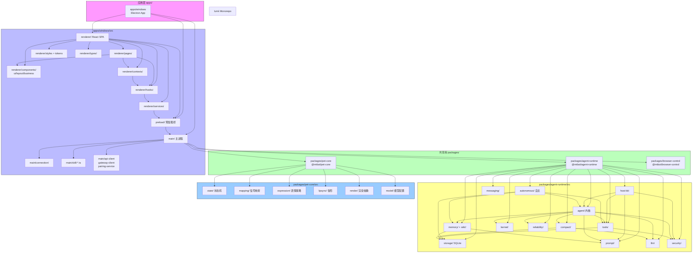

# 项目结构与模块划分

## 根目录结构

Lumii 是基于 pnpm Workspace 的 Monorepo 工程，根目录按「应用 / 共享包 / 文档 / 脚本」划分。

```
lumii/
├── apps/                          # 应用层（可独立构建运行）
│   └── windows/                   #   Windows 桌面端 Electron 应用
│
├── packages/                      # 共享库层（被 apps 引用，纯 TS）
│   ├── agent-runtime/             #   Agent 运行时核心
│   ├── pet-core/                  #   桌宠共享逻辑（状态机/映射/策略）
│   └── browser-control/           #   浏览器自动化控制包
│
├── docs/                          # 文档根目录
│   ├── standards/                 #   开发规范（结构、风格、功能、架构）
│   ├── guide/                     #   用户指南（内置使用说明）
│   ├── plans/                     #   实施计划/方案
│   └── wiki/                      #   知识库（本系列文档所在目录）
│
├── scripts/                       # 根级构建/运维脚本（PowerShell）
│   ├── start-dev.ps1              #   一键拉起开发环境
│   ├── stop-dev.ps1               #   停止开发进程
│   └── package-win.ps1            #   打包 Windows 安装包
│
├── patches/                       # pnpm patch 第三方依赖补丁
│
├── pnpm-workspace.yaml            # Workspace 声明
├── pnpm.overrides                 # 版本统一覆盖
├── package.json                   # 根 package 元数据与聚合命令
└── AGENTS.md                      # 贡献者/自动化代理总纲
```

**常用根级命令**（在 `package.json` 中定义）：

| 命令 | 说明 |
|------|------|
| `pnpm install` | 安装依赖并自动重建原生模块（better-sqlite3、sharp） |
| `pnpm dev` | 启动 Windows Electron 开发模式（热重载） |
| `pnpm typecheck` | 对全 workspace 执行 `tsc --noEmit` |
| `pnpm build` | 构建 Windows 应用生产产物 |
| `pnpm dist` / `pnpm package:win` | 调用脚本完成完整 Windows 打包 |
| `pnpm verify` | 类型检查 + Windows 全量测试 |

---

## apps/windows/src/ 完整目录结构

Windows 应用的源代码按 Electron 三层进程严格划分：`main/`（主进程）、`preload/`（预加载桥）、`renderer/`（渲染进程 React）。

```
apps/windows/src/
├── main/                          # 主进程 (Node.js 全权限)
│   ├── index.ts                   #   入口 (~2900 行) 窗口+IPC+生命周期
│   ├── gateway-client.ts          #   Gateway WS 客户端（UI 会话，role=user）
│   ├── node-connection.ts         #   Node 模式 WS 连接（命令执行）
│   ├── node-mode-coordinator.ts   #   Node 生命周期 + 启停协调
│   ├── api-client.ts              #   Gateway HTTP REST 封装
│   ├── device-pairing-service.ts  #   设备配对 + 双 Token 管理
│   ├── tray-manager.ts            #   系统托盘图标/菜单
│   ├── updater-service.ts         #   electron-updater 自动更新
│   ├── directory-manager.ts       #   工作区/数据目录服务
│   ├── exec-approvals-manager.ts  #   执行审批队列与白名单
│   ├── file-logger.ts             #   滚动文件日志
│   ├── logger.ts                  #   主进程日志门面
│   ├── python-runner.ts           #   Python 子进程执行器
│   ├── shell-runner.ts            #   Shell（PS/Cmd/Bash）执行器
│   ├── ts-runner.ts               #   即时 TS 编译运行
│   ├── security-utils.ts          #   加密/哈希/校验工具
│   ├── system-service.ts          #   CPU/内存/磁盘等系统信息
│   ├── skill-execution-service.ts #   技能执行编排
│   ├── skill-runtime.ts           #   技能沙箱运行时
│   ├── skill-sandbox.ts           #   技能权限沙箱
│   ├── skill-*.ts                 #   其他 skill 模块（共 15+ 文件）
│   │
│   ├── connection/                #   连接管理子模块
│   │   ├── connection-coordinator.ts  # UI + Node 双连接总协调
│   │   ├── ui-connection-manager.ts   # UI 连接健康/重连
│   │   ├── node-connection-manager.ts # Node 连接健康/重连
│   │   └── README.md
│   │
│   ├── stubs/                     #   主进程模块存根（测试/降级）
│   │
│   └── types/                     #   主进程内部类型
│       └── skill-metadata.ts      #     技能元数据类型
│
├── preload/                       # 预加载桥接层
│   └── index.ts                   #   唯一入口 (~1400 行)
│                                    #   contextBridge + 全部 IPC 定义
│
└── renderer/                      # 渲染进程 (React SPA)
    ├── main.tsx                   #   ReactDOM.createRoot 入口
    ├── App.tsx                    #   根组件（Provider + 路由挂载点）
    │
    ├── components/                #   React 组件
    │   ├── ui/                    #     基础 UI 原子组件
    │   ├── layout/                #     布局容器组件
    │   ├── business/              #     业务域复合组件
    │   ├── Router.tsx             #     前端路由（页面切换）
    │   ├── GlobalModals.tsx       #     全局模态框统一入口
    │   ├── DeviceBindWizard.tsx   #     新设备绑定向导
    │   └── WorkspaceWizard.tsx    #     首次工作空间向导
    │
    ├── pages/                     #   路由页面（每目录一个页面）
    │   └── index.ts               #     统一 barrel 导出
    │
    ├── contexts/                  #   React Context（全局状态）
    │   └── AppProviders.tsx       #     所有 Provider 组合器
    │
    ├── hooks/                     #   自定义 Hooks
    │   ├── common/                #     通用 Hooks（8+）
    │   └── business/              #     业务 Hooks（22+）
    │
    ├── services/                  #   API 服务层（对 electronAPI 的封装）
    │   └── __tests__/             #     服务层单元测试
    │
    ├── styles/                    #   样式系统
    │   ├── global.css             #     全局样式（重置/布局/滚动条）
    │   ├── tokens.css             #     CSS 变量注入（颜色/间距...）
    │   └── tokens/                #     TS 设计令牌（代码层使用）
    │       ├── colors.ts
    │       ├── spacing.ts
    │       ├── typography.ts
    │       ├── shadows.ts
    │       ├── radius.ts
    │       ├── transitions.ts
    │       ├── z-index.ts
    │       └── breakpoints.ts
    │
    ├── test/                      #   渲染进程测试目录
    │   ├── setup.ts               #     Vitest 全局 setup
    │   ├── __tests__/             #     页面级测试（CreditsPage、SubscriptionPage 等）
    │   ├── components/
    │   ├── hooks/
    │   └── services/
    │
    └── types/                     #   渲染进程全局类型
        ├── user.ts
        ├── skill.ts
        ├── file.ts
        ├── system.ts
        ├── gateway.ts
        └── chat.ts
```

### 主进程关键入口：main/index.ts

该文件约 2900 行，是主进程的「大脑」，主要职责顺序：

1. **app 生命周期事件**：`ready` / `window-all-closed` / `activate` / `before-quit`
2. **安全设置**：`webPreferences`（contextIsolation、nodeIntegration:false、sandbox 等）
3. **核心服务初始化**：DevicePairingService → GatewayClient → NodeModeCoordinator → TrayManager → UpdaterService
4. **IPC 注册**：所有 `ipcMain.handle(...)` 与 `ipcMain.on(...)` 集中注册
5. **自动连接流程**：读取持久化设置 → 注入 UI Token → 建立 Gateway 连接 → 按需启动 Node 模式

---

## renderer/components/ 组件划分

组件按「基础 → 布局 → 业务」三层组织，依赖方向单向，避免循环。

### ui/ — 基础 UI 原子组件（22+）

定位：**纯展示、无业务依赖、可跨项目复用**。只依赖 React、设计令牌、lucide-react 图标。

| 组件目录 | 用途 |
|----------|------|
| Avatar/ | 用户/Agent 头像（支持首字母、图片） |
| Badge/ | 状态徽标（成功/警告/错误/信息） |
| Button/ | 按钮（主/次/文本/危险 变体 + 尺寸 + 加载态） |
| Card/ | 卡片容器（标题/操作区/内容区） |
| Checkbox/ | 复选框 + 复选框组 |
| Divider/ | 水平/垂直分割线 |
| Empty/ | 空数据占位（含图标与文案） |
| ErrorBanner/ | 错误提示条（错误码 + 重试/关闭按钮） |
| Input/ | 文本输入框（前缀/后缀/验证态） |
| Loading/ | 加载指示（Spinner/Skeleton/骨架屏） |
| Modal/ | 模态对话框（Header/Body/Footer） |
| PageHeader/ | 页面顶部标题栏（返回+操作区） |
| Radio/ | 单选按钮组 |
| Responsive/ | 响应式断点容器 |
| Select/ | 下拉选择（单选/多选/搜索） |
| Skeleton/ | 数据加载骨架屏 |
| Switch/ | 开关按钮 |
| Table/ | 数据表（分页/排序/空态/加载态） |
| Tag/ | 标签（可关闭/颜色变体） |
| Toast/ | 消息提示（成功/警告/错误/信息） |
| Tooltip/ | 文字气泡提示 |
| ...其他 | （如 Progress、Tabs、Collapse 等） |

**规范要点**：每个组件目录内含 `ComponentName.tsx`、`ComponentName.module.css`、`index.ts`。

### layout/ — 布局容器组件

定位：**决定页面骨架结构**，组合 ui 组件，不涉及具体业务逻辑。

| 组件目录 | 职责 |
|----------|------|
| MainLayout/ | 主工作区布局：顶部 TitleBar + 左侧 Sidebar + 内容区 + 可选右侧抽屉 |
| Sidebar/ | 左侧导航：Logo + 会话列表 + 功能菜单 + 新建/设置按钮 |
| TitleBar/ | 自定义标题栏：拖拽区 + 快捷工具栏 + 最小化/最大化/关闭按钮 |

### business/ — 业务域复合组件（12+）

定位：**组装 ui + 调用业务 Hooks**，承载特定业务域的交互与展示。

| 组件目录 | 业务域 | 主要能力 |
|----------|--------|----------|
| ApprovalSettings/ | 执行审批 | 审批开关、白名单、全局策略配置 |
| ConnectionStatus/ | 连接管理 | Gateway 当前状态、延迟、断开重连按钮 |
| CreditsView/ | 积分/用量 | API 调用量、积分余额、花费明细卡片 |
| DeviceCard/ | 设备管理 | 单设备信息卡片（状态/配对时间/操作） |
| DualConnectionStatus/ | 双连接架构 | UI + Node 两路连接并排展示 + 健康指示 |
| ExecDenylistManager/ | 执行黑名单 | 命令模式黑名单增删查 |
| SkillCard/ | 技能管理 | 单技能展示（描述/工具列表/启用开关） |
| SkillStoreView/ | 技能商店 | 搜索/筛选/安装/导入技能 |
| SubscriptionView/ | 订阅管理 | 套餐信息、到期时间、续费按钮 |
| SystemStatus/ | 系统监控 | CPU/内存/磁盘/网络占用实时展示 |
| UpdaterView/ | 自动更新 | 版本检测、下载进度、重启更新 |
| index.ts | Barrel 导出 | 所有业务组件统一从此导出 |

---

## packages/agent-runtime/ 模块划分

Agent Runtime 是客户端智能体核心，包内按「子系统 = 子目录」原则组织，模块间通过消息总线与接口解耦。

```
packages/agent-runtime/src/
├── index.ts                    # 包公共 API 统一导出
├── browser.ts                  # 浏览器环境兼容入口
│
├── agent/                      # Agent 内核子系统
│   ├── agent-instance.ts       #   单 Agent 实例与 turn 循环
│   ├── orchestrator.ts         #   回合编排、hook 执行、状态机
│   ├── definition-store.ts     #   Agent 定义持久化（团队/角色）
│   ├── subagent-broker.ts      #   spawn-agent 子代理分治与汇总
│   ├── subagent-summary.ts     #   子代理摘要合并策略
│   ├── token-budget.ts         #   按回合/会话的 Token 预算控制
│   ├── message-pruner.ts       #   消息列表智能裁剪
│   ├── verdict-parser.ts       #   模型 verdict 结构化解析
│   ├── stuck-detection.ts      #   重复/空转/死循环检测
│   ├── verification-nudge.ts   #   结果验证提示注入
│   ├── verification-tracker.ts #   验证门状态追踪
│   ├── proactivity-scheduler.ts#   主动行为调度（插话/提醒）
│   ├── hook-executor.ts        #   turn 前后钩子统一执行
│   ├── agent-registry.ts       #   已注册 Agent 索引
│   ├── api-agent-mapper.ts     #   API ↔ 内部模型互转
│   ├── builtin/                #   内置 Agent 定义与提示词
│   └── hooks/                  #   内置 hook（verification-gate 等）
│
├── autonomous/                 # 自主进化子系统
│   ├── autonomous-coordinator.ts  # 总协调器（主循环 tick）
│   ├── intrinsic-goal-generator.ts# 内在目标生成
│   ├── planner.ts / planner-landing.ts # 目标拆解为可执行步骤
│   ├── goal-executor.ts        #   单个目标执行 + 风险分类
│   ├── coordinated-scheduler.ts#   多目标冲突避免调度
│   ├── conflict-detector.ts    #   目标/动作冲突检测
│   ├── reflection-engine.ts    #   执行后反思（成败归因）
│   ├── meta-cognition-engine.ts#   元认知（对自身决策的反思）
│   ├── memory-evolution.ts     #   记忆结构演化建议
│   ├── skill-evolution.ts      #   技能使用策略优化
│   ├── tool-evolution.ts       #   工具选择偏好演化（Thompson）
│   ├── capability-rating-system.ts # 能力自评分级
│   ├── capability-tracker.ts   #   能力使用记录追踪
│   ├── memory-ranking-model.ts #   记忆重要性排序模型
│   ├── personality-tracker.ts  #   人格维度状态追踪
│   ├── mood.ts                 #   情绪模型（ valence / arousal ）
│   ├── concerns.ts             #   用户未决关注点队列
│   ├── diary.ts                #   自主写日记（总结今日）
│   ├── settings.ts / config.ts #   自主系统参数配置
│   ├── tick-signals.ts         #   tick 事件合成（空闲/忙碌/早晨）
│   ├── prompt-evolution.ts     #   SOUL/系统提示词演化
│   ├── token-budget.ts         #   自主行为 token 预算
│   ├── outreach-budget.ts      #   主动联系用户频率预算
│   ├── pareto-frontier.ts      #   目标 Pareto 最优权衡
│   ├── shapley-attribution.ts  #   工具贡献度归因
│   ├── tool-thompson-sampling.ts # 工具多臂老虎机
│   ├── approval-queue.ts       #   审批请求队列
│   ├── approval-delivery.ts    #   审批消息推送到用户 UI
│   ├── approval-reply-parser.ts#   审批回复解析
│   ├── approval-timeout-scanner.ts # 审批超时扫描器
│   ├── auto-approval-policy.ts #   自动审批白名单策略
│   ├── approval-db-adapter.ts  #   审批记录仓储
│   ├── db-adapter.ts           #   自主状态仓储
│   ├── metrics-collector.ts    #   指标收集
│   └── logger.ts               #   自主系统独立 logger
│
├── memory/                     # 记忆子系统
│   ├── manager.ts              #   记忆管理统一入口
│   ├── segmentation.ts         #   长消息 → 语义分段
│   ├── segment-memory-pipeline.ts # 分段 → 记忆管道
│   ├── memory-extractor.ts     #   从对话中抽取事实性记忆
│   ├── memory-consolidation.ts #   短期→长期记忆巩固
│   ├── memory-index.ts         #   倒排/向量/关键字索引
│   ├── memory-injector.ts      #   召回后注入上下文
│   ├── memory-repo.ts          #   仓储接口
│   ├── segment-tracker.ts      #   分段生命周期追踪
│   ├── scorer.ts               #   记忆相关性评分
│   ├── temperature.ts          #   温度采样（新颖性扰动）
│   ├── summarization-queue.ts  #   记忆摘要生成队列
│   ├── merge.ts                #   冗余记忆合并去重
│   ├── content-address.ts      #   内容哈希寻址
│   ├── memory-architecture.ts  #   架构文档与接口定义
│   └── types.ts
│
├── wiki/                       # Wiki 知识库子系统
│   ├── wiki-index.ts           #   总入口 + Facade
│   ├── wiki-classifier.ts      #   文档自动分类（LLM 标注）
│   ├── wiki-topic-tree.ts      #   主题层级树构建
│   ├── wiki-vector.ts          #   向量嵌入 + 语义检索
│   ├── wiki-content-extractor.ts # 非结构化文件 → 纯文本
│   ├── wiki-ero.ts             #   摘录-重排-概述流水线
│   ├── wiki-summary.ts         #   文档自动摘要
│   ├── wiki-cleanup.ts         #   废弃内容清理
│   ├── wiki-forgetting.ts      #   长期冷门内容降权/遗忘
│   ├── wiki-link-parser.ts     #   维基链接语法解析
│   ├── wiki-link-resolver.ts   #   链接目标解析
│   ├── wiki-ref-store.ts       #   参考来源存储
│   ├── wiki-source-identity.ts #   文档来源身份追踪
│   ├── wiki-source-exists.ts   #   源文件存在性校验
│   ├── wiki-broken-source-purge.ts # 断链条目清理
│   ├── wiki-invalid-file-purge.ts  # 无效文件清理
│   ├── wiki-ingest-filter.ts   #   摄取前过滤（重复/黑名单）
│   ├── wiki-ingest-hook.ts     #   摄取事件钩子
│   ├── wiki-organizer.ts       #   整理归档调度
│   ├── wiki-organize-queue.ts  #   整理任务队列
│   ├── wiki-reclassifier.ts    #   批量重分类
│   ├── wiki-catalog-prompt.ts  #   分类 LLM 提示词模板
│   ├── wiki-taxonomy-prompt.ts #   分类学提示词
│   ├── wiki-ero-extractor.ts   #   ERO 摘录提取器
│   ├── wiki-nav-map.ts         #   文档导航视图
│   ├── wiki-topic-mutate.ts    #   主题节点增删改
│   ├── wiki-title-score.ts     #   标题质量评分
│   ├── wiki-folder-importer.ts #   本地文件夹批量导入
│   ├── wiki-library-inventory.ts # 知识库清单清点
│   ├── wiki-library-migrate.ts #   旧版结构迁移
│   ├── wiki-migrate-types.ts   #   迁移类型定义
│   ├── wiki-migrate-inventory.ts # 迁移清单
│   ├── wiki-migrate-prompt.ts  #   迁移提示词
│   ├── wiki-vault-layout.ts    #   Vault 目录布局规范
│   ├── wiki-vault-sync.ts      #   Obsidian Vault 双向同步
│   ├── wiki-clip-saver.ts      #   摘录片段保存
│   ├── wiki-attachments.ts     #   附件处理
│   ├── wiki-exporter.ts        #   导出 Markdown/HTML 包
│   ├── line-diff.ts            #   行级 diff（知识库变更追踪）
│   ├── wiki-graph-types.ts     #   图谱 TS 类型
│   └── types.ts
│
├── tools/                      # 工具子系统
│   ├── tool-runner.ts          #   工具执行总入口
│   ├── tool-registry.ts        #   工具注册表（内置 + MCP + 技能）
│   ├── tool-adapter.ts         #   适配器：异构工具 → 统一接口
│   ├── tool-hooks.ts           #   工具执行钩子机制
│   ├── tool-result-storage.ts  #   工具结果持久化
│   ├── resolve-file-path.ts    #   虚拟路径 → 真实路径
│   ├── file-state-cache.ts     #   文件读写缓存
│   ├── file-hash.ts            #   文件内容哈希
│   ├── telemetry.ts            #   遥测埋点
│   ├── hooks/                  #   内置钩子：缓存/日志/读写前置/持久化
│   ├── built-in/               #   40+ 内置工具（见下一小节）
│   └── mcp/                    #   MCP 客户端 + 代理工具
│
├── storage/                    # 存储子系统（SQLite）
│   ├── local-database.ts       #   DB 连接 + 事务帮助器
│   ├── schema.ts               #   Schema 版本化 + 迁移
│   ├── conversation-repo.ts    #   会话 + 消息仓储
│   ├── segment-repo.ts         #   记忆分段仓储
│   ├── task-repo.ts            #   任务（看板）仓储
│   ├── autonomous-repo.ts      #   自主状态仓储
│   ├── audit-repo.ts           #   审计日志仓储
│   ├── file-repo.ts            #   文件元数据仓储
│   ├── runtime-state-repo.ts   #   运行时状态（KV）仓储
│   ├── session-config.ts       #   会话级配置持久化
│   ├── storage-stats.ts        #   存储大小/使用率统计
│   ├── backup.ts               #   自动备份/恢复
│   ├── message-content-json.ts #   消息 JSON 序列化帮助器
│   ├── assistant-parts.ts      #   assistant 消息多部分解析
│   ├── schema-wiki.test.ts     #   Wiki 表结构迁移测试
│   ├── schema-diary.test.ts    #   日记表结构迁移测试
│   ├── schema-autonomous-*.ts  #   自主系统各版 schema
│   └── node-sqlite.d.ts        #   better-sqlite3 类型补丁
│
├── compact/                    # 上下文压缩子系统
│   ├── policy.ts               #   压缩触发策略（阈值/冷却/保护）
│   ├── session-index.ts        #   会话窗口索引
│   ├── partition.ts            #   语义/时间分区切分
│   ├── message-ops.ts          #   消息增删改原子操作
│   ├── token-estimate.ts       #   Token 数估算
│   ├── summary-prompt.ts       #   摘要 LLM 提示词
│   ├── summary-message.ts      #   摘要消息构造
│   ├── post-compact.ts         #   压缩后整理
│   ├── progress-fence.ts       #   压缩进度围栏（防重复）
│   ├── idle-trigger.ts         #   空闲时触发压缩
│   ├── transform-context.ts    #   压缩前后上下文转换
│   ├── strategies/             #   压缩策略：微压缩/摘要压缩/硬裁剪
│   └── types.ts
│
├── prompt/                     # 提示词构建子系统
│   ├── system-prompt-builder.ts#   装配器：SOUL + Guides + Sections
│   ├── default-soul.ts         #   默认 AI 灵魂/人格模板
│   ├── system-prompt.types.ts  #   Prompt AST 类型
│   ├── guides/                 #   三类指南：memory/task/a2ui
│   └── sections/               #   运行时注入 section：工具/技能/协作/知识库
│
├── kernel/                     # 内核抽象层
│   ├── types.ts                #   统一 Agent Turn 类型
│   ├── agent-turn-types.ts     #   pi-agent-core ↔ 内部类型转换
│   ├── pi-agent-kernel-adapter.ts # 对接 MarioZe 核心
│   ├── create-pi-agent.ts      #   Agent 工厂
│   └── fake-agent-kernel.ts    #   测试桩内核（不调用 LLM）
│
├── llm/                        # LLM 调用层
│   ├── direct-stream.ts        #   流式调用封装
│   ├── model-router.ts         #   多模型路由 + 故障转移
│   ├── llm-error.ts            #   错误分类 + 重试策略
│   └── prompt-capture.ts       #   提示词抓包（调试用）
│
├── security/                   # 权限与安全子系统
│   ├── permission-checker.ts   #   执行前权限检查
│   ├── permission-context.ts   #   权限上下文（用户/会话）
│   ├── permission-memory.ts    #   历史授权记忆
│   ├── param-permission-parser.ts # 工具参数级权限解析
│   ├── tool-sandbox.ts         #   工具沙箱执行器
│   └── index.ts
│
├── host-kit/                   # 宿主装配工具包
│   ├── assemble-agent.ts       #   一行完成 Agent 装配（给 apps/* 调用）
│   ├── prompt-assembly.ts      #   系统提示词装配策略
│   ├── tool-assembly.ts        #   工具注册批量装配
│   ├── stream-fn-factory.ts    #   流式回调工厂
│   ├── permission-gate-hook.ts #   权限门 Turn Hook
│   └── types.ts
│
├── messaging/                  # 消息总线
│   ├── message-bus.ts          #   发布订阅实现
│   ├── message-types.ts        #   所有 Topic + Payload 类型
│   └── topics.md               #   Topic 命名与语义文档
│
├── reliability/                # 可靠性子系统
│   ├── stuck-guard.ts          #   卡住看门狗（超时/重复）
│   ├── self-heal.ts            #   自愈流水线（重试 + 降级）
│   └── message-repair.ts       #   模型输出格式修复
│
├── shell/                      # Shell 执行适配
│   ├── resolve-shell.ts        #   自动探测可用 shell
│   ├── shell-provider.ts       #   Shell Provider 接口
│   ├── powershell-provider.ts  #   PowerShell（Windows 默认）
│   ├── cmd-provider.ts         #   Cmd.exe 回退
│   ├── bash-provider.ts        #   WSL / Git Bash
│   └── windows-paths.ts        #   Windows 路径规范化
│
├── skill/                      # 技能激活层
│   ├── activation-resolver.ts  #   技能 → 工具/能力解析
│   └── index.ts
│
├── config/                     # 配置层
│   ├── runtime-config.ts       #   运行时可配置项
│   ├── feature-flags.ts        #   功能开关
│   ├── storage.ts              #   存储配置
│   └── index.ts
│
├── context/                    # 上下文整合层
│   └── memory-integration.ts   #   记忆召回 + prompt 注入整合
│
├── types/                      # 顶层公共类型
│   ├── agent-definition.ts     #   Agent/团队/角色定义
│   ├── tool.ts                 #   工具元类型
│   ├── events.ts               #   领域事件类型
│   └── index.ts
│
└── __tests__/                  # 包级集成测试（50+ 文件）
    └── helpers/
        └── sqlite-test-db.ts   #   测试 SQLite 内存库帮助器
```

### tools/built-in/ 40+ 内置工具速览

| 工具类 | 代表工具 | 说明 |
|--------|----------|------|
| 文件操作 | file-read / file-write / file-edit / file-copy / file-move / file-mkdir / list-dir / glob / grep | 安全沙箱化的本地文件读写 |
| Shell 与子进程 | bash-tool / spawn-agent-tool | 命令执行、spawn 子 Agent |
| 搜索与网络 | web-search-tool / web-fetch-tool / bing-search-tool | 联网搜索与网页抓取 |
| 技能 | execute-skill-tool / skill-tools | 技能加载、查询、调用 |
| 多智能体 | agent-management-tools | Agent 生命周期管理 |
| 任务看板 | task-tools / task-complete-tool | 任务增改查、状态流转 |
| 对话渠道 | channel-tools / send-message-tool | 微信/飞书等渠道消息发送 |
| 计划与调度 | cron-tools | 定时任务增删 |
| 媒体生成 | image-generate-tool | 文生图 / 图生图 |
| 仪表盘 | dashboard-feed-tool | Dashboard 资讯流 |
| 用户交互 | ask-user-question-tool / client-command-tools | 弹窗询问、控制客户端 UI |
| Wiki | wiki-tools | 知识库读写、分类、搜索 |
| 集成工具 | integration-tools | 常用复合工作流 |

---

## 模块间依赖关系图（Mermaid）



**依赖方向黄金规则**：
- ✅ apps → packages（应用引用共享库）
- ✅ renderer → preload → main（单向 IPC 调用）
- ✅ agent-runtime 子模块 → storage/messaging 等基础设施
- ❌ packages → apps（共享库绝对不能引用应用代码）
- ❌ main → renderer（主进程不得直接依赖 React/渲染代码）
- ❌ 循环依赖（任何两个模块之间禁止循环导入）
