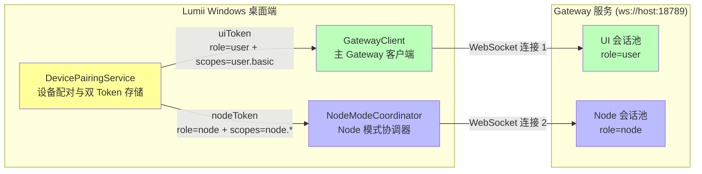
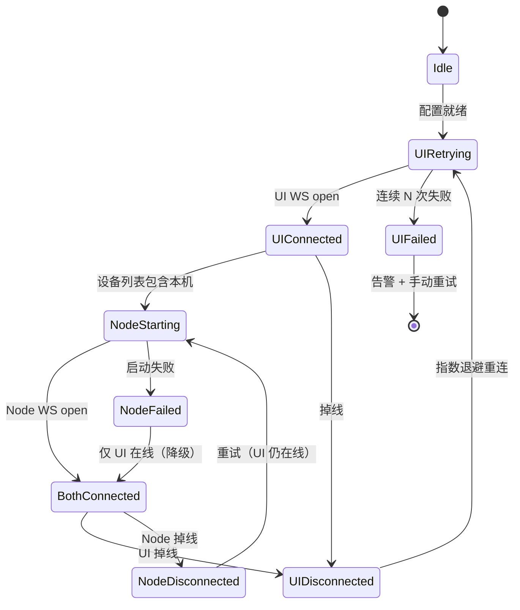
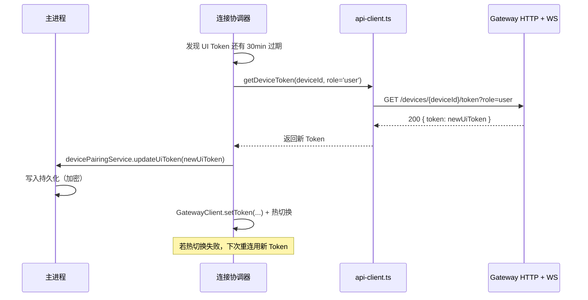
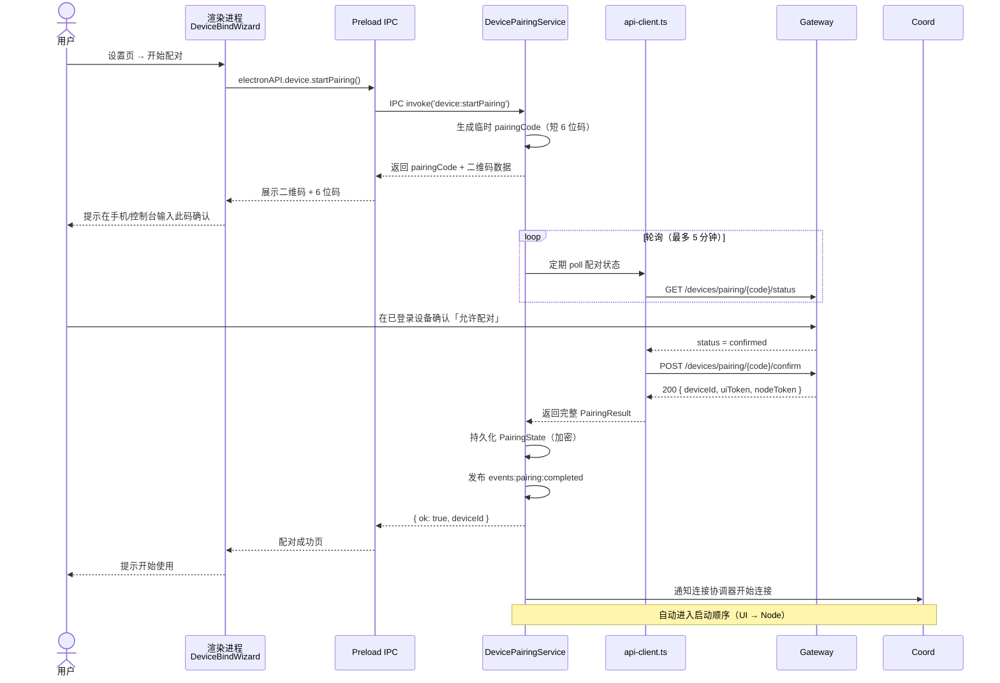

# 双连接架构说明

## 双连接的定义

Lumii 桌面客户端需要**同时承担两种身份**，因此设计了「双连接架构」：一个进程同时维护两条独立的 WebSocket 连接到同一个 Gateway 服务，各自使用不同的 Token、扮演不同的角色、调用不同的 API 域。

两条连接分别为：

| 连接名称 | 客户端角色 | 使用 Token | Gateway 会话 | 可调用方法域 |
|----------|------------|------------|--------------|--------------|
| **Gateway 连接（UI 连接）** | `role=user` 普通用户客户端 | `uiToken`（UI 专用） | UI 会话 | `sessions.*`、`node.list`、`chat.*`、`user.*` 等面向用户交互的方法 |
| **Node 模式连接** | `role=node` 可执行设备节点 | `nodeToken`（Node 专用） | Node 会话 | `node.*`、命令执行、技能运行、bash 工具等高危/高权限操作 |

**两种连接共同存在、互不替代**，缺一都会导致功能残缺：没有 UI 连接则无法查看设备列表、管理会话；没有 Node 连接则无法在本机执行 Shell 命令、运行技能工具。



### 为什么需要两条连接？（背景动机）

Gateway 的权限模型是**「单连接 = 单身份」**：一条 WebSocket 连接在握手阶段就确定了 `role` 与 `scopes`，后续无法动态切换。若 Windows 客户端只建立一条 `role=node` 的连接，就会在调用 `sessions.patch`、`node.list` 等 UI 相关方法时遭到拒绝：

```
errorCode=INVALID_REQUEST
errorMessage=unauthorized role: node
```

因此只能使用「双连接」方案，让同一进程**在 Gateway 看来是两个独立客户端**。

---

## 两种连接的使用场景和切换逻辑

### 使用场景对比表

| 场景 | 通过哪条连接发起？ | 典型方法 | 失败后果 |
|------|--------------------|----------|----------|
| 用户在聊天页发送消息 | UI 连接（gateway-client） | `chat.*`、`sessions.patch` | 消息无法发送、会话列表不更新 |
| 用户刷新设备列表 | UI 连接 | `node.list`、`device.*` | 看不到当前在线设备，无法管理 |
| Agent 判断需要运行 Shell 命令 | Node 连接（node-connection） | `node.*`、内部 tool_exec | 工具执行失败，bash/python 技能无响应 |
| Agent 调用需本机文件读写的工具 | Node 连接 | `node.bash`、文件工具 | 工作空间操作失败 |
| 多设备之间转发文件/任务 | UI 连接 + Node 连接协同 | 两者结合 | 跨设备协同中断 |
| 接收远程下发的任务到本机执行 | Node 连接（被动接收） | `node.*` subscribe | 无法作为节点被调度 |
| 管理订阅 / 积分 / 账户信息 | UI 连接 | `subscription.*`、`credits.*` | 设置页面数据空 |

### 生命周期与连接时机

**UI 连接（GatewayClient）生命周期**：
1. 应用启动 → 读取持久化设置与已配对 Token
2. 调用 `gatewayClient.setToken(uiToken)` 注入 UI Token
3. `gatewayClient.connect(gatewayUrl)` 建立连接，role=user
4. 保持长连接：心跳、自动重连、Token 自动刷新
5. 应用退出前 `disconnect()` 关闭

**Node 连接（NodeModeCoordinator）生命周期**：
1. 在 UI 连接成功、确认设备已上线之后**再启动**（依赖顺序）
2. 读取 `devicePairingService.getNodeToken()` 获取 Node Token
3. 建立独立的 WebSocket 连接，携带 `role=node` + `scopes=node.*`
4. 订阅 Gateway 下发的 node 侧任务队列
5. 可被用户在设置中手动「启用/关闭 Node 模式」
6. UI 连接断开时 Node 连接也跟着降级，避免孤岛

### 切换与降级策略

| 场景 | 切换逻辑 |
|------|----------|
| Gateway 地址变更（用户在设置页修改） | 两条连接同时断开 → 重新按顺序建立（UI 先，Node 后） |
| UI Token 过期 | 通过 `autoRefreshToken` 拉取新 UI Token → 重新连接；刷新后级联重启 Node 连接 |
| Node Token 过期 | 走 `device:*` 刷新接口拿新 Node Token → 单条 Node 连接重连，不影响 UI |
| UI 连接临时断开 | Node 连接继续工作但不接收新的 UI 指令；UI 恢复后补同步状态 |
| Node 连接临时断开 | UI 仍然可用，标记工具执行能力降级；恢复后透明重试任务 |
| 单设备离线模式（无 Gateway） | 两条连接都断开，Agent Runtime 直连 LLM + 本地工具工作 |

---

## 连接协调器的职责

双连接的复杂性要求有一个**单一协调权威**，避免两条连接的代码各自为政导致状态竞争。协调器位于：`apps/windows/src/main/connection/connection-coordinator.ts`

### 子模块组织

```
connection/
├── connection-coordinator.ts    # 总协调器（唯一入口）
├── ui-connection-manager.ts     # UI 连接专项管理器
└── node-connection-manager.ts   # Node 连接专项管理器
```

### 协调器的核心职责

#### 1. 启动顺序编排

保证「UI 连接就绪 → 再启动 Node 连接」的严格顺序，因为 Node 连接依赖 UI 连接成功后 Gateway 端对设备状态的注册。



#### 2. 健康检查与重连策略

- **心跳**：定期向 Gateway 发送 ping 消息，超时未回 pong 即视为断链
- **指数退避**：失败重试间隔 1s → 2s → 4s → 8s → 最大 60s 封顶
- **断路器**：同一连接连续失败 10 次则冷却 5 分钟，避免死循环占满 CPU
- **Token 刷新门**：重连前先尝试刷新 Token，若发现是 401 授权失败则停止重试并通知用户重新配对

#### 3. 聚合状态暴露

对外暴露单一的「连接状态对象」，UI 层无需关心双连接的内部差异：

```typescript
interface AggregatedConnectionStatus {
  overall: 'offline' | 'degraded' | 'online';
  ui: { connected: boolean; latencyMs: number; error?: string };
  node: {
    enabled: boolean;          // 用户是否允许本设备当 Node
    connected: boolean;
    latencyMs: number;
    error?: string;
  };
  gatewayUrl: string;
  deviceId: string;
  isPaired: boolean;
}
```

`renderer/components/business/DualConnectionStatus/` 消费该状态，在 UI 上以并排两个指示灯展示。

#### 4. 方法路由与统一调用面

上层（IPC handler、Agent Runtime）不直接操作 GatewayClient 或 NodeConnection，而是通过协调器的「门面方法」：

```typescript
coordinator.callUiMethod('sessions.patch', params);    // 走 UI 连接
coordinator.callNodeMethod('node.execBash', params);   // 走 Node 连接
coordinator.broadcastEvent('user.activity', payload);  // 两条连接都发
```

这样若未来架构调整（例如 Gateway 改为单连接双通道），上层代码无需改动。

#### 5. 崩溃防护与资源清理

- 应用 `before-quit` 阶段保证两条连接优雅关闭（发送 `bye` 帧 + 释放句柄）
- 协调器内部持有引用计数，避免重复 `connect` 导致连接泄漏
- 单条连接出现未捕获异常时，只重启该连接，不拖垮整个主进程

---

## 认证与安全机制

### 双 Token 模型

设备配对服务（`device-pairing-service.ts`）是凭证管理的唯一真相源。配对成功后 Gateway 返回两个独立 JWT：

```typescript
interface PairingState {
  deviceId: string;
  pairedAt: number;
  tokens: {
    ui: string;     // UI Token：短有效期、权限受限
    node: string;   // Node Token：有效期更长、权限高、仅本机使用
  };
}
```

**双 Token 差异**：

| 维度 | UI Token | Node Token |
|------|----------|------------|
| 签发对象 | `sub=<deviceId>`、`role=user`、`scopes=['user.basic']` | `sub=<deviceId>`、`role=node`、`scopes=['node.*']` |
| 典型有效期 | 24 小时 | 7 天 |
| 刷新方式 | 过期前通过 UI 连接 `sessions.refresh` 或 HTTP API 刷新 | 通过 HTTP API 并附加设备签名刷新 |
| 存储位置 | 主进程内存 + 加密持久化到 `device-pairing.json` | 同左，**绝不**进入 localStorage / 渲染进程 |
| 可被渲染进程读取？ | ❌ 绝对不可 | ❌ 绝对不可 |

### Token 自动刷新流程



对 Node Token 的刷新同理，但 `role=node` 并额外要求对设备 ID 做一次签名校验。

### 渲染进程的安全红线

**严禁在渲染进程（localStorage / sessionStorage / React State）中保存任何真实 Token。**

Token 只存在于：
1. 主进程内存（`DevicePairingService` 私有字段）
2. `~/.lumii/device-pairing.json`（加密 JSON 保存，首次启动生成随机密钥）
3. 临时传给 `ws` 库的 `Authorization` 头（发送后立即清除引用）

渲染进程如需展示「配对状态/设备 ID/有无 Token」，只能通过 IPC 获取脱敏后的摘要信息：

```typescript
ipcMain.handle('device:getPairingInfo', () => ({
  isPaired: devicePairingService.isPaired(),
  deviceId: devicePairingService.getDeviceId(),
  hasUiToken: !!devicePairingService.getUiToken(),
  hasNodeToken: !!devicePairingService.getNodeToken(),
  // 注意：这里绝不返回 Token 字符串本身
}));
```

### IPC 输入校验

所有跨进程入口都有参数校验与类型守卫，防止渲染进程被攻陷后进一步横向攻击主进程：

```typescript
ipcMain.handle('gateway:connect', async (event, url: unknown, opts: unknown) => {
  if (typeof url !== 'string' || !isValidWsUrl(url)) {
    throw new AppError('INVALID_URL', 'Invalid gateway URL');
  }
  if (!isConnectOptions(opts)) {
    throw new AppError('INVALID_OPTIONS', 'Invalid connect options');
  }
  // 真实连接逻辑
});
```

遵循纵深防御：即使 Preload 层被绕过，主进程 handler 自身仍做校验。

---

## 设备配对服务说明

设备配对服务（`apps/windows/src/main/device-pairing-service.ts`）是连接与认证的前置依赖：未配对就不可能有有效 Token，两条连接都无法建立。

### 配对流程（新设备首次接入）



### 持久化文件结构

文件位置：`~/.lumii/device-pairing.json`（通过 `LUMII_CLIENT_DATA_DIR` 可覆写根路径）

```jsonc
{
  "version": 2,
  "deviceId": "dev_abc123xyz",
  "deviceName": "My-Desktop-Win11",
  "pairedAt": 1756789012345,
  "lastSeen": 1757000000000,
  "encryptedTokens": "<AES-GCM加密的双Token结构体>",
  "encryptionKeyFingerprint": "sha256:...",
  "gatewayUrlFingerprint": "sha256:wss://..."   // 防串环境
}
```

首次启动生成加密密钥并写入 OS 凭证管理器（Windows Credential Locker），密钥不落盘；仅在主进程生命周期内持有。

### 取消配对与吊销

| 触发方式 | 服务端动作 | 客户端动作 |
|----------|------------|------------|
| 客户端设置页点击「取消配对」 | 通过 API 通知 Gateway 吊销双 Token | 清空本地 pairing 文件 → 协调器断开双连接 → 跳转引导页 |
| 服务端强制吊销（控制台） | Gateway 侧 invalid 该 deviceId 的所有 Token | 两条连接同时收到 `401 token_revoked` 帧 → DPS 自清理并告警 |
| 配对超时（30 天未连接） | Gateway 清理设备注册 | 客户端重连时被拒，触发重新配对流程 |
