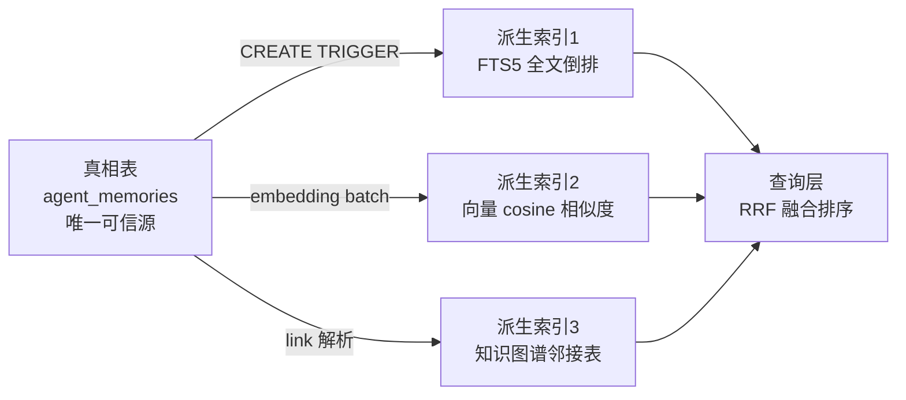
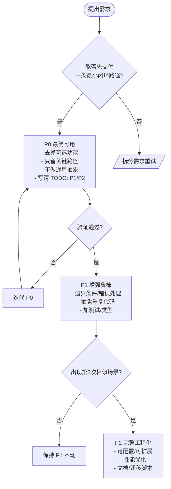

# 01-设计原则与模式

## 1. 通用软件设计原则在本项目中的应用

| 原则 | 定义 | Lumii 落地实例 |
|------|------|----------------|
| **单一职责原则 (SRP)** | 一个模块/类只应有一个引起变化的原因 | `packages/pet-core` 仅负责宠物核心状态，不依赖 React/Electron/Pixi/DOM；`packages/agent-runtime` 只封装通用 Agent/记忆/工具逻辑；Electron 专属逻辑全部收敛于 `apps/windows/src/main` |
| **开闭原则 (OCP)** | 对扩展开放，对修改关闭 | 工具系统通过注册机制扩展新工具，不改动执行沙箱核心；记忆提取的打分权重通过配置表注入；子 Agent 类型通过 Broker 注册表新增而非修改编排器主循环 |
| **依赖倒置原则 (DIP)** | 高层不依赖低层，二者依赖抽象；抽象不依赖细节 | 编排器依赖 `ToolExecutor` 接口而非具体 `ShellExecutor`；记忆层依赖 `VectorStore` 抽象而非具体 `SQLiteFTS5`；渲染层通过 ElectronAPI 类型契约调用 preload，不直接依赖主进程实现 |
| **接口隔离原则 (ISP)** | 多个细粒度接口优于单一胖接口 | 主进程 IPC handler 按 `agent-runtime:command`、`voice`、`screen-record`、`provider` 4 类拆分；工具权限分 `read-file`、`write-file`、`exec-shell` 等细粒度白名单；ElectronAPI 按功能域分对象而非单一全局对象 |

## 2. 本项目采用的设计模式与理由

### 2.1 纯函数优先

**模式说明**：核心计算（打分、温度、满意度等）一律实现为纯函数，时间、随机数等隐式依赖通过参数**显式传入**（如 `now` 字段），保证可测试、可重现、可并行。

**应用场景**：

```typescript
interface MemoryScoreInput {
  semanticCategory: 'user' | 'feedback' | 'preference' | 'reference' | 'general';
  createdAt: number;
  accessedAt: number;
  hitCount: number;
  feedbackPositive: number;
  feedbackNegative: number;
  now: number;
}

function computeLifetimeTemperature(input: MemoryScoreInput): 'hot' | 'warm' | 'cold' {
  const ageHours = (input.now - input.createdAt) / 3600_000;
  const lastAccessHours = (input.now - input.accessedAt) / 3600_000;
  const base = Math.exp(-ageHours / 720) * 0.4 + Math.exp(-lastAccessHours / 168) * 0.4;
  const feedback = Math.atanh(Math.min(0.95, (input.feedbackPositive - input.feedbackNegative) / (input.feedbackPositive + input.feedbackNegative + 1))) * 0.2;
  const total = base + feedback;
  return total > 0.65 ? 'hot' : total > 0.3 ? 'warm' : 'cold';
}
```

**核心理由**：避免 `Date.now()` 散布于业务代码导致单测不可重复；显式 `now` 可以模拟任意时间点回放温度衰减曲线。

### 2.2 真相表 + 可重建派生索引模式

**模式说明**：区分**真相表**（唯一可信源，仅追加，不可变或带修订版本链）与**派生索引**（FTS5 全文、向量、图谱等，可随时从真相表重建）。索引损坏不丢数据，只需要重跑重建脚本。

**应用场景（记忆系统）**：



**核心理由**：向量模型/FTS5 分词器/图谱算法迭代频繁，真相表与派生索引解耦后，升级只需清空派生索引重跑 `rebuild_*_index()` 迁移，不触动用户原始记忆。

### 2.3 正交维度不互相编码

**模式说明**：当事物可沿两个独立维度分类时，不把一个维度编码进另一个维度的枚举值，而是用「笛卡儿积」组合表达。

**应用场景**：记忆分类轴——**语义类别 × 生命周期温度**，两条轴独立。

| 语义类别 \ 温度 | HOT（7天内活跃） | WARM（活跃但衰减） | COLD（归档） |
|-----------------|-------------------|---------------------|--------------|
| `user`（用户事实） | 姓名/最近住址 | 旧住址 | 小学地址 |
| `feedback`（反馈） | 上次对话 thumbs up | 本月正面反馈 | 去年差评 |
| `preference`（偏好） | 当前在用的代码风格 | 曾经的主题色 | 早年喜欢的字体 |
| `reference`（参考） | 刚看过的 API 文档 | 上月项目 Wiki | 历史技术选型记录 |
| `general`（杂项） | 今天的会议笔记 | 上周计划 | 归档日记 |

**反例（不做）**：单独造一个 `hot-user-preference` 的枚举值，这样每加一个维度枚举值数量爆炸。

### 2.4 AI 不静默覆写用户内容

**模式说明**：任何 AI 自动整理（记忆去重、Wiki 合并、文件重构）必须走**生成 diff → 用户预览 → 确认提交**三阶段，禁止 AI 直接写回用户可编辑文件。

**应用场景**：

1. **记忆整理护栏**：整理后条目较原条目「缩水超过 50%」直接拒绝写入，告警人工 review。
2. **Wiki 编译流水线**：AI 先生成 `wiki_candidate`（建议页面）→ 展示 diff → 用户点「接受」才写入 `wiki_pages` 主表。
3. **自主目标执行禁令**：Autonomous Agent 绝对禁止：删改用户目录文件、读敏感环境变量、执行 shell、联系第三人、发起支付。

### 2.5 Schema 先行 / 数据库迁移机制

**模式说明**：任何持久化结构改动先写 DDL/SQL 迁移脚本，版本号严格递增；应用启动时按 `user_version` 判定当前版本，顺序执行未应用的迁移。

**应用场景（SQLite）**：

```sql
-- migrations/001_initial.sql
PRAGMA user_version = 1;
CREATE TABLE agent_memories (
  id INTEGER PRIMARY KEY AUTOINCREMENT,
  semantic_category TEXT NOT NULL CHECK (semantic_category IN ('user','feedback','preference','reference','general')),
  content TEXT NOT NULL,
  created_at INTEGER NOT NULL,
  accessed_at INTEGER NOT NULL,
  hit_count INTEGER NOT NULL DEFAULT 0,
  tombstone INTEGER NOT NULL DEFAULT 0
);

-- migrations/002_add_temperature_fts.sql
PRAGMA user_version = 2;
ALTER TABLE agent_memories ADD COLUMN temperature TEXT;
CREATE VIRTUAL TABLE agent_memories_fts USING fts5(content, content='agent_memories', content_rowid='id');
```

**配套规则**：迁移脚本只增不改（如需修正旧迁移，新建 `00N_*.sql` 追加）；测试套件必跑「全新库从 0 升到最新」与「旧版库顺序升」两条路径。

## 3. 数据分类矩阵法

来源：同步架构分析中 8 类数据 × 5 项属性的结构化决策模板，可推广到任何「哪些数据该进哪个层」问题。

| 数据类型 | 应同步 | 冲突风险 | 单用户典型大小 | 同步优先级 |
|----------|--------|----------|----------------|------------|
| `profile` 用户画像（偏好/配置） | ✅ 是 | 低（双方偶改） | < 1 MB | P0 |
| `wiki` 知识库（sources+pages+revisions） | ✅ 是 | 中（可并发编辑） | 50-500 MB | P0 |
| `memory` Agent 工作记忆（SQLite truth table） | ✅ 是 | 低（Agent 单写） | 10-100 MB | P1 |
| `autonomous` 自主进化状态（元认知/目标/人格） | ✅ 是 | 低（单 Agent 写） | < 50 MB | P1 |
| `workspace` 工作空间代码仓 | ✅ 是（复用 Git） | 高（多设备都写） | 无上限 | P1 |
| `conversation` 实时对话消息 | ❌ 否（仅摘要 L1/L2 可选） | 高（每轮都改） | 1-10 GB | P2 摘要 |
| `logs` 运行时日志/监控聚合 | ❌ 否 | 无 | 500 MB+ | - |
| `cache` 向量索引/FTS/缩略图 | ❌ 否（可重建） | 无 | 与 truth 等大 | - |

**用法**：对每个新数据实体先填这 5 列，再决定它属于同步区、本地区还是可重建派生区。

## 4. P0 / P1 / P2 分阶段设计方法



| 阶段 | 交付物特征 | 反模式 |
|------|------------|--------|
| **P0** | 一条用户路径跑通，硬编码路径可接受，只写 happy path | 一开始就建 5 层抽象、做 plugin 系统 |
| **P1** | 核心边界有防护，API 形状稳定，同一模式最多 2 处 copy-paste | 把 P2 的通用化提前，过度设计 |
| **P2** | 至少 3 个真实消费者，有基准测试、迁移脚本、回滚策略 | 只改了 2 处就想抽框架 |

## 5. 方案对比与决策记录表

### 5.1 标准格式（TypeScript 接口）

```typescript
interface DecisionRecord {
  id: string;
  title: string;
  date: string;
  context: string;
  alternatives: Array<{
    name: string;
    pros: string[];
    cons: string[];
    complexity: 'low' | 'medium' | 'high';
    risk: 'low' | 'medium' | 'high';
  }>;
  decision: string;
  rationale: string;
  consequences: {
    positive: string[];
    negative: string[];
    followUps: string[];
  };
}
```

### 5.2 完整示例：记忆存储真相表方案对比

```json
{
  "id": "DR-001",
  "title": "记忆系统是否采用真相表 + 派生索引分离架构",
  "date": "2026-08-24",
  "context": "方案 A 直接把向量/FTS 存主表列；方案 A+ 拆真相表 + 多个派生索引；方案 B 纯向量库。",
  "alternatives": [
    {
      "name": "A 单表混合",
      "pros": ["SQL 少", "查询简单"],
      "cons": ["向量模型升级要 ALTER 大表", "无法单独重建某个索引", "迁移时间与数据量线性"],
      "complexity": "low",
      "risk": "high"
    },
    {
      "name": "A+ 真相表 + 派生索引",
      "pros": ["FTS/向量/图谱各自独立升级", "索引损坏只需重跑 rebuild", "符合 Schema 先行迁移"],
      "cons": ["多写一份触发器/重建脚本", "首次学习曲线"],
      "complexity": "medium",
      "risk": "low"
    },
    {
      "name": "B 纯外置向量库",
      "pros": ["ANN 检索快"],
      "cons": ["引入 Milvus/pgvector 等重型依赖", "跨进程事务一致性难保证", "Electron 打包体积 ↑300MB+"],
      "complexity": "high",
      "risk": "medium"
    }
  ],
  "decision": "采用方案 A+，真相表 agent_memories + FTS5 + 向量列 + 图谱邻接表 三类派生索引。",
  "rationale": "核心记忆数据量在 100MB 级，SQLite 内置 FTS5 + cosine 够用；真相/派生分离是唯一可随模型迭代无痛升级的结构。",
  "consequences": {
    "positive": [
      "切换 embedding 模型只删向量列重跑",
      "可做 RRF 多检索融合",
      "数据迁移脚本可单测"
    ],
    "negative": [
      "写入多一次 TRIGGER 开销 (~<5%)",
      "需要维护 rebuild 命令"
    ],
    "followUps": [
      "实现 rebuild_fts / rebuild_embeddings / rebuild_graph 三个独立迁移",
      "写损坏检测：sum(派生) vs count(真相表) 定期校验"
    ]
  }
}
```
