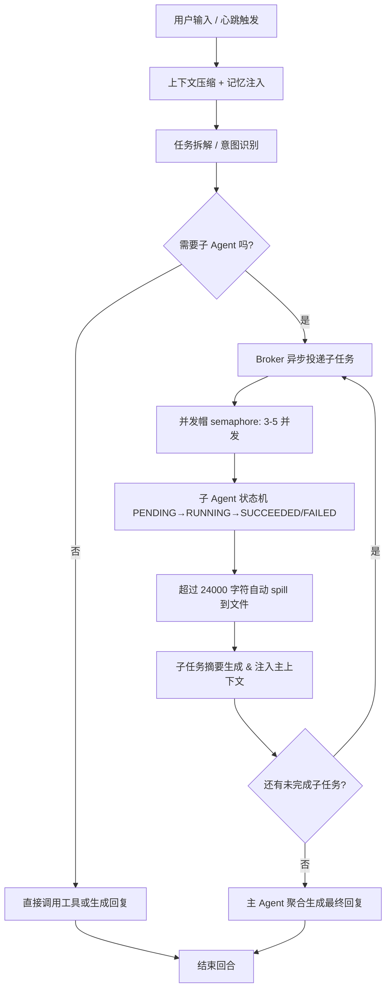
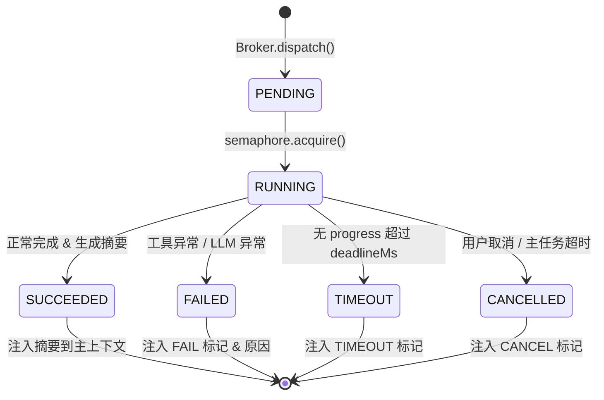

# 02-Agent 系统设计

## 1. Agent 编排器核心设计

### 1.1 Orchestrator 职责边界

| 属于 Orchestrator | 不属于 Orchestrator（下沉子 Agent / 工具层） |
|-------------------|----------------------------------------------|
| 接收用户 query，拆分子任务 DAG | 具体某个工具调用的参数组装 |
| 维护全局会话状态、并发帽、回合计数 | 某个子任务内部的 Prompt 细节 |
| 分派子 Agent、收集摘要、聚合最终回复 | 单个工具的权限判定（工具层自管） |
| 处理超时 / 重试 / 降级路径 | 子任务结果的业务语义校验（子 Agent 自管） |
| 注入记忆块 `{{LUMII_MEMORY_BLOCK}}` 到上下文 | 记忆召回的打分算法细节（记忆层自管） |

### 1.2 单轮循环结构



### 1.3 6 条硬约束

1. **异步投递**：新子任务一律通过 Broker 发「新回合消息」，禁止主循环 await 假等待阻塞。
2. **并发帽 3~5**：同一次 Orchestrator 分派的 RUNNING 态子 Agent 不超过 3-5 个。
3. **结果摘要上限 24000 chars**：超过的 dump 到临时文件，上下文只放摘要 + 文件路径引用。
4. **状态机明确**：`PENDING → RUNNING → SUCCEEDED / FAILED / CANCELLED / TIMEOUT`，不允许无状态 float。
5. **超时按层**：子 Agent 执行超时 ≥ 工具层超时 ≥ 单 LLM 调用超时。
6. **永不 force push**：涉及 Git Worktree 操作的子 Agent，push 一律走 merge 模式。

## 2. 子 Agent 协作架构

### 2.1 Broker 模式 + 异步投递

```mermaid
flowchart LR
    ORCH[Orchestrator] -->|TaskSpec| BROKER[Broker 事件总线]
    BROKER -->|dispatch| SA1[Sub-Agent 1 代码审查]
    BROKER -->|dispatch| SA2[Sub-Agent 2 文档搜索]
    BROKER -->|dispatch| SA3[Sub-Agent 3 测试执行]
    SA1 -->|result| AGG[摘要聚合器]
    SA2 -->|result| AGG
    SA3 -->|result| AGG
    AGG -->|Digest[]| ORCH
```

核心机制：

- **TaskSpec**：`{ taskId, type, prompt, toolsWhiteList, contextSnapshot, deadlineMs }`
- **深度并发控制**：Semaphore 令牌桶 + 按 `type` 单独队列（避免 I/O 密集和 CPU 密集互相抢占）。
- **进度优先超时**：一段时间内有持续 progress event（工具调用/中间输出）则不触发硬超时，防止长任务被误杀。

### 2.2 四层协作对照（Hermes MOA vs Lumii）

| MOA 四层 | Hermes 实现 | Lumii 当前成熟度 | Lumii P2 推荐目标 |
|----------|-------------|------------------|-------------------|
| **L1 Fan-out 扇出** | Coordinator 分拆独立子任务 | ✅ Orchestrator 任务拆解 | ✅ 保持 |
| **L2 Delegate 委派** | 专用 Worker Agent（前端/后端/测试） | ⚠️ 单一通用子 Agent | ✅ P1 加 type 注册表 |
| **L3 Async Scheduler 调度** | 异步消息 + 进度 + spill | ⚠️ 半异步假等待 | ✅ P0 立即改真异步投递 |
| **L4 Worktree 隔离** | 不同子 Agent 独立 Git worktree | ❌ 共享工作目录 | ✅ P2 Git Worktree 隔离 |

### 2.3 顾问（Advisor） vs 执行（Executor）分离

| 维度 | Advisor 扇出（非默认 P3） | Executor 子 Agent（默认） |
|------|----------------------------|---------------------------|
| 目标 | 出方案、给建议、风险评审 | 动手：读文件、调工具、写代码 |
| 工具权限 | 只读工具白名单 | 读写工具白名单 |
| 输出 | 结构化建议（option/pro/con） | 可执行结果 + diff + 测试 |
| 是否默认触发 | 否，用户显式 `--review` | 是，任何需要动手的任务 |

## 3. 工具系统设计

### 3.1 工具注册 + 执行沙箱 + 权限三层

```typescript
interface ToolDefinition {
  name: string;
  description: string;
  parameters: JSONSchema7;
  requiredCapabilities: Capability[];
  timeoutMs: number;
  pure: boolean;
}

type Capability =
  | 'fs:read'
  | 'fs:write'
  | 'fs:delete'
  | 'shell:exec'
  | 'net:fetch'
  | 'env:read'
  | 'memory:write'
  | 'wiki:edit';
```

**权限控制顺序（白名单硬防线）**：

1. **会话级白名单**：用户开新会话时确认的 Capability 集合（prompt 护栏之外独立存在）。
2. **工具级 requireCapabilities**：工具声明最少权限，缺一个拒绝注册。
3. **调用前二次校验**：`ToolExecutor.canInvoke(cap, target)`，例如 `fs:write` 校验路径不在黑名单（`~/.ssh`、密钥文件）。
4. **黑名单兜底**：`rm -rf /`、`curl ... \| sh` 等危险模式即使过白名单也拦截。

### 3.2 关键复用模式（来自 Hermes）

| 模式 | 说明 | Lumii 采纳位置 |
|------|------|----------------|
| Capability 句柄 | 每个 Tool 返回的 handle 可被后续工具引用，避免序列化大对象 | 执行沙箱 `ToolResult { handle, preview }` |
| 写严读宽 | 写操作必须双校验，读操作宽松 | 工具层 `fs:write` vs `fs:read` 校验强度 |
| 结果哈希 | 大工具结果存文件，上下文只放 `sha256+路径` | spill 机制 |
| 新回合投递 | 子 Agent 完成不直接 return，而是向总线发 `subagent-completed` | Broker 核心 |

## 4. Prompt 模板系统

### 4.1 Section 结构 + 动态组装

```text
┌─────────────────────────────────────────┐
│  SYSTEM  (固定角色 + 能力声明)           │
│  ├─ Role: "你是 Lumii，桌面 AI 助手"     │
│  └─ Capabilities: 已注册工具列表摘要     │
├─────────────────────────────────────────┤
│  MEMORY_INJECT  ({{LUMII_MEMORY_BLOCK}}) │
│  └─ 由记忆提取流水线在 Orchestrator 前置 │
├─────────────────────────────────────────┤
│  CONTEXT  (对话历史压缩 + 子任务摘要)    │
│  └─ 三层压缩：规则去重 → LLM 摘要 → 截断│
├─────────────────────────────────────────┤
│  TOOLS  (本次允许的 tools schema)        │
├─────────────────────────────────────────┤
│  USER_QUERY  /  HEARTBEAT_TASK           │
└─────────────────────────────────────────┘
```

**注入规则**：

- `SYSTEM` 永不被压缩，优先级最高。
- `MEMORY_INJECT` 块通过占位符替换（旧 indexOf 方案已弃用，统一用模板变量）。
- `CONTEXT` 最先被压缩，超长时先从最老的轮次开始。

### 4.2 模板存储与版本

模板为纯 Markdown 文件放在 `packages/agent-runtime/src/prompts/*.md`，通过 UCB1 多臂老虎机做 A/B 进化（见 03-自主进化Agent 设计 §5）。版本号格式：`<prompt-name>@<sha7>`，每次改动新 hash 旧版本不删，便于回滚。

## 5. 会话上下文管理

### 5.1 压缩引擎三层

| 层级 | 策略 | 典型压缩比 | 信息损失 |
|------|------|------------|----------|
| **L1 规则过滤** | 去重（最长公共子串匹配按模型阈值）、合并重复 tool output、清理纯格式行 | 1.0 : 1.3 | 无损 |
| **L2 LLM 摘要** | 对 ≥ N 轮的历史按窗口摘要，保留 Action/Result 对，跳过寒暄 | 1 : 5 ~ 1 : 10 | 有损可控 |
| **L3 硬截断** | 超过模型上下文 90% 时，最老轮次整段砍掉，保证 SYSTEM + MEMORY 永远保留 | 任何比例 | 最旧信息丢失 |

### 5.2 双预算 + Commit Fence 永不中断

```typescript
interface ProgressAwareCompressionBudget {
  softTokenLimit: number;   // 达此值触发 L2 摘要（后台跑，不阻塞用户）
  hardTokenLimit: number;   // 达此值触发 L3 截断（同步阻塞保证不 OOM）
  commitFenceBytes: number; // 每写多少字节落盘一次 checkpoint
}
```

配合 **Rearm 跑道防抖动**：刚完成一次 L2 摘要后冷却 R tokens 不再触发，避免乒乓。**Reclaim Gate**：至少回收 4096 tokens 才认为本次压缩有效。

## 6. 与 Hermes MOA 的对比分析

### 6.1 六维度详细对比

| 维度 | Hermes MOA | Lumii 当前 | 差距等级 | 优化方向 |
|------|------------|------------|----------|----------|
| 任务扇出 | 自动 DAG + 依赖解析 | 线性拆解 | ⚠️ 中 | P1 加 DAG 依赖描述 |
| 异步调度 | 真异步事件总线 + progress | 半假等待 | ❌ 高 | P0 改 Broker 真异步 |
| 并发控制 | 全局 + 按类型双 semaphore | 无控制 | ❌ 高 | P0 加 3-5 并发帽 |
| 大结果 spill | 自动 + 结果哈希句柄 | 手动部分实现 | ⚠️ 中 | P0 24000 chars 自动 spill |
| Worktree 隔离 | 每子 Agent 独立 worktree | 共享目录 | ⚠️ 中 | P2 Git Worktree |
| 顾问扇出 | 专门 Reviewer Agent | 无 | ⚠️ 低 | P3 Advisor 非默认 |

### 6.2 Lumii 5 条固有优势

1. **Electron 全栈可控**：主/preload/renderer 三层都是自己代码，Hermes 依赖外部 MCP 桥。
2. **记忆 + 自主进化闭环**：MOA 纯执行框架，不内置人格/目标/元认知。
3. **Pet 桌面宠物持续存在**：心跳架构天然适配后台 Agent，而不是一次性 CLI。
4. **本地优先 SQLite**：不依赖外部 DB，跨设备用 Git 同步而不是云服务。
5. **Wiki 内建编译流水线**：MOA 无知识库沉淀概念。

### 6.3 可复用设计模式清单（12 条中优先 6 条）

1. Capability 句柄（不把大对象塞上下文）
2. 进度优先超时（有 progress 不杀）
3. 写严读宽（fs 写操作双校验）
4. 结果哈希 + spill 引用
5. 子 Agent 完成 → 新回合投递（禁止 await 假等待）
6. Advisor vs Executor 分离

## 7. 子 Agent 生命周期管理



| 状态 | 输出物 | 主上下文注入内容 |
|------|--------|------------------|
| `PENDING` | 无 | `<subagent id=X status=pending />` 占位 |
| `RUNNING` | 可选 progress 事件流 | 占位保持不变，progress 只进 UI 不进上下文 |
| `SUCCEEDED` | 原始结果文件 + Digest(≤24000) | Digest 全文注入，超出放 digest + 文件引用 |
| `FAILED` | Error stack + 重试次数 | `FAILED: <reason>` 短注入，不把长 stack 塞上下文 |
| `TIMEOUT` | 最后 checkpoint | `TIMEOUT after N ms, last progress: ...` |
| `CANCELLED` | 无 | `CANCELLED by user` |

**销毁策略**：子 Agent 完成后所有临时 handle 存活 1 个主回合，下一回合开始 GC，临时文件放 `os.tmpdir()` 系统回收。

## 8. 参考链接

- Hermes MOA 深度对比：`docs/design/AGENT优化/2026-08-26-hermes-moa-对比分析.md`
- Hermes vs Lumii 差距分层与优化路线：`docs/design/AGENT优化/2026-08-26-hermes-moa-vs-lumii-对比与优化.md`
- Lumii Agent 优化实施方案（P0/P1/P2/P3）：`docs/design/AGENT优化/2026-08-26-lumii-agent-优化方案.md`
