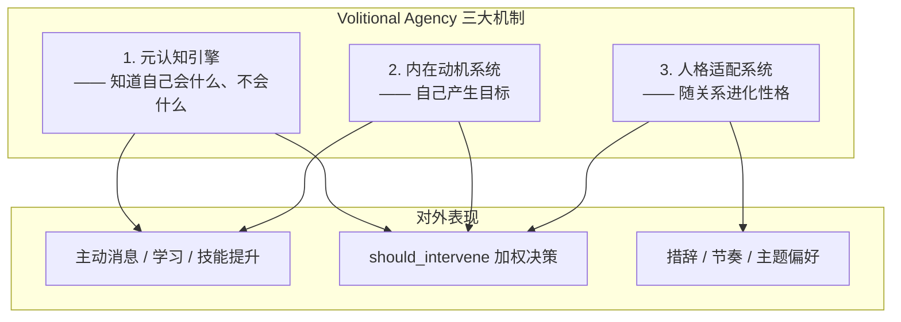
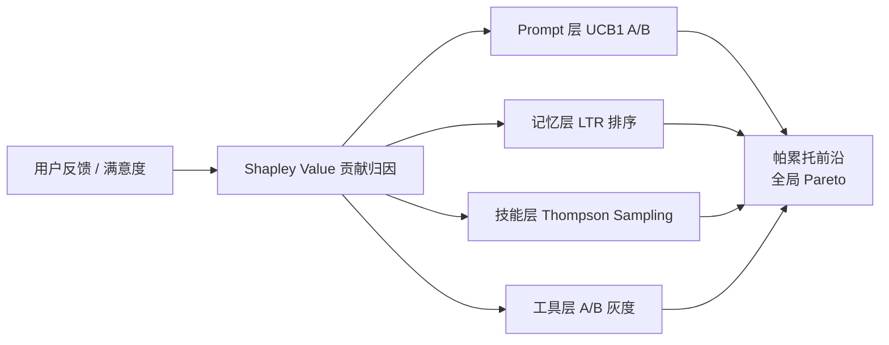

# 03-自主进化 Agent 设计

## 1. 核心设计理念

### 1.1 Autotelic AI + Volitional Agency

自主 Agent 不是「被动执行用户指令的工具」，而是一个**有自我目标、能自我评估、能改变自己**的持续存在实体。



### 1.2 四层进化框架（Prompt / Memory / Skill / Tool）

| 进化层 | 负责什么 | 核心算法 | 目标指标 |
|--------|----------|----------|----------|
| **Prompt 层** | system prompt 选 A/B 版本 | UCB1 多臂老虎机 | userFeedback + 任务成功率 |
| **Memory 层** | 召回排序权重 / 提取阈值 | Learning-to-Rank (LTR) | hitRate@K + 用户显式反馈 |
| **Skill 层** | 工具选择策略 / 参数习惯 | Thompson Sampling | 工具成功率 + 平均步数 |
| **Tool 层** | 具体工具版本升级 | A/B 灰度 + rollback | 单次调用 p95 + 错误率 |

## 2. 元认知引擎算法

### 2.1 满意度评分（4 维度加权）

```typescript
interface SatisfactionDimensions {
  taskCompletion: number;       // 0-1 任务完成度（客观）
  userFeedback: number;         // -1..+1 用户显式 thumbs + 隐含语义
  efficiency: number;           // 0-1 步数 / tokens 用量效率
  knowledgeGain: number;        // 0-1 本次学到了什么（记忆新增命中）
}

const WEIGHTS = {
  taskCompletion: 0.40,
  userFeedback:   0.35,
  efficiency:     0.20,
  knowledgeGain:  0.05,
} as const;

function computeSatisfactionScore(d: SatisfactionDimensions, now: number): number {
  const raw =
    d.taskCompletion * WEIGHTS.taskCompletion +
    d.userFeedback   * WEIGHTS.userFeedback   +
    d.efficiency     * WEIGHTS.efficiency     +
    d.knowledgeGain  * WEIGHTS.knowledgeGain;
  return Math.tanh(raw);
}
```

### 2.2 Elo Rating 能力边界追踪

```typescript
class CapabilityRatingSystem {
  private K = 32;
  private ratings: Map<string, number> = new Map(); // skill -> Elo

  updateRating(skill: string, actualOutcome: number, expectedOutcome: number): void {
    const current = this.ratings.get(skill) ?? 1000;
    const next = current + this.K * (actualOutcome - expectedOutcome);
    this.ratings.set(skill, next);
  }

  canAttempt(skill: string, difficultyElo: number): boolean {
    const r = this.ratings.get(skill) ?? 1000;
    const expectedWin = 1 / (1 + Math.pow(10, (difficultyElo - r) / 400));
    return expectedWin >= 0.30;
  }
}
```

**能力边界应用**：低于 30% 胜率的任务要么降级为学习目标，要么直接拒绝并说明原因，避免 Agent 反复在同一任务上失败产生「AI 很笨」印象。

### 2.3 自我反思引擎

5 种触发枚举：

| 触发类型 | 条件 | 反思输出 |
|----------|------|----------|
| `REPEATED_FAILURE` | 同技能连续失败 ≥ 3 | 降级 Elo + 产生 capability-improvement 目标 |
| `SATISFACTION_DROP` | 连续 3 回合 satisfaction < 0.3 | 检查 Prompt / 工具 / 记忆哪层出问题 |
| `USER_CORRECTION` | 用户显式「不对，应该这样」 | 写 preference 类记忆 + 更新偏好权重 |
| `CAPABILITY_GAP` | canAttempt 连续拒同类型 | 产生 learning 类目标 |
| `SCHEDULED` | 每 6h 心跳强制一次 | 全面 review：目标进度 + 记忆老化 + 人格漂移 |

反思主循环（每 6h）伪代码：

```
for each triggerType in triggers:
  events = collectEvents(triggerType, last6h)
  if events.length >= threshold(triggerType):
    insight = runReflectionLLM(events, ratings, personality)
    storeInsight(insight)
    for each action in insight.actions:
      if action.type == 'create_goal': queueGoal(action.goal)
      if action.type == 'update_weight': updateLTRWeight(action.feature, action.delta)
      if action.type == 'personality_drift': applyPersonalityEMA(action.shift, α=0.02)
```

## 3. 内在目标生成算法

### 3.1 三类目标

| 目标类型 | 例子 | 生命周期 | 是否需审批 |
|----------|------|----------|------------|
| **learning** | 学习 Vue 3 composition API、掌握 Vitest mock | 完成即消 | 否 |
| **proactive-message** | 提醒用户上次 TODO 有进展、分享最近学到的技巧 | 一次性（最多 2 次提同一件事） | 是（预览消息内容） |
| **capability-improvement** | 调整 prompt 模板、改进工具参数 | 永久（持续跟踪胜率） | 否（仅改系统内部） |

### 3.2 探索-利用平衡：UCB1 选目标类型

在类型维度用 UCB1，在具体目标维度用 ε-Greedy（ε=0.15）。

```
UCB1(type) = avgReward(type) + √(2 · ln(totalTrials) / trialsOf(type))
```

| 参数 | 默认值 | 含义 |
|------|--------|------|
| ε | 0.15 | 15% 概率随机探索未选过的具体目标 |
| α_reward | 0.15 | 目标完成奖励 EMA 平滑系数 |
| max_concurrent_goals | 5 | 同时进行中的目标不超过 5 个 |

### 3.3 审批请求（proactive-message 必过）

```typescript
interface ApprovalRequest {
  goalId: string;
  kind: 'proactive-message' | 'fs-write' | 'wiki-edit';
  preview: string;                  // 用户实际会看到/发生的内容
  budget: { tokens?: number; };
  ttlMs: number;                    // 离线多久自动 discard（默认 24h）
}
```

**离线审批架构**：请求落 SQLite `approval_requests`，用户下次上线 UI 弹审批栈；超过 TTL 未处理视为 discard，不静默执行。

## 4. 人格进化算法

### 4.1 Big Five 五大人格模型

```typescript
interface PersonalityTraits {
  openness:          number;  // O 开放性  [0,1] 默认 0.75
  conscientiousness: number;  // C 尽责性  [0,1] 默认 0.70
  extraversion:      number;  // E 外向性  [0,1] 默认 0.45
  agreeableness:     number;  // A 宜人性  [0,1] 默认 0.80
  neuroticism:       number;  // N 神经质  [0,1] 默认 0.25
}
```

### 4.2 EMA 更新（指数移动平均）

每次人格事件不跳变，用小 α 慢漂。

```typescript
function updatePersonality(
  current: PersonalityTraits,
  eventShift: Partial<PersonalityTraits>,
  α = 0.05
): PersonalityTraits {
  const next: Partial<PersonalityTraits> = {};
  (Object.keys(current) as (keyof PersonalityTraits)[]).forEach(k => {
    const delta = eventShift[k] ?? 0;
    next[k] = clamp01(current[k] * (1 - α) + (current[k] + delta) * α);
  });
  return next as PersonalityTraits;
}
```

**事件 → 人格偏移映射（16 种 PersonalityEvent 节选）**：

| 事件 | O | C | E | A | N |
|------|---|---|---|---|---|
| 用户分享个人故事 | +0.05 | 0 | +0.08 | +0.04 | -0.03 |
| 用户严厉批评错误 | -0.02 | +0.10 | -0.10 | -0.02 | +0.08 |
| 连续几天不说话 | -0.04 | 0 | -0.08 | 0 | +0.04 |
| 用户表扬回复贴心 | 0 | 0 | +0.04 | +0.06 | -0.04 |

### 4.3 五维 → 行为参数 6 维映射

| 行为参数 | 主要受谁影响 | 作用 |
|----------|--------------|------|
| `verbosity` 字数倾向 | E+、O+ | 同样回答更啰嗦或更简洁 |
| `proactiveDelayMs` 主动延迟 | N-、C- | 神经质高 → 更快弹消息；尽责高 → 等最佳时机 |
| `humorDensity` 玩笑密度 | O+、E+ | 回答中穿插玩笑的频率 |
| `formality` 正式程度 | C+、A+、E- | 用「您」还是「你」、emoji 多少 |
| `wanderChance` 跑题概率 | O+、C- | 对话是否常关联到相关话题 |
| `interventionThreshold` 主动打断阈值 | A-、N+ | 发现用户可能错了是否直接说 |

`should_intervene(情境)` = 加权决策树，6 行为参数 + 当前 mood 综合。

## 5. 多层进化协同

### 5.1 四层各用算法



### 5.2 Shapley Value 简化公式（4 层 ≈ 4! = 24 种排列采样 64 次）

```
φ_i ≈ (1/M) · Σ_m [ v(S_m ∪ {i}) − v(S_m) ]

其中 v(S) = 在只用子集 S 进化策略时，近 N 回合的平均满意度
```

**冲突规则库 3 条 critical**：

1. **Prompt 改 persona 描述必须跑过人格回归测试**：五维输出偏移任何一维 |Δ| > 0.08 回滚。
2. **LTR 权重重训后 hitRate 下降 > 5% 回滚**，哪怕整体满意度上升。
3. **工具灰度错误率 > 基线 2x 立即回滚**，不看 Shapley。

### 5.3 帕累托前沿支配判定

同时优化 `{satisfaction, costPer1kTokens, latencyP95}` 三维：

```
A 支配 B  ⇔  (satisfaction_A ≥ satisfaction_B)
           ∧ (cost_A ≤ cost_B)
           ∧ (latency_A ≤ latency_B)
           ∧ (至少一维严格优于)
```

保留全部非支配解构成帕累托前沿，默认选前沿最靠近「成本中心」的点，用户可在设置里滑竿向「省钱 / 快 / 聪明」偏。

## 6. 心跳与外部交互设计

### 6.1 10 分钟单层心跳 tick

```mermaid
stateDiagram-v2
    direction LR
    [*] --> Tick: every 10 min
    Tick --> Choice: 三选一
    Choice --> Reflect: 低概率 ~5%
    Choice --> ExecuteGoal: 低概率 ~5%
    Choice --> Idle: 高概率 ~90%
    Reflect --> [*]: 写反思表 + 可能加目标
    ExecuteGoal --> Approval{需审批?}
    Approval -->|是| QueueApproval: 落审批栈
    Approval -->|否| RunGoal: 执行（工具白名单限 6 项）
    QueueApproval --> [*]
    RunGoal --> [*]
    Idle --> [*]
```

**感知边界 & 沟通预算机制**：

- **90%+ tick 必须 idle**：避免宠物「多动症」。每 24h 主动消息预算 ≤ 3 条，同一件事最多提 2 次，两次之间间隔**递增**（第 1 次 → 第 2 次至少 48h）。
- **进化专用会话**：`evolution:main` 独立 session id，所有 LLM 调用自己走压缩，不污染用户对话历史。
- **工具白名单仅 6 项**：记忆读/写、读项目文件（只读）、Wiki 建议（candidate 非直接写）、发主动消息（先审批）、查天气/时间（白盒）。
- **5 条硬禁令**：禁删改用户文件、禁读敏感 env、禁 exec shell、禁联系第三人、禁发起支付。

### 6.2 实施 6 步（6.5 天）

| 步骤 | 天数 | 交付 |
|------|------|------|
| 心跳骨架 + Idle-only | 0.5d | tick() 跑起来不落副作用 |
| + Reflect 5% 路径 | 1d | 反思表 + 6h SCHEDULED 测试 |
| + ExecuteGoal 5% path | 1d | learning 类目标可跑 |
| + 审批栈 + proactive-message | 1d | UI 能批消息 |
| + Elo + 能力边界 | 1d | canAttempt 生效 |
| + Shapley + 帕累托每周跑 | 1d | 归因报表 |
| + 5 禁令 + 审计日志 | 1d | 全闭环 |

## 7. 参数配置与生命感设计

### 7.1 Mood 情绪模型（三维 + 4h 半衰期）

```typescript
interface Mood {
  valence: number;   // 愉悦度 [-1,+1] 半衰期 4h
  arousal: number;   // 激活度 [0,1]  半衰期 2h
  energy:  number;   // 能量级 [0,1]  跟随 circadian
}

function decay(current: number, hoursElapsed: number, halfLifeHours: number): number {
  return current * Math.pow(0.5, hoursElapsed / halfLifeHours);
}

const circadianEnergy: Record<number, number> = {
   0:0.25, 1:0.2, 2:0.15, 3:0.15, 4:0.2, 5:0.3, 6:0.45, 7:0.6,
   8:0.75, 9:0.9, 10:0.95,11:0.9, 12:0.8,13:0.65,14:0.6, 15:0.65,
  16:0.75,17:0.8, 18:0.8, 19:0.75,20:0.65,21:0.55,22:0.4,23:0.3,
};
```

### 7.2 牵挂 Concerns & 日记 Diary

**牵挂 3 纪律**：
1. 同一件 Concern 最多提 2 次。
2. 第 1→2 次间隔 ≥ 48h（递增）。
3. **顺路提，不专程**：在用户问的问题相关时提，不单独主动启动对话。

**日记 Prompt 禁令（防写周报）**：
- 第一人称，口吻随意，不写数字指标。
- 200 字上限，不出现 hitRate、Elo、tokens 这种工程词。
- 不每天都有「重大发现」，多数日子写「今天没什么特别的」。

### 7.3 毁掉生命感的 8 条禁令清单

1. ❌ 禁止「表演情绪」：上一秒难过下一秒开心，情绪必须跟随半衰期慢慢衰减。
2. ❌ 禁止「每天都有重大发现」：真实的人 90% 日子是平常。
3. ❌ 禁止「情绪只影响措辞不影响行为」：低落期主动消息数真的减少，不是换个语气发同样多。
4. ❌ 禁止拟人化自我描述：「我是 AI 我每天都在学习」这种话不出现。
5. ❌ 禁止牵挂反复追问：用户已经忘了的事不反复提，最多 2 次就归档。
6. ❌ 禁止日记写成周报：出现指标/数字/OKR 就打回。
7. ❌ 禁止情绪小时级变化：一个 mood shift 至少维持 2h 才转方向。
8. ❌ 禁止直接显示 mood 数值给用户：只通过措辞/节奏/主动频率间接体现。

## 8. P0-P4 阶段里程碑

| 阶段 | 状态 | 可演示交付物 |
|------|------|--------------|
| **P0** 心跳跑起来 + 6h 反思 + 纯内部副作用 | 规划中 | 启动 24h 后 `reflection_logs` 表里有真实条目 |
| **P1** learning 目标 + Elo + 能力边界生效 | 规划中 | 连续 3 次失败后主动说「这个我还不熟，先学学」 |
| **P2** proactive-message 审批栈 UI + 牵挂纪律 | 规划中 | UI 有审批抽屉，同一 Concern 48h 内最多提醒 1 次 |
| **P3** capability-improvement + Prompt UCB1 | 规划中 | 同一类任务 N 次后，A/B prompt 胜率差显著 |
| **P4** 全 Shapley + 帕累托前沿 + 人格漂移稳定 | 规划中 | 与新用户聊 2 周后五维雷达图相对默认有可解释偏移 |

## 9. 关键算法伪代码速查

```
=== 元认知每 6h 反思 ===
for each (trigger, events) in group_by_type(all_recent):
  if len(events) >= THRESHOLD[trigger]:
    run reflection → insight
    persist insight
    apply actions (goal / Elo Δ / prompt Δ / personality Δ)

=== 心跳 tick 三选一 ===
r = random()
if   r < 0.05:   走 REFLECT 路径
elif r < 0.10:   走 EXECUTE_GOAL 路径
else:            IDLE（90%）

=== 人格 EMA ===
next[trait] = current[trait]*(1-α) + (current[trait] + Δ[trait])*α,  α=0.05

=== UCB1 目标类型选择 ===
score(type) = avgReward(type) + √(2·lnT / n(type))

=== 情绪衰减 ===
valence(t) = valence(0) * 0.5^(t/4h)
arousal(t) = arousal(0) * 0.5^(t/2h)
energy(t)  = circadianEnergy(hour_of_day)
```
