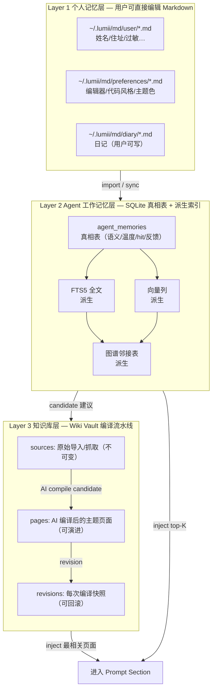
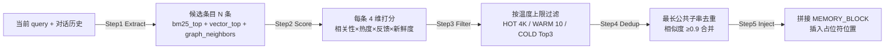

# 04-记忆与知识库设计

## 1. 记忆系统的问题定义

**跨会话信息自动沉淀 / 召回 / 注入**：Lumii 是一个长期存在的桌面伙伴，不是「重启即失忆」的单次 CLI 对话。记忆系统必须做到：

1. **沉淀 Automatic Silt**：用户本次对话里说过「我讨厌 React，只用 Vue」，下次新会话自动记得，不用反复说。
2. **召回 Retrieval**：面对当前 query 时，从海量沉淀中捞取 ≤ 阈值的**最相关片段**（不是全量塞上下文）。
3. **注入 Injection**：以对 LLM 最友好的 Section 形式插入 prompt（用 `{{LUMII_MEMORY_BLOCK}}` 占位符，不做字符串 indexOf 黑魔法）。

核心矛盾：**上下文窗口有限** vs **用户一生的信息无限** → 必须做分层 + 排序 + 压缩。

## 2. 稳定记忆 vs 动态记忆的本质差异

| 维度 | 稳定记忆（Stable Memory） | 动态记忆（Dynamic / Working Memory） |
|------|----------------------------|--------------------------------------|
| **例子** | 姓名、过敏史、常用编程语言、长期偏好 | 当前会话上下文、上一轮用户刚说的参数 |
| **写入频率** | 低频，一生几百~几千条 | 高频，每轮都改 |
| **持久化要求** | 永久，跨设备同步 | 当前进程，丢了不致命 |
| **数据形态** | 结构化条目 + 修订链 | 非结构化 prompt 片段 |
| **查询方式** | FTS5 + 向量 + 图谱 RRF 融合 | 直接取最后 N 轮 |
| **是否需要去重** | 强需求（重复偏好会冲突） | 弱（上下文压缩自己会去重） |
| **生命周期模型** | 温度衰减（热→温→冷归档） | 轮次相关（越近权重越高） |
| **存储层** | Layer 1 Markdown + Layer 2 SQLite | Layer 2 SQLite 仅 session 表 |

## 3. 方案 A+ 的设计决策：双正交轴

**决策结论**：最终采用方案 A+（语义类别 × 生命周期温度，两条独立轴）而非方案 A（把温度编码进语义分类）或 B（外置向量库）。

4 个采纳理由：

1. **可组合**：5 语义 × 3 温度 = 15 格，无需 15 个枚举值。
2. **可独立迭代**：换温度公式不影响语义分类枚举，反之亦然。
3. **可解释**：用户问「这条为什么被召回？」可以明确答「因为它是 preference 类 + 7 天内被访问过 3 次（HOT）」。
4. **SQLite 够用**：100MB 级本地数据不引入 Milvus/pgvector 外部依赖。

## 4. 三层存储架构



## 5. 五类语义类别

| 类别 | 存什么 | 典型例子 | 用户可编辑？ |
|------|--------|----------|--------------|
| `user` | 用户事实 | 「我叫张三，在腾讯做前端」「我对芒果过敏」 | ✅ L1 Markdown |
| `feedback` | 用户对回复的反馈 | thumbs up/down + 隐式语义（纠正过的内容） | ❌ Agent 写 |
| `preference` | 用户偏好/习惯 | 「代码风格 2 空格不用分号」「讨厌 emoji 太多」 | ✅ L1 Markdown |
| `reference` | 参考知识/上下文 | 「项目用 pnpm workspaces」「这个仓库用 Vitest」 | ❌ Agent 从对话提取 |
| `general` | 杂项/不确定 | 「今天下午聊了 AI 设计文档」 | ❌ Agent 兜底 |

## 6. 三档生命周期温度

**计算方式**：纯函数，所有隐式时间通过 `now` 参数显式传。

```typescript
function computeTemperature(
  createdAt: number,
  lastAccessedAt: number,
  hitCount: number,
  feedbackPos: number,
  feedbackNeg: number,
  now: number,
): 'hot' | 'warm' | 'cold' {
  const ageHours       = (now - createdAt)      / 3_600_000;
  const idleHours      = (now - lastAccessedAt) / 3_600_000;
  const feedbackSignal = Math.atanh(
    Math.min(0.95, (feedbackPos - feedbackNeg) / (feedbackPos + feedbackNeg + 1))
  );
  const score =
    0.40 * Math.exp(-ageHours  / 720) +   // 30 天半衰期
    0.40 * Math.exp(-idleHours / 168) +   //  7 天半衰期
    0.05 * Math.min(1, hitCount / 20) +
    0.15 * (feedbackSignal * 0.5 + 0.5);   // 归一到 [0,1]
  if (score > 0.65) return 'hot';
  if (score > 0.30) return 'warm';
  return 'cold';
}
```

**不同温度的注入策略**：

| 温度 | 注入上限 | 排序权重系数 | 注入位置 |
|------|----------|--------------|----------|
| **HOT** | 不限制条数，但总字符 ≤ 4K | × 2.0 | MEMORY_BLOCK 前半段 |
| **WARM** | 最多 10 条 | × 1.0 | MEMORY_BLOCK 中段 |
| **COLD** | 仅 FTS/向量命中 Top-3，否则不注入 | × 0.5 | MEMORY_BLOCK 最后（可被压缩掉） |

**温度 9 宫格热力图（5×3 组合语义）**：

| 类别 \ 温度 | HOT (≤7d) | WARM | COLD (归档) |
|-------------|-----------|------|-------------|
| user | 刚搬家的新住址 | 住过 3 年的旧地址 | 小学时的老家 |
| feedback | 上次对话的 thumbs up | 本月累计正反馈 | 去年那条差评 |
| preference | 当前在用的 2 空格风格 | 曾经喜欢过的 4 空格 | 早年的 Tab 缩进 |
| reference | 昨天刚看的 API | 上月项目技术选型 | 3 年前的旧框架笔记 |
| general | 今天刚聊的会议 | 上周讨论过的功能 | 归档日记摘要 |

## 7. 记忆提取流水线（5 步）



**打分 4 维权重**：

```
finalScore = 0.35 · bm25_norm        // FTS 语义相关
           + 0.30 · temperature_coef // 温度（HOT=2.0, WARM=1.0, COLD=0.5）
           + 0.20 · feedback_norm    // 用户历史显式反馈
           + 0.15 · freshness        // 最近被调用过的记忆加成
```

**缩水过半拒绝写入护栏**：当一次整理/合并后字符数 < 原始总字符数 × 50%，直接拒绝写入，打告警让人工 review，防止过度压缩毁掉信息。

## 8. Wiki 知识库设计

### 8.1 Vault 概念 + Topic 层级

```
~/.lumii/wiki/
├── vaults/
│   ├── work/           # 一个 Vault = 一个主题域
│   │   ├── sources/    # raw_sources，不可变：导入 MD、爬取 URL 快照
│   │   ├── pages/      # wiki_pages，AI 编译后的主题页（可演进）
│   │   └── revisions/  # wiki_page_revisions，每次编辑快照
│   └── personal/
```

**Topic 层级自动生成**：AI 编译 pages 时自动生成 `Topic 父页`，子 Topic 通过 `[[wikilink]]` 解析器关联，用户可手动拖拽调整。

### 8.2 [[wikilink]] 5 条解析规则

1. `[[Foo]]` → 匹配同 Vault 下 title=Foo 的 page，无则红链（提示可创建）。
2. `[[Bar#Section]]` → 锚点到页面 section。
3. `[[Alias|RealTitle]]` → 显示别名但跳真实标题。
4. `[[../OtherVault/Baz]]` → 跨 Vault 跳转。
5. `[[http://...]]` → 外链，不参与图谱闭环。

### 8.3 三层分离（Karpathy DKR 理念落地）

| 层 | 表名 | 可变性 | 编辑者 | 说明 |
|----|------|--------|--------|------|
| Raw | `wiki_sources` | **只追加不可变** | Import CLI / 爬虫 | 原始素材，永远不删，存导入来源 URL/路径、etag |
| Compiled | `wiki_pages` | 可演进（版本链） | AI 编译 + 用户手动 | 主题页，有 `current_revision_id` 指针 |
| History | `wiki_page_revisions` | 只追加 | page 修改时自动 | 每次改动快照，可回滚可 diff |

**AI 编译流水线（2 张辅助表）**：

| 表名 | 作用 |
|------|------|
| `wiki_compile_candidates` | AI 每次建议的新 page/edit，存 diff 预览，用户未点接受不入 `wiki_pages` |
| `wiki_compile_runs` | 每轮编译 run 的审计日志：tokens、耗时、采纳率 |

## 9. 真相表 + 派生索引的可重建策略

### 9.1 真相表 DDL（唯一可信源）

```sql
CREATE TABLE agent_memories (
  id                 INTEGER PRIMARY KEY AUTOINCREMENT,
  semantic_category  TEXT NOT NULL CHECK (semantic_category IN ('user','feedback','preference','reference','general')),
  content            TEXT NOT NULL,
  source_session_id  TEXT,
  source_message_id  TEXT,
  created_at         INTEGER NOT NULL,
  accessed_at        INTEGER NOT NULL,
  hit_count          INTEGER NOT NULL DEFAULT 0,
  feedback_positive  INTEGER NOT NULL DEFAULT 0,
  feedback_negative  INTEGER NOT NULL DEFAULT 0,
  tombstone          INTEGER NOT NULL DEFAULT 0
);
```

### 9.2 三个派生索引（全部可重建，不丢数据）

```sql
-- 1. FTS5 全文倒排（通过 TRIGGER 自动同步）
CREATE VIRTUAL TABLE agent_memories_fts USING fts5(
  content, content='agent_memories', content_rowid='id'
);
CREATE TRIGGER agent_memories_ai AFTER INSERT ON agent_memories BEGIN
  INSERT INTO agent_memories_fts(rowid, content) VALUES (new.id, new.content);
END;

-- 2. 向量列（定期 batch 重算 embedding，不实时）
ALTER TABLE agent_memories ADD COLUMN embedding BLOB;  -- 派生字段，可清空重来
CREATE INDEX idx_memories_embedding ON agent_memories(id);

-- 3. 图谱邻接表（解析 wikilink / 语义关联生成，可单独 rebuild）
CREATE TABLE memory_graph_edges (
  from_id INTEGER NOT NULL,
  to_id   INTEGER NOT NULL,
  kind    TEXT NOT NULL CHECK (kind IN ('wikilink','semantic','co_reference')),
  weight  REAL NOT NULL DEFAULT 1.0,
  PRIMARY KEY (from_id, to_id, kind)
);
```

**重建命令**：`rebuild_fts_index()` / `rebuild_embeddings(newModelName)` / `rebuild_graph_index()` 三个独立迁移，互不依赖。

## 10. 参考链接：11 份参考项目拆解

记忆设计阶段逐一拆解的参考项目文档（含设计解构与可复用点）：

1. `docs/design/记忆设计/mcp-memory-graph/设计解构.md`
2. `docs/design/记忆设计/memory-graph/设计解构.md`
3. `docs/design/记忆设计/llm-wiki/设计解构.md`
4. `docs/design/记忆设计/llm-wiki-knowledge/设计解构.md`
5. `docs/design/记忆设计/llm-wiki-organizer/设计解构.md`
6. `docs/design/记忆设计/llm-wiki-vault/设计解构.md`
7. `docs/design/记忆设计/modelcontextprotocol-servers/设计解构.md`
8. `docs/design/记忆设计/siyuan-note/设计解构.md`
9. `docs/design/记忆设计/wiki0/设计解构.md`
10. `docs/design/记忆设计/local-memory-mcp/设计解构.md`
11. `docs/design/记忆设计/memex/设计解构.md`

源设计文档：
- `docs/design/记忆设计/2026-08-24-memory-design.md` 方案 A+ 决策全过程
- `docs/design/记忆设计/2026-08-24-wiki-design.md` Wiki 三层分离 DDL 全集
