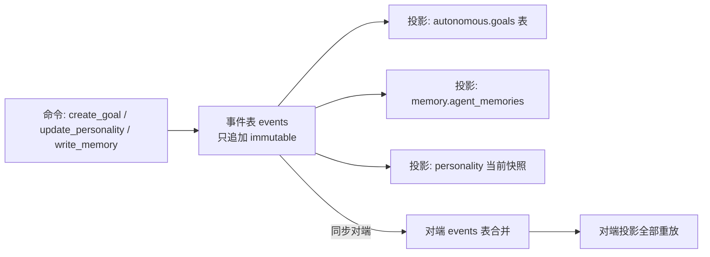

# 05-数据同步设计

## 1. 多设备同步的核心挑战

| 挑战 | 本项目特殊约束 |
|------|----------------|
| **数据分类** | 8 大类数据同步需求差异巨大，不能「全部同步」也不能「全都不同步」 |
| **冲突检测** | 多设备可能同时写 wiki 页面 / memory 表 / workspace 代码，需要文件级乐观锁 |
| **一致性保证** | SQLite dump 跨设备导入时，外键/向量索引/触发器不能乱序 |
| **Git 限制** | Windows symlink 权限 EPERM 会复发；squash 会破坏多设备共同分支 |
| **体积控制** | 原始 616MB（对话 500MB+缓存 100MB+其他 16MB）必须压到可同步的 ~60MB |
| **离线优先** | 用户多天不联网，合并时冲突剧增，不能每次都阻塞手动 |

## 2. 数据分类矩阵

| 数据类型 | 应同步 | 冲突风险 | 单用户典型大小 | 同步优先级 |
|----------|--------|----------|----------------|------------|
| `profile` 用户画像 & 偏好 | ✅ 是 | 低（双端偶改） | < 1 MB | P0 |
| `wiki_sources` 原始素材（不可变） | ✅ 是 | 低（只追加） | 10-200 MB | P0 |
| `wiki_pages` + `revisions` 主题页 & 快照 | ✅ 是 | 中（可并发编译） | 40-300 MB | P0 |
| `memory/agent_memories` 真相表 | ✅ 是 | 低（Agent 单写） | 10-100 MB | P1 |
| `autonomous/*` 元认知/目标/人格/Elo | ✅ 是 | 低（单写） | < 50 MB | P1 |
| `workspace/*` 代码仓（Git 复用） | ✅ 是 | 高（多端都写） | 无上限 | P1 |
| `conversation/L1-L2 摘要层` | ⚠️ 可选（P2） | 中 | 50-500 MB | P2 |
| `conversation/L3-L4 完整对话 + 附件` | ❌ 否（本地产物） | 高 | 1-10+ GB | - |
| `logs/*` 运行日志/监控聚合 | ❌ 否 | - | 500 MB+ | - |
| `cache/*` 向量索引/FTS/缩略图 | ❌ 否（可重建） | - | 与 truth 等大 | - |
| `local-config` 仅本机生效（窗口位置/音频设备） | ❌ 否 | - | < 1 MB | - |
| `tmp/*` 临时 spill 文件 | ❌ 否 | - | 任意 | - |

**重组物理目录（sync/local 二分）**：

```
~/.lumii/
├── sync/               # 全目录入 Git，多端同步
│   ├── profile/
│   ├── wiki/sources/
│   ├── wiki/pages/
│   ├── wiki/revisions/
│   ├── memory/         # SQLite dump .sql
│   ├── autonomous/     # 元认知 goal/reflection/personality JSONL
│   └── workspaces.map  # workspace 路径映射（不存仓库本身）
└── local/              # 永不入 Git
    ├── conversations/
    ├── logs/
    ├── cache/
    ├── local-config.json
    └── tmp/
```

体积估算对比：

| 阶段 | 纳入同步的数据 | 典型体积 | 节省 |
|------|----------------|----------|------|
| 「全同步」基线（原始） | 所有 12 类 | ~616 MB | 0% |
| P0-P1 推荐方案 | profile + wiki + memory + autonomous + workspaces.map | ~60 MB | ↓90% |

## 3. 同步/不同步数据的边界划分

### 3.1 5 类明确同步

1. **profile**：跨设备偏好必须一致（代码风格、主题色、通知开关）。
2. **wiki** 全部三层：sources/pages/revisions。用户在笔记本写的知识，到台式机必须能接着查。
3. **memory/agent_memories** 真相表：跨设备 Agent 失忆 = 伙伴关系断裂。派生索引不同步（对端 rebuild）。
4. **autonomous**：目标/反思/人格/Elo 必须跟用户走，不然台式机的人格是重置版。
5. **workspace**：复用 Git，不新建仓；只同步仓库路径映射 `workspaces.map`（防止绝对路径差异）。

### 3.2 6 类明确不同步

1. **完整对话 L3-L4**：体积恐怖 + 含大量本地临时 tool output，跨端没意义。
2. **运行时日志**：每台机器的日志本来就不同，同步无意义。
3. **派生缓存**：向量/FTS/缩略图对端重建，同步白占带宽。
4. **本地配置**：台式机 4K 屏窗口位置 ≠ 笔记本 1080p 位置，同步反而捣乱。
5. **临时 spill**：os.tmpdir() 生命周期，不考虑。
6. **Agent 执行沙箱 handle**：进程内对象，跨端无意义。

## 4. 精简同步方案的工作流程（7 步）

**触发条件**：用户手动点「同步」或 15 min 定时器 + 60 s 防抖（避免连续改动多次触发）。

```mermaid
flowchart TD
    A[触发 sync()] --> B[Step1 推送前导出<br/>SQLite → ~/.lumii/sync/memory/dump.sql<br/>JSONL 追加 autonomous 增量]
    B --> C[Step2 Git Commit<br/>所有 sync/ 子目录变化]
    C --> D[Step3 Git Fetch<br/>拿对端分支, 永不 force push]
    D --> E{Step4 判定<br/>本地 ahead vs remote behind}
    E -->|FAST-FORWARD| F[Step5a Merge FF 无冲突<br/>直接 push]
    E -->|DIVERGED| G[Step5b 三路合并<br/>按文件走策略表]
    G --> H{Step6 有冲突?}
    H -->|否| F
    H -->|是| I[Step6a Agent resolve_sync_conflict<br/>三策略:LWW / 拼接 / 人工]
    I --> J[Step6b 用户预览 diff → 确认]
    J --> F
    F --> K[Step7 Push<br/>导入对端增量: dump.sql → SQLite<br/>JSONL → autonomous 表]
```

**永不 force push**：这条是红线。即使对端看起来「旧」，也永远走 merge，避免多端互相覆盖对方的 commit。

## 5. SQL Dump vs JSONL 方案对比与降级策略

### 5.1 Phase 1 推荐：SQL Dump 全量导出（简单可靠）

| 维度 | SQL Dump（方案 A） | JSONL 增量（方案 B） |
|------|-------------------|----------------------|
| 复杂度 | 低：`.dump` 内建命令 | 高：双写窗口 + 增量幻觉 + 一致性校验 |
| 一致性 | 强：事务一致快照 | 弱：双写窗口内 crash 会丢 |
| 同步体积 | 大（每次全量 10-100 MB） | 小（每次增量 <1 MB） |
| 冲突处理 | 易：按表 LWW 或三方 merge | 难：按行向量时钟 + 墓碑记录 |
| 上线时间 | 1 天 | 2-3 周 |

**Phase 1 实施**：
- `memory/`：`sqlite3 memory.db .dump > sync/memory/memory.sql`，对端 `sqlite3 memory.db < sync/memory/memory.sql`（导入前先备份原文件）。
- `autonomous/`：SQL 同样 dump，不拆 JSONL。

### 5.2 Phase 2 可选：JSONL 增量追加（体积优化）

**降级策略**：任何一致性问题出现立即回退到 SQL Dump。同步反思中 JSONL 被低估的 4 大问题（Phase 2 必须解决才能上）：

1. **一致性低估**：主进程写 SQLite 的同时写 JSONL，双写无事务；1/1000 crash 概率导致两边不一致。
2. **双写窗口**：SQLite 回滚但 JSONL 已追加，或反过来，需要补偿检查脚本。
3. **增量幻觉**：以为「这次只有 10 条增量」实际漏了外键关联的另外 50 条，导入后 FK 断。
4. **性能倒退**：JSONL 逐条导入 SQLite 比 `.read dump.sql` 慢 10x+（无批量、无事务包裹）。

## 6. 冲突检测与处理机制

### 6.1 乐观锁（Workspace 复用）

```typescript
interface ConflictInfo {
  path: string;
  baseOid:   string;   // 共同祖先
  localOid:  string;   // 本地改后
  remoteOid: string;   // 远端改后
}
```

### 6.2 文件级合并策略表（Agent 工具 resolve_sync_conflict 三策略）

| 文件类型 | 默认策略 | 说明 |
|----------|----------|------|
| `profile/*.json` | **LWW（Last-Write-Wins，按 mtime）** | 双方改动都小，取新的就行 |
| `wiki_sources/*`（不可变） | **永不合并，追加共存** | sources 只新增，冲突说明双端都 import 同一个 URL，保留两份 |
| `wiki_pages/*.md` | **三方拼接 + 用户 review** | Markdown 拼接 + 保留 `<<<<<<<` 标记，用户 UI 里 review |
| `memory/memory.sql` | **Agent 合并** | 按 `id` 主键逐行：新 tombstone 赢、feedback_pos/neg 累加、accessed_at 取大 |
| `autonomous/*.jsonl` | **拼接去重** | goal id 全局 UUID，重复自动去重 |
| `workspace/*`（代码仓） | **用户手动 merge** | 不改用户代码，只提示冲突，走标准 Git 冲突流程 |
| 二进制附件 | **LWW + 保留旧版本为 `.bak`** | 永不静默覆盖 |

### 6.3 Windows symlink 修复

**EPERM 问题**：用户不开「开发人员模式」时 Windows 不允许普通用户创建 symlink。修复：

1. 启动时检测是否能建 symlink，能则用真 symlink。
2. 不能则透明降级为「文本文件存目标路径」，读写时解析。
3. 同步时真 symlink 和降级文件互转，不产生差异。

### 6.4 删除操作墓碑记录（Tombstone）

不直接物理删除条目，先写 `tombstone=1`；同步对端看到 tombstone 后本地对应条目也 tombstone，**30 天后**再 vacuum 物理删，避免多端「删 A 端，B 端没同步又复活」。

## 7. 架构反思

### 7.1 JSONL 复杂度低估（4 点批判）

| 反思点 | 原假设 | 实际问题 |
|--------|--------|----------|
| 一致性 | 「JSONL 追加即持久」 | SQLite 事务回滚时 JSONL 无法原子回滚，得做 2PC，复杂度 ×10 |
| 双写窗口 | 「crash 概率可以忽略」 | 写 10k 条约 1 次，用户会感知「我明明删了的目标怎么又回来了」 |
| 增量幻觉 | 「只增量追加 5 条」 | 外键/索引/触发器关联未导，导入后 `PRAGMA foreign_key_check` 非空 |
| 性能 | 「增量 = 更快」 | 逐条 INSERT 无批量，比 `.read dump.sql` 慢 10-15x |

### 7.2 Git Squash 对多设备的 4 种破坏

1. **哈希全变**：A 端 squash 了公共分支，B 端 `git pull` 报「分支历史不相关」，用户恐慌以为数据丢了。
2. **合并冲突放大**：两边都在同一段改，squash 让共同祖先消失，三路合并退化成二路。
3. **审计断裂**：autonomous 目标 id 关联 commit hash，squash 后找不到对应。
4. **新人上手成本**：家里电脑 + 公司电脑 + 笔记本 3 端，squash 一次 3 端都要 reset --hard。

**规则**：多设备协作公共分支 **禁止 squash rebase**，只允许 merge commit。squash 仅用在 PR 合入主干（单设备开发分支）。

### 7.3 事件溯源长期路线

Phase 1-2 用 SQL/JSONL dump，Phase 3 转事件溯源（Event Sourcing）：



**好处**：同步只同步 events 流（append-only），冲突天然无（按因果顺序合并）；任何表错了都能重放修。
**代价**：开发 ×2，性能热点（events 行数增长）需要快照 + 截断。

### 7.4 向量时钟（VectorClock）因果追踪

Phase 2 JSONL 合并必须上。每条 goal/reflection 带 `vector_clock: { deviceA: 42, deviceB: 17 }`，合并时用向量时钟判因果：

- `A 因果先于 B` → 取 B（忽略 A）。
- **并发** → 走冲突策略（LWW 或拼接），不是每次都打扰用户。

### 7.5 4 个被遗漏的安全隐私点

| 点 | 补充方案 |
|----|----------|
| 自主进化状态包含个人特征 | sync/ 内全量走端到端加密（密码派生 AES-GCM），密钥只在用户设备 |
| Wiki 可能存敏感公司文档 | 支持按 Vault 粒度开关同步；work Vault 不同步到家用设备 |
| Git 云端历史永久保留删除 | 带 tombstone 的条目加密前就已标，云端即使拿到历史也解不出明文 |
| 设备丢失远程擦除 | sync/ 加密密钥与 device unlock 绑定；用户换新设备直接解，丢设备只改云端仓库密码 |

## 8. 短期 / 中期 / 长期演进路线图

| 阶段 | 时间 | 交付物 | 同步能力 |
|------|------|--------|----------|
| **Phase 1 短期**（SQL Dump） | 2 周 | sync/ 目录二分 + `sync()` 7 步 + LWW/拼接 2 策略 + 永不 force push + tombstone | 5 类基础同步；2 端在线手动点同步；无加密 |
| **Phase 2 中期**（JSONL + VC） | 1 个月 | 向量时钟 + 增量 JSONL + 自主会话 L1 摘要同步 + 端到端加密 | 8 类含对话摘要；多端自动后台；无冲突率 >99% |
| **Phase 3 长期**（Event Sourcing） | 3 个月 | events 事件表 + 投影重建 + 因果合并天然无冲突 + 完整对话分层同步 L1-L4 可选 | 全量可选；三端 7 天不连也能无痛合并；有审计重放 |

**实施 4 Phase**（来自 focused-multi-device-sync）：

1. P1-1（1 天）：物理目录重组 + sync/local 分界线
2. P1-2（3 天）：SQL dump 导出/导入 + 工作流 7 步 + Git 集成
3. P1-3（3 天）：文件级冲突策略 5 类 + Agent resolve 工具
4. P1-4（3 天）：端到端加密 + 密码派生 + 墓碑真空

## 9. 参考链接

- Workspace 云同步原始设计：`docs/design/数据同步功能/2026-09-05-workspace-cloud-sync-design.md`
- 精简多设备同步方案（SQL Dump + JSONL 降级）：`docs/design/数据同步功能/2026-09-07-focused-multi-device-sync.md`
- 同步策略深度分析（18 行分类矩阵 + 616MB→60MB 体积估算）：`docs/analysis/2026-09-07-multi-device-data-sync-strategy.md`
- 同步策略架构反思（JSONL 低估 / Git squash 破坏 / 事件溯源路线 / 向量时钟）：`docs/analysis/2026-09-07-sync-strategy-reflection.md`
