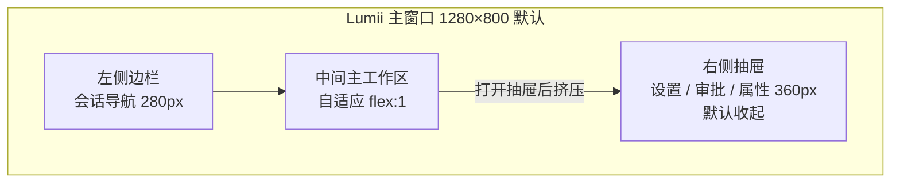
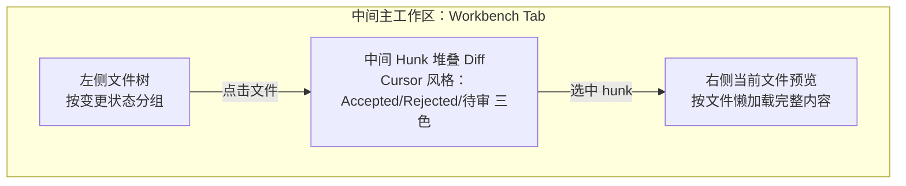
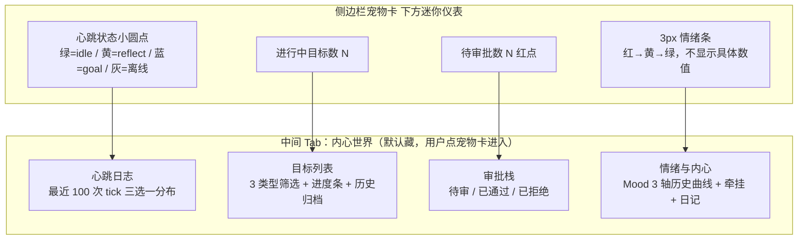

# 06-UI 与交互设计

## 1. 设计语言：暗色优先 + 暖奶油底色

### 1.1 --mt-* 语义化变量体系

所有颜色/间距/圆角一律走变量，不硬编码。主题切换通过根节点 `[data-theme]` 属性，默认暗色优先，亮色是同变量的另一组赋值。

```css
/* design-system.css — 仅摘录核心变量 */
:root[data-theme='dark'] {
  --mt-surface-rgb: 30 29 27;           /* 暖奶油暗底：米灰不冷 */
  --mt-surface: rgb(var(--mt-surface-rgb));
  --mt-surface-raised: 40 38 35;        /* 卡片/弹层：浮起一点更亮 */
  --mt-fg-1: 243 239 231;               /* 主文字：暖白 */
  --mt-fg-2: 184 176 164;               /* 次文字：灰 */
  --mt-fg-muted: 120 112 100;
  --mt-border: 64 60 54;
  --mt-accent: 234 179 128;             /* 主色：奶油焦糖，不蓝不紫 */
  --mt-danger: 239 108 108;
  --mt-success: 134 196 129;
  --mt-warning: 240 187 104;

  /* 间距系统 4px base */
  --mt-sp-1: 4px;  --mt-sp-2: 8px;  --mt-sp-3: 12px;
  --mt-sp-4: 16px; --mt-sp-6: 24px; --mt-sp-8: 32px;

  /* 圆角：圆角适中，不是 iOS 巨型圆也不是直角 */
  --mt-radius-xs: 4px;  --mt-radius-sm: 6px;
  --mt-radius-md: 10px; --mt-radius-lg: 16px;

  /* 阴影：柔而不糊 */
  --mt-shadow-sm: 0 1px 2px rgb(0 0 0 / .25);
  --mt-shadow-md: 0 4px 12px rgb(0 0 0 / .35);
  --mt-shadow-lg: 0 16px 40px rgb(0 0 0 / .5);
}

:root[data-theme='light'] {
  --mt-surface-rgb: 250 245 238;        /* 真·奶油浅底 */
  --mt-surface-raised: 255 251 245;
  --mt-fg-1: 41 37 33;
  --mt-fg-2: 98 90 81;
  /* 其余主题等价替换，不新增变量名 */
}
```

**硬规则**：组件不得出现 `#fff`、`black`、`margin: 7px` 这种裸值，一律走 `--mt-*`。

## 2. 三档布局区域



### 2.1 各区域常驻内容

| 区域 | 固定内容 | 可切换 Tab |
|------|----------|------------|
| **左侧边栏** 280 px | 宠物头像 + 昵称 / 状态、新建会话按钮、最近会话搜索框、底部菜单（Wiki / 设置 / 退出） | 会话列表 ↔ 记忆搜索 ↔ 目标列表 |
| **中间主工作区** 弹性 | 当前页标题栏 + 主内容 + 底部输入框（会话页） | 对话 / Workbench / Wiki 浏览 / 内心世界（4 大 Tab） |
| **右侧抽屉** 360 px（默认关） | 关闭键 Esc、抽屉标题 | 设置 / 会话详情 / 同步冲突 diff / 知识库属性 |

**响应式断点**：
- ≥ 1200 px：左 280 + 主 + 右 360 全开（右抽屉支持「钉住」永久展开）
- 960 ~ 1200 px：抽屉默认叠层而非挤压
- < 960 px：侧边栏折叠为 56 px 图标条

## 3. 页面四状态标准 & 组件标准

**每个页面/列表/卡片必须完整处理 4 种状态，不得缺任何一种：**

| 状态 | 触发 | UI 要求（组件 `<PageState>` 统一输出） |
|------|------|--------------------------------------|
| **加载 Loading** | 首屏拉数据、筛选/分页切换 | 骨架屏与真实布局等高对齐；至少 3 行假数据，形状与真数据一致；禁用底部输入操作 |
| **空数据 Empty** | 成功拉到 0 条 | 图标 + 一行说明 + 一个 CTA 按钮（例：新建会话 / 先写第一篇）；不空屏发呆 |
| **错误 Error** | 网络 / 权限 / 抛异常 | 错误标题 + 错误详情（原始 message 灰字折叠可展开） + `重试` 主按钮 + `反馈` 次按钮；禁止静默失败 |
| **成功 Success** | 正常有数据 | 按列表/卡片/详情各自的 layout；操作按钮状态与权限匹配（无权限=灰+tooltip 说明原因） |

**组件标准**：

```typescript
interface LumiiButtonProps {
  variant: 'primary' | 'secondary' | 'ghost' | 'danger';
  size:    'sm' | 'md' | 'lg';
  loading?: boolean;
  disabled?: boolean;
  icon?:    React.ReactNode;
}
```

- `primary`：主行动 1 屏最多 1 个（除了弹窗 OK+Cancel 双按钮）。
- `ghost`：列表行操作一律 ghost，不抢注意力。
- `loading=true`：宽度不变（防跳）、按钮禁用 + spinner 替代文字。

## 4. 关键交互模式（快捷键）

所有快捷键注册在全局 `<Hotkeys>` 组件，支持自定义。默认：

| 快捷键 | 作用 | 可用域 |
|--------|------|--------|
| `Esc` | 关闭最上层抽屉/弹窗/下拉菜单（栈式，关一个不影响下层） | 全局 |
| `Enter` | 发送当前输入框消息（非多行模式下） | 会话输入框 focus |
| `Shift+Enter` | 输入框换行 | 同上 |
| `Cmd/Ctrl + K` | 打开全局搜索（会话/记忆/Wiki/目标 混搜） | 全局 |
| `Cmd/Ctrl + N` | 新建会话 | 全局 |
| `Cmd/Ctrl + S` | 保存当前 Wiki 页面 / Workbench diff | Wiki & Workbench |
| `Cmd/Ctrl + P` | 打开命令面板（调用 Agent 工具快捷） | 全局 |
| `Cmd/Ctrl + [` / `]` | 主工作区 Tab 左右切换 | 全局 |
| `↑`（输入框空时） | 回填上一条自己发的消息 | 会话输入框 |

**实现约束**：
- 快捷键在 input/textarea/contenteditable 内默认不吞（除了显式列的 Enter/Shift+Enter/↑）。
- `Esc` 栈必须可预测：开了 2 层弹层 + 1 层抽屉，按 3 下 Esc 应该依次全关完，回到基准态。

## 5. 工作空间 Workbench 设计

### 5.1 Cursor 式堆叠 Diff



**核心机制（对比 Git 原生 `git diff` 性能）**：

| 技术 | 传统全量 readBlob | **OID tree-walk 剪枝（本项目采用）** |
|------|-------------------|-------------------------------------|
| 原理 | 读所有变更文件的完整 blob，字符串级 diff | 先 walk 两棵 commit tree，按 OID 比；只对 OID 不同的路径读 blob |
| 变更 100 行 / 2 文件 | ~800 ms（全读全 diff） | ~60 ms（OID 命中直接跳，13x 提升） |
| 变更 1000 行 / 50 文件 | ~8 s（线性） | ~350 ms（10x+，多数文件 OID 相同被剪掉） |
| 大仓库 10k 文件 200 MB blob | 直接 OOM / 卡死 | 稳定 1.2 s（walk 不碰内容） |

### 5.2 按文件懒加载 hunks

- 首屏只渲染左侧「文件变更树」 + **视口内 5 个文件**的 hunks。
- 滚动到哪个文件再 `readBlob` 算 diff 渲染 hunk。
- 渲染过的文件结果缓存到 `Map<filePath+baseOID, Hunk[]>`，切 tab 不重算。
- 每个 Hunk 提供 4 按钮：`接受单块` / `拒绝单块` / `编辑内联` / `跳到完整预览`。

**性能预算**：首屏交互可操作 ≤ 300 ms（点文件树到 hunk 渲染完），单 hunk diff ≤ 16 ms（一帧内）。

## 6. 自主进化 Agent 前端可视化

### 6.1 可视元素总览（侧边栏 & 内心世界 Tab）



### 6.2 心跳状态 & 目标列表

| 心跳色 | 含义 | 后台真实行为 |
|--------|------|--------------|
| 🟢 绿 idle | 90% 时间的常态 | tick 结束，啥都没做（符合生命感：大部分时间安静） |
| 🟡 黄 reflect | ~5% | 写了反思表 / 更新了 Elo / 调整了 LTR 权重 |
| 🔵 蓝 run-goal | ~5% | 跑 learning 或 capability-improvement（**不会碰用户文件**） |
| ⚪ 灰 | 离线 / 心跳被禁用（用户可关自主进化） | 后台线程已暂停 |

**目标列表行结构**（3 类型图标区分）：

```
[🏫 learning]  学习 Vue Composition API    [████░░░░░░] 58%   今日 0/3 次调用
[💬 proactive] 提醒周五有会议（待审批）    [等待用户点击审批按钮]
[⚡ cap-optim]  Prompt A/B：warm-v2 vs v1 [███████░░░] Win Rate 62% ±4%
```

### 6.3 审批界面

审批栈**按进入时间倒序**（最新在最上），每卡包含：

```
┌─ 主动消息审批 #A-1042 ────────── 2h 后过期 ─┐
│  Lumii 想在用户下次活跃时主动说：             │
│  ┌───────────────────────────────────────┐   │
│  │ 「对了上次你说要重构记忆组件，我整理了  │   │
│  │   3 个可复用 hook，要不要看看？」       │   │
│  └───────────────────────────────────────┘   │
│  [通过]  [修改消息再发]  [永久拒绝此话题]     │
└──────────────────────────────────────────────┘
```

### 6.4 情绪 & 内心世界 Tab

- **Mood 三维曲线**：只看 24h 形状，不显示任何数值刻度。标签为「整体」「活跃度」「精力」三条，不出现 valence/arousal/energy 术语。
- **牵挂列表 Concerns**：同一件事最多出现 2 行卡片，出现过 2 次自动归档。
- **日记 Diary**：纯 Markdown 展示，第一人称，无字数统计。**绝对禁止**在日记里出现 hitRate、Elo、tokens 等工程术语（后端 prompt 禁令 + 渲染层双重扫描过滤）。

**毁掉生命感红线（渲染层强制检查，不通过直接不渲染）**：
- 出现数值指标（hitRate / Elo / tokens 等）→ 打回
- 日记超过 300 字 → 打回
- 自我描述「作为 AI，我在学习」→ 打回

## 7. Wiki 可视化

### 7.1 层级结构 & Vault 智能分类

三栏布局（和 MemoriesPage 同构复用）：

| 左栏 220 px | 中栏 弹性 | 右栏 360 px |
|-------------|-----------|-------------|
| Vault 列表（work / personal / 自建）<br/>Vault 下 Topic 层级树 | 当前 Topic 下 Pages 列表 / 当前 Page Markdown 视图切换 | 页面属性面板：分类标签 / 反向链接 / 修订历史 / AI 重新编译建议 |

**Vault 智能分类**：新建 Page 时 AI 建议分类到最合适的 Vault + Topic，用户可以接受也可以手动拖。建议旁边标置信度：

- 置信 ≥ 0.8：直接放建议分类，用户可撤销
- 0.5-0.8：弹 2 选 1
- < 0.5：让用户选，不预填

## 8. 可访问性与键盘操作要求

| 要求 | 等级（WCAG 2.2） | 落地规则 |
|------|------------------|----------|
| 语义化标签 | A | 按钮用 `<button>`，不用 `<div onClick>`；列表用 `<ul><li>`；弹层用 `<dialog>` + role=dialog |
| 焦点可见 | AA | 所有 focusable 元素 `:focus-visible` 有 `2px solid var(--mt-accent)` 描边，不依赖颜色 alone |
| 对比度 | AA | 正文 fg-1 on surface ≥ 4.5:1；次要 fg-2 on surface ≥ 3:1；用色彩表示的状态（红/绿心跳）必须附 shape（圆/方/三角） |
| 键盘可达 | A | 全站不依赖 hover 才能操作；所有功能可通过 Tab + Enter/Space 完成；Tab 顺序 = 视觉顺序 |
| 跳过链接 | A | 首屏第一个 Tab 停在 `<a href="#main-content">跳到主内容</a>`，跳过侧边栏重复导航 |
| 动效尊重 | AA | 读 `prefers-reduced-motion`：开启时关闭过渡、骨架屏不闪烁 |
| 屏幕阅读器 | AA | 弹层打开时把焦点移入弹层；心跳等状态小圆点配 `aria-label`（例：aria-label="心跳：idle，过去 24h 完成 3 个目标"） |
| Esc 关闭所有浮层 | 本项目硬要求（高于 WCAG） | 见 §4 快捷键，任意弹窗/抽屉/下拉 Esc 必关 |
