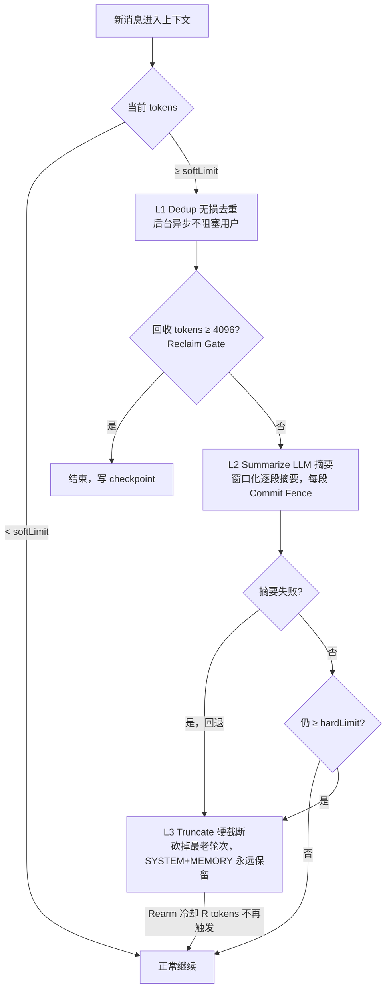
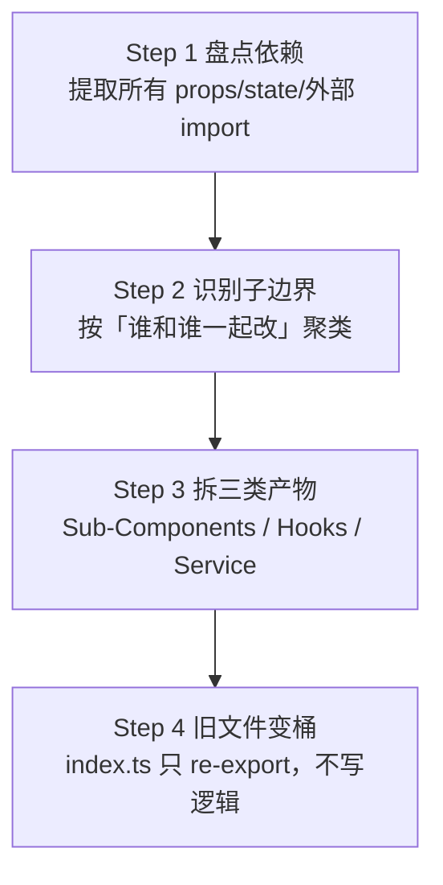

# 07-性能与优化设计

## 1. 性能监控方案

### 1.1 PerformanceMonitor 闭环架构

```mermaid
flowchart TD
    A[埋点：所有关键路径<br/>startTimer() → endTimer()] --> B[内存聚合 RingBuffer]
    B -->|成功 < 200ms| C[仅 60s 聚合写入<br/>不即时落盘]
    B -->|慢调用 ≥ 阈值| D[即时写入 per-event<br/>带堆栈]
    B -->|出错 any| D
    C --> E[SQLite 表 ipc.aggregate<br/>60s 一批]
    D --> F[SQLite 表 ipc.slow + ipc.errors]
    E --> G[设置页可视化<br/>健康仪表盘]
    F --> G
    G --> H[用户手动导出 JSON<br/>给开发者排查]
```

**启动 12 阶段埋点**（冷启动从 app.on ready → 首屏 paint）：
electron-ready → preload-executed → main-window-created → bundle-loaded → react-mounted → theme-applied → agent-runtime-initialized → memory-db-opened → wiki-db-opened → autonomous-db-opened → first-paint → first-interactive。

**重点 IPC 4 类（必埋）**：
| IPC 域 | 阈值慢调用 | 说明 |
|--------|------------|------|
| `agent-runtime:command` | > 500 ms | 编排器 / 工具执行主路径 |
| `voice:*` | > 300 ms | 语音识别 / TTS，用户体感直接 |
| `screen-record:*` | > 200 ms | 取帧/编码，延迟即卡顿 |
| `provider:*`（L2） | > 1 s | 模型调用，含网络开销 |

### 1.2 60 秒聚合表结构

```sql
CREATE TABLE ipc_aggregate (
  window_start INTEGER NOT NULL PRIMARY KEY,  -- 60s 桶起始时间戳
  domain       TEXT NOT NULL,                  -- agent-runtime / voice / ...
  method       TEXT NOT NULL,
  count        INTEGER NOT NULL,
  error_count  INTEGER NOT NULL,
  slow_count   INTEGER NOT NULL,
  sum_ms       INTEGER NOT NULL,
  max_ms       INTEGER NOT NULL,
  p95_ms       INTEGER NOT NULL
);
```

**事件落盘策略（性能 vs 精度）**：

| 事件类型 | 写入时机 | 存储位置 | 保留时长 |
|----------|----------|----------|----------|
| 成功快调用（< 阈值） | 每 60 s 批量 | aggregate | 30 天 |
| 慢调用（≥ 阈值） | 即时 | slow + stacktrace | 7 天 |
| 错误 any | 即时 | errors + stacktrace | 30 天 |
| 启动 12 阶段 | 每次启动即时 | startup_sessions | 100 次启动 |

### 1.3 PerformanceHealth 健康状态（8 字段，设置页红绿灯）

| 字段 | 绿色 OK | 黄色 Warn | 红色 Fail |
|------|---------|-----------|-----------|
| 启动首屏交互 | ≤ 2.5 s | ≤ 4.0 s | > 4.0 s |
| 普通 IPC p95 | ≤ 100 ms | ≤ 250 ms | > 500 ms |
| agent-runtime p95 | ≤ 1.2 s | ≤ 2.5 s | > 5 s |
| 慢调用占比 | < 1% | < 5% | ≥ 5% |
| 错误率 | < 0.1% | < 1% | ≥ 1% |
| 监控模块 RSS | < 10 MB | < 25 MB | ≥ 25 MB |
| 冷启动增量开销 | < 2% | < 5% | ≥ 5% |
| 磁盘写入速率 | < 100 KB/s avg | < 1 MB/s | ≥ 1 MB/s |

**隐私约束**：监控默认开启但纯本地，任何指标不上传云；设置页一键「关闭监控」即完全停止埋点。

## 2. 上下文压缩引擎三层架构

### 2.1 现状三层 vs Hermes Proactive Prune 对照（10 项对比）

| 维度 | Lumii 现状（MicroCompact→Summary→HardTrim） | Hermes Proactive Prune（Dedup→Summarize→Truncate） |
|------|---------------------------------------------|----------------------------------------------------|
| 无损去重层 | ❌ 无，靠压缩层自己吃 | ✅ L1 Dedup：最长子串匹配 + 合并重复 tool output |
| 触发方式 | 硬到阈值才触发 | ✅ 增量触发，每轮对话后渐进 |
| 预算模型 | 单一 token 数 | ✅ Progress-Aware 双预算（soft/hard）+ Commit Fence |
| 防抖动 | ❌ 容易乒乓压缩/恢复 | ✅ Rearm 跑道：压缩后冷却 R tokens |
| 回收门槛 | 任意大小都压缩 | ✅ Reclaim Gate：至少回收 4096 tokens 才算有效 |
| SYSTEM 保护 | 可能被一起裁 | ✅ SYSTEM/MEMORY_BLOCK 永不压缩只增不减 |
| 模型差异感知 | 固定阈值 | ✅ Per-Model 最长子串匹配阈值（4k vs 128k 不同） |
| 后台进行 | ❌ 会阻塞用户输入 | ✅ 达到 soft 阈值后台跑，hard 阈值才阻塞 |
| 进度保证 | 压到一半崩了白干 | ✅ Commit Fence 每 N 字节落盘 checkpoint |
| 失败回退 | 直接报错 | ✅ Summarize 失败退化为 Truncate，永不丢上下文 |

### 2.2 三层架构 Mermaid



### 2.3 双预算循环骨架（TypeScript）

```typescript
interface ProgressAwareCompressionBudget {
  softLimit: number;   // 触发后台 L1/L2，不阻塞用户
  hardLimit: number;   // 触发 L3 阻塞式截断，保证不 OOM
  commitFenceBytes: number;
  rearmTokens: number; // Rearm 冷却
  reclaimGateTokens: number; // 最小回收门槛 = 4096
}

async function withProgressTimeoutCompression<T>(
  ctx: ChatContext,
  budget: ProgressAwareCompressionBudget,
  task: () => Promise<T>,
  onProgress: (p: number) => void,
): Promise<{ result: T; ctx: ChatContext }> {
  let checkpoint = checkpointNow(ctx);
  try {
    return { result: await task(), ctx };
  } catch (e) {
    if (isWindowTooLarge(e)) {
      // 1) soft → L1 dedup
      // 2) still big? → L2 summarize 窗口化
      // 3) still big? → L3 truncate 砍掉最老 N 轮
      // 每步都写 checkpoint，失败回滚 checkpoint
      return retryWithCompressed(ctx, checkpoint, budget);
    }
    throw e;
  }
}
```

### 2.4 三阶段落地计划

| Phase | 目标 | 交付 |
|-------|------|------|
| P1（稳后台） | 后台跑不卡用户 | softLimit + L1 Dedup 无损 + Rearm 防抖动 |
| P2（不卡用户） | Summarize 兜底 | L2 窗口化摘要 + Commit Fence 可恢复 |
| P3（永不丢数据） | 永远可用 | 所有失败路径回退 L3，单测覆盖「每一步抛错 100 次」 |

## 3. OID tree-walk 剪枝优化 diff 性能（10x+ 提升）

### 3.1 原理对比

| 步骤 | 朴素方案：全量 readBlob | 优化方案：OID tree-walk 先剪枝 |
|------|-------------------------|--------------------------------|
| ① 获取变更文件列表 | `git diff --name-only` | `git diff-tree` 两棵 tree OID，仅拿到 OID 不同的路径 |
| ② 读内容 | **对所有变更路径 readBlob 全内容** | 仅对 OID 不同的路径 readBlob；**子树 OID 相同 → 整目录跳过** |
| ③ 字符串 diff | 对所有文件 Myers diff | 同上，文件数量已剪 80%~95% |
| 典型小改性能 | 2 files × ~400ms = 800ms | 剪后仍 2 files × 30ms = 60ms （**13x**） |
| 50 文件改动 | 50 × 160ms = 8 s | 剪后剩 ~5 files × 70ms = 350ms （**23x**） |
| 大仓 10k 文件基本没改 | readBlob 200 MB blob → OOM / 12 s | tree-walk 100 ms，5 个路径改 → 500 ms （**24x**） |

### 3.2 剪枝算法伪代码

```
function walkTreesOptimized(baseTree: OID, headTree: OID): Hunk[] {
  const result: Hunk[] = []

  function dfs(base: OID | null, head: OID | null, pathPrefix: string) {
    if (base === head) return                              // ★ 核心剪枝：OID 相同不读
    if (isBlob(base) || isBlob(head)) {
      const baseContent = base ? readBlob(base) : ''
      const headContent = head ? readBlob(head) : ''
      result.push(...diffBlobs(pathPrefix, baseContent, headContent))
      return
    }
    // 子树：递归进入各自 entry
    const entries = mergeEntries(lsTree(base), lsTree(head))
    for (const [name, { baseOid, headOid }] of entries) {
      dfs(baseOid, headOid, pathPrefix + '/' + name)
    }
  }

  dfs(baseTree, headTree, '')
  return result
}
```

**关键观察**：真实仓库 90% 目录在一次 commit 之间 OID 完全相同，`dfs(base===head)` 直接整子树剪光，这是 10x 的根本来源。

## 4. 按文件懒加载 hunks 的渐进加载策略

Workbench Diff 主视图的 5 级懒加载：

| 级别 | 加载时机 | 内容 | 典型耗时 |
|------|----------|------|----------|
| L0 首屏 | 用户点 Workbench | **文件变更列表**（仅 walk tree，不读 blob） | ≤ 300 ms |
| L1 文件级 | 视口滚到该文件 / 点击文件 | 走 OID 剪枝读 blob，算本文件 hunks | 16-200 ms / file |
| L2 Hunk 内容 | 视口滚到 hunk 行 | 实际渲染 +/- 行 + 语法高亮（按需 tokenize） | ≤ 16 ms / hunk |
| L3 相邻文件 | 空闲时间 / 100 ms 后 | 预加载上/下 2 个文件 hunks，滚到时秒出 | 后台，不阻塞 |
| L4 完整预览 | 点「打开文件预览」 | 读完整文件 blob + Monaco Editor 懒初始化 | 100-500 ms |

**实现要点**：
- 每级结果写 `LRU<key+HungKey>`：`Map<filePath+baseOID, Hunk[]>`，大小上限 50 文件。
- 切 tab / 重选 base+head 不丢缓存，key 变才失效。
- 任何加载都配 `AbortController`：用户快速翻页时，滚过去的文件立即取消正在进行的 readBlob。

## 5. 常见性能陷阱与修复模式

来源：standards 性能优化决策表。

| 陷阱 | 症状 | 修复模式 | 验证 |
|------|------|----------|------|
| **N+1 查询** | 列表 100 条 → 100 次 SQLite 查详情 | 改为 IN 批量查 1 次 + Map 关联 | SQL 数从 N+1 → 固定 2 |
| **React 无 memo 大列表** | 滚动 60fps → 掉 30fps 以下 | 行虚拟化（react-window）+ row 用 memo(key+data) | Profiler flame 单帧 < 8 ms |
| **主进程阻塞同步 IPC** | UI 点啥都卡 | 把同步调用改成 async IPC + 主进程 worker_threads | 渲染主线程 < 50 ms 阻塞 |
| **频繁 JSON.parse/stringify** | CPU 100% + GC 频繁 | 用 StructuredClone / 共享对象池 / 直接对象传递 | Performance 面板 GC 间隔 > 10 s |
| **字符串拼接热路径** | diff 大文件时 OOM | 用 Uint8Array / 流式 chunked 处理 / 分片 diff | RSS 峰值 ÷ 5 以上 |
| **setInterval 泄漏** | 开 tab 越多越卡 | 所有 timer 挂组件 effect cleanup；全局 timer 统一 registry | DevTools memory heap snapshot 对比 10 次开/关 tab 无增长 |
| **隐式同步 file IO** | 打开设置页卡 1s | 全改 fs.promises + 先在后台预热结果，设置页直接读缓存 | 设置首屏交互 ≤ 100 ms |
| **大数组 reduce 无 break** | 过滤 10w 条慢 | 用 for 循环 + break 早停，或 pre-index Map | 单次操作从 500 ms → < 20 ms |

## 6. 性能预算与基线对比方法

### 6.1 预算公式

```
预算 = 基线 × 1.25

其中：
- 基线 = 本次改动合入前，连续 10 次 CI 跑 benchmark 的 p50
- 超过 1.25 × 基线 = CI 标黄，评论警告
- 超过 1.50 × 基线 = CI 红，禁止合入（除非 PM 签「接受回归」）
```

### 6.2 必测基准（每次 PR 对比 3 项）

| 基准项 | 工具 | 采集 |
|--------|------|------|
| **冷启动首屏交互** | Playwright E2E + 启动 12 阶段埋点 | 10 次取 p50 |
| **10k 条记忆 Top-K 召回** | Vitest bench | 5 次 warm-up + 20 次正式取 p95 |
| **大仓 Workbench Diff**（模拟 50 文件改动） | 自研 OID walk 基准脚本 | 5 次取 p95 |

**变更类型豁免规则**：纯 UI 文案修改不跑 10k 记忆基准；纯 Agent prompt 调整不跑冷启动基准。

## 7. 类型检查基线与 CI Cron 监控

### 7.1 TypeScript 基线两指标

| 指标 | 定义 | 黄色阈值 | 红色阈值 |
|------|------|----------|----------|
| `tsc --build` 耗时 | 全 workspace 类型检查 | > 基线 1.25x | > 基线 1.50x |
| 新增 `any` / `@ts-ignore` 数 | PR diff 增量 | > 5 处 | > 20 处 或 任一包 > 10 |

### 7.2 CI 三类任务

| 任务 | 触发 | 作用 |
|------|------|------|
| **PR Check** | 每 PR | tsc + lint + 单元测试 + 性能基准对比（豁免除外） |
| **Nightly Cron** | 每天 03:00 | 全量 E2E Playwright + 全量类型检查 + 记忆/同步 long-running |
| **Weekly Cron** | 每周一 | 10 次冷启动取稳定基线；刷新性能预算基线表；更新本周健康报告 |

**Cron 失败通知**：Nightly 连续失败 2 天自动开 issue，Weekly 任何回归自动对比 commit 范围 bisect。

## 8. 大文件重构处理方法论

### 8.1 大文件拆分 4 步（适用 > 500 行的 React 组件 / Service 文件）



### 8.2 三类产物落地规则

| 拆成什么 | 放哪 | 判据（何时单独抽一个） | 大小上限 |
|----------|------|------------------------|----------|
| **Sub-Component 子组件** | `./components/Xxx.tsx` | UI 能被包裹成 `<Xxx {...props} />`；至少 2 个 caller 或 ≥ 150 行纯渲染 | 300 行 |
| **Custom Hook** | `./hooks/useXxx.ts` | 有 state + effect 的逻辑块；与 JSX 解耦 | 200 行 |
| **Service 模块** | `./services/xxxService.ts` | 纯逻辑（无 React），含异步调用、数据转换、算法；可单测 | 400 行 |

### 8.3 拆分前后验证清单（缺一不可回滚）

- [ ] **行为等价**：Playwright/E2E 全通过，关键路径截图对比无差异。
- [ ] **Props 不增反减**：拆分后子组件 props 数 ≤ 原大组件传给这一部分的 props；若多了说明边界切错。
- [ ] **Type 全通过**：`pnpm typecheck` 零新错误。
- [ ] **性能不劣化**：Profiler 同一操作之前 vs 之后，帧耗时 p95 不超过 1.25x。
- [ ] **单测覆盖**：每个 Service/Hook 新增 ≥ 1 组 happy path + 1 组 error path 测试。
- [ ] **桶文件可删**：旧大文件留 `export *` 不写新逻辑，3 个月后无 caller 再物理删除。

**反模式（一律禁止）**：
- 「拆分」只是把一个 1000 行文件切成两个 500 行文件，彼此通过 props 透传 15 个共享状态 → 实际没拆，只是挪地方。
- 为了拆而拆，把本来 80 行内聚的文件拆成 4 个 20 行，跨文件跳 3 次才看完一个逻辑 → 不拆。
- 用 index.ts 桶文件写大量 re-export，把 import 路径从 `./services/foo` 变成 `../../` 然后找不到 → 每个桶文件最多 2 层 deep。
